# ml ops-构建端到端的深度学习项目(第 1 部分)。

> 原文：<https://medium.com/analytics-vidhya/mlops-building-a-deep-learning-project-from-end-to-end-part-1-5ae1e6e76906?source=collection_archive---------5----------------------->

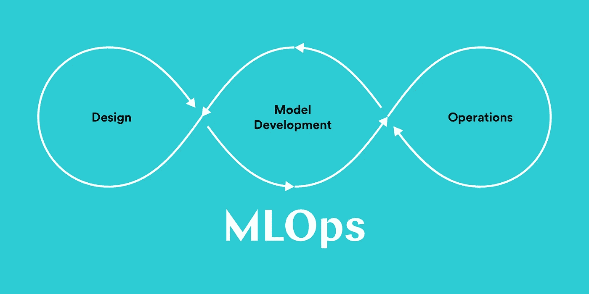

信用——valohai.com

F 在过去几年的软件行业中，我们已经听到了很多关于“DEVOps”的说法，由于它对传统方法(包括 SDLC(软件开发生命周期))的改进得到了证实，因此已经被许多行业迅速采用。尽管最流行的“敏捷”方法在过去十年中为我们提供了很好的服务，但在它专注于弥合客户和开发人员团队之间的差距时，DevOps 专注于弥合开发人员和进一步运营之间的差距，这也是自动化管道的形式，也称为 CI-CD(持续集成和持续交付)。

另一方面，数据科学行业也经历了蓬勃发展，一些类似的实践将进一步增强它，因此，它采用了 2015 年提出的“MLOPS”(机器学习操作)。
在本文中，我们将简要介绍一些基本概念，然后从端到端直至部署，继续构建一个简单的深度学习项目，为了简化，本文将分为两个部分。在第 1 部分中，将加载、分割和训练模型，在第 2 部分中将包括部署。

# **内容**

1.  什么是 MLOPS？
2.  DVC 简介
3.  项目实施和设计第 1 部分

# 1.什么是 MLOPS？

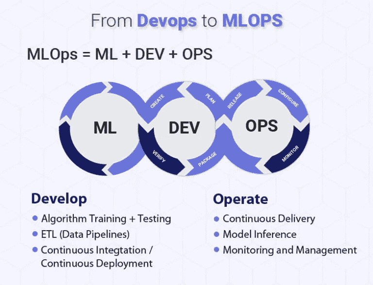

简单地说，这是一个数据科学/机器学习项目生命周期与运营的聚合，它基于 DevOps，但有一些额外的附加内容，如构建 **ci-cd 管道**和**模型再培训方法**。这些实践仅仅是为了减少构建完整项目所花费的时间，同时保证质量和强大的软件监控体验。MLOps 只是帮助针对给定的问题建立更有效的业务解决方案。要详细了解它，请查看此[文章](https://blogs.nvidia.com/blog/2020/09/03/what-is-mlops/)。

# 2.DVC 简介

DVC(数据版本控制)是一个开源工具，用于机器学习项目的跟踪和版本控制。它用于与 git 协作创建 ci-cd 管道。如果你熟悉 git，那么使用这个工具非常容易。该工具还涵盖了远程存储，如 S3、Azure Blob 存储、Google Drive、Google 云存储、HDFS、HTTP、网络连接存储或存储数据的光盘。
此外，它还集成了大数据，如 HDFS、Hive 和 Apache Spark。

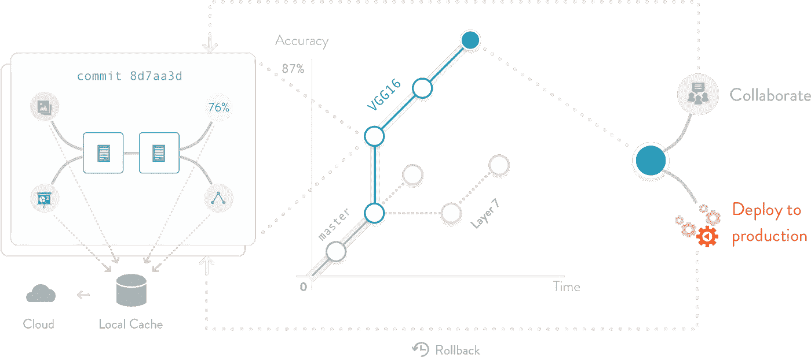

source-dvc.org

DVC 框架相当大，我可以写一篇关于 DVC 本身的单独文章，展示它的不同特性和功能。除了 DVC，还有许多其他的 MLOps 工具，如 MlFlow、DataBricks、云平台，如 AWS、Azure 和 GCP 等。在本文中，我们将使用 DVC，因为它是一个简单而强大的入门工具。
上图显示了 DVC 如何帮助建立完整的管道直至部署。

# 3.项目实施第一部分

简介:-我们将在后面建立一个简单的分类模型，并在前面创建一个 web 应用程序，最后将其部署在云平台上，如 Heroku。

3.1:创建一个 anaconda 环境并安装需求

在操作系统中打开终端或 cmd，并键入以下命令

```
conda create -n 'env name' python==3.7
```

创建环境后，键入

```
conda activate 'env name'
```

您将在 cmd/terminal 中的路径旁边看到您的环境名称

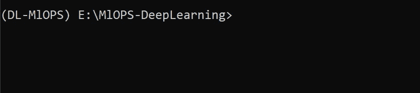

1.1-创建并激活环境后

现在从 Github 下载我的 repo 并安装 requirements.txt 文件，该文件包含项目的所有依赖项。

```
pip install requirements.txt -r
```

执行时，您可能会看到以下内容&进入当前 cmd 工作目录。

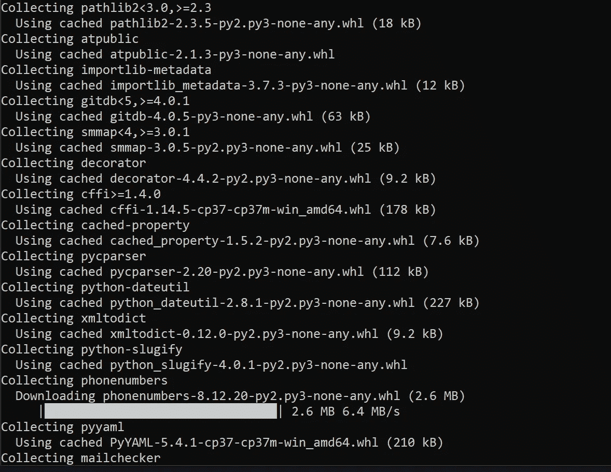

1.2-安装软件包

3.2 了解我们的项目架构
在继续之前，让我们浏览一下我们的项目架构，了解一下管道。

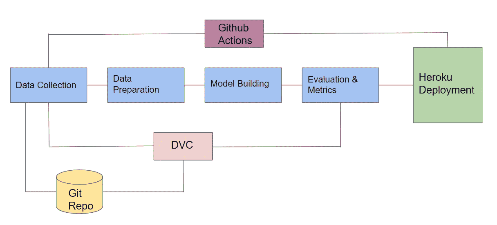

1.3-项目架构

这里，管道从数据收集开始，它可以来自任何来源，如任何云或实时数据流。在我们的案例中，我们将使用已经收集的数据。
在下一阶段，我们将准备数据，特别是根据给定的比率将其分为训练和测试。
接下来是模型构建阶段，我们将训练并保存我们的模型。
一旦模型得到训练，我们将通过一些指标和图表来评估我们的模型表现如何。
最后，在完成所有这些后，该模型将在 Heroku 上部署，在前端使用 web-app，并与 flask API 配对。DVC 负责跟踪数据和管道。
Github 操作有助于构建管道，并在部署前持续集成管道。最后，对于所有方式，git 库是推送所有代码的基础库。

3.3 初始化 git 和 DVC 并获取根目录中的数据(阶段 1)
我们将创建 Git 的本地 repo 并启动 DVC。
在终端/命令中键入以下命令。

```
git init
dvc init
```

完成后，您将看到如下所示的两个文件

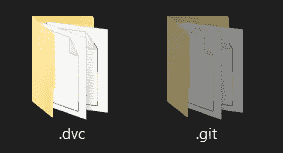

1.4-运行以上两个命令后

现在，要开始跟踪 cmd 中的数据，请键入以下命令

```
dvc add Data_Set/Bulbasaur
dvc add Data_Set/Charmander
dvc add Data_Set/Squirtle
```

运行以上程序后，你会在下面显示的 Data_Set 目录中看到一些新文件。

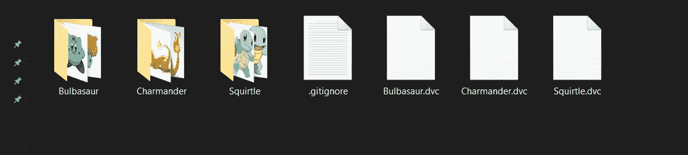

1.5- .运行以上 3 个命令后，创建了 dvc 文件

## 3.4 创建“config.yaml”和其他文件夹

现在，我们需要一些配置文件和文件夹，我们可以从这些文件和文件夹开始构建管道。请看下图，并在 cmd/terminal 中键入命令

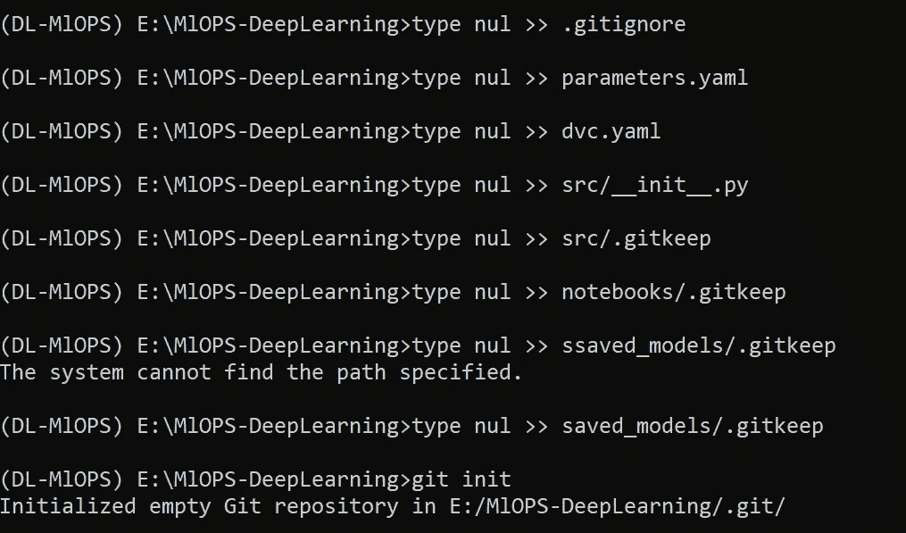

1.6-创建所需文件和文件夹的命令

> 注意-如果你使用的是 Linux，使用命令“touch”而不是“type nul > >”，也不要运行“git init ”,因为我们之前已经运行过了。

最后，您将得到如下所示的目录结构

## 3.5 配置文件和数据准备(第二阶段)

在“parameters.yaml”文件中复制粘贴以下参数，您可以使用文本编辑器或 IDE。为此，我将使用 VS 代码。

```
base:
  project: Deep Learning using MlOPSdata_source:
  data_src: Data_Setload_data:
  num_classes: 3
  raw_data: Data_Set
  preprocessed_data: Data\preprocessed
  full_p: \MlOPS-DeepLearning\Data_Set
```

以下是'中的以下参数。yaml '文件
1。' project ':代表项目名称
2。data_src:在我们的例子中，我们从哪里获取数据呢？是“Data_Set”文件夹。
3。num_classed:它是可用于分类的类的数量
4。预处理数据:分割数据将出现的目录
5。full_p:这是“数据集”文件夹的路径

> 注意:因为这是我们将要构建的管道，所以任何更改都应该只在“parameter.yaml”中进行，除非我们想要更改完整的管道。例如，如果您有更多的类，如 6 或 7，那么将值“num_classes”从 3 更改为 6。

为了读取配置文件，我创建了一个“getdata.py”文件，它从。yaml '文件基于提到的参数从该文件返回特定值。

```
import os
import numpy as np
import shutil
import random
import yaml
import argparsedef get_data(config_file):
    config = read_params(config_file)
    return configdef read_params(config_file):
    with open(config_file) as conf:
        config = yaml.safe_load(conf)
        return configif __name__ == '__main__':
    args = argparse.ArgumentParser()
    args.add_argument("--config", default = 'parameters.yaml')
    passed_args = args.parse_args()
    a = get_data(config_file = passed_args.config)
```

下一步是为训练和测试准备数据(在我们的例子中是图像),所以下面的代码创建新的文件夹，如 data->预处理->train，test
train 和 test 的每个子目录将包含 3 类图像。此外，分流比将在“parameters.yaml”中给出。

```
import os
import numpy as np
import shutil
import random
import yaml
import argparse
from getdata import get_data####################method for creating folder#####################def create_fold(config,img = None):
    config = get_data(config)
    dirr = config['load_data']['preprocessed_data']
    cla = config['load_data']['num_classes']
    print(dirr)
    print(cla)if os.path.exists(dirr+'/'+'train'+'/'+'class_0') and os.path.exists(dirr+'/'+'test'+'/'+'class_0'):
        print('train and test folders already exist...')
        print('skipping it!')else:
        os.mkdir(dirr+'/'+'train')
        os.mkdir(dirr+'/'+'test')
        for i in range(cla):

            os.makedirs(os.path.join(dirr+'/'+'train','class_'+str(i)))
            os.makedirs(os.path.join(dirr+'/'+'test','class_'+str(i)))#####method for splitting the images for train and test####def train_test_split(config):
    config =  get_data(config)
    root_dir = config['data_source']['data_src'] 
    dest = config['load_data']['preprocessed_data']
    p = config['load_data']['full_p']
    cla = config['data_source']['data_src']
    cla = os.listdir(cla)
    cla = [i for i in cla if not i.endswith('.dvc') and cla if not i.startswith('.git')]
    print(cla)
    splitr = config['train_split']['split_ratio']
    print(splitr)for k in range(len(cla)):
        print(cla[k])
        per = len(os.listdir((os.path.join(root_dir,cla[k]))))
        cnt = 0
        for j in os.listdir(os.path.join(root_dir,cla[k])):
            #per = len(os.path.join(root_dir,cla[k]))
            #print(per)
            pat = os.path.join(p+'/'+cla[k],j)
            split_ratio = round((splitr/100)*per)
            print(split_ratio)
            if cnt != split_ratio:
                #print(cnt)
                shutil.copy(pat,dest+'/'+'train/class_'+str(k))
                cnt = cnt+1 else:
                shutil.copy(pat,dest+'/'+'test/class_'+str(k))print('done')if __name__ == '__main__':
    args = argparse.ArgumentParser()
    args.add_argument("--config", default = 'parameters.yaml')
    passed_args = args.parse_args()

    create_fold(config=passed_args.config)
    train_test_split(config = passed_args.config)
```

> 注意-把上面的两个代码放到 src 文件夹中，不要放在根文件夹中。

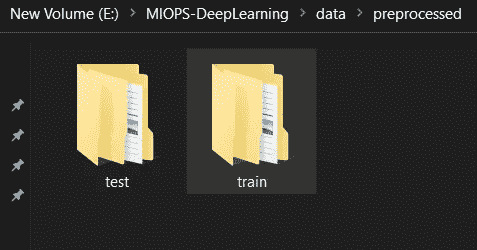

1.7-运行“split.py”文件

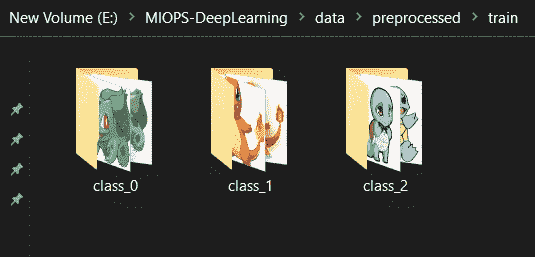

1.7-子目录已创建。

上面两张图片是运行“split.py”文件的结果，每个子目录都包含按拆分比例排列的图像(测试文件夹也是如此)。

## 3.6 模型构建和培训

现在是构建和训练模型的时候了，在我们的例子中是 VGG19。您可以使用您选择的任何其他模型。但是，即使是为了构建模型，我们也需要给出一些参数，我们将通过“parameters.yaml”文件给出这些参数。看看下面的片段。

```
model:
  name: ResNet50
  trainable: False
  train_path: Data\preprocessed\train
  test_path: Data\preprocessed\test
  image_size: [225,225]
  loss: 'categorical_crossentropy'
  optimizer: 'adam' 
  metrics: ['accuracy']
  epochs: 8
  sav_dir : 'saved_models/trained.h5'img_augment:
  rescale: 1./255,
  shear_range: 0.2
  zoom_range: 0.2
  horizontal_flip: True
  vertical_flip: True
  batch_size: 18
  class_mode: 'categorical'
```

上述配置文件中的每个属性都是用于训练模型及其扩充的参数。您可以根据自己的选择对该文件进行更改。是时候建立模型了。

```
import numpy as np
from keras.applications.resnet import ResNet50
from keras_preprocessing.image import ImageDataGenerator
from keras.layers import Dense,Input,Flatten
from keras.models import Model
from glob import glob
import os
import argparse
from getdata import get_data
import matplotlib.pyplot as plt
from keras.applications.vgg19 import VGG19def train_model(config_file):

    config = get_data(config_file)
    train = config['model']['trainable']
    if train == True:img_size = config['model']['image_size']
        trn_set = config['model']['train_path']
        te_set = config['model']['test_path']
        num_cls = config['load_data']['num_classes']
        rescale = config['img_augment']['rescale']
        shear_range = config['img_augment']['shear_range']
        zoom_range  = config['img_augment']['zoom_range']
        verticalf = config['img_augment']['vertical_flip']
        horizontalf = config['img_augment']['horizontal_flip']
        batch = config['img_augment']['batch_size']
        class_mode = config['img_augment']['class_mode']
        loss = config['model']['loss']
        optimizer = config['model']['optimizer']
        metrics = config['model']['metrics']
        epochs = config['model']['epochs']#print(type(batch))resnet = VGG19(input_shape = img_size +[3], weights = 'imagenet', include_top = False)for p in resnet.layers:
            p.trainable = Falseop = Flatten()(resnet.output)
        prediction = Dense(num_cls,activation = 'softmax')(op)mod = Model(inputs = resnet.input,outputs = prediction)
        print(mod.summary())
        img_size = tuple(img_size)mod.compile(loss = loss ,optimizer = optimizer , metrics = metrics)train_gen = ImageDataGenerator(rescale = 1./255,
                                    shear_range = shear_range,
                                    zoom_range =  zoom_range,
                                    horizontal_flip = horizontalf,
                                    vertical_flip = verticalf,
                                    rotation_range = 90)test_gen = ImageDataGenerator(rescale = 1./255)train_set = train_gen.flow_from_directory(trn_set,
                                                target_size = (225,225),
                                                batch_size = batch,
                                                class_mode = class_mode
                                                )test_set = test_gen.flow_from_directory(te_set,
                                                target_size = (225,225),
                                                batch_size = batch,
                                                class_mode = class_mode
                                                )history = mod.fit(train_set,
                                 epochs = epochs,
                                validation_data = test_set,
                                steps_per_epoch = len(train_set),
                                validation_steps = len(test_set)
        )plt.plot(history.history['loss'], label='train_loss')
        plt.plot(history.history['val_loss'],label='val_loss')
        plt.legend()
        plt.savefig('Reports/train_v_loss')plt.plot(history.history['accuracy'], label='accuracy')
        plt.plot(history.history['val_accuracy'],label='val_acc')
        plt.legend()
        plt.savefig('Reports/acc_v_vacc')mod.save('saved_models/trained.h5')
        print('model saved')

    else:
        print('Model not trained')if __name__ == '__main__':args_parser = argparse.ArgumentParser()
    args_parser.add_argument('--config',default='parameters.yaml')
    passed_args = args_parser.parse_args()
    train_model(config_file=passed_args.config)
```

在上面的代码中，我们根据我们的数据训练 VGG16，并将模型文件保存到“保存的模型”目录中，精度损失将保存在“报告”目录中。

> 注意:如果您不想再次训练模型，请在 parameters.yaml 文件中将“可训练”参数更改为“False”。

训练后，您将看到以下输出。

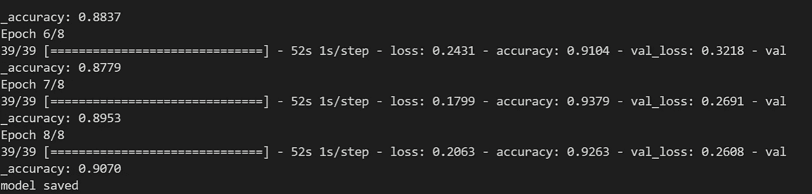

1.8-培训后

在此之后，我们将把所有的更新推到我们的 GitHub repo 中，然后去 GitHub 创建一个新的 repo 并复制它的 URL。然后执行以下步骤。

```
git remote add origin 'paste your github repo url'
git add .
git commit -m "model training done"
git push origin main
```

> 注意:可选地，你也可以在每个阶段之后继续将变更推送到 github。

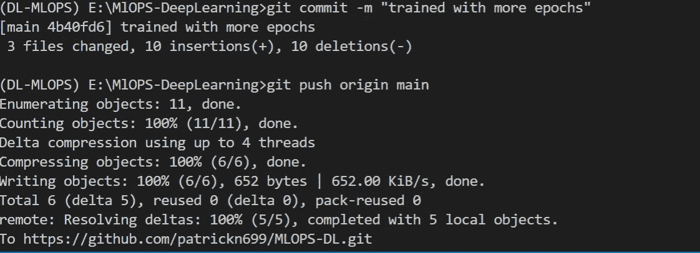

1.9-将更新推送到 GitHub repo 后

此外，如果您检查报告目录，那么您将发现 2 个图像，它们是带有验证准确性的列车准确性和带有验证损失的列车损失图。

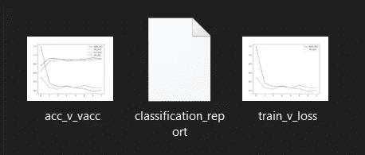

2.0-保存的图

3.7 评估

完成培训后，我们将通过生成混淆矩阵和分类报告来评估性能。
并将它们分别以图像和 CSV 格式保存在“报告”目录中。在源目录中创建一个名为“evaluate.py”的新文件，并粘贴下面的代码片段。

```
from keras.models import load_model
from sklearn.metrics import confusion_matrix,classification_report
import os
import numpy as np
import argparse
from getdata import get_data
from keras_preprocessing.image import ImageDataGenerator
import seaborn as sns
import matplotlib.pyplot as plt
import pandas as pddef m_evaluate(config_file):
    config = get_data(config_file)
    batch = config['img_augment']['batch_size']
    class_mode = config['img_augment']['class_mode']
    te_set = config['model']['test_path']
    model = load_model('saved_models/trained.h5')
    config = get_data(config_file)test_gen = ImageDataGenerator(rescale = 1./255)
    test_set = test_gen.flow_from_directory(te_set,
                                                target_size = (225,225),
                                                batch_size = batch,
                                                class_mode = class_mode
                                                )label_map = (test_set.class_indices)
    print(label_map)
    Y_pred = model.predict_generator(test_set, len(test_set))
    y_pred = np.argmax(Y_pred, axis=1)
    print('Confusion Matrix')
    sns.heatmap(confusion_matrix(test_set.classes, y_pred ),annot = True)
    plt.xlabel('Actual values, 0:Bulbasaur, 1:Charmander,2:Squirtle')
    plt.ylabel('Predicted values, 0:Bulbasaur, 1:Charmander,2:Squirtle')
    plt.savefig('Reports/Confusion Matrix')
   # plt.show()
    print('Classification Report')
    target_names = ['Bulbasaur', 'Charmander', 'Squirtle']
    df = pd.DataFrame(classification_report(test_set.classes, y_pred, target_names=target_names, output_dict=True)).T
    df['support'] = df.support.apply(int)
    df.style.background_gradient(cmap='viridis',
                             subset=pd.IndexSlice['0':'9', :'f1-score'])
    df.to_csv('Reports/classification_report')
    print('Classification Report And Confusion Matrix Saved at Reports Directory')if __name__ == '__main__':
    args_parser = argparse.ArgumentParser()
    args_parser.add_argument('--config',default='parameters.yaml')
    passed_args = args_parser.parse_args()
    m_evaluate(config_file=passed_args.config)
```

运行后，您将看到如下所示的 2 个新文件

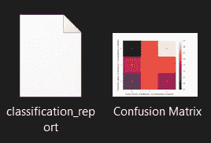

2.1-混淆矩阵和分类报告

现在是时候向 GitHub 推送更新了

```
git add .
git commit -m "model evaluated and reports saved"
git push origin main
```

## 3.8 建筑管道

接下来，我们将开始制作管道，因为所有阶段都是按顺序执行的，为此我们需要在“dvc.yaml”文件中添加参数。
打开‘DVC . YAML’文件，粘贴以下参数。该文件负责将所有阶段连接在一起，形成一个完整的管道。

```
stages:
  load_data:
    cmd: python src/split.py --config=parameters.yaml
    deps:
    - src/getdata.py
    - src/split.py
    - Data_Set/

    outs:
    - data/preprocessed:
         persist: truetrain_model:
    cmd: python src/model_train.py --config=parameters.yaml
    deps:
    - src/getdata.py
    - src/model_train.py
    outs:
    - saved_models:
          persist: true
    - Reports:
          persist: trueevaluate:
    cmd: python src/evaluate.py --config=parameters.yaml
    deps:
    - src/getdata.py
    - src/evaluate.py
```

' dvc.yaml '用于构建和执行管道，其中:
1。阶段:定义管道的阶段
2。load_data，train_model，evaluate:是阶段的名称
3。cmd:用于运行特定的 python 文件
4。deps:是运行我们的 python 文件
5 所需的依赖项。outs:用于指定执行脚本的输出应该保存在哪里
6。persist:允许保留执行管道后所做的更改

因此，要运行管道中的所有阶段，只需在 cmd/terminal 中运行下面的命令

```
dvc repro
```

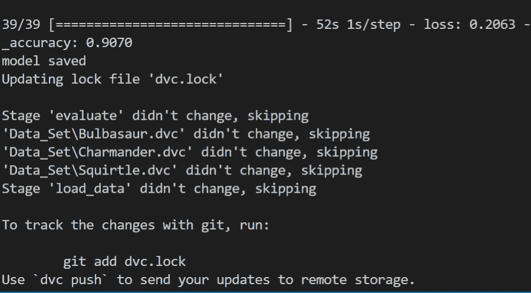

2.2-运行上述命令后

运行“dvc 再现”命令后，所有管道将执行并生成一个“dvc.lock”文件，在该文件中跟踪管道中的所有更改

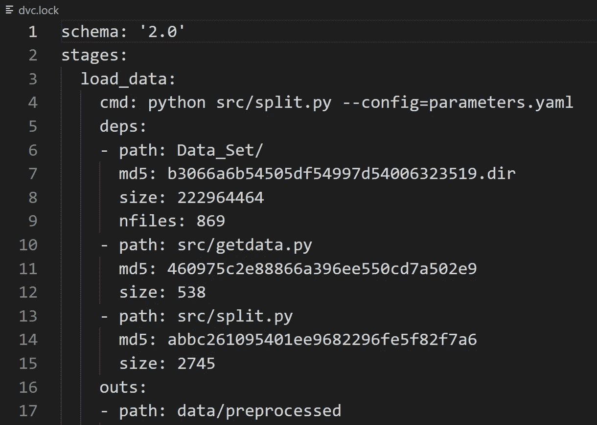

2.3-dvc.lock 文件

它还为管道中每个阶段的每个文件生成一个唯一的哈希值，即 md5。

到目前为止，我们已经建立了准备数据、模型训练和评估的管道。但我们还没有完成，我们仍然需要使用 flask 构建一个 web 应用程序，并在 GitHub actions 的帮助下，使用“持续集成和部署”将其部署在 Heroku 中。
由于这篇文章已经很长了，我将在下一部分继续，即第 2 部分，我们将继续部署这个模型。这是我目前项目的 GitHub 回购，你可以下载。

也就是说，在我的下一篇文章，也就是非常有趣的第二部分，再见！….这是我文章第二部分的链接。如有任何疑问，您可以通过 [Linkedin](https://www.linkedin.com/in/prathmesh-patil-b151051a3) 联系我。