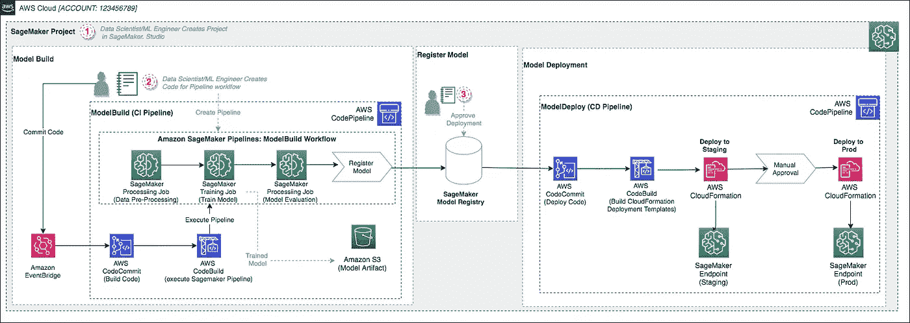
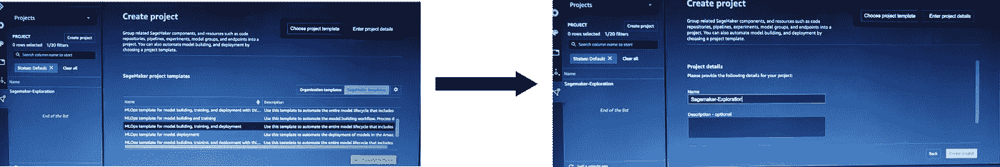
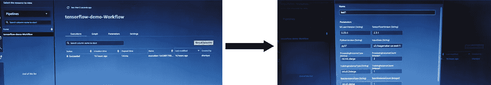
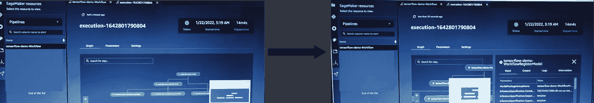
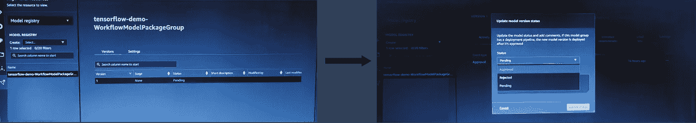

# MLOps —使用 Sagemaker SDK 和 AWS CodeCommit 构建端到端管道

> 原文：<https://medium.com/analytics-vidhya/mlops-building-end-to-end-pipeline-using-sagemaker-sdk-aws-codecommit-a4d15d7efdc3?source=collection_archive---------0----------------------->

在后 covid 时代，公司不断通过使用人工智能来实现业务流程的自动化。数据科学家和数据工程师一直需要支持业务需求的不断变化。人们通常将这称为人工智能热潮或现代数字时代。

随着这种变化，数据科学家不断寻找快速开发解决方案的方法，并将其部署在一个设备无关的平台上，该平台可以满足人们的需求，同时优化运营成本。一旦解决方案部署到生产就绪环境中，数据科学家需要收集模型性能的反馈，并不断完善模型以实现更高的准确性。这导致这些公司将他们的解决方案从本地服务器迁移到云环境，在云环境中，他们可以根据模型要求灵活地更改他们的计算资源，并根据使用情况付费，从而帮助这些公司降低运营成本，并帮助客户快速交付模型。

在本文中，我们将介绍一个这样的云环境(Amazon Web Service)解决方案，它可以使用 AWS Sagemaker & AWS CodeCommit，只需点击一下，就可以帮助在单个工作流中自动化模型训练、部署和监控的完整过程。



[https://AWS . Amazon . com/blogs/machine-learning/building-automating-management-and-scaling-ml-workflows-using-Amazon-sage maker-pipelines/](https://aws.amazon.com/blogs/machine-learning/building-automating-managing-and-scaling-ml-workflows-using-amazon-sagemaker-pipelines/)

> 使用的主要 AWS 资源:

> AWS Sagemaker、AWS CodeCommit、亚马逊 S3、AWS CodeBuild 和亚马逊 EventBridge

# 使用的数据集

在这个示例方法中，我们将使用一个通常可用的数据集，称为“[波士顿住房数据集](https://www.kaggle.com/schirmerchad/bostonhoustingmlnd)，它用 14 个不同的要素和 506 个不同的条目表示马萨诸塞州波士顿的住房数据。一些共同特征包括通往高速公路、平均房间数量和靠近河流等。我们将尝试解决一个回归任务，即使用基于神经网络的算法，根据数据集中存在的 13 个不同特征来预测房屋的价格。

# Sagemaker 管道

所以，现在我们清楚了目的和解决问题的方法，我们将首先在 AWS 中建立 sagemaker 工作室。请参考下面的链接获取分步指南:

 [## 使用快速入门进入 Amazon SageMaker 域

### 本主题介绍如何使用快速入门程序登录 Amazon SageMaker 域，该程序使用 AWS 身份…

docs.aws.amazon.com](https://docs.aws.amazon.com/sagemaker/latest/dg/onboard-quick-start.html) 

一旦我们登录到 sagemaker studio jupyter 实验室，我们将使用现有的 sagemaker 项目模板创建一个项目。请选择“用于模型构建、培训和部署的 MLOps 模板”模板，如下图所示



AWS Sagemaker 项目创建

既然项目已经成功建立，我们将深入到编码方面。但是在开始编写代码之前，我们首先将 sagemaker SDK 更新到最新版本:

```
!pip install sagemaker --upgrade
```

现在，我们将初始化 sagemaker 会话、区域和 s3 存储桶名称，我们希望在其中存储数据、实验日志和模型工件:

```
**import** boto3
**import** os
**import** sagemaker
**import** tensorflow **as** tf

sess **=** sagemaker**.**session**.**Session()
bucket **=** sess**.**default_bucket() 
region **=** boto3**.**Session()**.**region_name
```

## 定义参数

一旦我们上传了定义的 s3 存储桶中的数据，我们将对 pipeline.py 文件进行一些编辑，该文件执行模型训练和注册的源代码。在这种情况下，我们需要首先参数化一些关键参数，这将使我们能够执行定制的管道和时间表，而不必修改管道定义。以下是代码:

```
**from** sagemaker.workflow.parameters **import** ParameterInteger, ParameterString

*# package versions*
sklearn_version **=** ParameterString(name**=**"SKLearnVersion", default_value**=**"0.23-1")
tensorflow_version **=** ParameterString(name**=**"TensorFlowVersion", default_value**=**"2.3.1")
python_version **=** ParameterString(name**=**"PythonVersion", default_value**=**"py37")

*# raw input data*
input_data **=** ParameterString(name**=**"InputData", default_value**=**s3_path)

*# processing step parameters*
processing_instance_type **=** ParameterString(name**=**"ProcessingInstanceType", default_value**=**"ml.m5.xlarge")
processing_instance_count **=** ParameterInteger(name**=**"ProcessingInstanceCount", default_value**=3**)

*# training step parameters*
training_instance_type **=** ParameterString(name**=**"TrainingInstanceType", default_value**=**"ml.c5.2xlarge")
training_instance_count **=** ParameterInteger(name**=**"TrainingInstanceCount", default_value**=**1)

*# batch inference step parameters*
batch_instance_type **=** ParameterString(name**=**"BatchInstanceType", default_value**=**"ml.c5.xlarge")
batch_instance_count **=** ParameterInteger(name**=**"BatchInstanceCount", default_value**=**1)
```

## 定义处理步骤

流水线的第一步是预处理输入数据。为此，我们将实例化一个 SKLearnProcessor 对象，该对象允许我们使用上面定义的参数指定作业的实例类型和计数，以及指定可分配给 sagemaker 培训作业和 sagemaker 端点以及用于成本分配和其他目的的标签。

```
**from** sagemaker.sklearn.processing **import** SKLearnProcessor
**from** sagemaker.processing **import** ProcessingInput, ProcessingOutput
**from** sagemaker.workflow.steps **import** ProcessingStepprocessing_tags **=** [{'Key': 'pipeline-demo', 'Value': 'TFDemoProcessing'}]sklearn_processor **=** SKLearnProcessor(
    framework_version**=**sklearn_version**.**default_value,
    instance_type**=**processing_instance_type,
    instance_count**=**processing_instance_count,
    base_job_name**=**"tensorflow-demo-process",
    sagemaker_session**=**sess,
    role**=**sagemaker**.**get_execution_role(),
    tags**=**processing_tags)

step_process **=** ProcessingStep(
    name**=**"TFDemo",
    processor**=**sklearn_processor,
    inputs**=**[
        ProcessingInput(source**=**input_data, destination**=**"/opt/ml/processing/input", s3_data_distribution_type**=**'ShardedByS3Key'),
    ],
    outputs**=**[
        ProcessingOutput(output_name**=**"train", source**=**"/opt/ml/processing/train"),
        ProcessingOutput(output_name**=**"test", source**=**"/opt/ml/processing/test"),
    ],
    code**=**"./scripts/preprocessing.py" )
```

使用 ShardedByS3Key 分布类型，数据可以平均分布在上面定义的 n 个实例中，以将数据转换过程的速度提高 n 倍。

## 定义培训、模型创建和模型注册步骤

以下代码将使用带有指定 TensorFlow 版本的预构建 TensorFlow docker 容器为培训作业设置管道步骤。

```
**from** sagemaker.tensorflow **import** TensorFlow
**from** sagemaker.inputs **import** TrainingInput
**from** sagemaker.workflow.steps **import** TrainingStep
**from** sagemaker.workflow.step_collections **import** RegisterModel

image_uri_train **=** sagemaker**.**image_uris**.**retrieve(framework**=**"tensorflow", region**=**region, version**=**tensorflow_version**.**default_value, py_version**=**python_version**.**default_value, instance_type**=**training_instance_type, image_scope**=**"training")
```

如需更多此类预建 sagemaker 图像，请参考以下链接:

[](https://github.com/aws/deep-learning-containers/blob/master/available_images.md) [## 深度学习容器/available _ images . MD at master AWS/deep-learning-containers

### 下表列出了 Amazon ECS 将在任务定义中使用的 Docker 图像 URL。替换和…

github.com](https://github.com/aws/deep-learning-containers/blob/master/available_images.md) 

接下来，我们需要指定一个估计器对象，并基于默认的贝叶斯优化调优策略定义一个超参数调优器对象，以便对下面定义的参数运行超参数调优。

```
**import** time

model_path **=** f"s3://{bucket}/TFDemoTrain"
training_parameters **=** {'epochs': 20, 'batch_size': 64, 'learning_rate': 0.001, 'for_pipeline': 'true'}training_metrics **=** [
   {
       "Name": "training:loss",
       "Regex": ".*step - loss: ([0-9\\.]+) - val_loss: [0-9\\.]+ - batch: [0-9\\.]+.*",
    },
    {
        "Name": "validation:loss",
        "Regex": ".*step - loss: [0-9\\.]+ - val_loss: ([0-9\\.]+) - batch: [0-9\\.]+.*",
    }
]training_tags **=** [{'Key': 'pipeline-demo', 'Value': 'TFDemoTrain'}]estimator **=** TensorFlow(
    image_uri**=**image_uri_train,
    metric_definitions**=**training_metrics,
    tags**=**training_tags,
    source_dir**=**'./scripts/',
    entry_point**=**'train.py',
    instance_type**=**training_instance_type,
    instance_count**=**training_instance_count,
    role**=**sagemaker**.**get_execution_role(),
    base_job_name**=**"tensorflow-demo-train",
    output_path**=**model_path,
    hyperparameters**=**training_parameters )
```

超参数调谐器定义:

```
**from** sagemaker.tuner **import** IntegerParameter, CategoricalParameter, ContinuousParameter, HyperparameterTuner

hyperparameter_ranges **=** {
  'learning_rate': ContinuousParameter(0.001, 0.2, scaling_type**=**"Logarithmic"),
  'epochs': IntegerParameter(5, 30),
  'batch_size': IntegerParameter(64, 256),
}

metric_definitions **=** [{'Name': 'loss',
                       'Regex': 'loss: ([0-9\\.]+)'},
                     {'Name': 'val_loss',
                       'Regex': 'val_loss: ([0-9\\.]+)'}]

tuning_tags **=** [{'Key': 'pipeline-demo', 'Value': 'TFDemoTuning'}]
tuner **=** HyperparameterTuner(estimator,
                            'val_loss',
                            hyperparameter_ranges,
                            metric_definitions,
                            max_jobs**=**30,
                            max_parallel_jobs**=**10,
                            objective_type**='**Minimize',
                            tags**=**tuning_tags)
```

接下来，我们需要定义一个训练步骤，用来自前一个处理步骤的输入在管道中插入训练作业。

```
step_train **=** TrainingStep(
    name**=**"TFDemoTrain",
    estimator**=**estimator,
    inputs**=**{
        "train": TrainingInput( s3_data**=**step_process**.**properties**.**ProcessingOutputConfig**.**Outputs[
                "train"
            ]**.**S3Output**.**S3Uri
        ),
        "test": TrainingInput(
            s3_data**=**step_process**.**properties**.**ProcessingOutputConfig**.**Outputs[
                "test"
            ]**.**S3Output**.**S3Uri
        )
    },
)
```

一旦定义了训练步骤，我们还将创建一个 sagemaker 模型对象来包装模型工件，并将它与一个单独的 SageMaker 预构建 TensorFlow 服务推理容器相关联，以便进行推理

```
**from** sagemaker.model **import** Model
**from** sagemaker.inputs **import** CreateModelInput
**from** sagemaker.workflow.steps **import** CreateModelStep

image_uri_inference **=** sagemaker**.**image_uris**.**retrieve(framework**=**"tensorflow", region**=**region, version**=**tensorflow_version**.**default_value, py_version**=**python_version**.**default_value, instance_type**=**batch_instance_type, image_scope**=**"inference")model **=** Model(image_uri**=**image_uri_inference, model_data**=**step_train**.**properties**.**ModelArtifacts**.**S3ModelArtifacts, sagemaker_session**=**sess, role**=**sagemaker**.**get_execution_role())

inputs_model **=** CreateModelInput(instance_type**=**batch_instance_type)

step_create_model **=** CreateModelStep(name**=**"TFDemoCreateModel", model**=**model, inputs**=**inputs_model)
```

最后一步是通过 Sagemaker Model Registry 注册一个模型，用于版本控制和改进的模型治理。使用模型注册中心，我们可以管理不同的模型版本，它也可以作为 CI/CD 工作流的一部分，用于将模型部署到 Sagemaker 端点

```
**from** sagemaker.workflow.step_collections **import** RegisterModel

step_register **=** RegisterModel(name**=**"TFDemoRegisterModel", estimator**=**estimator, model_data**=**step_train**.**properties**.**ModelArtifacts**.**S3ModelArtifacts, content_types**=**["text/csv"],
response_types**=**["text/csv"],
inference_instances**=**["ml.m5.xlarge"],
transform_instances**=**["ml.c5.xlarge"],
model_package_group_name**=**"TFDemoModelPackageGroup",
image_uri**=**image_uri_inference)
```

## 定义管道

除了所有这些步骤，我们还可以创建一个类似的步骤用于模型推断。最后，一旦定义了所有步骤，我们可以将这些步骤缝合到管道函数中，使其能够以自动化的方式运行。这个管道还与 SageMaker 实验集成在一起，让我们可以组织、跟踪、比较和评估 ML 实验。

```
**from** sagemaker.workflow.pipeline **import** Pipeline, PipelineExperimentConfig
**from** sagemaker.workflow.execution_variables **import** ExecutionVariables

pipeline **=** Pipeline(
    name**=**f"TFDemo",
    parameters**=**[sklearn_version,
                tensorflow_version,
                python_version,
                input_data,
                processing_instance_type, 
                processing_instance_count, 
                training_instance_type, 
                training_instance_count,
                batch_instance_type,
                batch_instance_count],
    steps**=**[step_process, 
           step_train, 
           step_create_model,
           step_register,
           step_batch
          ],
    pipeline_experiment_config**=**PipelineExperimentConfig("TFDemoExperiment", ExecutionVariables**.**PIPELINE_EXECUTION_ID),
    sagemaker_session**=**sess)
```

## 自动化工作流执行

现在，由于代码已经准备好执行，我们可以通过代码手动执行它:

```
pipeline_tags **=** [{'Key': 'pipeline-demo', 'Value': 'TFDemoPipeline'}]
pipeline**.**upsert(role_arn**=**role, tags**=**pipeline_tags)
execution **=** pipeline**.**start()
execution**.**wait()
execution**.**list_steps()
```

或者，我们可以简单地 git push AWS code commit 中的已编辑代码，一旦模型经过训练并在 Sagemaker 注册表中注册，它将自动触发管道解决方案通过手动批准流程来构建、训练和部署模型。



通过 AWS Sagemaker Studio 资源管道执行管道部分

# 结论

AWS Sagemaker studio 是一个很好的地方，可以通过 AWS 在 Sagemaker 资源中提供的交互式 UI 来自动化模型开发和部署的完整端到端过程。在管道部分，显示了所有的执行细节。新的执行可以通过一些参数更改和点击开始，其余的可以由 AWS 自动处理。如果我们深入单个执行，我们可以看到完整的管道流以及输入、输出和日志，如下图所示。



一旦模型被训练和注册，我们就可以根据它的验证分数来批准模型。在我们批准注册的模型之后，它将进入部署阶段。在这个阶段，如果我们对测试指标(比如蓝绿色测试或 A/B 测试)感到满意，我们可以进一步批准模型进行生产就绪部署。



通过手动批准的模型部署步骤

敬请关注，了解我们在日常工作中使用的不同方法。在 Linkedin 上关注我来互动和分享想法:[https://www.linkedin.com/in/mdsharique0107/](https://www.linkedin.com/in/mdsharique0107/)