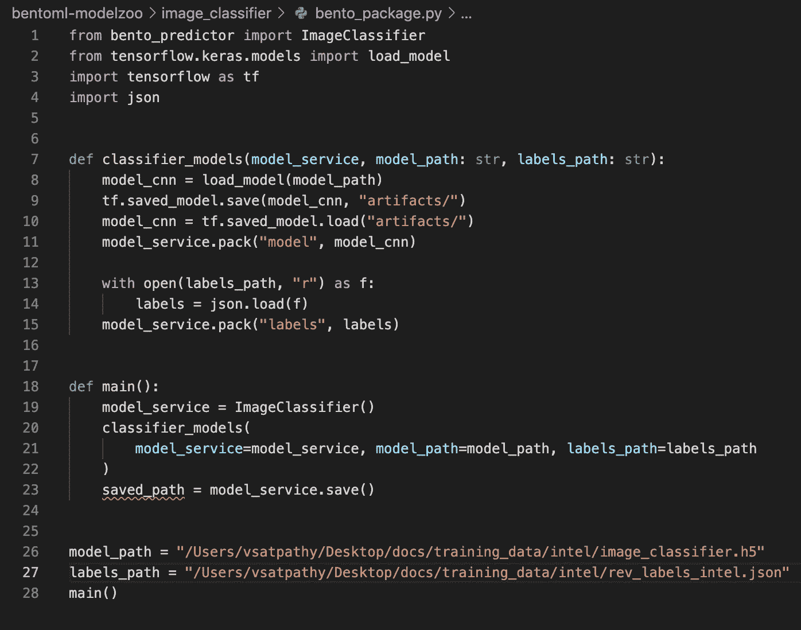
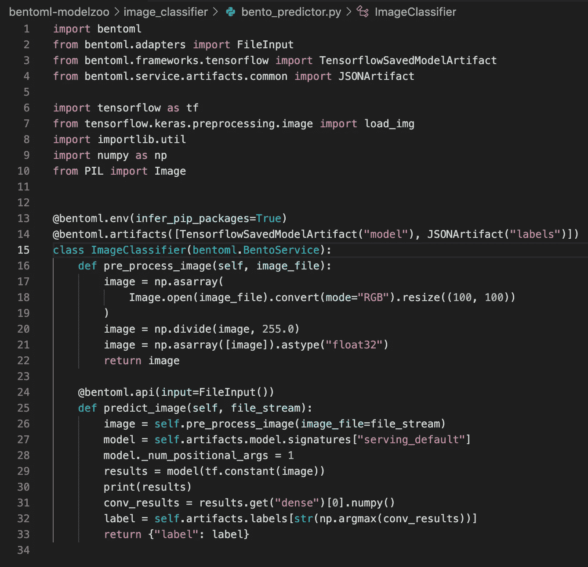
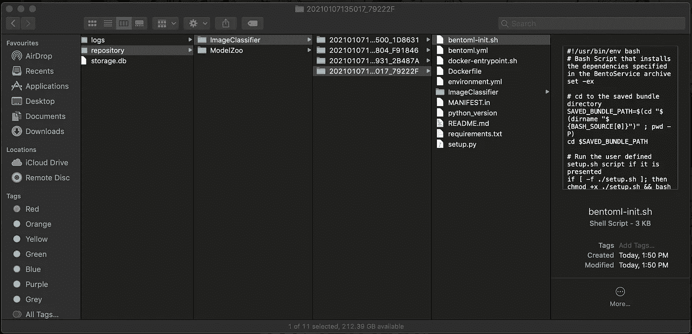
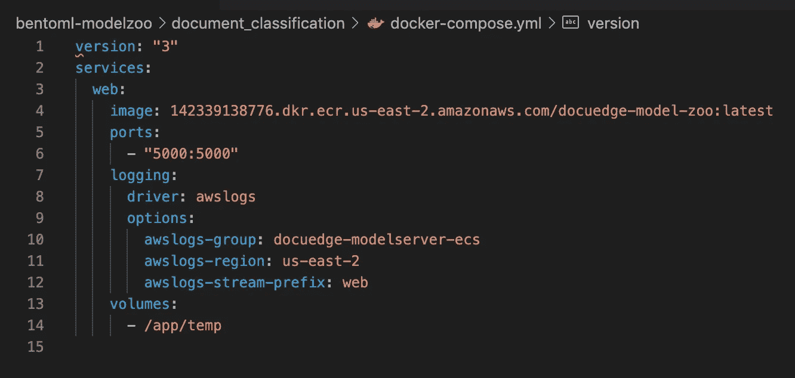
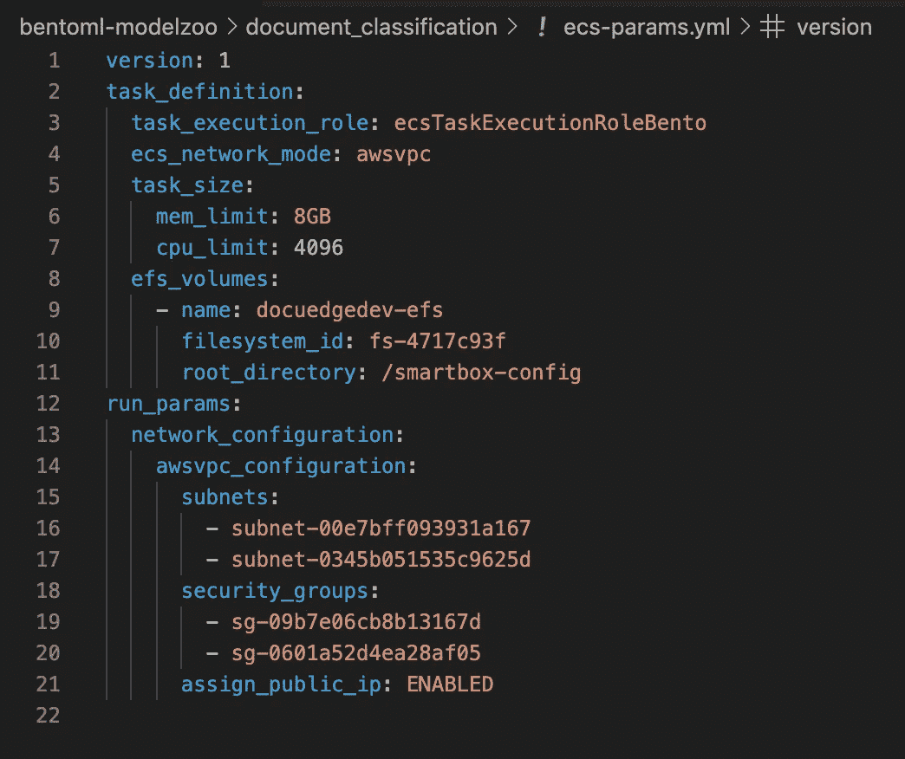
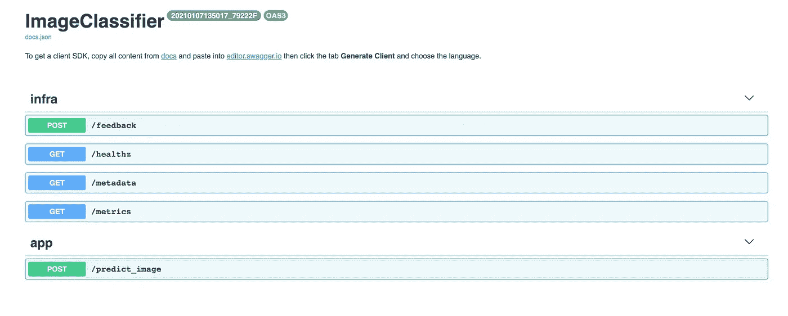
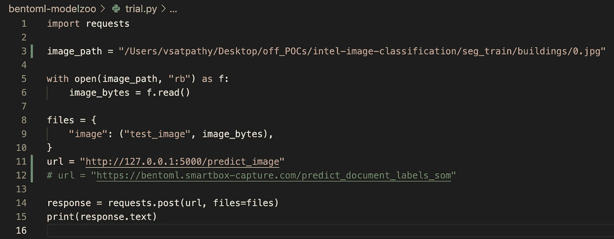

# MLOps 部署到 AWS Fargate: II

> 原文：<https://medium.com/analytics-vidhya/mlops-deployment-in-to-aws-fargate-ii-95321942b9e1?source=collection_archive---------8----------------------->


欢迎学习端到端 MLOps 的 3 部分教程，从培训、跟踪、部署和推理开始。

第 1 部分:在 AWS EC2 上设置 MLflow

第 2 部分:在 AWS Fargate 上部署 MLOps

第 3 部分:AWS Fargate: II 上的 MLOps 部署

继续第 3 部分…

你可以在这里找到所有使用过的代码[的 Github 库！](https://github.com/vaibhavsatpathy/psAI-clOps)

在上一部分中，我们已经设置了将模型部署到云环境中所需的所有基础设施。既然培训已经完成，我们已经有了工件，下一个具有挑战性的任务是创建 API，创建一个包含所有必需内容的 Docker 映像，并将其设置到 AWS 中。

为了避免手动创建 Docker 镜像及其所有依赖项的繁琐任务，我们将使用一个名为 [BentoML](https://www.bentoml.ai/) 的 Python 框架。

BentoML 使开发和部署神经模型成为每个人的茶。让我们看看如何设置 python 脚本来获得想要的结果。

创建 API 需要编写两个 python 脚本。第一个用来打包所有必需的工件，另一个用来声明所有必需的 API 和依赖项。

## 先决条件:

1.  系统上配置的 AWS 账号:
    CLI 安装:[https://docs . AWS . Amazon . com/CLI/latest/user guide/CLI-chap-install . html](https://docs.aws.amazon.com/cli/latest/userguide/cli-chap-install.html)账号配置:[https://docs . AWS . Amazon . com/CLI/latest/user guide/CLI-chap-configure . html](https://docs.aws.amazon.com/cli/latest/userguide/cli-chap-configure.html)
2.  系统上安装的 Docker
3.  AWS ecs-cli 安装和配置
    CLI 安装:[https://docs . AWS . Amazon . com/AmazonECS/latest/developer guide/ECS _ CLI _ installation . html](https://docs.aws.amazon.com/AmazonECS/latest/developerguide/ECS_CLI_installation.html)

I .使用 [BentoML 指南](https://docs.bentoml.org/en/latest/quickstart.html)开发必要的脚本。

1.  便当包装脚本需要给出工件的路径。现在，我们从 S3 下载文物到我们的本地系统，并给出了相应的路径



2.Bento 预测脚本需要将所有的需求和 API 结构整合到 AWS 中。

让我们来看看剧本



decorator @bentoml.api 帮助创建名为 predict_image 的 api 函数。API 已经被构建为在其请求中接收字节格式的图像文件，作为回报，它将发送标签。

如您所见，必要的人工制品是一个基于 Tensorflow 的模型和一个包含标签的 Json 文件。

decorator @bentoml.env 有助于自动生成 requirements.txt 文件，以便根据脚本中导入的包构建 Docker 映像。

3.使用以下命令运行便当打包脚本

```
python3 bento_package.py
```

4.这将创建一个以 UUID 作为其文件夹名称的本地存储库，它将包含构建 docker 映像和测试其功能所需的所有数据。



5.为了在本地测试结果，我们需要运行以下命令:

```
bentoml serve ImageClassifier:latest
```

二。[将 BentoML 模型服务器装箱进行部署](https://docs.bentoml.org/en/latest/deployment/aws_ecs.html)

1.  为了创建 ECS 部署，需要对模型服务器进行容器化，并将其推送到容器注册中心(ECR)
2.  我们需要登录 Docker

```
aws ecr get-login-password --region us-east-2*# Sample output (Authentication Token)*

eyJ.................OOH
```

3.使用以下命令中的输出并添加您的帐户 ID。

```
docker login -u AWS -p eyJ.................OOH https://account_id.dkr.ecr.us-west-2.amazonaws.com
```

4.创建 AWS ECR 存储库

```
aws ecr create-repository --repository-name irisclassifier-ecs
```

5.建立 Docker 形象

```
saved_path=**$(**bentoml get IrisClassifier:latest --print-location --quiet**)**

docker build --tag=account_id.dkr.ecr.us-west-2.amazonaws.com/irisclassifier-ecs $saved_path
```

6.推送 docker 图像

```
docker push account_id.dkr.ecr.us-west-2.amazonaws.com/irisclassifier-ecs
```

7.为 ECR 部署准备 AWS

```
$ cat task-execution-assume-role.json

# Sample output

{
  "Version": "2012-10-17",
  "Statement": [
    {
      "Sid": "",
      "Effect": "Allow",
      "Principal": {
        "Service": "ecs-tasks.amazonaws.com"
      },
      "Action": "sts:AssumeRole"
    }
  ]
}
```

8.创建 IAM 角色

```
aws iam --region us-west-2 create-role --role-name ecsTaskExecutionRole \
  --assume-role-policy-document file://task-execution-assume-role.json

# Sample output

{
    "Role": {
        "Path": "/",
        "RoleName": "ecsTaskExecutionRole",
        "RoleId": "AROASZNL76Z7C7Q7SZJ4D",
        "Arn": "arn:aws:iam::192023623294:role/ecsTaskExecutionRole",
        "CreateDate": "2019-12-17T01:04:08Z",
        "AssumeRolePolicyDocument": {
            "Version": "2012-10-17",
            "Statement": [
                {
                    "Sid": "",
                    "Effect": "Allow",
                    "Principal": {
                        "Service": "ecs-tasks.amazonaws.com"
                    },
                    "Action": "sts:AssumeRole"
                }
            ]
        }
    }
}
```

9.将策略 AmazonECSTaskExecutionRolePolicy 添加到角色 ecsTaskExecutionRole

```
aws iam --region us-west-2 attach-role-policy --role-name ecsTaskExecutionRole **\**
  --policy-arn arn:aws:iam::aws:policy/service-role/AmazonECSTaskExecutionRolePolicy
```

三。配置 ECR 配置文件

1.  创建 ECR CLI 配置文件

```
ecs-cli configure profile --access-key $AWS_ACCESS_KEY_ID --secret-key $AWS_SECRET_ACCESS_KEY --profile-name docuedge-bentoml-profile
```

2.创建 ECR 集群配置文件配置

```
ecs-cli configure --cluster docuedge-bentoml-modelzoo --default-launch-type FARGATE --config-name docuedge-bentoml-config --region us-east-2
```

3.使用上面创建的配置文件创建一个集群

```
ecs-cli up --vpc vpc-01b4edaf92e19af08 --subnets subnet-0345b051535c9625d, subnet-00e7bff093931a167 --cluster-config docuedge-bentoml-config --cluster docuedge-bentoml-modelzoo
```

四。创造必要的。yaml 文件

1.  创建 docker-compose.yaml 文件，使用前面步骤中的图像标记



2.使用您在本集的前一部分中使用的安全组和子网创建 ecs-params.yaml。



*由于我们使用 Tensorflow，docker 图像的大小大于 4GB，因此分配给任务的大小是 8GB，CPU 限制也是相同的。*

*EFS 是可选的，如果您在系统中设置了它，您可以如上所述将其添加到 ecs-params.yaml 中，或者将其从文件中删除。*

动词 （verb 的缩写）将 BentoService 部署到 Fargate

我们按照在前面章节中设置的内容来设置目标组、集群配置文件和项目名称。

```
ecs-cli compose --project-name docuedge-bentoml-modelzoo service up --target-groups targetGroupArn=arn:aws:elasticloadbalancing:us-east-2:142339138776:targetgroup/docuedgedev-bentoml/5743cdb7a5630ff9,containerName=web,containerPort=5000 --create-log-groups --cluster-config docuedge-bentoml-config --ecs-profile docuedge-bentoml-profile
```

恭喜您，您已经成功地将模型部署到您的 AWS 云环境中。要查看 Swagger 文档或 API 套件，请导航到您的 AWS 仪表板并使用您的 ALB 的 DNS。或者，如果您已经附加了 SSL 证书，请打开您在 ACM 证书中提到的 HTTPS 链接

你应该看到这样的东西！！！



要使用 Python 来使用 API，只需复制链接并将其替换为下面的代码片段



希望你觉得这个教程有用。😁😁