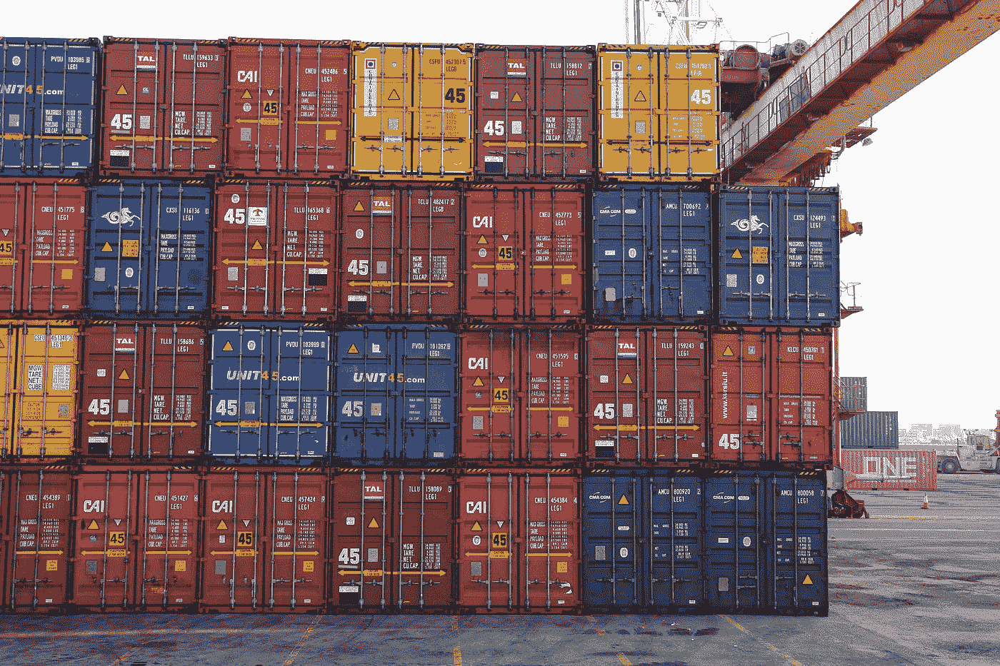

# MLOps-Dockers 和 Kubernetes 数据科学家必备

> 原文：<https://medium.com/analytics-vidhya/mlops-dockers-and-kubernetes-essentials-for-a-data-scientist-8bc7b5866957?source=collection_archive---------1----------------------->

塞巴斯蒂安·赫尔曼在 [Unsplash](https://unsplash.com?utm_source=medium&utm_medium=referral) 上的照片

**简介**

我将为 MLOps 工程师/数据科学家介绍 **Docker 和 Kubernetes** 的基础和要点。我们将学习如何对一个简单的 ML python 应用程序进行 dockerize，然后将其部署在 Kubernetes 集群中。Docker 和 Kubernetes 是一个大话题，很难在这里面面俱到。如果您是 docker 和 Kubernetes 的新手，请尝试…