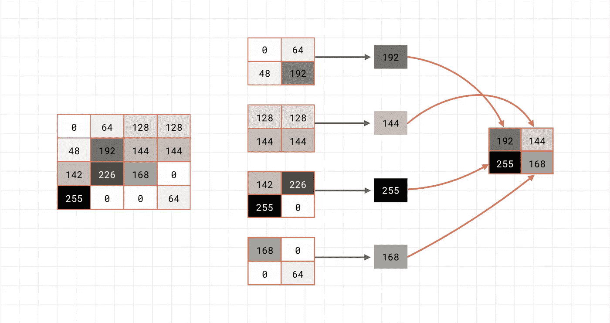

# MNIST 数据库:手写数字识别

> 原文：<https://medium.com/analytics-vidhya/mnist-database-handwritten-digit-recognition-9ee9c917bf59?source=collection_archive---------5----------------------->

## 在这篇文章中，我将解释一个机器学习模型，它能够尽可能简单地识别手写数字。

我会尽可能简单地解释一切。我将展示这个项目的部分代码，但我只是想让你明白这个项目的基本原则是如何工作的。

我们要建立一个能够识别手写数字的机器学习模型！此外，我还链接了一个应用程序，你可以下载它来玩机器学习模型。你可以在这里下载应用[。](https://drive.google.com/file/d/1a0VpMwz1r2FX1_myQv1S5srQoIN_CuDs/view?usp=sharing)

为了训练机器学习模型，我们需要大量数据。幸运的是，有一个数据库叫做“MNIST 数据库”。这为我们提供了 60000 张用于训练模型的图片和 10000 张用于测试模型的图片。“模型”是我们的程序。它使我们能够输入图像并得到预测。它使用输入来生成输出。这是可能的，因为有一个叫做“训练”的过程，在这个过程中，我们向模型输入大量数据。通过这个，它学会了在什么场景下如何表现。

## 理解数据

让我们先来看看 MNIST 数据库中的数据:


MNIST 数据库的 5 个示例图像。

这里你可以看到 MNIST 数据库中的另一张图片:


MNIST 数据库中一个条目的图像(左)，该图像的数值(右)

我使用一个名为“matplotlib”的库创建了左边的图像(库是预制代码/软件的集合。我们可以在项目中实现库，从而加快开发速度)。Matplotlib 是 Python(一种经常用于机器学习的编程语言)最流行的库之一。Matplotlib 用于可视化数据。在右边，我们可以看到存储在 MNIST 数据库条目中的普通数值。“5”仍然可以辨认，但不像左边的图像那样清晰。Matplotlib 能够将数值转换成图像。MNIST 数据库只是为每幅图像存储这些数值。数字从 0 到 255。现在，我们对正在处理的数据有了基本的了解，让我们继续看一下代码。

## 导入库

导入必要的库

我们从导入必要的库开始。我们主要用 [TensorFlow](http://www.tensorflow.org) 。您不必太担心这部分代码，只需记住我们在项目中实现了几个预制的软件部分。例如，TensorFlow 为我们处理了机器学习背后的所有数学问题。

## 加载和准备数据

加载和准备数据

接下来，我们加载数据。MNIST 数据库包含在 TensorFlow 中，因为它是一个非常受欢迎的机器学习项目。我们继续重塑和规范化数据。你不需要明白这里到底发生了什么。请记住，我们不再将单个值更改为 0 到 255 之间的值，而是 0 到 1 之间的值。

## 创建模型

定义模型

现在我们已经准备好了数据，我们终于可以开始创建我们的模型了！呜呜呜。！我们的模型是一个神经网络。我们指定了一个所谓的“顺序”模型，用于在彼此之上堆叠多个层。层基本上是基于给定输入确定输出的函数。在我们的模型中，这个过程将如下进行。之后我会解释每一层的功能。

1.  数据被传递到神经网络的第一层。
2.  第一层(“Conv2D”)更改数据并将其传递给下一层。
3.  第二层(“MaxPooling2D”)再次更改数据并传递它。
4.  ….

这个改变数据和传递数据的过程一直持续到我们到达最后一层。这最后一层现在生成一个输出。它“标记”输入。在这个项目中，我们有 10 个可能的标签(数字 0-9)。现在我将解释每一层。

## Conv2D

第一层“Conv2D”将滤镜分配给输入图像。参数“input_shape”定义输入图像的宽度和高度(28，28)。“28，28”后面的“1”代表通道尺寸。因为我们使用灰度图像作为输入，所以我们使用“1”。如果我们有一个 RGB 图像，我们必须使用“3”。最终，这整个概念导致了“28，28，1”的输入形状。

## 池化(MaxPooling2D)

第二层“MaxPooling2D”减少了我们的图像大小，但保留了，有时甚至突出了最重要的信息。合用是一个非常酷的概念。



直观地表示池。(via [机器学习基础第三集](https://youtu.be/PCgLmzkRM38))。

在左边，我们可以看到图像的一大块像素。在这个例子中，每个像素由灰色背景上的数字表示。我们可以将这些像素分成四个 2×2 的像素部分。现在开始汇集。池化从每个 2 乘 2 部分中获取最高价值。这在上面的图像中直观地呈现出来。我们可以看到中间 2 乘 2 的部分。每个部分的箭头指向每个部分的最高值。这 4 个最高值现在形成了新的 2×2 像素部分。使用这种技术，我们能够大规模减少图像的大小，但仍然保持我们的图像最重要的信息。这有助于我们的机器学习模型找到模式，然后识别数字。


行动中的汇集。(via [机器学习基础第三集](https://youtu.be/PCgLmzkRM38))

在上面的图片中，我们可以看到汇集的作用。一个用于突出垂直线的滤镜被附加到左边的图像上。在右边，我们看到合并后完全相同的图像。图像的重要部分更加清晰。

## 变平

“展平”层展平输入。理解这个模型如何工作并不一定需要背后的确切逻辑。

## 稠密的

“密集”层只是实现了我们神经网络的一个等式。对于理解模型如何工作，没有必要对这一层进行更深入的解释。

## 激活功能

也许你已经注意到了我们一些层的定义里面的参数“激活”。激活函数只是帮助我们的神经网络判断一个神经元是否应该激活。你现在不需要从总体上理解人工神经元或者神经网络。我将只介绍这个项目中使用的两个激活函数(ReLU 和 softmax)，更深入的解释将超出本文的目的。

## 热卢

ReLU 函数是最流行的激活函数之一。它代表“校正线性单元”。数学上，该函数定义为:

```
y = max(0,x)
```


ReLU 函数的可视化。

如果输入为负，ReLU 函数返回“0 ”,如果输入为正，则返回线性。你可以在上面的图像中看到这一点。

## Softmax

softmax 功能是另一个激活功能。它将输入值转换为从 0 到 1 的值。正因为如此，我们在神经网络的最后一层使用 softmax 激活函数:神经网络生成从 0 到 1 的值作为输出。我们可以将这些值视为不同标签(0–9)的概率。使用这种技术，我们能够从模型中获得有用的输出。

我们现在已经完成了模型的创建，并且理解了它最重要的组成部分。现在我们开始训练。

## 培养

在训练模型之前，我们首先需要为训练过程配置我们的模型。这是使用 compile 方法完成的。

编译模型

我不打算在这里解释“优化器”和“损失”是什么意思。这再次超出了本文的目的。

现在我们可以真正开始训练模型了。对于训练，我们使用 fit 方法。

训练模型

在这部分代码中，我们对模型进行训练！我们为模型提供训练所需的图像和标签。我们训练模型 10 个时期。一个历元是整个数据集的一次通过。这意味着模型在整个数据集上运行它的函数。我们重复这个过程，遍历整个数据集 10 次。我们将通过训练生成的数据存储在一个名为“历史”的变量中。通过这个，我们可以访问每个时期的关键数据，比如模型的准确性。当我们试图改进我们的模型时，这变得非常重要。


这是在训练我们的模型时打印出来的。

在上图中，我们可以看到每个时期的一些数据。我们可以看到一个东西叫“失”，一个东西叫“准”。稍后我会解释这一点。

训练后，我们可以测试我们新训练的模型。我们为此使用 evaluate 方法。

评估我们的模型

我们将测试图像和测试标签提供给 evaluate 方法。这将生成以下输出:


评估方法的输出

我们可以在测试模式下看到模型的损耗和精度输出。在“从未见过的数据”上，该模型的准确率为 98.58%。那很酷，不是吗？！

我们已经基本完成了最复杂和最重要的步骤！呜哇！

## 准确性和损失

让我们来看看我们的模型的损失和准确性。


模型精度(左)和损失(右)

在左图中，我们可以看到代表模型精确度的图表。在右图中，图表显示了模型的损耗。我们可以看到，在整个时代，我们的模型精度增加，我们的模型损失减少！这很好，因为我们的模型通过预测获得了信心。

## 手写数字识别应用程序

哇！投入太多了，不是吗？我希望你通过这篇文章学到了一些新东西。这是一种非常理论化的方法，试图教你机器学习的基础知识。我更喜欢变得实际，所以我用我们训练过的模型开发了一个应用程序。你可以亲自试用这个应用程序，它是一个. apk 文件，所以你可以直接在你的 android 设备上下载。该应用程序是使用 Flutter 构建的，我观看的将我们的模型实际实现到应用程序中的教程链接在下面的“参考和资源”部分。

虽然它不能正确预测所有的事情，但是玩一会儿这个应用程序还是很有趣的。尽情享受吧！

这里可以下载 app [。](https://drive.google.com/file/d/1a0VpMwz1r2FX1_myQv1S5srQoIN_CuDs/view?usp=sharing)

## 保存和转换我们的模型

在本文的这一部分，我将快速向您展示让模型在智能手机上运行所必需的东西。

保存模型

首先，我们需要保存我们训练好的模型。在括号中，我们只是定义了保存模型的路径。

转换模型

下一步是将模型转换为“tflite”。这只是代表 TensorFlow Lite。它类似于普通的张量流，但针对移动或嵌入式设备进行了优化。对于转换，我们加载保存的模型，然后使用 TensorFlow 提供的 convert 方法。然后我们可以下载。文件，并在我们的应用程序中使用它。

我们完了！耶！

派对！！

非常感谢您阅读这篇文章！我希望你喜欢它，反馈和掌声非常感谢！如果有任何问题，请在评论中留下，我会尽力帮助你的！你也可以通过社交媒体联系我。

## 参考资料和资源

*   [刘丹青关于热路功能的惊人文章](/@danqing/a-practical-guide-to-relu-b83ca804f1f7#:~:text=ReLU%20stands%20for%20rectified%20linear,max(0%2C%20x).&text=ReLU%20is%20the%20most%20commonly,usually%20a%20good%20first%20choice)
*   [在 Flutter 应用中实现 Tflite 的教程](https://youtu.be/SRbxEQ89IBs)
*   [手写数字识别 app](https://drive.google.com/file/d/1a0VpMwz1r2FX1_myQv1S5srQoIN_CuDs/view?usp=sharing)

谷歌开发人员的“机器学习基础”对计算机视觉和机器学习等主题提供了很好的解释。

## 源代码

*   [谷歌 Colab 笔记本](https://colab.research.google.com/drive/1EI1Rbn6M9AU7HEOuvwLMuEwIa-zLPcrJ?usp=sharing)