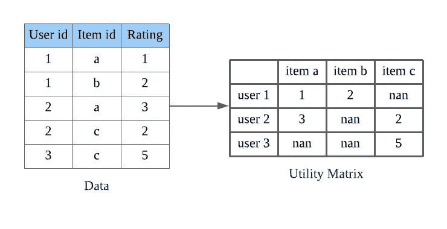
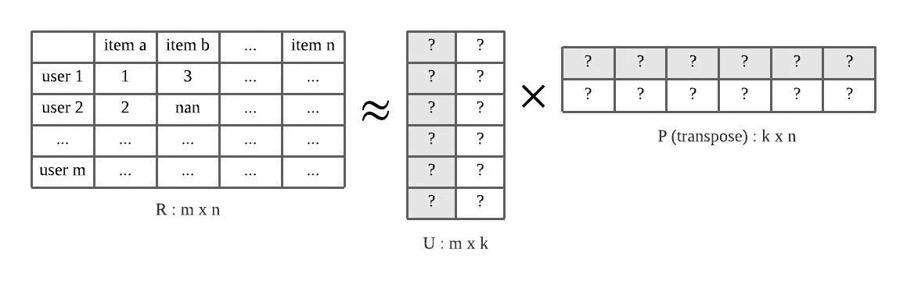
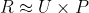
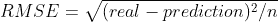
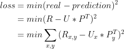
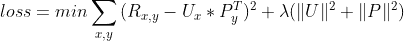
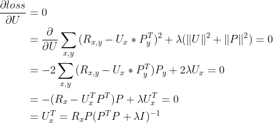
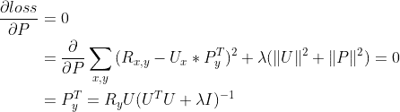

# 基于模型的矩阵分解推荐系统——ALS 模型及其数学基础

> 原文：<https://medium.com/analytics-vidhya/model-based-recommendation-system-with-matrix-factorization-als-model-and-the-math-behind-fdce8b2ffe6d?source=collection_archive---------3----------------------->

## 矩阵分解在推荐系统中有着广泛的应用，我们将使用 als 模型进行构建，并解释其背后的数学原理

协同过滤是实现最多、最成熟的推荐系统。我们将使用 pyspark 提供的 ALS 模型来构建基于模型的推荐系统——矩阵分解。

GitHub 链接:[https://GitHub . com/Chiang 9/re commendation _ system _ py spark/blob/main/ALS _ model/movie len % 20 ALS . ipynb](https://github.com/chiang9/Recommendation_system_pyspark/blob/main/ALS_model/movielen%20ALS.ipynb)



图一。效用矩阵

稀疏矩阵 **R** 可以基于用户-项目关系及其评级的数据来构建。分数可以从用户或用户行为中获得。协同过滤方法使用矩阵 **R** 来产生推荐。



图二。矩阵分解

矩阵分解法的目标是将效用矩阵分解成**用户潜在矩阵**和**产品潜在矩阵**，这样



效用矩阵的分解方法有很多，如奇异值分解、概率潜在语义分析等。在替代最小二乘法(ALS)中，优化因子分解模型是一个迭代过程。

# 替代最小二乘法

ALS 模型是协同过滤中最流行的方法之一。为了看到模型背后的数学，我们首先使用 ***损失函数— RMSE 来定义 ***目标函数*** 。***



其中实数= R，预测等于 U*P^T.

假设有 **m 个**用户和 **n 个**项，R = m * n，U = m * k，P = n * k，其中 k 为潜在因素。



为了避免过度拟合，我们将 l2 范数添加到我们的目标函数中，使得



目标函数

接下来，我们对 U 和 p 取偏导数。



通过应用类似的过程，我们可以找到关于 p 的损失微分。



因此，我们有 U 和 p 的两个方程，通过固定一个，我们可以优化另一个。迭代地交替潜在矩阵 U 和 P，我们能够优化效用矩阵分解。

# 数据源

在本例中，我们将使用 movielens 数据集(ml-100k)。

链接:[https://grouplens.org/datasets/movielens/](https://grouplens.org/datasets/movielens/)

# 我们开始吧

在这个例子中，我们将使用 **pyspark** 和 **movielens** 数据集。

```
[Row(userid=196.0, itemid=242.0, rating=3.0),
 Row(userid=186.0, itemid=302.0, rating=3.0)]
```

我们缓存了训练和测试数据集，以便进一步使用 spark。

接下来，我们使用 **CrossValidator** 来调优超参数。在 Spark ALS 模型中，我们可以定义各种参数， **rank** ， **maxIter** ， **regParam** ，更多信息请访问[https://Spark . Apache . org/docs/latest/API/python/reference/API/py Spark . ml . recommendation . ALS . html # py Spark . ml . recommendation . ALS](https://spark.apache.org/docs/latest/api/python/reference/api/pyspark.ml.recommendation.ALS.html#pyspark.ml.recommendation.ALS)

其中秩为**潜在因子，k 为**

经过训练后，我们可以从 CrossValidator 中提取出最佳模型及其参数。

```
Rank = 100 
MaxIter = 10 
RegParam = 0.1
```

```
RMSE = 0.9293164895244701
+---+--------------------+
| id|            features|
+---+--------------------+
| 10|[0.3314802, -0.07...|
| 20|[0.3870823, 0.024...|
| 30|[0.3141748, -0.09...|
| 40|[0.26709092, -0.2...|
| 50|[0.35146096, -0.0...|
| 60|[0.36123818, -0.1...|
| 70|[0.44221446, -0.0...|
| 80|[0.4122668, -0.07...|
| 90|[0.070995346, -0....|
|100|[0.45245463, 0.05...|
+---+--------------------+
only showing top 10 rows+---+--------------------+
| id|            features|
+---+--------------------+
| 10|[0.24241637, -0.2...|
| 20|[0.21774949, -0.0...|
| 30|[0.2805123, -0.04...|
| 40|[0.08548905, -0.0...|
| 50|[0.47504237, -0.2...|
| 60|[0.046063706, -0....|
| 70|[0.21902403, -0.1...|
| 80|[0.33022547, -0.1...|
| 90|[0.42008877, -0.0...|
|100|[0.28412965, -0.1...|
+---+--------------------+
only showing top 10 rows
```

我们可以使用以下方法找到对特定用户或可能对特定项目感兴趣的用户的项目推荐，**推荐给用户**，**推荐给项目，推荐给用户子集**，**推荐给项目子集。**

# 此外…

Spark ML 中有两个模块， **ml** 和 **mllib。**

spark.ml 模块使用**数据帧**，mllib 使用 **RDD，**其中 mllib 慢慢被弃用。

# 结论

ALS 模型是构建推荐系统的有力工具。Apache Spark 提供了一个方便的 API 来建立模型，然而，大多数时候该模型在处理数据稀疏、冷启动等问题时不够好。我们需要结合一些策略和用户行为分析。

感谢您的阅读，祝您度过美好的一天。