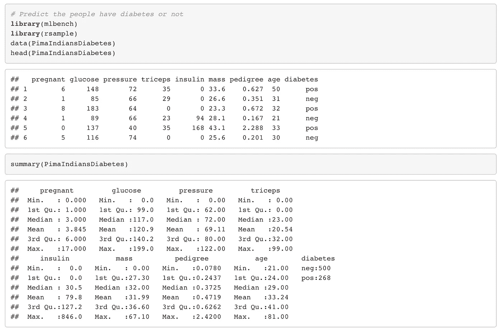
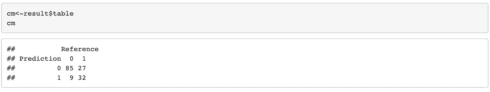
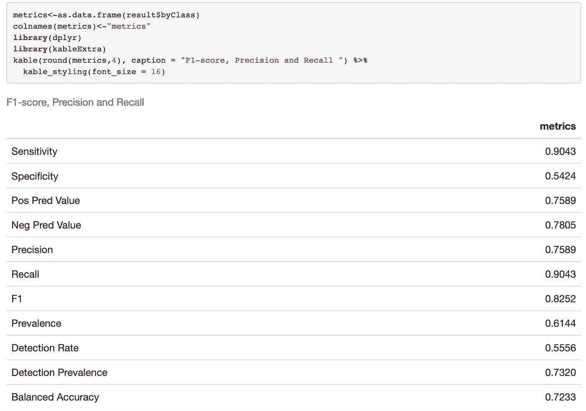

# 机器学习中的模型评估度量

> 原文：<https://medium.com/analytics-vidhya/model-evaluation-metrics-in-machine-learning-928999fb79b2?source=collection_archive---------3----------------------->

**简介**

T2:中文学习现在变得非常流行。我们使用机器学习来利用旧数据对新情况进行推断，有太多的机器学习算法可以做到这一点。线性回归、逻辑回归、决策树、朴素贝叶斯、K-Means 和随机森林都有常用的机器学习算法。在预测数据时，我们不只是尝试一种算法。有时，我们使用多种算法，然后继续使用对数据做出更好预测的算法。我们如何理解哪种算法效果更好？模型评估指标有助于我们评估模型的准确性，并衡量这个经过训练的模型的性能。定义自适应与非自适应机器学习模型的模型评估指标告诉我们该模型对未知数据的概括程度。通过使用不同的指标进行性能评估，我们可以提高模型的整体预测能力，然后再将它应用于看不见的数据。在评估机器学习模型时，选择正确的指标也很关键。在不同的应用中，有各种各样的指标来评估机器学习模型。让我们检查用于评估机器学习模型性能的评估指标，这是任何数据科学项目的一个非常关键的步骤，因为它旨在评估模型对未来数据的泛化精度。

1.  **分类指标**

当响应为二进制时(仅取两个值，例如 0:失败和 1:成功)在机器学习模型中，我们使用分类模型，如逻辑回归、决策树、随机森林、XGboost、卷积神经网络等。然后，为了评估这些模型，我们使用分类度量。

**1.1。混淆矩阵(准确性、敏感性和特异性)**

混淆矩阵包括通常用于描述分类模型性能的任何二元测试的预测结果。

图一。混淆矩阵表

图二。混淆表

*   让我们看一个混淆矩阵的示例 R 实现。

我们在混淆矩阵中看到了所有的准确性、敏感性和特异性。

*   精度为 0.76。
*   敏感度为 0.90，这是测试将个体正确分类为“患有糖尿病”的能力。
*   特异性为 0.54，这是测试将个体正确分类为“没有糖尿病”的能力。当预测真正没有患病的人时，模型犯了 46%的错误。

## 1.2.精确

当我们有一个类不平衡，准确性可以成为一个不可靠的衡量我们的表现。因此，我们还需要查看特定于类的性能指标。精度就是这样一种度量，它被定义为正的预测值。

## 1.3.回忆(敏感度)

召回也是一个重要的衡量标准，它是被正确识别的实际阳性案例的比例。

## 1.4.f1-分数

F1 分数是两个重要错误指标的组合:精确度和召回率。因此，它可以被认为是关于数据的二进制分类的不平衡数据集的精度和召回错误度量的调和平均值。

*   我们只能通过书写来查看混淆表:

*   通过拉动结果混淆矩阵中的 byClass 参数，我们还可以看到 F1 的分数、精度和召回率。

## 1.5.受试者工作特性曲线

测量 ROC 曲线下的面积也是评估模型的一个非常有用的方法。它显示了二元分类器的性能作为其截止阈值的函数。它本质上显示了对不同阈值的假阳性率的敏感性。

我们编写了一个函数，允许使用基于不同的概率截止值进行预测，然后获得这些分类器的准确性、敏感性和特异性。

*   如果 AUC 值增加，我们可以说模型是适当的。(这是以高灵敏度和特异性获得的)。

## 1.6.原木损失

Log Loss 是一种通过惩罚错误分类来量化分类器准确性的度量。此指标的值表示预测的不确定性，基于它与实际标签的差异程度。

# 2.回归相关指标

当机器学习模型中的响应是连续的(目标变量可以取任何实际值)时，我们使用回归模型，如线性回归、随机森林、XGboost、卷积神经网络、递归神经网络等。然后，为了评估这些模型，我们使用回归相关的度量。

## 2.1.平均绝对误差

MAE 测量一组预测中误差的平均大小，不考虑它们的方向。它是预测和实际观察之间的绝对差异的测试样本的平均值，其中所有个体差异都具有相同的权重。

## 2.2.均方误差

MSE 告诉我们回归线离一组点有多近。这意味着它找到了预测值和实际值之间的平均平方误差。这是最流行的回归相关指标。

## 2.3.均方根误差(RMSE)

均方根误差(RMSE)是一种常用的测量方法，用于测量模型或估计器预测的值(样本值或总体值)与观测值之间的差异。

*   让我们看一个回归相关指标的示例 R 实现。

*   均方误差是实际值和预测值之差的均方。模型的残差给出了实际值和预测值之间的差异，因此我们可以从模型中提取残差，并获得残差的均方值。

或者，我们也可以看到预测值，我们可以手动取差。

或者我们可以使用“MLmetrics”库中的 MAE 函数。

*   平均绝对误差是实际值和预测值之间的平均绝对差值。模型的残差给出了实际值和预测值之间的差异，因此我们可以从模型中提取残差，从而获得平均绝对残差。

或者我们可以使用“度量”库中的 MAE 函数。

*   均方根误差是实际值和预测值之间的均方差的平方。模型的残差给出了实际值和预测值之间的差异，因此我们可以从模型中提取残差，并可以获得均方残差的平方。

或者我们可以使用“度量”库中的 RMSE 函数。

# 结论

总之，在本文中，我们研究了一些流行的机器学习指标，这些指标是用于评估分类和回归模型性能的回归相关指标和分类指标。此外，我们还检验了使用这些指标来获得良好预测的重要性。

# 参考

[1].精确度和召回率。(2021 年 3 月 25 日)。检索于 2021 年 3 月 30 日，来自[https://en.wikipedia.org/wiki/Precision_and_recall](https://en.wikipedia.org/wiki/Precision_and_recall)

[2].Minaee，S. (2019 年 10 月 28 日)。20 个流行的机器学习指标。第 1 部分:分类和回归评估度量。2021 年 3 月 30 日检索，来自[https://towards data science . com/20-popular-machine-learning-metrics-part-1-class ification-regression-evaluation-metrics-1 ca 3 e 282 a2 ce](https://towardsdatascience.com/20-popular-machine-learning-metrics-part-1-classification-regression-evaluation-metrics-1ca3e282a2ce)