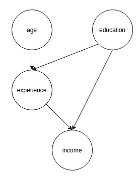
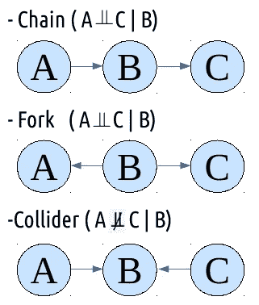
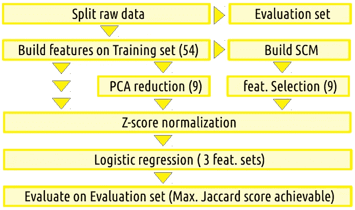
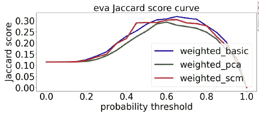
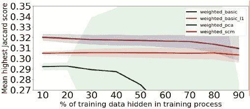

# 用因果关系模拟客户转化

> 原文：<https://medium.com/analytics-vidhya/modeling-customer-conversion-with-causality-c44d1d5cf868?source=collection_archive---------3----------------------->

探索特征选择中的因果关系

当对具有许多特征的数据集进行建模时，维数灾难是一个众所周知的问题，尤其是需要统计显著性的模型。然而，功能不会成为我们的敌人，因为它们提供了对客户的描述，例如，丰富我们对业务的理解。因此，如何为特定的任务选择合理的特性就成了本文将要讨论的问题。

# 流行的降维工具

自动编码器或主成分分析(PCA)是一些流行的方法，用于捕获原始特征集的本质，并产生新的特征集，但具有较少数量的特征。然而，它们在解释上存在不足，因为每个转换后的特征都变成了原始特征的混合物，从而失去了它们的物理意义。然而，我的因果关系方法并没有“压缩”特征，而是提供了特征和预测变量之间关系的图形视图，因此人们可以选择直接影响预测变量的特征作为他们的建模预测器。

# 因果关系

因果模型有一个有向图表示来描述特征之间的因果关系，如下所示:

4 个特征之间的图形因果模型

如果这种模型是用一些丰富的统计数据建立的，那么有人可能会说，不要用所有其他 3 个特征对“收入”建模，也许只使用“经验”和“教育”就足够了，因为它们是导致预测变量“收入”的*和*因素。

# 用 IC*算法构建因果图

图的基本构件

虽然细节可以参考 Pearl 的书[1]，但是 IC*算法从所有特征都相互连接的图开始，然后每当发现两个特征的条件独立性时断开这两个特征，留下部分连接的无向图。

单连通不讲是哪一个导致哪一个，因此，算法下一步发现因果关系。

首先，只要有三个相连的特征(A-B-C)但是给定一组特征(不包括 B)A 和 C 是条件独立的，那么我们可以将这些连接变成箭头(A-> B碰撞器 T5)

在第一步发现所有碰撞器后，我们继续迭代下面两步，直到再也画不出新的箭头。

*   但凡有(A -> B — C)结构，就改成(A -> B => C)，因为不可能是对撞机结构，否则早就被发现了。符号= >与->相区别，以指示 B => C 是真正的有向关系，而 B -> C 可以表示真正的有向关系(即 B => C)或者存在潜在变量(在数据集中未观察到)U 的可能性，使得 B 和 C 以这种方式相关:B C，这是一个 ***分叉*** 结构。
*   只要有一条链 A 是从 A 到 B 的真正有向路径，即 A => F1 => F2 … => B，并且 A 与 B 相连(即 A — B)，那么这种连接就应该变成 A -> B

提到潜在因素后，它指出了一种可能性(实际上是一种很大的可能性),即生成的图可能不是唯一的。然而，这应该是有意义的，因为我们可能无法将所有决定性因素纳入模型。潜在变量的存在本身就给了我们一些提示，告诉我们在收集数据时应该从哪里入手，做什么样的计划。

最后，对于那些无向的、相连的要素，它们之间的关系仍未确定，可能需要更多的数据。

# 使用电话销售数据集进行演示

银行电话营销数据集[2]包含 41，188 名客户中每一位的 20 个特征，用于演示。其工艺流程可以在下面说明。

数据集处理流程

然后通过 IC*算法构建偶然模型。由于上一节讨论的原因，我们有不止一个模型。但是，如果我们关注预测变量(在这个电话销售数据集中是转换)，我们可以找到 9 个最接近它的特征，尽管没有直接联系。虽然这不是一个我可以干预以澄清关系的业务，但我选择了基于朴素马尔可夫假设的 9 个特征(标记为 scm)作为我的建模参数。

为了与现代降维技术进行比较，应用 pca 还创建了一组 9 个嵌入特征(标记为 PCA)。连同 54 个特征的原始集合(标记为基本)，有 3 个数据集用于比较。

在下面的比较中，因果模型(红线)的特征表现始终优于主成分分析(绿线)。

分数成就比较

另一方面，因果模型特征(红线)比主成分分析(绿线)更能忍受训练数据集的变化。随着更多的数据在训练过程中被隐藏，绿线很快下降。

针对训练中可见数据的稳定性

# 结论

虽然不能保证哪种归约技术总是比其他技术表现得更好，但因果模型提供了一种可解释的方法来推理我们的数据，同时允许选择特征。在电话销售数据集中，测试了任何 9 个特征的不同组合，由因果模型产生的组合排名前 3%，至少在这个数据集中，这不仅仅是巧合。

# 参考

1.  j .珀尔(2000 年)。因果关系:模型、推理和推论。剑桥大学出版社。
2.  南莫罗 p .科尔特斯和 p .丽塔。(2014)预测银行电话营销成功的数据驱动方法。决策支持系统，爱思唯尔，62:22–31。从 UCI 机器学习库检索。[http://archive.ics.uci.edu/ml/datasets/Bank+Marketing](http://archive.ics.uci.edu/ml/datasets/Bank+Marketing)