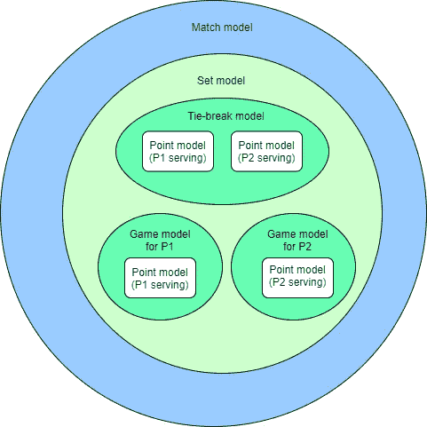
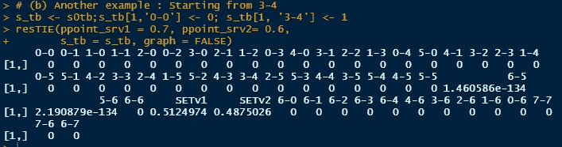

# 用马尔可夫链为一场网球比赛建模

> 原文：<https://medium.com/analytics-vidhya/modelizing-a-tennis-match-with-markov-chains-b59ca2b5f5bf?source=collection_archive---------9----------------------->

> #HHMM。

本文主要用数学对象*【1】***对一场网球比赛进行建模。它很有说明性，并且被设计成每个人都能理解——不需要任何先决条件。****

*与其他运动相比，网球的得分很特别。如果你不熟悉，请参考[2]进行简单介绍。尽管如此，这篇文章也可能是对这个评分系统的一个非常清晰的解释。我们将通过称为*马尔可夫链*的优雅状态模型来说明评分的顺序组织，并最终计算获胜概率:*

**

*图 1:网球比赛的模型嵌套*

*生成这种模型化的全部代码可以在专门的 GitHub 存储库中获得[3]。*

*我——模拟一个游戏*

*II —模拟平局决胜*

*III —对集合建模*

*IV —模拟匹配*

*v-在单个模型中装配所有模型*

*六、结论*

*我们用来模拟比赛的唯一两个参数是基本的获胜概率:*

*   **ppoint_srv1* :玩家 1 赢得一个发球点的概率*
*   **ppoint_srv2* :玩家 2 赢得一个发球点的概率*

***我——模拟一个游戏***

*在这一部分中，我们试图根据服务器赢得一分的概率对游戏进行建模。马尔可夫链的原理简单来说就是定义 ***状态*** (在我们的例子中状态就是分数)，以及从一个给定状态到另一个状态的*概率。如果你熟悉网球得分，那么下面的矩阵(图 2)是显而易见的。它简单地说明了分数之间的转移概率，即 *ppoint_srv1 = 0.7。***

****为了知道 1 次迭代后的状态值，我们简单地将转移矩阵乘以初始状态矩阵**。当我们从“0–0”开始时，状态矩阵在“0–0”的情况下包含 1，在所有其他状态下包含 0。为了知道在 *n* 次迭代之后的状态值，我们简单地将转移矩阵与其自身 *n* 次相乘，最后将其与初始状态矩阵相乘。**

**我们可以观察静止状态(保持和中断)，因为当我们达到这个分数时，我们不能在游戏结束时将*移动到另一个状态:***

****

**图 2:一个游戏的马尔可夫矩阵(ppoint_server = 0.7)**

**为了便于说明，我们也可以绘制这个矩阵:**

****

**图 3:用马尔可夫链表示的游戏模型**

**最后，我们可以在 R 中构建一个函数 *resGAME()* ，它在开始时将参数 *ppoint_srv1* 和*得分*作为输入，然后**计算结果概率——要么保持，要么中断**。当 *ppoint_srv1 = 0.7* 且*score = ' 0–0 '*时，输出如下:**

****

**图 4:用马尔可夫链计算游戏结果概率**

**现在，如果我们想从*‘0–15’*计算概率，我们只需要通过改变状态将起始分数设置为*‘0–15’*:**

****

**图 5:根据游戏中的给定分数计算游戏结果概率**

****II —模拟平局决胜****

**既然我们已经解释了用于游戏建模的原理，我们可以将相同的原理应用于**对决胜局**的建模。我们应该注意抢七的连续进程:首先是 P1 发球，然后是 P2 发球两次，然后是 P1 发球两次，等等。要做到这一点，我们只需注意在构建矩阵时设置正确的转移概率。该模块的输入参数为 *ppoint_srv1* 和 *ppoint_srv2。***

**马尔可夫链看起来是这样的 *ppoint_srv1 = 0.7* 和 *ppoint_srv2= 0.6* :**

****

**图 6:用马尔可夫链表示的平局决胜模型**

**正如在游戏模型化期间，我们可以在 *R* 中构建一个函数 *resTIE()* ，该函数将参数 *ppoint_srv1、ppoint_srv2* 和开始时的*分数*作为输入，并且**计算结果概率**——P1 或 P2 赢得该局。当 *ppoint_srv1 = 0.7，ppoint_srv2 = 0.6，*和*score = ' 0–0 '*时，输出如下:**

****

**图 7:计算平局决胜的结果概率**

**我们最终可以根据任何分数计算出结果的概率:**

****

**图 8:从 3 到 4 计算平局决胜的结果概率**

****III —建模一套****

**遵循完全相同的技术，我们可以**对集合**建模。输入参数是*保持概率*，以及*P1 赢得决胜局的概率。*马尔可夫链看起来如下:**

****

**图 9:用马尔可夫链表示集合模型**

**由于我们之前已经构建了*游戏*和*平局决胜*模型化，我们可以根据点赢概率计算保持概率和平局决胜概率，这样输入可以只是点赢概率:**

****

**图 10:从点获胜概率计算集合获胜概率**

**我们也可以根据给定的分数计算概率:**

****

**图 11:图 10:从给定分数的点获胜概率计算集合获胜概率**

****IV —模拟一场比赛****

**遵循完全相同的原则，我们可以**为整个比赛**建立一个模型。给定获胜概率，我们就可以计算获胜概率:**

****

**图 12:用马尔可夫链匹配模型表示**

**输入参数是设定的获胜概率，然而如前所述，设定的获胜概率可以从点获胜概率中推断出来，从而我们可以仅用输入的两个基本参数来构建该模型(步骤 V):**

****

**图 13:计算精确的得分概率**

**我们也可以根据给定的分数来计算这些概率:**

****

**图 14:根据给定的分数计算精确的分数概率**

****V —将所有型号组装成一个型号****

**如介绍中所述，一旦我们正确定义了*博弈*、*决胜*、*集合*和*匹配*马尔可夫链模型，我们就可以**叠加这些模型来建立我们的最终模型化**。这可通过简单地将输出与输入相联系来实现(*例如*设定模型的输出将被用作匹配模型参数的输入)。完成这一步后，**我们可以从比赛的任何状态计算获胜概率，只有两个基本参数**:**

****

**图 15:从任何得分计算获胜概率，只输入得分获胜概率**

****六——结论****

**这种类型的模型通常用于体育博彩行业，因为**该模型根据比赛的任何状态来计算估计的获胜概率**。例如，我们可以从历史统计数据中推断出每位球员在发球时赢得*底注*点的概率。这种估计将取决于条件、表面、球员的状态等。一旦我们估计了这两个参数，我们刚才介绍的软件包将允许我们估计获胜的机会，以及中间事件的概率(举行一场比赛、赢得一盘比赛、以特定分数获胜等)**

**此外，我只能想象博彩公司为了使模型尽可能精确而采用几个输入参数。我们给出的函数是所使用的一些模型的概述，可以作为构建更强大的模型的良好起点。**

**不要犹豫留下任何反馈/问题/ *掌声*或联系我获取更多信息。**

****另一篇文章** *(用机器学习构建体育博彩算法)* [新冠肺炎如何阻止我在 2020 年成为百万富翁|作者塞巴斯蒂安·卡拉罗| Analytics vid hya | 2020 年 12 月| Medium](/analytics-vidhya/how-covid-19-prevented-me-from-being-a-millionnaire-in-2020-5b2144e8bdef)**

****联系人:** sebcararo@hotmail.fr**

****来源****

**[1]马尔可夫链简介**

**[马尔可夫链直观解释(setosa.io)](https://setosa.io/ev/markov-chains/)**

**[2]网球计分系统**

**[网球计分，解释:美国网球公开赛规则、术语&积分系统理解指南|体育新闻](https://www.sportingnews.com/us/tennis/news/tennis-scoring-explained-rules-system-points-terms/7uzp2evdhbd11obdd59p3p1cx)**

**[3] GitHub 知识库**

**[Seb943/Markov4Tennis: R 用马尔可夫链对网球比赛建模的脚本(比赛，抢七，盘，比赛)(github.com)](https://github.com/Seb943/Markov4Tennis)**