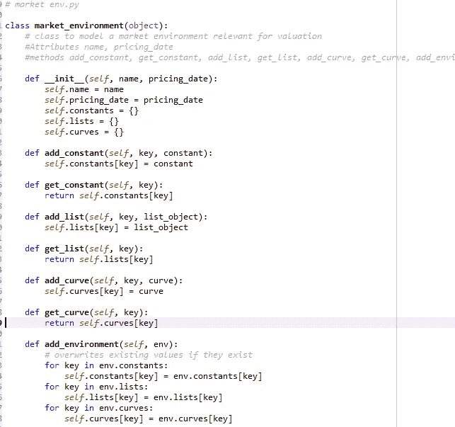
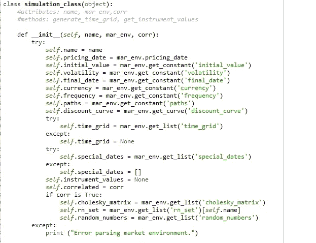
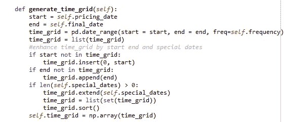
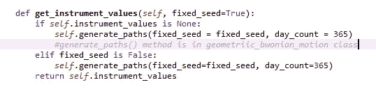
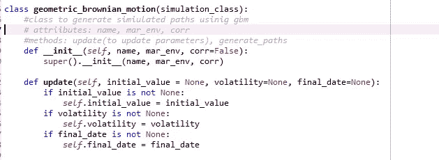
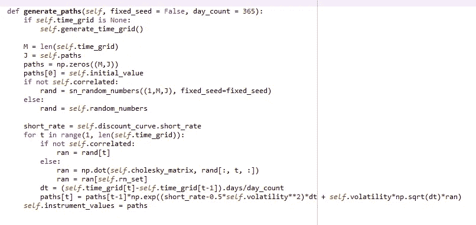
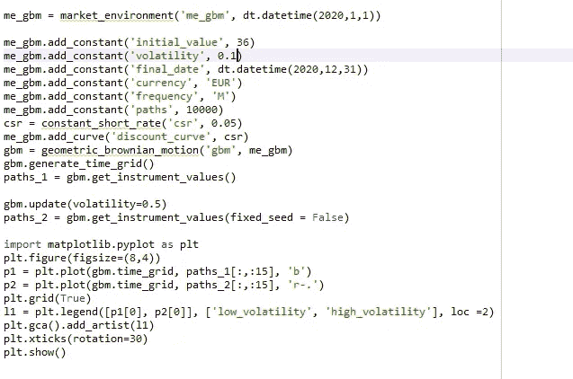
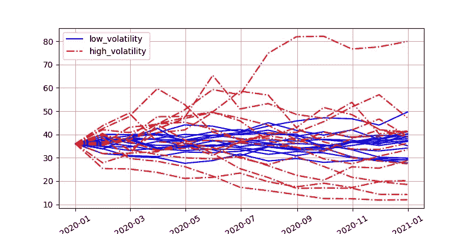

# 用 python 模拟几何布朗运动

> 原文：<https://medium.com/analytics-vidhya/modelling-geometric-brownian-motion-in-python-b65462cc2c1d?source=collection_archive---------5----------------------->

科学的目的不是分析或描述，而是制造有用的世界模型。—爱德华·德·波诺

Black 和 Scholes (1973)的开创性工作将几何布朗运动过程引入期权定价文献；它仍然是期权和衍生品估价的基准过程。虽然，几何布朗运动有它的缺点和来自金融现实的越来越多的经验证据；它是构建更好模型的良好基础。

几何布朗运动是一个随机过程，如下式所示。

> 重要假设:我们在等价的[鞅测度](http://www.cs.rpi.edu/~magdon/ps/journal/martingale.pdf)下操作

随机微分方程:

# dSt = r*Stdt + σ*StdZt

St:日期 t 的指数水平

r:恒定无风险短期利率

σ:恒定波动性

z:标准正态分布随机变量

我们使用著名的蒙特卡罗模拟，近似求解上述随机微分方程。

我们用 python 对流程进行编码，以查看流程的可用性，并构建可用的模型。我们首先需要建立几个模块，如获得标准的正态分布随机变量，常数无风险短期利率和通用模拟模块。

如果你熟悉 python，构建这些小模块应该很容易，无论如何你可以参考 Yves Hilpisch 的《O'Reilly Python for Finance 》,在那里你可以学习这些模块以及更多。因此，我们创建一个函数，将提供的 short rate 转换成一个由日期和 short_rate 组成的二维数组。

我们创建了另一个来生成所需形状的伪随机数(您可以使用 numpy.random.standard_normal()方法轻松生成这些数字),您还可以更进一步，即时匹配随机数。

现在我们创建 market_environment，以获得模拟所需的所有变量:

接下来，我制作了一个 generic_simulation_module，因为我将继续模拟不同的模型。下一个模型(在几何布朗运动之后)将建立在近似动态规划(ADP)的基础上，这是一种非常有前途的获得最优路径的方法，因此感兴趣的人可以跟随。

首先，我们收集所有变量值:

从 market_environment 类获取变量

接下来，我们根据提供的开始和结束日期生成一个 time_grid:

接下来，我们返回将由我们的特定模拟器生成的路径(在这些情况下是几何布朗运动):

最后，我们编写我们的几何布朗运动类:

首先，像往常一样，我们使用 __init__。虽然在这里我们使用[超级](https://rhettinger.wordpress.com/2011/05/26/super-considered-super/)方法，这确实有助于整体代码。和更新变量以比较不同模拟的更新函数。

接下来，我们生成路径，模拟几何布朗运动的差分方程:

St = St exp((r-0.5 *σ)(t(m+1)-t(m))+σ* sqrt(t(m+1)-t(m))* Zt)

一个使用案例:

结果图

可以看出，该模型提供了不同的路径，这里展示了 10000 条路径中的 15 条。

几何布朗运动仍然被广泛使用，并有助于理解估价。人们可以进一步调整模型，这对于任何类型的实际应用都是必要的。我将使用 ADP 来模拟更好的随机微分方程上的优化路径。