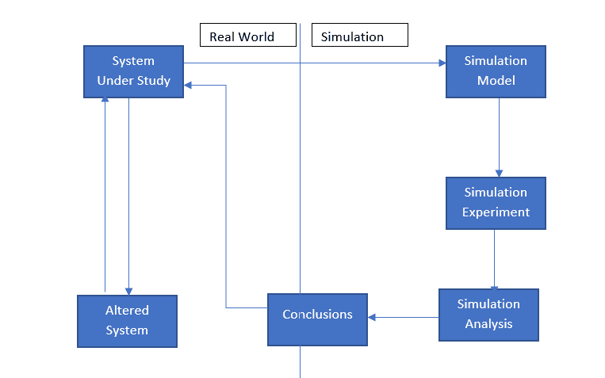
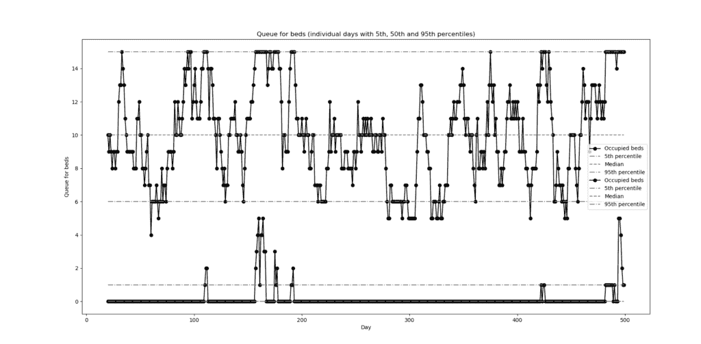
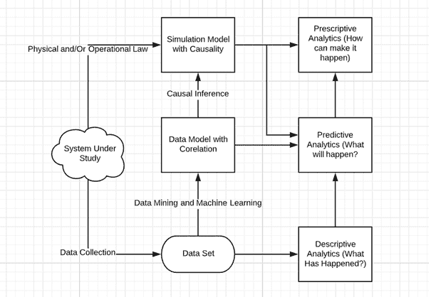

# 模拟现实世界的规定过程:数据模拟、模型模拟和分析

> 原文：<https://medium.com/analytics-vidhya/modelling-real-world-prescriptive-process-data-modelling-model-simulation-and-analysis-ce68099871fe?source=collection_archive---------1----------------------->

建模是产生模型的过程，该模型是感兴趣的一些系统的构造和工作的表示。在更改现有系统或构建新系统之前，使用模拟来降低不符合规范的可能性，消除不可预见的瓶颈，防止资源利用不足或过度利用，以及优化系统性能。

在本文中，我们将学习以下内容:

*   什么是模拟建模
*   拥有模拟模型的好处
*   模拟分析的要素
*   一个用例:医院病房床位占用模型。
*   用 Python 代码实现用例
*   模拟建模的局限性。
*   什么是数据建模？
*   数据建模的局限性。
*   为什么模拟建模伴随着数据科学？
*   结论

让我们开始吧..

# 什么是模拟建模？

**模拟建模**是创建和分析物理**模型**的数字原型的过程，以预测其在现实世界中的性能，这有助于设计师和工程师了解系统的一部分是否会在什么条件下以什么方式发生故障，以及它可以承受什么负载。模拟建模，通过对复杂系统、跨行业和跨学科的模拟建模提供有价值的解决方案。它是一种基于物理的模拟建模，是一种更经典但更强大的方法，用来表示一组受控输入和相应输出之间的因果关系。

# 拥有模拟模型的好处

*   无风险环境:模拟建模提供了对不同“假设”场景的探索。改变医院床位容量水平的影响(请参考使用案例)不会给生产带来风险，这有助于在做出实际改变之前做出正确的决策。使用医疗保健系统的历史数据建立的数学模型，如果当前趋势持续到未来，可以对系统压力进行前瞻性分析。这些结果有助于您理解和规划会给医疗保健系统带来巨大压力的情况。例如，如果有重大流感爆发，可以预测一些参数，这些参数可以添加到模型中，以帮助了解对服务提供的影响。除了对服务的额外需求之外，流感爆发也会影响医护人员，因此服务的供应也会受到影响。如果我们正在考虑做出长期或重大的改变，而这些改变的影响很难预测，那么这些是很有用的。在我们开始改变之前，它将帮助我们计划和实施更有效的服务改进。它们还可以使我们了解未来对服务的需求，以确保任何服务开发都是“经得起未来考验的”。
*   节省金钱和时间:用模拟模型进行虚拟实验比用真实资产进行实验花费更少，时间更短。
*   更高的准确性:模拟模型可以捕获比分析模型更多的细节，提供更高的准确性和更精确的预测。
*   可视化:使用各种 2D/3D 可视化，模拟模型概念和想法更容易验证、交流和理解。分析师通过将模型可视化来获得对模型的信任，并且可以清楚地向管理层展示发现。
*   处理不确定性:操作时间和结果的不确定性可以很容易地在模拟模型中表示出来，允许风险量化，并找到更可靠的解决方案。

# 模拟分析的要素

以下是模拟分析的基本要素:

*   问题定式化
*   数据收集和分析
*   模型开发
*   模型验证和确认
*   模型实验和优化
*   模拟结果的实现



# 用例:一个医院病房床位占用模型。

**问题陈述:**床位管理一直是医院发展过程中的一个问题，但由于需求不断增长，它变得更加重要，并已成为提供高质量、高性价比医疗服务的重要标准，这需要一个床位管理团队。那么，他们是如何做到这一点的？

**数据收集与分析:**病人到达率，即病人到达医院的速率，我们可以从指数分布中任意两个病人之间的时间来得到。住院时间再次从指数分布中取样。我们在这里假设医院病房可以扩展以应对需求高峰，并使用该模型来研究病房床位占用的预期自然变化。

这是一个目标导向的任务。床位管理的目标包括及时为每位患者提供合适的床位，以及减少因缺少可用床位而被拒绝并转往其他机构的患者数量。床位管理有许多好处，包括客户满意度、增加利润、预测能力和提高护理水平。医院必须关注可靠性、准确性和客户护理水平，以保持竞争力和盈利，实现这一目标的一个关键方法是不断改进他们的床位管理系统。由于需求的日益变化和资源的不足，规划的复杂性正在增加。

如果我们稍微追溯一下对目标规划的理解，那么我们可以说这是一种线性规划，对于与最优化相关的问题来说，这是重要且有用的。我们优化了一个场景，该场景基于管理该情况的多个约束。

因此，有很多种技术可以用来建立这种模型，这不是我们在这个博客中讨论的话题。我们将讨论的是，一旦模型建成，我们将如何模拟它。

# 使用 PYTHON 代码进行模型开发

在 Python 中，simpy 库提供了事件模拟。

在 Python 中运行模拟有三个步骤:

1.  建立环境:env = simpy。环境()
2.  传入参数:env.process(checkpoint_run(env，num _ booths，check_time，passenger_arrival))
3.  运行模拟:env.run(直到=10)

一旦我们建立了我们的环境，我们将传递所有的变量作为我们的参数。这些是我们可以改变的事情，以观察系统将如何对变化做出反应。

步骤 1:导入所有需要的库。

SimPy 是一个基于标准 Python 的基于流程的离散事件模拟框架。

```
from SimPy.SimulationTrace import *import simpy as smimport randomimport pandas as pdimport matplotlib.pyplot as plt
```

步骤 2:我们将全局变量存储在一个类“g”中。所有全局变量都用必需的注释声明

```
class g:inter_arrival_time = 1  # Average time (days) between arrivalslos = 10  # Average length of stay in hospital (days)sim_duration = 500  # Duration of simulation (days)audit_interval = 1  # Interval between audits (days)beds = 15  # bed capacity of hospital
```

第三步:第二类:“医院”包含对床位占用情况进行审计、总结审计(在运行结束时)以及绘制床位占用时间图(在运行结束时)的方法。

```
class Hospital:"""Hospital class holds:1) Dictionary of patients present2) List of audit times3) List of beds occupied at each audit time4) Current total beds occupied5) Admissions to data​Methods:__init__: Set up hospital instanceaudit: records number of beds occupied build_audit_report: builds audit report at end of run (calculate 5th, 50th and 95th percentile bed occupancy.chart: plot beds occupied over time (at end of run) """
```

医院类的构造函数方法。用属性初始化对象。

def __init__(self):

self.patients = {} #在场患者字典

```
self.patients_in_queue = {}self.patients_in_beds = {}self.audit_time = []  # List of audit timesself.audit_beds = []  # List of beds occupied at each audit timeself.audit_queue = []self.bed_count = 0  # Current total beds occupiedself.queue_count = 0self.admissions = 0  # Admissions to data
return
```

审计方法。调用时，将当前模拟时间附加到 audit_time 列表，并将当前床位数附加到 audit_beds。

```
def audit(self, time):self.audit_time.append(time)self.audit_beds.append(self.bed_count)
self.audit_queue.append(self.queue_count)
return
```

这个方法在运行结束时被调用。它创建一个 pandas 数据框架，将审计时间和床位数转移到数据框架，然后
计算/存储第 5、第 50 和第 95 个百分位数。

```
def build_audit_report(self):self.audit_report = pd.DataFrame()self.audit_report['Time'] = self.audit_time
self.audit_report['Occupied_beds'] = self.audit_beds
self.audit_report['Median_beds'] =\
self.audit_report['Occupied_beds'].quantile(0.5)self.audit_report['Beds_5_percent'] = \self.audit_report['Occupied_beds'].quantile(0.05)self.audit_report['Beds_95_percent'] = \self.audit_report['Occupied_beds'].quantile(0.95)self.audit_report['Queue'] = self.audit_queueself.audit_report['Median_queue'] = \
```

self.audit_report['Queue']。分位数(0.5)

```
self.audit_report['Median_queue'] = \
```

self.audit_report['Queue']。分位数(0.5)

self . audit _ report[' Queue _ 5 _ percent ']= \

```
self.audit_report['Queue'].quantile(0.05)self.audit_report['Queue_95_percent'] = \
```

self.audit_report['Queue']。分位数(0.95)

```
return
```

这个方法在运行结束时被调用。它以 5%、50%和 95%的百分比绘制了模型运行期间的床位占用率。

```
def chart(self):"""This method is called at end of run. It plots beds occupancy over the model run, with 5%, 50% and 95% percentiles."""
```

绘制被占用的床位

```
# Plot occupied beds
plt.plot(self.audit_report['Time'],self.audit_report['Occupied_beds'],color='k',marker='o',linestyle='solid',markevery=1,label='Occupied beds')
plt.plot(self.audit_report['Time'],
self.audit_report['Beds_5_percent'],
```

color='0.5 '，

linestyle='dashdot '，

markevery=1，

label = ' 5% ')
PLT . plot(self . audit _ report[' Time ']，
self . audit _ report[' Median _ beds ']，
color='0.5 '，linestyle='dashed '，label='Median ')

```
plt.plot(self.audit_report['Time'],self.audit_report['Beds_95_percent'],
color='0.5'linestyle='dashdot',label='95th percentile')plt.xlabel('Day')plt.ylabel('Occupied beds')plt.title('Occupied beds (individual days with 5th, 50th and 95th ' +'percentiles)')plt.legend()
plt.show()
```

绘制床的队列

```
# Plot queue for bedsplt.plot(self.audit_report['Time'],self.audit_report['Queue'],color='k',marker='o',linestyle='solid',markevery=1, label='Occupied beds')
```

PLT . plot(self . audit _ report[' Time ']，self . audit _ report[' Queue _ 5 _ percent ']，color='0.5 '，linestyle='dashdot '，markevery=1，label= '第 5 个百分点')

```
plt.plot(self.audit_report['Time'],self.audit_report['Median_queue'],color='0.5',linestyle='dashed',label='Median')plt.plot(self.audit_report['Time'],self.audit_report['Queue_95_percent'],color='0.5',linestyle='dashdot',label='95th percentile')plt.xlabel('Day')
plt.ylabel('Queue for beds')plt.title('Queue for beds (individual days with 5th, 50th and 95th' +' percentiles)')plt.legend()plt.show()return
```

第三类:“模型”包含模型环境。建模环境已建立，患者到达和审核流程已启动。病人的到来触发了对住院病人的咒语。到达和审计在模型运行期间持续进行。然后对审计进行总结，并绘制床位占用率和等待床位的人数(第 5、50 和 95 个百分点)。

```
class Model:"""The main model class.
```

模型类包含模型环境。建模环境已建立，患者到达和审核流程已启动。病人的到来触发了对住院病人的咒语。到达和审计在模型运行期间持续进行。然后对审计进行总结，并绘制床位占用率(第 5、50 和 95 个百分点)。

```
Methods are:__init__: Set up model instanceaudit_beds: call for bed audit at regular intervals (after initial delayfor model warm-up)new_admission: trigger new admissions to hospital at regular intervals.Call for patient generation with patient id and length of stay, then callfor patient spell in hospital.run: Controls the main model run. Initialises model and patient arrival andaudit processes. Instigates the run. At end of run calls for an auditsummary and bed occupancy plot.spell_gen: stores patient in hospital patient list and bed queuedictionaries, waits for bed resource to become available, then removespatient from bed queue dictionary and adds patient to hospital beddictionary and increments beds occupied. Waits for the patient length ofstay in the hospital and then decrements beds occupied and removes patientfrom hospital patient dictionary and beds occupied dictionary."""
```

新模型的构造函数类。

```
def __init__(self):self.env = simpy.Environment()return
```

床位审计流程。通过应用延迟开始，然后在 g.audit_interval :param delay:模型预热运行开始时的延迟(天数)中设置的
间隔调用审计。

```
def audit_beds(self, delay):# Delay first audityield self.env.timeout(delay)# Continually generate audit requests until end of model runwhile True:# Call audit (pass simulation time to hospital.audit)self.hospital.audit(self.env.now)# Delay until next callyield self.env.timeout(g.audit_interval)returnNew admissions to hospital.
   :param interarrival_time: average time (days) between arrivals
   :param los: average length of stay (days)def new_admission(self, interarrival_time, los):while True:# Increment hospital admissions countself.hospital.admissions += 1# Generate new patient object (from Patient class). Give patient id# and set length of stay from inverse exponential distribution).p = Patient(patient_id=self.hospital.admissions,los=random.expovariate(1 / los))# Add patient to hospital patient dictionaryself.hospital.patients[p.id] = p# Generate a patient spell in hospital (by calling spell method).# This triggers a patient admission and allows the next arrival to# be set before the paitent spell is finishedself.spell = self.spell_gen(p)self.env.process(self.spell)# Set and call delay before looping back to new patient admissionnext_admission = random.expovariate(1 / interarrival_time)yield self.env.timeout(next_admission)return#Controls the main model run. Initializes model and patient arrival and audit processes.
Instigates the run. At end of run calls for an audit summary and bed occupancy plot.#
def run(self):# Set up hospital (calling Hospital class)self.hospital = Hospital()# Set up resources (beds)self.resources = Resources(self.env, g.beds)# Set up starting processes: new admissions and bed  audit (with delay)self.env.process(self.new_admission(g.inter_arrival_time, g.los))self.env.process(self.audit_beds(delay=20))# Start model runself.env.run(until=g.sim_duration)# At end of run call for bed audit summary and bed occupancy plotself.hospital.build_audit_report()self.hospital.chart()return
```

病人住院生成器。增加床位数，等待患者住院时间结束，然后减少床位数，并从医院患者字典中删除患者。:参数 p:患者对象(包含患者的住院时间)

```
def spell_gen(self, p):# The following 'with' defines the required resources and automatically# releases resources when no longer requiredwith self.resources.beds.request() as req:# Increment queue countself.hospital.queue_count += 1# Add patient to dictionary of queuing patients. This is not used# further in this model.self.hospital.patients_in_queue[p.id] = p# Yield resource request. Sim continues after yield when resources# are vailable (so there is no delay if resources are immediately# available)yield req# Resource now available. Remove from queue count and dictionary of# queued objectsself.hospital.queue_count -= 1del self.hospital.patients_in_queue[p.id]# Add to count of patients in beds and to dictionary of patients in# bedsself.hospital.patients_in_beds[p.id] = pself.hospital.bed_count += 1# Trigger length of stay delayyield self.env.timeout(p.los)# Length of stay complete. Remove patient from counts and# dictionariesself.hospital.bed_count -= 1del self.hospital.patients_in_beds[p.id]del self.hospital.patients[p.id]return
```

第三类:“病人”是生成的所有病人的模板(每个新到达的病人创建一个新的病人对象)。患者对象包含患者 id 和住院时间。

```
class Patient:def __init__(self, patient_id, los):"""Contructor for new patient.:param patient_id: id of patient  (set in self.new_admission):param los: length of stay (days, set in self.new_admission)"""self.id = patient_idself.los = los
return
```

第四类:“资源”包含床位资源(也可以包含其他资源，比如医生)

```
class Resources:def __init__(self, env, number_of_beds):"""        Constructor method to initialise beds resource)"""self.beds = simpy.Resource(env, capacity=number_of_beds)
returndef main():
model = Model()
model.run()
```

返回

第五类:“Main”创建模型对象，并运行模型

```
# Code entry point. Calls main method.if __name__ == '__main__':main()
```



观察:模型显示“占用床位”和“排队床位”的百分位数，这有助于确定有多少床位应该排队以满足患者的需求，这样，整个系统可以得到优化。

# 模拟建模的局限性

模拟建模是一种基于理论的建模方法，它使用物理或操作法则。因为该理论意味着对什么引起什么和为什么的陈述，所以有可能清楚地表示一组受控输入和系统的相应输出之间的因果关系，这与数据建模方法相矛盾。仿真建模方法是基于目标系统的先验知识，它的完成取决于我们对系统的了解程度。因此，它本身不可能是我们问题的完美解决方案。

# 什么是数据建模

大数据在不同的研究领域受到了更多的关注，其中，用数据建模的概念被称为数据建模，它专注于表示数据的相关性。这种方法已经以两种方式被分类和研究:数据挖掘和机器学习。

数据建模由一系列过程组成:数据获取、建模、验证和预测。然而，数据建模并不总是一种强大的建模方法。它有一些局限性。

# 数据建模的局限性

*   典型的**限制**之一是它只能描述数据之间的相关性，而不能表示受控输入和相应输出之间的因果关系。它无法应对系统的异常情况和不断变化的环境。它还会受到我们拥有的目标系统数据量的影响。
*   对于一个数据模型来说，在变化的环境下进行预测是困难的。
*   数据模型的另一个限制是它不能处理意外事件。在现实系统中，由于其高度的复杂性和不确定性，可能会发生意外事件，如发生概率非常低的罕见事件。通常，数据集不包括这些事件，被认为是异常值。当事件发生时，隶属于数据集的数据模型无法准确预测意外事件的结果。

为了克服数据建模的这种局限性，有必要通过模拟建模使用另一种方法。

总而言之，每种建模方法都有其优点和缺点。

# 为什么模拟建模伴随着数据科学？

为了减少这两种建模方法的缺点，需要一种新的建模方法，该方法利用了数据建模和模拟建模的优点。

分析有 3 种类型:

*   描述性分析:提供对当前数据模式的洞察。
*   预测分析:提供预测结果。
*   规定性分析:提供我们如何让事情发生的洞察力。

如果我们考虑最后一个:规定性分析，那么我们可以说数据集和数据模型可以分别用于描述性和预测性分析，但由于缺乏因果关系而不能用于规定性分析。因此，在这里，模拟建模的作用开始显现。

数据挖掘和机器学习模型应建立相互关联，并应馈入模拟模型，模拟模型应包含因果关系，这被称为规范建模。



# 结论:

在这篇文章中，我们学习了模拟建模、数据建模以及它们各自的优点和局限性。我们学过，模拟建模为床位占用模型。我们设计了描述性建模系统的数据流和系统架构的概述。

快乐学习…下次博客见。在那之前，敬请关注！

*参考:*

*   [https://www . research gate . net/publication/303132614 _ A _ queuing _ model _ for _ hospital _ bed _ occupancy _ management _ A _ case _ study](https://www.researchgate.net/publication/303132614_A_queuing_model_for_hospital_bed_occupancy_management_a_case_study)
*   【https://scholarsmine.mst.edu/cgi/viewcontent.cgi? article = 8459&context = masters _ themes