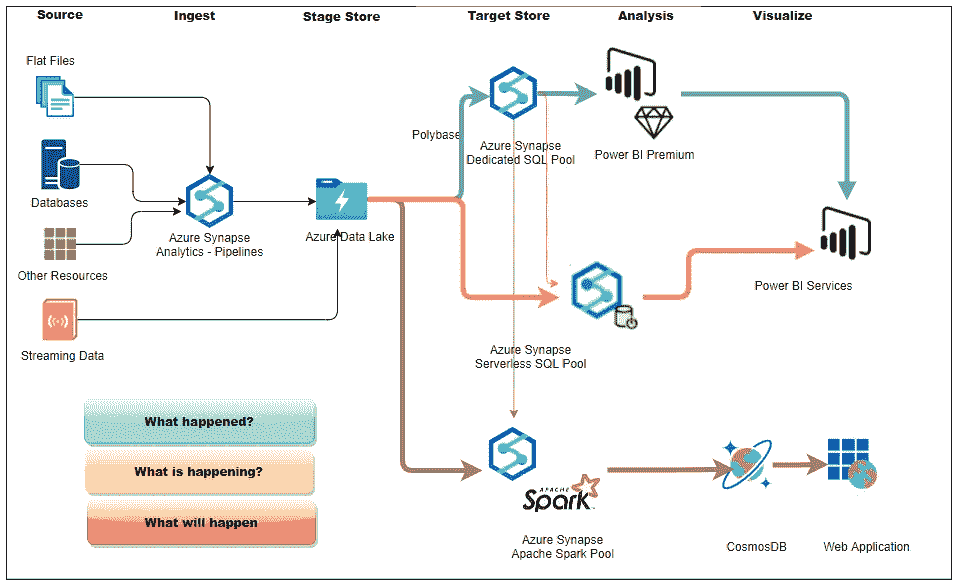
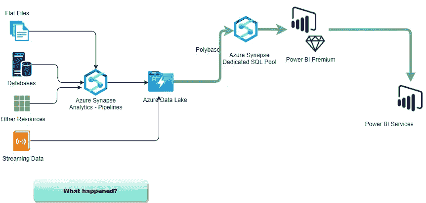
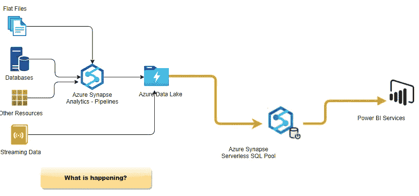
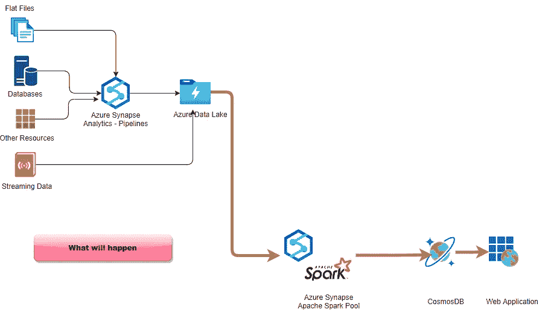

# 现代商业智能(BI)架构— Azure Synapse 分析

> 原文：<https://medium.com/analytics-vidhya/modern-business-intelligence-bi-architecture-azure-synapse-analytics-6e17237e5940?source=collection_archive---------1----------------------->

数据量呈指数级增长，组织正在寻求创新的方法来利用这些数据，并将它们转化为有价值的见解，从而有可能增加业务价值

传统的商业智能解决方案成功地为组织提供了一个全面的" ***历史报告，到目前为止发生了什么？*** "如每日在库余额或每周销售额或每月收入..等等。

但是要在当今竞争激烈的现代商业世界中生存并取得成功，公司应该知道正在发生什么，将会发生什么，为什么？ ”，因此，为了获得这些详细信息，公司需要先进的数据分析技术，并需要直接访问最新的数据。

本文重点关注 ***现代商业智能(BI)架构*** 以及 Azure 为支持这种现代架构而提供的各种数据平台服务。

现代商业智能(BI)架构

Azure Synapse Analytics 是一项高级分析服务，面向希望实现分析平台现代化的大型公司。这将企业数据仓库和大数据分析结合在一起，回答了"*正在发生什么，将会发生什么，为什么？*“并扩展企业在高级数据分析方面的能力。

现在让我们看看这个现代建筑是如何回答 3 个关键问题的

# 发生了什么事？

***第一层:*** 这个传统的商业智能平台为用户提供了各种各样的历史和特定报告。众所周知，传统的 BI 架构完全依赖于企业数据仓库和语义模型。分析服务模型在 BI 仪表板场景中特别有用。在这种体系结构中，Analysis Services 模型从数据仓库中读取数据，并有效地为仪表板查询提供服务。

虽然用户已经能够从传统的商业智能平台中获得巨大的历史报告、即席报告和趋势报告功能，但现在更多的用户需要最新的数据来进行高级数据分析。

# 发生了什么事？

***第二层:I*** 对于公司来说，实时了解*当前正在发生的事情，以便能够做出反应，更重要的是，预测和发现新的商业机会，是非常必要的。第二层将帮助用户获得最新的数据进行分析。*

*Azure Synapse Analytics workspace 附带了无服务器 SQL 池端点，我们可以使用它来查询 ADLS 中的数据，这是一种针对您的数据湖中的数据的查询服务。借助该服务，数据专业人员可以直接访问 Azure 数据湖存储中的原始数据，并可以在湖中数据的基础上快速创建 Power BI 报告，并使用 Power BI 生成表格，从而在几分钟内获得洞察力*

# ****会发生什么，为什么？****

**

****第三层:I*** t 对于公司来说，知道 ***会发生什么事情，为什么很重要？*** 更有效地运作，可以帮助企业吸引、保留和培育他们最有价值的顾客。*

*Azure Synapse Analytics 提供各种机器学习功能，创建机器学习模型→使用 MLlib 在 Apache Spark 池上训练模型→部署模型并对其评分。*

*从 Apache Spark pools 到 Cosmos DB，通过 web 和移动应用程序访问它们。*

*目前就是这样，我将在接下来的文章中详细介绍每一层，直到那时保持安全和健康*

**