# 现代投资组合理论模型在 Python 中的实现

> 原文：<https://medium.com/analytics-vidhya/modern-portfolio-theory-model-implementation-in-python-e416facabf46?source=collection_archive---------1----------------------->

免责声明:本文不作为财务或法律建议。我不是一个合格的专业人士，所以这篇文章只能用于教育/娱乐目的。投资/交易可能会导致亏损。

**UPD:这篇文章是很久以前写的，那时我还不太懂统计学。在本文中，我使用方差和协方差的有偏估计量，但是无偏版本会更好。**

# 背景

本节我们将讨论现代投资组合理论的理论背景。如果你想了解更多，我建议你去读一读精彩的[维基百科文章](https://en.wikipedia.org/wiki/Modern_portfolio_theory)，这是本节的基础。如果您只想了解 Python 实现，可以安全地跳到下一节。

**现代投资组合理论**(简称 MPT)是一种金融模型，由哈里·马科维茨(Harry Markowitz)创建，用于组合优化风险收益权衡的资产组合。

设 *Rₚ* 是代表投资组合回报的随机变量。设 *Rᵢ* 为随机变量，代表投资组合中第 *i* 项资产的收益。设 *wᵢ* 为投资组合中第 *i* 项资产的“权重”，这样所有权重都是介于 0 和 1(含)之间的实数，且总和都为 1。

MPT 声明 *Rₚ* 是所有回报 *Rᵢ* 的加权和(权重 *wᵢ* ):

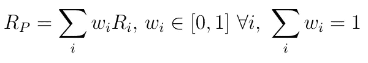

来源:图片由作者创作。

利用期望的线性，

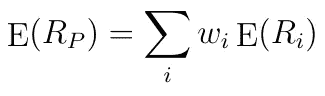

来源:图片由作者创作。

MPT 对“回归”的确切含义模棱两可，而且有许多不同的选择。我个人决定使用*对数回报*，因为它们最终是最容易使用的，而且它们提供了很好的结果，因为它们模拟了投资组合资产回报的连续复合。

这意味着期间 *i* 的收益可以用期间 *i* 和 *i + 1* 的价格表示如下:

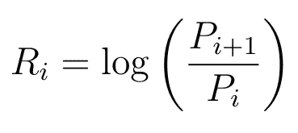

来源:图片由作者创作。

为了使用历史数据估算年度收益的 *E(Rᵢ)* ，我们需要计算*每日*对数收益的平均值(这是每日收益期望值的近似值，假设每日收益是独立同分布的)，并将其乘以一年中的交易天数(250)以获得年度 *E(Rᵢ).*

为了逼近两种资产的年回报率的协方差，我们首先需要认识到对数年回报率只是每日对数回报率的总和，因为

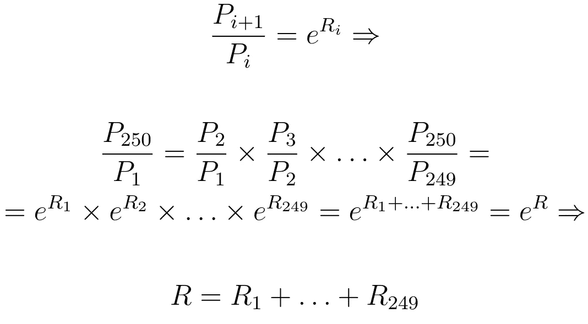

r 表示年回报率， *Rᵢ* 表示日回报率。来源:图片由作者创作。

此外，我们需要记住，对于两个随机变量 *X* 和 *Y* ，它们的协方差可以表示为

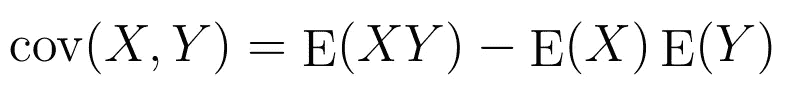

来源:图片由作者创作。

因此，要估算年回报率的协方差，我们首先需要用我们讨论过的相同方法估算每项资产的预期年回报率，然后通过计算所有可能的日回报率乘积的平均值来估算年回报率乘积的预期，然后将结果乘以交易日数(250)减去 1 的平方。然后，为了得到协方差，我们用一个减去另一个。

另一种选择是使用 [*资本资产定价模型*，](https://en.wikipedia.org/wiki/Capital_asset_pricing_model)但这不在本文的讨论范围之内。

MPT 用方差来衡量风险。我们将把 *Rₚ* 的方差记为σ *ₚ* ，把 *Rᵢ* 的方差记为σ *ᵢ* 。

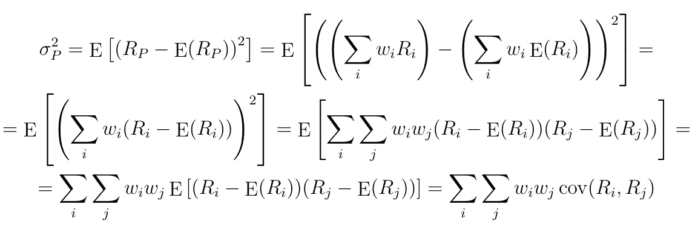

来源:图片由作者创作。

注意我们如何对最后两个公式进行矢量化:设 *R* 是资产收益的向量 *Rᵢ，w* 是权重的向量 *wᵢ，*σ是向量 *R 的协方差矩阵*然后，

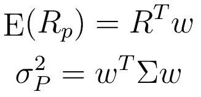

来源:图片由作者创作。

在 MPT，**有效边界**是在风险回报权衡意义上最优的投资组合集合，也就是说，有效边界中的每个投资组合都使给定回报的风险最小化。

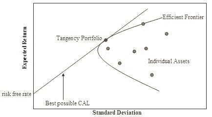

来源:G2010a，公共领域，通过维基共享

参数化有效边界有两种等价的方法:

1.  通过最小化

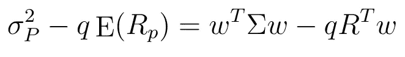

来源:图片由作者创作。

关于向量*w .**q*≥0*是一个代表“风险承受能力”的参数，即我们选择 *q* 越大，我们得到的投资组合就越激进。*

*2.通过最小化*

*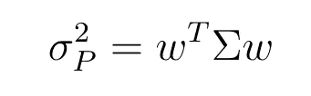*

*来源:图片由作者创作。*

*关于矢量 *w* ，服从*

*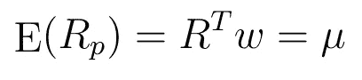*

*来源:图片由作者创作。*

*对于参数μ。*

*请注意，在这两种情况下，我们都有两个额外的约束:*

1.  *所有的 *wᵢ* 必须在范围[0，1]内。*
2.  *所有 *wᵢ* 的总和应该等于 1。*

*顺便提一下，一项投资的**夏普比率**是衡量其相对于无风险资产的表现，并根据风险进行调整。从本质上讲，如果我们比较两项具有相同回报的投资，夏普比率较大的那一项会以较低的风险提供相同的回报。*

*设 *R* 为代表投资收益(单一资产，或投资组合)的随机变量， *Rf* 为代表无风险收益(如美国国债利率)的随机变量，σ为 *R* 的标准差， *S* 为夏普比率*。*然后，*

*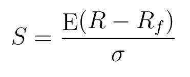*

*来源:图片由作者创作。*

# *Python 实现*

**这部分的源代码可以在我的*[*Github repo*](https://github.com/taiypeo/mpt_medium_notebook)*中找到。**

*首先，让我们导入所有必要的库并创建常量。*

*现在，让我们创建一个描述我们投资组合中的资产的类。*

*在构造函数中，我们接收资产的名称和包含每日资产价格历史的 Pandas 数据帧，该数据帧由 yfinance 返回(我们只使用‘Close ’,但为了便于将来的开发，我仍然决定传递整个数据帧)。使用这个数据框架，我们计算资产的日收益和预期日收益。*

*该类还有一个名为 expected_return 的属性，它只是上一节中的 *E(Rᵢ)* 、用于漂亮打印的 __repr__ 和一个名为协方差矩阵的静态方法，用于计算资产向量的协方差矩阵。这个静态方法有一个缓存装饰器，因为重新计算矩阵非常耗时。*

*创建资产类别后，我们可以创建投资组合类别。*

*在构造函数中，我们接收一组资产，计算它们的预期回报、协方差矩阵，并创建一个随机权重向量。*

*这个类有两个属性，叫做 expected_return 和 variance，分别是上一节的*e(rₚ】*和σ *ₚ* (注意下面代码中的 _expected_return 和 _variance 接受一个权重向量作为参数，这对优化很有用)。它还有一个用于漂亮打印的 __repr__ 方法。*

*我们还创建了三种优化方法:*

*   *optimize _ with _ risk_tolerance(unsafe _ optimize _ with _ risk _ tolerance 是相同的东西，但是不检查 risk _ tolerance 是否大于或等于 0)*
*   *optimize _ with _ expected _ return*
*   *优化 _ 锐化 _ 比率*

*这些方法中的每一种都使用 scipy.optimize.minimize 和必要的约束和界限来优化投资组合权重(使用上一节中的有效前沿参数；optimize_sharpe_ratio 只是在相同的约束和界限下最大化 sharpe 比率)。*

*为了使用 yfinance 数据，我们创建了一个名为 yf_retrieve_data 的助手函数，它接受一个 ticker 名称列表，并返回一个由 yfinance 返回的 Pandas 数据帧列表。*

*举个例子，让我们列出标准普尔 500 指数中一些最大的公司，并绘制出:*

*   *随机投资组合*
*   *效率限界*
*   *风险最小的优化投资组合*
*   *给定风险承受能力的优化投资组合*
*   *给定回报的优化投资组合*
*   *夏普比率最大化的优化投资组合*

*我们得到了这样一个图表:*

*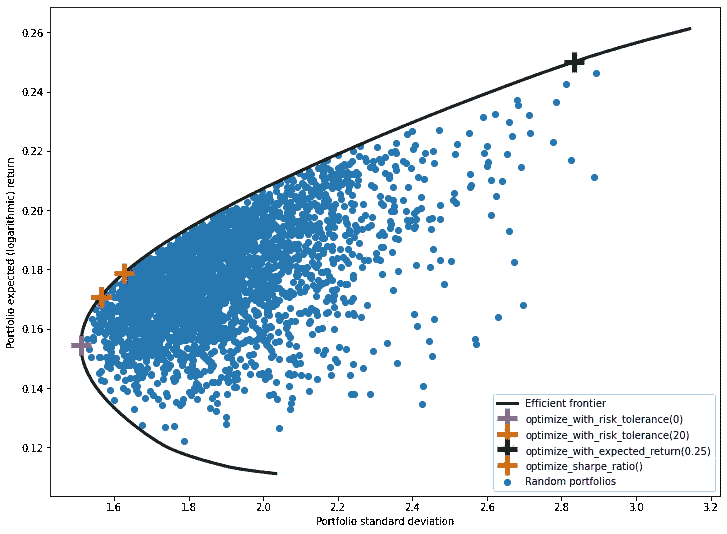*

*来源:图片由作者创作。*

*要获得准确的重量，我们可以这样做:*

*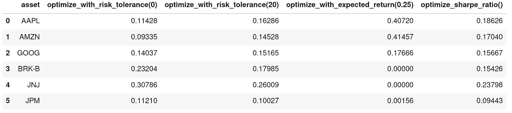*

*每一列代表一个独立的投资组合，以及这些资产在投资组合中的权重。来源:图片由作者创作。*

# *结论*

*正如我们在第一部分所讨论的，MPT 的想法很简单，但它导致了一个非常强大的模型，允许我们优化由一组给定资产组成的投资组合。*

*然而，一些人批评 MPT 不是现实世界金融市场的好模型。这导致了基于更现实假设的 MPT 的新扩展的产生，例如[后现代投资组合理论](https://en.wikipedia.org/wiki/Post-modern_portfolio_theory)。*