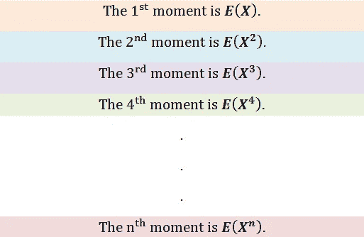
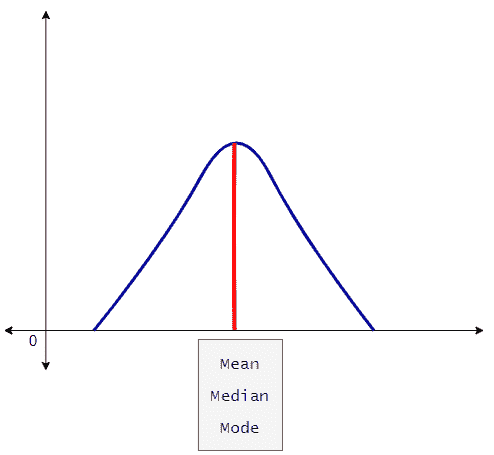
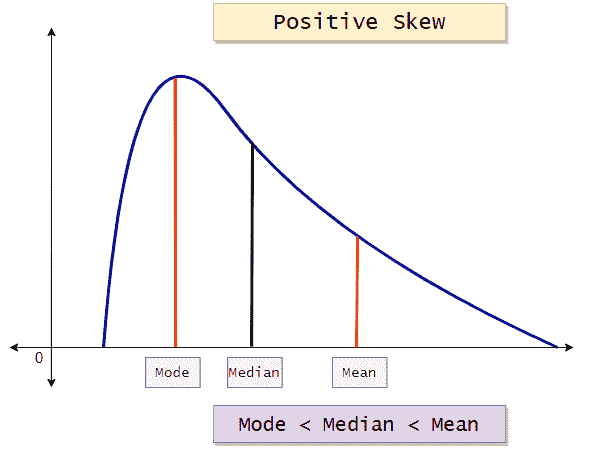
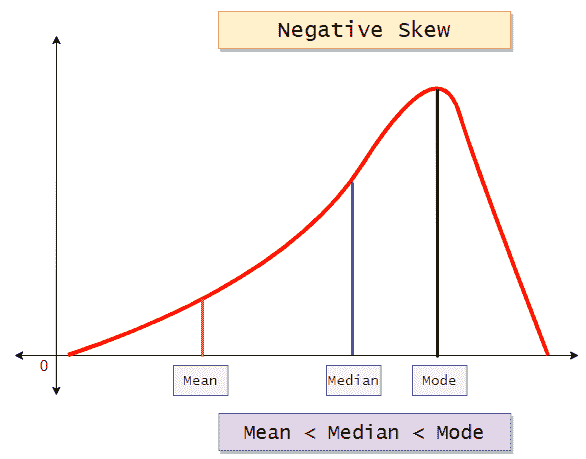
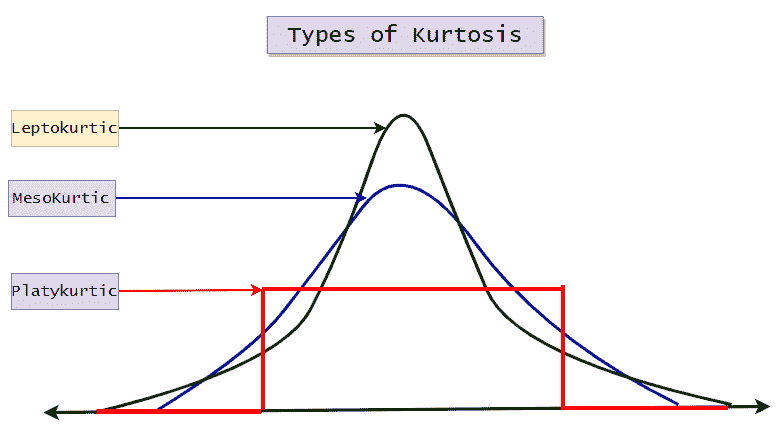

# 统计学中的矩

> 原文：<https://medium.com/analytics-vidhya/moment-in-statistics-9407438c083b?source=collection_archive---------1----------------------->

偏斜度和峰度的简明注释

# 统计学中的矩是什么？

我们一般用统计中的矩、 [**、机器学习**](https://mld.ai/mldcmu) 、数学等领域的**来描述一个分布的特征。**

假设我们感兴趣的变量是 X，那么矩就是 X 的期望值。比如 E(X)，E(X)，E(X)，E(X⁴),…等等。

图 1:统计中的矩。

# 统计学中的矩:

**1)一阶矩:**中心位置的度量。(平均值)

**2)二阶矩:**离差/扩散的度量。(方差)

**3)三阶矩:**不对称的度量。

**4)四阶矩:**异常值/尾部的度量。

现在我们非常熟悉一阶矩(均值)和二阶矩(方差)。

三阶矩称为偏度，四阶矩称为峰度。

第三个矩测量分布的不对称性，而第四个矩测量尾部值有多重。物理学家通常在物理应用中使用高阶矩。让我们来看看第三和第四个时刻的可视化。

# 三阶矩(偏斜度):

**1)无歪斜:**

图 2:没有偏斜的图表数据。

**2)正偏斜:**

图 3:正偏斜的数据图。

**3)负偏斜:**

图 4:具有负偏斜的数据图表。

# 四阶矩(峰度):

图 5:表示峰度类型的图表。