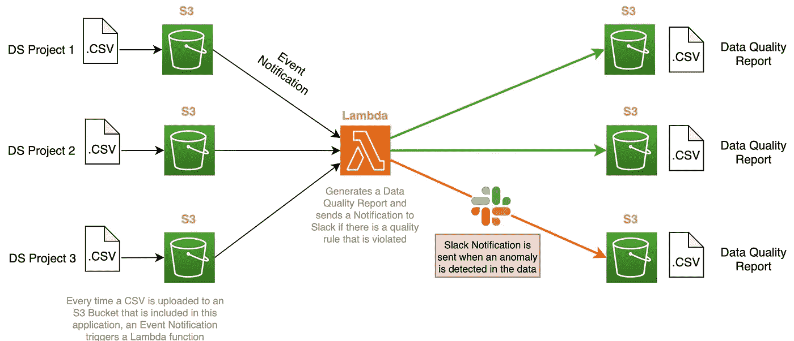
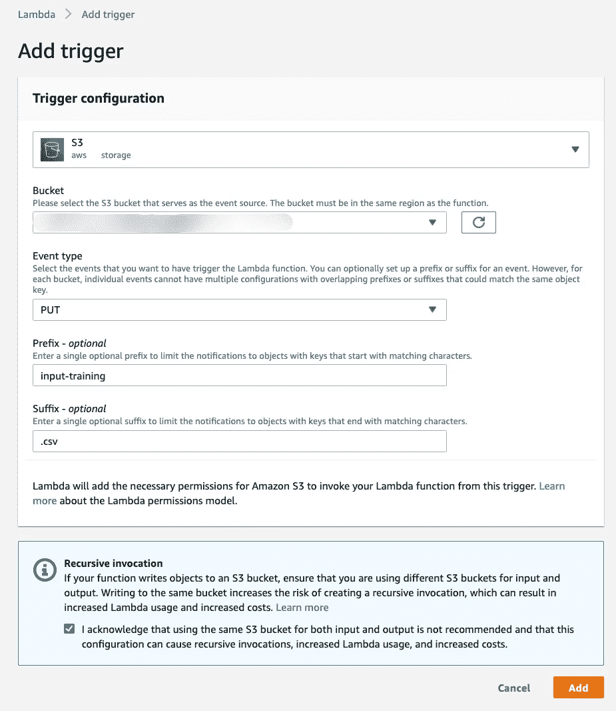
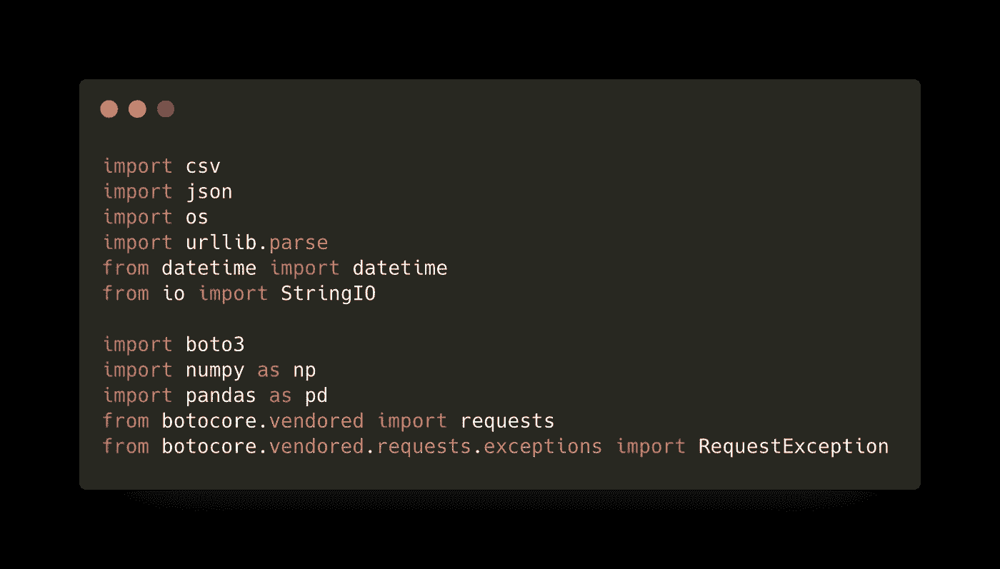
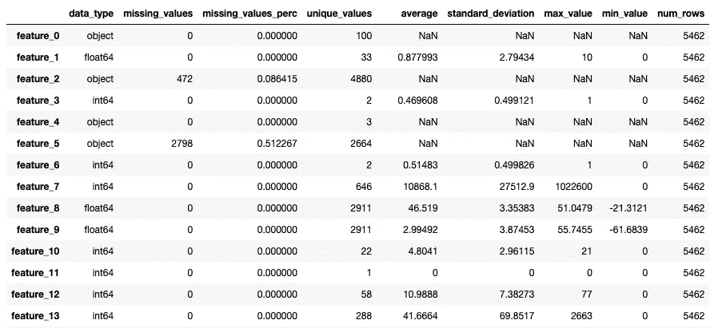
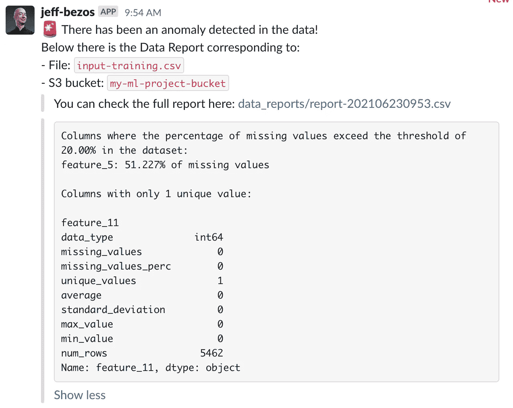

# 用一个 AWS Lambda 监控所有流入 ML 模型的输入数据

> 原文：<https://medium.com/analytics-vidhya/monitor-all-input-data-flowing-into-your-ml-models-with-a-single-aws-lambda-e702c5d21c28?source=collection_archive---------8----------------------->

## 我们在 Instapro 构建的一个简单应用程序，用于检测和报告输入数据中的异常。

*作者:* [*保罗·维拉*](https://www.linkedin.com/in/pauvilarribo/) *，数据科学家:Instapro* *。*


帕特里克·罗伯特·道尔在 [Unsplash](https://unsplash.com?utm_source=medium&utm_medium=referral) 上拍摄的照片

当你和你的团队将机器学习模型部署到生产中时，你满意吗？是的，这很有意义。但是，部署后工作完成了吗？不应该啊！

有时我们会忘记一个健康的 ML 项目生命周期的最后一步:**监控和可观察性**。这是一个很大的主题，不仅包括及时监控模型的性能，还包括监控其他事情，如模型偏差、数据漂移、数据中断等。监控你的模型用来训练的数据是保持你的 ML 项目健康的关键。我们需要数据来训练模型。这些数据很可能是从数据库中检索出来的，然后进行处理，以便对其进行清理和/或创建额外的特征。在这些步骤中，许多事情都可能出错，因此有一种机制来检测生成的数据中的异常非常重要。

在这篇文章中，我们将重点关注**监控数据**的质量，这些数据用于重新训练我们的模型，以及用于进行推理的数据:**输入数据**。

> *目标是主动检测输入数据中的异常，这些异常最终会降低模型的性能*。

# 架构概述

在 Instapro，我们将与每个 ML 项目相关的所有文件存储在一个 **S3 桶**中。这包括包含不同模型将用于训练和推断的数据的文件。在大多数项目中，这些数据是从 ETL 应用程序生成的 CSV 文件(通常由 cron schedule 表达式触发)。例如，如果我们决定每周重新训练一次某个模型，ETL 应用程序将每周生成新的训练数据。这个新的训练数据将从通讯项目上传到 S3 桶。

我们有兴趣对上传到 S3 的新数据进行评估。在 **AWS Lambda** 中，您可以设置许多类型的触发器，其中一个触发器是将操作放入 S3 桶。这个 PUT 操作将向 Lambda 发送一个事件通知，应用程序将开始运行。

Lambda 函数包含用于生成我们称之为*的数据质量报告*的代码，以及一组规则，如果违反了这些规则，就会触发警报。



应用程序架构图

# 创造必要的资源

对于这个应用程序，你只需要有一个 S3 桶，当你的数据生成时，它将被上传和一个包含代码的 Lambda 函数。

有三种方法可以创建这些资源:使用 AWS CLI、使用 AWS SDK for Python (Boto3)或直接从 AWS 控制台创建。在本练习中，为了简单起见，我们只从控制台显示内容，但是您可能希望使用 CloudFormation 这样的工具来管理您构建的所有资源。

在创建了 S3 桶和 Lambda 函数之后，让我们添加触发器。这些触发器是事件通知，它们会将一些信息传递给 Lambda，然后它会被执行。

以下是一个事件通知的示例:

```
{
   "Records":[
      {
         "s3":{
            "bucket":{
               "name":"my-ml-project-bucket"
            },
            "object":{
               "key":"input-training.csv"
            }
         }
      }
   ]
}
```

该事件采用 JSON 格式，包含触发该事件的存储桶的信息，以及上传到该存储桶的对象(CSV 文件)的信息。

触发类型将是 S3。然后，您可以指定存储桶名称。在事件类型中，我们指定了 PUT 操作，因为我们对在上传对象时触发 Lambda 感兴趣。我们可以添加一个前缀和一个后缀，这样 Lambda 只有在上传的对象匹配您的过滤器时才会被触发。我们对对应于不同 ML 项目的每个 S3 桶做同样的事情。



# 分步代码演练

如前所述，这个应用程序只是一个 Lambda 函数，所以所有代码都位于一个 Python 脚本中。

## 必需的库



## 主要功能

lambda 处理函数(代码如下)以 JSON 格式接收来自 S3 事件通知的事件。我们从该事件中需要的信息是 S3 存储桶的名称和上传文件的密钥(文件路径和文件名)。根据这些信息，我们遵循以下步骤:

1.  加载包含将要分析的数据的 CSV 文件。
2.  生成包含数据中每个要素的描述性统计数据、缺失值信息和唯一值信息的报告。
3.  生成一条消息(字符串),包含数据检查过程中发现的见解。如果违反了任何数据质量规则，变量`notify` 将采用一个`True`值。
4.  如果在数据中检测到异常，将通知发布到松弛通道，以便团队可以进一步调查。
5.  将生成的报表保存回同一个 S3 时段。

## 根据描述性统计数据、缺失值和唯一值生成包含要素级别信息的报告。

我们现在定义一个名为`generate_report()`的函数，该函数为数据中的每个要素生成一个包含以下信息的数据集:

*   数据中的行数
*   数据类型
*   缺失值的数量和百分比
*   数字特征的描述性统计(平均值、标准差、最大值和最小值)。

在下图中，您可以看到由上述函数生成的报告(描述性统计数据中带有 NaNs 的要素是分类变量或字符串变量):



## 定义质量规则，并创建一条包含检测到的任何中断信息的消息。

您可以在这个函数中找到两个基本规则来检测:

*   **缺少值的列**。在这里，我们检测是否有任何列超过了由`missing_values_threshold`定义的丢失值的允许百分比。
*   **只有一个唯一值的列**。例如，如果在某个时候缺失值被填充为 0，就会发生这种情况，如果某个要素的所有缺失值现在都是 0。

从上一步生成的报告中，您已经可以看到有两个特性包含缺失值(`feautre_2`和`feature_5`)。另外，还有一个特性只有一个唯一的值(`feature_11`)。在下一个函数中，我们将运行一些检查，并检测这些情况。

## 如果违反了一条或多条规则，创建一条将在 Slack 中发布的消息。

在消息中，我们包括 S3 存储桶名称和从中检测到异常的 CSV 文件名。我们还提供了数据质量报告的链接，可用于调查问题的根源。

下面是将发布到所选闲置渠道的通知示例。



## *其他注意事项*

*   你的 Lambda 需要有**权限**才能访问 S3 并进行读写操作。
*   您可能需要在 AWS Lambda 中创建一个新的**层**,其中包含为运行 Lambda 函数的 AMI Linux 机器编译的依赖项。
*   细化**规则**并使其适应不同项目的要求。与 PO 和团队讨论为不同的项目或功能设置不同的缺失值**阈值**。
*   [创建一个能够从 Python 发布消息的 Slack 应用](https://api.slack.com/start/overview#creating)。[更多详情请登陆官方网站](https://api.slack.com/messaging/sending)。

感谢阅读:)

*如果你对我们在 Instapro 集团所做的 ML 工作有兴趣，请查看我们目前在不同国家的职位空缺:* [*【荷兰】*](https://www.careersatwerkspot.com/vacancies/)*[*法国*](https://www.welcometothejungle.com/fr/companies/travaux-com/jobs) *和* [*德国*](https://myhammer.jobs.personio.de/) *。**