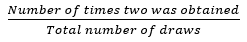

# 蒙特卡罗积分

> 原文：<https://medium.com/analytics-vidhya/monte-carlo-integration-987933ba2f73?source=collection_archive---------21----------------------->

资料来源:wallpapercave.com

听到“随机”这个词，你会想到什么？

资料来源:wallpaperflare.com

一个陌生号码打来的随机电话。一个在你回家的路上对你微笑的人。当你洗澡的时候，一个偶然的灵感闪现在你的意识中。溶液中悬浮粒子的随机运动，也称为布朗运动。从诞生之日起，整个宇宙就充满了随机性。

如果有人告诉你，你可以利用这种随机性来计算下面的积分:

激动！？我也很兴奋。请允许我分享它的要点。

*大数定律:*

比方说，我有一个封闭的盒子，里面装满了从 1 到 10 的卡片。然后说，让你随便挑一张牌。你得到数字 2 的概率是多少？右简单，是 0.1。

但是假设你想从统计学上证明这一点。在这种情况下，你将重复这个实验，比如说 N 次。您将按如下方式计算概率:

如果我在石器时代这样做，我可能不得不手动做这个实验来和你分享我的兴奋。但是既然我们有计算机，让我们在 MATLAB 中模拟我们的问题。

这段代码为“runx”次数生成一个 0 到 1 之间的随机数。它将概率计算为 2 弹出的次数与总运行次数之比。我按了几次 run 按钮，得到了像 0，0.2，0.3，0.1，0.4 这样的值。

是啊！在十次运行中，有实例 2 不止一次弹出，也有实例 2 根本没有弹出。

当你把 runx 的值从 10 增加到 100、1000、10000 等等时，奇迹就发生了…

当 runx=1000 和 100000 时

请注意，当您多次进行实验时，概率值 p 接近 0.1。*随着抽卡次数的增加，统计观察值接近理论值*。这种魔力叫做大数定律。

*现在，你可以用这个魔法来计算积分。*

众所周知，x 的期望值可以写成等式(1)

g(x)的期望值可以写成等式(2)。这里，P(x)是 x 处的概率密度。如果 g(x)是一个离散变量，则期望值就是所有离散点的所有 g(x)P(x)之和除以总点数，记为

现在，根据大数定律的魔力，如果我的 N 值变得足够大，我的 *E[g(x)]* 将接近积分，即，

我可以不用计算积分，而是生成一个概率分布为 P(x)的随机数，并在生成的 x 值上计算函数值，然后简单地将它们相加，再除以运行次数！！！！！

例如，考虑积分。

下图中的代码在区间内生成随机数，并计算那些点的函数值(y=x)。然后将所有这些值除以运行次数后相加。

积分的实际值是 0.3333…；注意当我们增加样本数量时，它是如何接近实际值的。

来源:wallpaperflare.com

我们刚刚在 MATLAB 上运行的模拟被称为 ***蒙特卡洛模拟*** 或以蒙特卡洛命名的随机模拟，蒙特卡洛是摩纳哥的一个城市，以赌博而闻名，是最有趣的随机过程。

今天的研究利用绝对的随机性来产生有用的结果。研究者在 ***随机过程*** 下研究此类过程。它涉及科学、数学、土木工程、机械工程、化学工程和许多其他学科的广泛兴趣。

令人着迷的是，不可控制的随机性是如何接近一个平静的结局的。

我再次引用，

> 从诞生之日起，整个宇宙就充满了随机性。然而，这些实体以这样一种方式相互作用，以这种形式使生命在地球上成为可能。