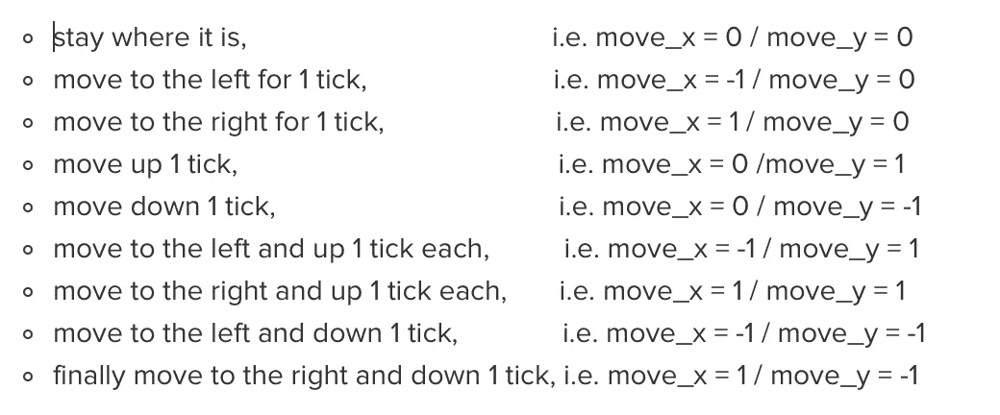
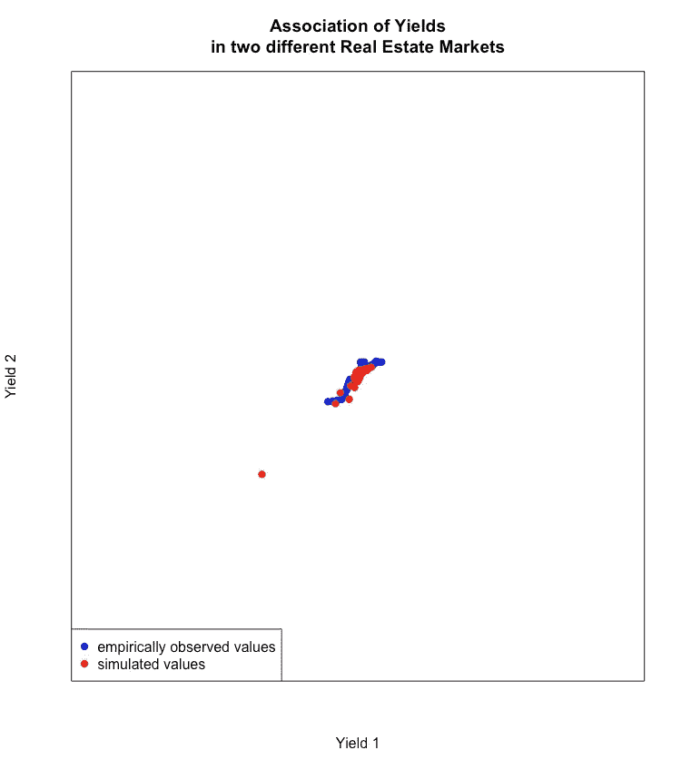

# 蒙特卡洛——通向房地产高级风险分析世界的一扇门

> 原文：<https://medium.com/analytics-vidhya/monte-carlo-one-gate-to-the-world-of-advanced-risk-analytics-in-real-estate-7f9e7679223c?source=collection_archive---------4----------------------->

# 介绍

蒙特卡洛模拟是一种对不同情景的概率进行建模的方法。为什么我们需要蒙特卡洛是因为这些场景不容易预测，因为涉及的输入变量在某种程度上是随机的。这是一件非常奇特的事情，尤其是当基于大量随机行为的输入参数，解析解不再可见的时候。

蒙特卡洛模拟几乎无处不在，例如工程、生物医学、供应链或金融等。它们在揭示风险和对预测性分析和预测中的不确定性给出感觉方面有很大的帮助。

在本文中，我们来看看蒙特卡罗模拟是如何工作的，它与**马尔可夫链蒙特卡罗**有什么不同，它如何应用于房地产的“现实生活”中，以及在这个过程中等待我们的棘手问题在哪里。

我们还将从商业房地产业务的角度讨论为什么这是预测分析应用的一个很好的工具，也是进入高级风险分析世界的一个途径。

# 蒙特卡洛模拟—基础知识

假设，一个客户服务有两个客户。在一个月内，通常有 20 %的几率客户 1 出现并需要帮助。在同一时间段内，客户 2 出现寻求帮助的几率约为 5 %。为了制定一个适当的当月工作计划，客户服务希望知道其中一个客户出现或者两个客户同时联系的概率。

**分析方法**

我们只有 2 个参数(客户端 1，客户端 2)和调用客户服务的固有机会。因此，在这种情况下，概率可以通过分析得出。

我们整个月面临以下框架:

**蒙特卡洛模拟**

在蒙特卡洛模拟中，我们将采取相同的情况，即两个客户，一个月的时间，并且这些客户的给定变化出现(客户 1 为 20 %，客户 2 为 5 %)，但是我们将一次又一次地重复这种情况(在本例中正好一百万次)，以便近似相关的组合概率。

这个问题的蒙特卡罗模拟可能是这样的:

以下是可能结果的摘录

模拟框架给出了普通月份的以下结果:

*   没有客户出现

*   一个客户出现了

*   两个客户都出现了

模拟结果与分析方法大致相同，即没有客户出现时为 76 %,一个客户出现时为 23 %,两个客户同时出现时约为 1 %。

以下是普通月份中各种客户行为的频率:

作者图片

当然，这个例子很简单，因为有一个简单的解析解。尽管如此，如上所述，当输入参数的数量变得更大，解析解不再可能或变得太复杂而无法导出时，蒙特卡罗模拟是一个很大的帮助。

# 马尔可夫链蒙特卡罗

在蒙特卡洛设置中，输入参数相互独立。看看前面例子中的两个客户端。客户 1 在某一时刻需要帮助，这与客户 2 的需求完全无关。

对于马尔可夫链蒙特卡罗(MCMC)应用来说，这略有变化。在这种情况下，当前阶段的**结果取决于前一阶段**的结果。需要注意的是，这种依赖性只是针对前一个阶段，而不是后面的任何阶段！

这里有一个简单的例子来抓住这一点。

假设，在 t_0 阶段，一个球在 x/y 网格上的位置 x = 50，y = 50。从一个阶段移动到下一个阶段，球可以

这些运动中的任何一个都有相同的概率被球“带走”。

所以，看 x/y 坐标，球在 t_0 的位置是 50/50。在 t_1，t_0 的位置被考虑，加上如上所述的球的一个可能的运动，例如 50-1/50 导致 t_1 的位置 49/50。接下来，球在 T2 的位置只取决于它在 t1 的位置加上球可能做的任何运动。但是球在 T2 时的位置肯定不再依赖于 t0 时的情况。

长话短说，这个球的“随机行走”可能是这样的:

作者图片

原则上就是这样。有了这些知识，人们可以建立一个适当的蒙特卡罗/ MCMC 应用。

# 房地产中的马尔可夫链蒙特卡罗

马尔可夫链蒙特卡罗是模拟时间序列的优秀工具。因此，它是**预测房地产市场模型**的最佳先决条件。

为了说明的目的，让我们看一看房地产市场中办公室租金价格的经验数据。

作者图片

基于经验时间线和 25.5 欧元的当前租金价格水平，我们可以使用 MCMC 预测未来 5 年的市场租金发展:

作者图片

这个模拟揭示的是，在这段时间结束时

*   租金价格水平低于当前价格水平的可能性为 30 %
*   有 90 %的可能性，租金价格在 22 欧元到 32 欧元的区间内
*   然而，潜在租金价格发展的“热区”在 23 欧元到 29 欧元之间

请记住，模拟时间越长，预期发展的范围就越广，这反映了**未来发展的不确定性越来越大**。这在下图中显示为“热区”，即深蓝色区域，随着时间的推移明显扩展。

作者图片

# 蒙特卡罗/ MCMC 模拟的一些“繁重工作”

当然，天下没有免费的午餐！

为了在强大的蒙特卡洛模拟中取得成功，必须准备好这个工具，并且**必须考虑几个严肃的主题**。

只要记住客户服务的例子。两个客户相互独立。两个客户同时出现的可能性的推导非常简单。否则，球随机走过 x/y 网格的模拟已经有了第一个约束，即球在当前阶段的位置取决于球在前一阶段的位置。

关注现在的房地产市场，并因此再次反映租金价格情景，似乎很明显，一个阶段的租金价格发展也取决于相应的前一阶段的租金价格水平。

此外，作为 MCMC 模拟基础的租金价格行为是以统计方式从经验数据中推断出来的，以便可用于该工具。

到目前为止，我们只讨论了一个市场参数。然而，租金价格是嵌入在一个具有许多市场特征的市场结构中的。在将其他市场输入纳入模拟之前，也必须对其进行**统计近似**。此外，市场参数之间的**关联，表示为**协方差矩阵**，必须在用于 MCMC 环境之前定义。这可能同样棘手。**

因此，为了能够**建立一个强大的预测工具**嵌入房地产投资者的风险管理系统，大量的技术建模和**市场专业知识**是**所必需的**。

对于不同的市场参数及其关联，以两个不同房地产市场(但资产类别相同)的收益发展的经验数据为例。他们的发展显示出很强的相关性，相关系数达到 0.75。

作者图片

在建立 MCMC 仿真时，必须考虑这一事实。不仅仅是这两个市场特征之间的关系。为了能够在模拟模型中反映真实市场，必须解决所涉及的市场参数之间的任何关联。

通过这样做，我们实现了模拟数据与观察数据的行为相似，如下图所示:

作者图片

市场参数越多，建模就越复杂，因为所有这些特征都必须相互关联。下图显示了基于 MCMC 的市场模型的一些结果(蓝点…经验观察值，红色…模拟值):

作者图片

但是我想，你明白了…

# 结论

有了统计建模和商业专业知识的良好组合，就有可能为房地产业务中的预测分析任务创建一个非常强大的工具。当然，为了充分利用蒙特卡罗/ MCMC 模拟，迎接更复杂模型可能遇到的挑战和陷阱，必须做好充分的准备。

而且，这还不止于此！

谈到房地产，模拟结果可以在房地产公司各自的风险管理环境中实施，并且是**在项目、投资组合或实体层面上进一步进行风险/绩效分析的非常坚实的基础**。

另一个噱头是，蒙特卡罗可以作为一种更高级的分析方法的门户，实现机器学习/神经网络的整个领域，并在更高的阶段实现网络分析和因果推理。

这个领域有各种各样的工具包，只是等待在更传统的业务中实施，就像商业房地产一样。

旨在支持房地产公司更准确地处理其风险敞口，并能够降低成本和损失。