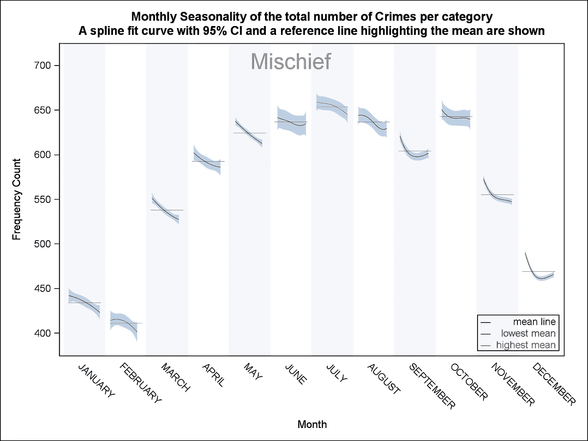

# 蒙特利尔犯罪研究

> 原文：<https://medium.com/analytics-vidhya/montreal-crime-study-e64f75bf0b3f?source=collection_archive---------5----------------------->

> 从 2015 年 1 月到 2021 年 5 月

由于当前的疫情以及过去几年中警察局的关闭和合并，蒙特利尔警察局发生了变化。犯罪行为的数据集在城市的开放数据门户上变得可用。对于每一个行为，我们都有它的类别，日期和时间，地理位置和分配给它的警察部门。该数据集涵盖 2015 年 1 月 1 日至今的时间，并定期更新。我们希望分析这些年来犯罪趋势的变化。

# 关于数据集

该数据集包含以下六个类别的所有登记行为:

致命罪行**。**中断进入**。**恶作剧**。**汽车入室盗窃**。**汽车盗窃**。**持械抢劫。

对于我们的每个行为:

1.  种类
2.  发生的日期、时间和地理位置
3.  分配给它的警察部门

这些点说明了丢失的位置坐标。

在这份报告中，我们使用了从 2015 年 1 月 1 日到 2021 年 5 月底的法案，总共有 191，611 起犯罪。

另一方面，该数据缺少其他重要类别，如欺诈和简单的抢劫。上述 6 个类别约占总犯罪率的 35%,因此我们无法概括我们的研究，我们将分别研究每个类别。

# 现有分析

*   2018 年，CBC 的[分析师](https://www.cbc.ca/news/canada/montreal/what-3-years-of-detailed-crime-data-tells-us-about-how-safe-a-city-montreal-is-1.4627438)制作了一张该市的动画地图，展示了 2015 年至 2017 年的犯罪演变。他们还研究了这一时期犯罪活动的模式变化。
*   蒙特利尔市目前提供最新的数据交互可视化。

# 探索性分析

*   有些类别比其他类别更受欢迎。例如，致命犯罪占数据的 0.1%，在整个期间仅发生 166 起。另一方面，我们有 57304 起汽车盗窃案。

*   同样，一些地区的犯罪率也比其他地区高。14.6%的犯罪发生在市中心，使其成为最高的地区。然而，2020 年犯罪率(针对给定的 6 个类别)下降了 24.6%，这是一个积极的变化。此外，最大的增长发生在高原地区，2019 年的增长率为 10%，总体上最大的变化发生在梅塞尔-霍切拉加-迈松纽夫，2018 年下降了 28.4%。
*   尽管 2019 年的平台期突然增加，但 2020 年再次下降了 14.8%，使 2020 年的犯罪率低于 2018 年的犯罪率。

*   每一类的犯罪率也随着时间的推移而变化。最显著的变化是 2018 年和 2020 年入室盗窃和武装抢劫的减少，以及由少量事件引起的致命犯罪的波动变化。
*   三大犯罪类别呈下降趋势，这是一个很好的指标。

# 时间序列分析

从这一点来说，每一个类别将被单独分析，以避免对人群做出错误的结论。

如果我们直观地分析每个类别的时间序列图，我们会注意到所有类别都有下降趋势。此外，我们还会注意到每年都会重复的季节性模式。接下来，我们将尝试分离趋势和季节性模式。

在应用时间序列技术进行分离后(查看最后的 GitHub repo 了解更多技术细节),我们得到以下趋势和季节性模式。

*   正如我们所料，除了汽车盗窃和致命犯罪，大多数类别都呈下降趋势。看起来致命的犯罪随着时间的推移在增加，汽车盗窃没有线性趋势。
*   我们还注意到，上半年犯罪率有所下降，其中 4 类案件在 2 月份达到最低，到年底犯罪率上升，尤其是在 10 月份，其中 5 类案件的犯罪率最高，第二高的是 6 类案件，其中 11 月份的犯罪率最高。
*   在估计了趋势和季节性模式后，我们将 ARIMA 模型拟合到残差中，以对数据进行建模，从而能够预测未来的变化。下面是我们的模型拟合。更多详情请见本报告末尾的 GitHub repo。

# 仔细观察季节性模式

通过前面的分析，我们对季节性模式更感兴趣了。我们为每个类别创建了更详细的季节性图表。

1.  **汽车盗窃**

*   从 4 月到 10 月的稳步增长。
*   10 月达到高峰，2 月达到最低。

**2。中断并输入**

*   显示了与汽车盗窃案相似的模式，最大和最小月份相同。

**3。恶作剧**

*   该比率从 2 月到 7 月严格递增，7 月达到最大值，2 月达到最小值。
*   然而，10 月份的利率非常接近最高水平。

**4。汽车盗窃**

*   与其他类别相比，曲线不太平滑。
*   然而，10 月和 2 月的利率仍然最高和最低。

**5。武装抢劫**

*   除了六月和九月，我们看到从四月到十月有所增加。
*   十月仍然得分最高，然而，六月得分最低。

**6。致命犯罪**

*   致命犯罪没有明确的模式。
*   二月是利率较高的月份之一，而十月仍然得分最高。
*   四月的致命犯罪数量最少。

# 摘要

*   汽车盗窃案在所有犯罪中数量最多，占 29.9%。
*   ***致命犯罪数量最低，占总犯罪数量的 0.1%。***
*   ***2018 年，梅塞尔-霍切拉加-迈松纽夫的总犯罪率下降幅度最高，为 26.4%。***
*   ***高原地区 2019 年犯罪总量增幅最高，为 10%***
*   ***最高的三种犯罪都呈下降趋势。***
*   大多数种类的犯罪在 10 月份达到高峰，大多数犯罪在冬季月份(即 1 月、2 月、3 月)处于最低水平。
*   虽然犯罪数量呈下降趋势，但随着时间的推移，汽车盗窃和致命犯罪都呈现上升趋势。
*   我们能够找到一个很好地符合数据的时间序列模型。

# 附录

*   除了在 r 中进行数据清理和准备外，分析主要在 SAS 中进行。
*   源代码、数据、方法和图表可以在下面的 GitHub repo 中找到

[GitHub—Khaled fouda/蒙特利尔犯罪](https://github.com/khaledfouda/Crimes-in-Montreal)

感谢您抽出时间阅读报告。请随时留下反馈和建议。