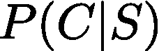
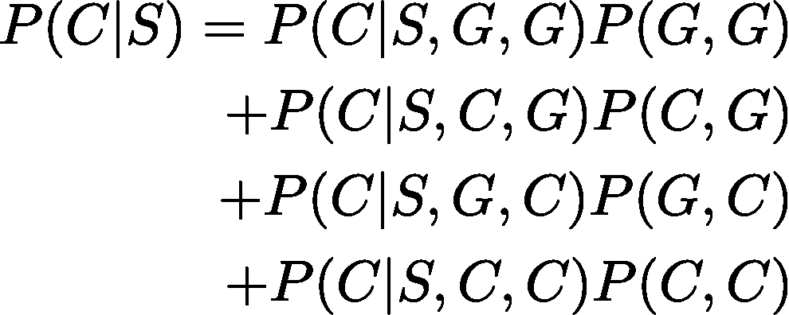
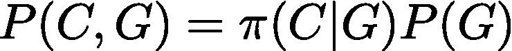
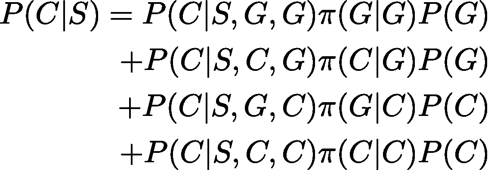
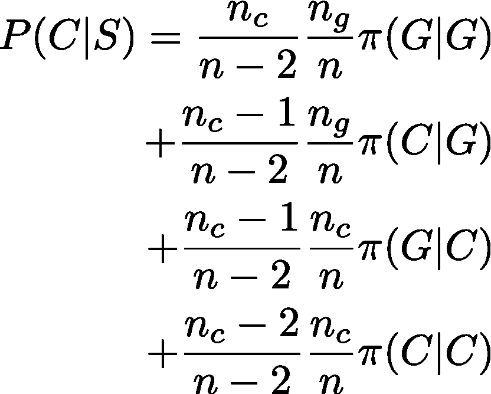
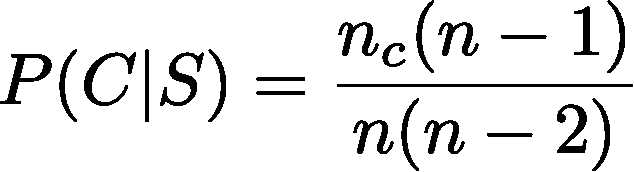
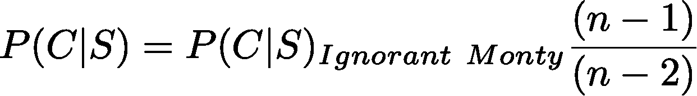
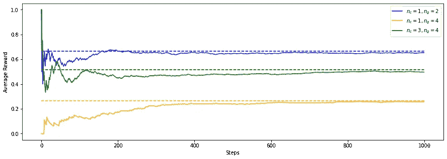

# 蒙蒂·霍尔做得对

> 原文：<https://medium.com/analytics-vidhya/monty-hall-done-right-15732a201fc3?source=collection_archive---------2----------------------->

## 蒙蒂霍尔问题是用条件概率用任意数量的汽车和山羊解决的。作为奖励，我包括一个 colab 笔记本，它通过多臂土匪策略解决了这个问题。

# 理论推导

不缺乏蒙蒂霍尔问题的描述。然而，我认为**反复看 1 辆汽车和 2 只山羊这个问题会被这个特殊例子的细节所困扰**,这让我想起李小龙在《龙争虎斗》中引用的一个禅宗寓言

> 这就像一个手指指向月亮，不要专注在手指上，否则你会错过所有天上的荣耀

所以在这里**我用任意数量的汽车和山羊**解决了蒙蒂霍尔问题，并使用了条件概率数学。此外，**我把最一般的宿主行为留到最后一步，以便突出无知的宿主和全知的宿主之间的区别。**

[https://unsplash.com/photos/3c_EjT6uAFo](https://unsplash.com/photos/3c_EjT6uAFo)

如果你知道条件概率，这并不难做到，否则可能会导致不必要的溃疡。你已经被警告了！

现在让我们来看一个情况，有 nc 汽车和 ng 山羊，设置是你随机选择一个门。主人打开另一扇门，露出里面的东西。该不该换？

所以我们想知道

如果我们交换，赢得一辆汽车的概率。

使用条件概率，这是

举例来说，其中的符号 P(C|S，C，G)表示得到一辆汽车的概率(C ),如果你在开始时碰巧选择了一扇有山羊的门(G ),然后主人打开了一扇有汽车的门(C ),然后你换了(S)。**概率的条件部分应由右至左阅读符号**(实际年表与计算无关)。另一个概率 P(C，G)是你选择了一扇门，门后有一只山羊(G)，主人打开了一扇门，门后有一辆汽车(C)。

上述表达式可以通过使用如下关系式来进一步简化

也就是说，你选择一只山羊(G)而主持人打开一扇门，门后有一辆车(C)的概率是你选择一只山羊的概率 P(G)和主持人选择一辆车(C)的概率的乘积*事后*你选择一只山羊。我用符号π(C|G)来表示它，因为它是宿主的一个动作，但是数学并不关心这个。

有了这个我们得到了

最后利用我们有 nc 汽车和 ng 山羊的事实

这里我们定义了 n = nc+ng。

到目前为止，我们有最普遍的情况，唯一的限制是主机只打开一扇门。这就是蒙蒂霍尔问题的由来。**如果主人不知道任何一扇门后有什么**那么打开任何一扇你没有选中的门的概率是相等的，给出π(G|G) = (ng-1)/(n-1)，π(C|G) = nc/(n-1)，π(G|C) = ng/(n-1)和π(C|C) =(nc-1)/(n-1)和**如果你算一下，你会得到 P(C|S) = n_c/n**

但是，**如果主人知道每扇门后面是什么，有目的地打开一扇门，门后面有一只山羊**那么我们就有π(C|C) = π(C|G) =0，π(G|G)= π(G|C) =1。有了这些，我们得到了

这对于 nc=1 和 n=3 给出了著名的结果 2/3。注意，n≥3 和 nc≤n-1(因为主人必然选择一只山羊)和上面的表达式 P(C|S) <1 as should be. In fact we can write

where the first part on the right hand side is the probability of P(C|S) when the host doesn’t know what’s behind each door. Since n-1 > n-2，我们看到，如果主人故意选择一扇后面有一只山羊的门，切换总是有利可图的。

# 多股武装匪徒

如果我们有一个不理解条件概率或者只是不喜欢数学，只是想在探索和利用的基础上学习转换或不转换的代理人，她可以在探索的同时重复玩这个游戏，有时转换，有时不理解奖励分配。与此同时，她不仅对经销的学术知识感兴趣，还想利用这些知识获得更多宝马、法拉利和劳斯莱斯。她必须在探索(切换或不切换)和利用(执行为她赢得更多汽车的行动)之间取得平衡。这是[多臂土匪](https://en.wikipedia.org/wiki/Multi-armed_bandit)的经典问题。

用于分析的笔记本可以在[这里](https://github.com/borundev/DNN_Lectures/blob/master/Monty_Hall.ipynb)找到。

下面是代理人使用ε贪婪方法切换或不切换的平均报酬(山羊=0，汽车=1)图。虚线是我上面推导的理论值。

Monty Hall 问题的多臂强盗解决方案

# 结论

为了突出 Monty Hall 问题的实际症结，我对任意数量的汽车和山羊进行了求解。当汽车和山羊的数量分别为 1 和 2 时，结果减少到著名的值 2/3。此外，通过编写显式宿主角色的表达式，我展示了无知的宿主如何导致大多数人天真地期待的答案，以及真实的答案如何与天真无知的 Monty 解决方案相关联。最后，我提供了一个到 colab 笔记本的链接，它使用多臂强盗策略解决了这个问题，并确认了理论结果与模拟结果相匹配。