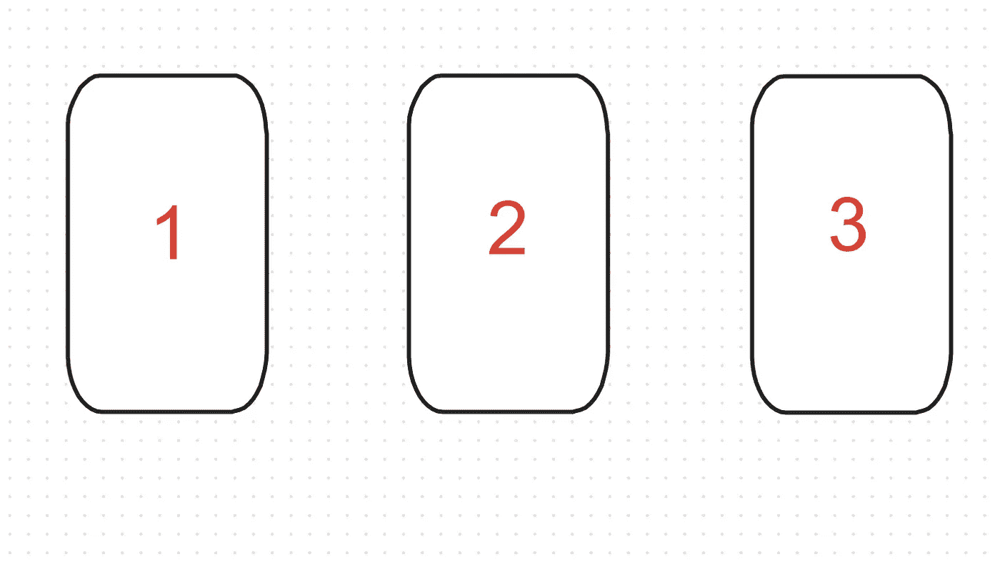
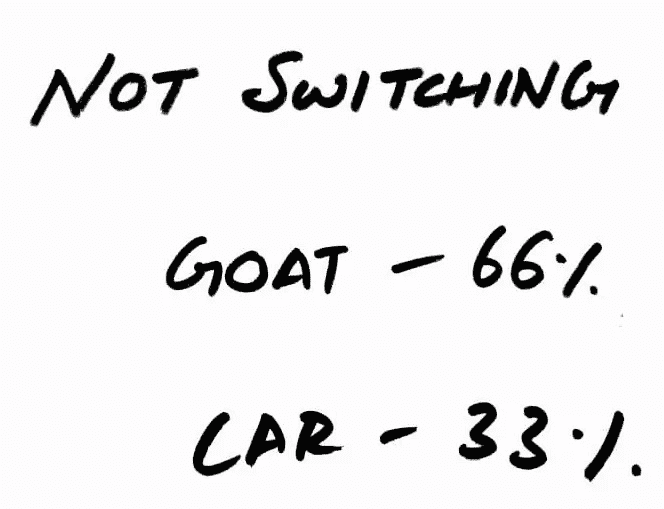
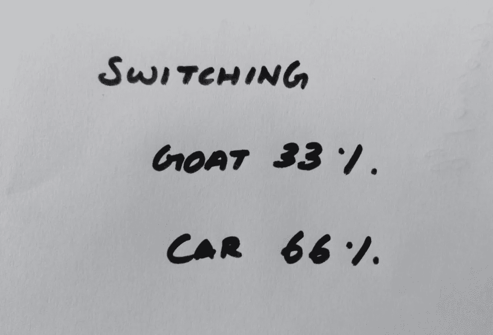
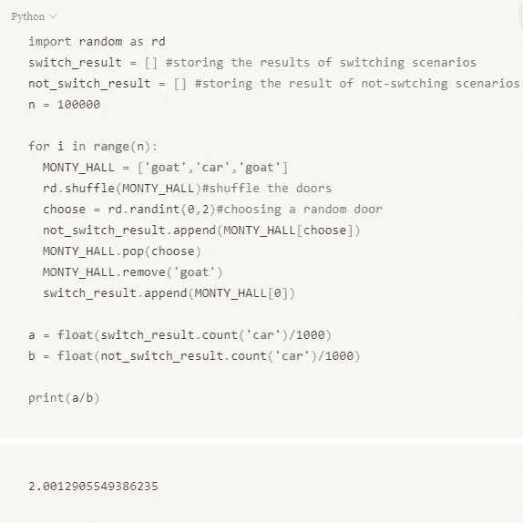

# 困惑数学家的 3 扇门。

> 原文：<https://medium.com/analytics-vidhya/monty-hall-problem-with-python-simulation-4af54fc14737?source=collection_archive---------12----------------------->

大多数时候，我们对现实生活问题的直觉与解决问题的数学方法是一致的，但有时当数学方法说不是这样时，它听起来是如此荒谬，以至于人类永远不会相信这种方法，这就是当美国专栏作家 Marilyn vos savant 对一个问题的回答激怒了许多人，包括博士，包括被称为离散数学之父的 T2 保罗·鄂尔多斯 T3。

# **问题:**

”“假设你在参加一个游戏节目，你有三扇门可以选择。一扇门后是一辆汽车，其他几扇门后是山羊。你选了一扇门，比如说 1 号门，主人知道门后有什么，他打开了另一扇门，比如说 3 号门，里面有一只山羊。他对你说，“你想选 2 号门吗？”改变你选择的门对你有利吗？""

玛丽莲的回答是改变是最好的选择，长话短说，她收到了大约 10000 封来自公众和一些著名研究人员的信，要求她收回她的回答。

# 解决方案:

让我们来看两种情况，一种是你会改变选择，另一种是你不会改变选择。

# 非开关:

如果你不切换并必须赢得一辆车，你应该选择一辆车，而主持人显示其中一扇门与此无关，因此有 1/3 ~ 33%的可能性你会选择有车的正确门，2/3 ~ 66%的可能性你会选择有羊的错误门。

# 开关:

因此，为了能够切换并赢得汽车，你应该首先选择错误的门，因此有 2/3 ~ 66%的可能性你会选择错误的门(即后面有山羊的门)，有 1/3~33%的可能性你会首先选择正确的门，然后切换会让你得到山羊。

因此，通过换车门，你赢得一辆车的机会从 33%增加到 66%(也就是说，你的机会增加了一倍)。

所以如果你仍然不相信这是一个有 100 扇门的相同场景。假设你随机选择其中一扇门。你跟车选门的几率是 1 / 100 也就是 1%。然后，主持人向你展示 98 个包含山羊的门，只留下你的第一个选择和一个未打开的门，所以我们知道其中一个包含奖品，另一个包含山羊。

你仍然认为，在这种情况下，你只有 50%的机会通过切换或不切换获胜，因为还有两个未显示的门？你觉得你换一个还是留在原来的选择会更好？

通过改变你的选择，你有额外的 98%的机会获得奖励(意味着通过改变你有 99%的机会获得奖励)，而你的第一个选择仍然只有 1%的机会是正确的。

你可以在家里玩这个游戏大约 100 次来验证这个结果，但是这可能很乏味，所以让我们运行一个 python 命令来模拟这个游戏 n 次。

所以从长远来看，你赢得这辆车的机会将会增加一倍。

我建议你阅读这本优秀的书[* *酒鬼的行走:随机性如何统治我们的生活](https://www.google.com/search?gs_ssp=eJzj4tZP1zc0MjQrssiJN2D0ksvIL1coSsxLyc_NSy0uVigqzUktVsgvLVLIySxLLQYAQ4APXw&q=how+randomness+rules+our+lives&oq=how+randomness&aqs=chrome.1.0i355j46j69i57j0j0i22i30l5j0i10i22i30.5840j0j4&sourceid=chrome&ie=UTF-8) **这本书涉及了很多话题，如博弈论、概率等。