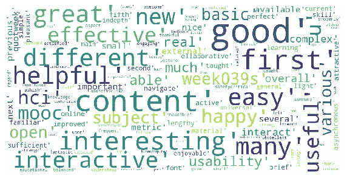

# MOOC 课程用户反馈的情感分析

> 原文：<https://medium.com/analytics-vidhya/mooc-feedback-sentiment-analysis-6491507e2eb4?source=collection_archive---------32----------------------->

在这个项目中，我们对 MOOC 课程的用户反馈进行了分析，对原始反馈数据进行了预处理，进行了情感分析，并使用 wordcloud 和 simple piechart 对其进行了可视化

我们首先导入必要的库，比如用于文本处理的 pandas、re 和 nltk，用于可视化的 wordcloud 和 matplotlib

```
import pandas as pd
import nltk
import re
from nltk.stem import WordNetLemmatizer
from nltk.corpus import stopwords
from wordcloud import WordCloud, STOPWORDS
import matplotlib.pyplot as plt
```

然后，我们导入 csv 格式的数据集。我们只取数据集的反馈列。它有 102 条独特的评论。

```
df = pd.read_csv('feedback_week1.csv').iloc[:,0:1]df.Feedback.nunique()102df.isnull().sum()Feedback    0
dtype: int64
```

## 数据预处理

我们通过将整个反馈的大小写改为小写、特殊字符、移除停用词、移除换行符来执行数据清理。我们还使用词汇化进行进一步的数据预处理。

```
# change to lowercase
df['Feedback'] = df['Feedback'].apply(lambda x: " ".join(x.lower() for x in x.split()))
# special character
df['Feedback'] = df['Feedback'].str.replace('[^\w\s]','')
## remove stopwords
stop = stopwords.words('english')
df['Feedback'] = df['Feedback'].apply(lambda x: " ".join(x for x in x.split() if x not in stop))## regular expression cleanup

REPLACE_NO_SPACE = re.compile("[.;:!\'?,\"()\[\]]")
REPLACE_WITH_SPACE = re.compile("(<br\s*/><br\s*/>)|(\-)|(\/)")
NEW_LINE_REMOVE = re.compile("\n")

def preprocess_reviews(reviews):
    reviews = [REPLACE_NO_SPACE.sub("", line.lower()) for line in reviews]
    reviews = [REPLACE_WITH_SPACE.sub(" ", line) for line in reviews]

    return reviews

df['Feedback'] = preprocess_reviews(df['Feedback'])
```

## 词汇化

```
def get_lemmatized_text(corpus):
    lemmatizer = WordNetLemmatizer()
    return [' '.join([lemmatizer.lemmatize(word) for word in review.split()]) for review in corpus]

df['Feedback'] = get_lemmatized_text(df['Feedback'])
```

## 常用词

然后我们找到最常用的单词列表

```
most = pd.Series(' '.join(df['Feedback']).split()).value_counts()[:10]
mostweek           47
content        46
hci            36
course         28
learning       28
interesting    26
system         25
video          23
1              22
mooc           21
dtype: int64
```

## 词云

我们使用词云来可视化用户给出的反馈。这可能是了解反馈意见的方法之一。

```
stopwords = set(STOPWORDS)
def show_wordcloud(col, title = None):
    wordcloud = WordCloud(
        background_color='white',
        stopwords=stopwords,
        max_words=500,
        max_font_size=40, 
        scale=3,
        random_state=1
    ).generate(str(col))

    fig = plt.figure(1, figsize=(10, 10))
    plt.axis('off')
    if title: 
        fig.suptitle(title, fontsize=10)
        fig.subplots_adjust(top=2.3)

    plt.imshow(wordcloud)
    plt.show()

show_wordcloud(df['Feedback'])
```


## 使用的形容词

我们还只过滤了形容词，以获得更多关于反馈的信息。我们列出了反馈中最常用的形容词

```
feelings = []
for sentence in df['Feedback']:
    for word, pos in nltk.pos_tag(sentence.split()):
        if pos in ['JJR', "JJ", "JJS"]:
            feelings.append(word)most = pd.Series(' '.join(feelings).split()).value_counts()[:10]
mostgood           18
content        13
first          11
interesting    11
helpful        10
different       9
new             9
many            8
easy            8
great           7
dtype: int64
```

## 情感评分

对于情感评分，我们使用 VADER(价感知词典和情感推理机)。这是一个基于词典和规则的情感分析工具。它给出情感评分，因此在处理社交媒体文本和评论(如电影评论和产品评论)时非常成功。

```
nltk.download('vader_lexicon')
from nltk.sentiment.vader import SentimentIntensityAnalyzer

#load in the sentiment analyzer
sia=SentimentIntensityAnalyzer()

#apply the analyzer over each comment
df['polairty scores'] =df['Feedback'].apply(lambda x: sia.polarity_scores(x)['compound'])[nltk_data] Downloading package vader_lexicon to
[nltk_data]     /home/bibhuti/nltk_data...
[nltk_data]   Package vader_lexicon is already up-to-date!def sentiment(score):
    if score<0 :
        return "Negative"
    elif score<=0.5:
        return "Neutral"
    elif score>0.5:
        return "Positive"sentiment_list=[]
for a in df['polairty scores']:
    sentiment_list.append(sentiment(a))
df['Sentiment']=sentiment_listdf['Sentiment'].value_counts().plot(kind="pie")
plt.show()
```


```
df_positive=df[df.Sentiment=='Positive']
df_negative=df[df.Sentiment=='Negative']
```

我们用最常用的肯定/否定形容词来形象化它们。

```
def feelings_func(df):
    feelings = []
    for sentence in df['Feedback']:
        for word, pos in nltk.pos_tag(sentence.split()):
            if pos in ["JJ"]:
                feelings.append(word)
    return feelingspostive_feeling = feelings_func(df_positive)
negative_feeling = feelings_func(df_negative)
all_feeling = feelings_func(df)
```

## 可视化所有反馈

```
show_wordcloud(feelings)
```


## 反馈中描述形容词的积极情绪的词云

```
show_wordcloud(postive_feeling)
```



## 负面情绪词云表示反馈中的形容词

```
show_wordcloud(negative_feeling)
```


## 参考

*   [https://medium . com/analytics-vid hya/simplified-social-media-sensition-analysis-using-Vader-in-python-f 9 e 6 EC 6 fc 52 f](/analytics-vidhya/simplifying-social-media-sentiment-analysis-using-vader-in-python-f9e6ec6fc52f)
*   [https://towards data science . com/感伤-分析-使用-维德-a3415fef7664](https://towardsdatascience.com/sentimental-analysis-using-vader-a3415fef7664)