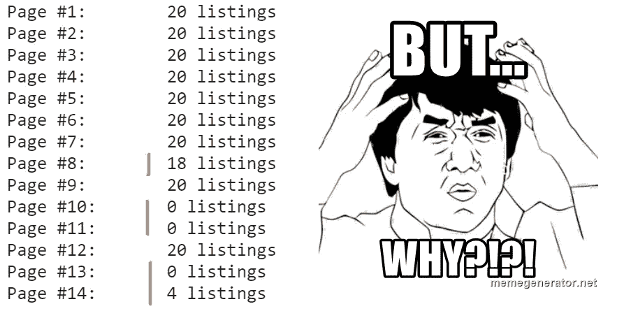
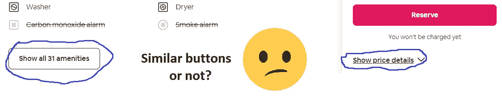
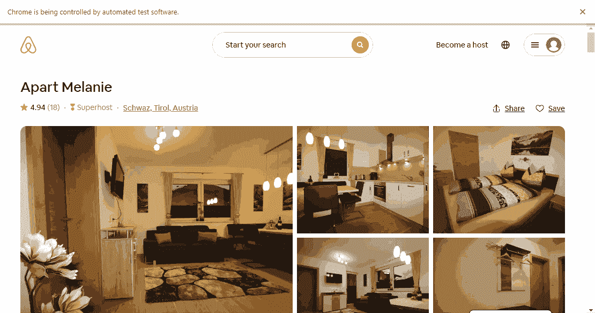
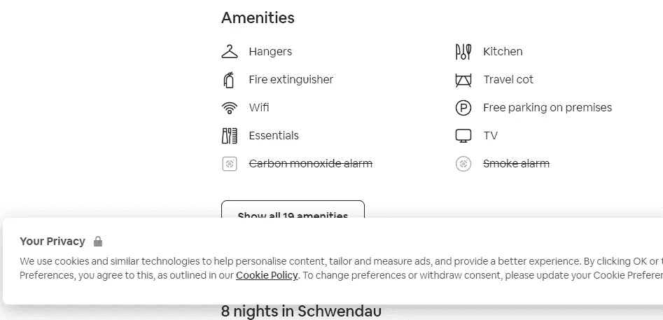

# 使用 Python 和 Selenium 进行 Web 抓取的更多细节

> 原文：<https://medium.com/analytics-vidhya/more-details-to-web-scraping-with-python-and-selenium-c32ac614c558?source=collection_archive---------4----------------------->

## 本文是教育数据科学项目的一部分— [Airbnb 分析](https://github.com/x-technology/airbnb-analytics)

*这个想法是使用 Airbnb 网站作为数据源来实现一个示例数据科学项目。请阅读这里的故事:*

```
[Part 0](https://smithio.medium.com/educational-data-science-project-b4f54c7cab19) - Intro to the project
[Part 1](https://smithio.medium.com/scraping-airbnb-website-with-python-beautiful-soup-and-selenium-8ec86e327b6c) - Scrape the data from Airbnb website
[Part 2](https://smithio.medium.com/more-details-to-web-scraping-with-python-and-selenium-c32ac614c558) - More details to Web Scraping **(this article)** Part 3 - Explore and clean the data set
Part 4 - Build a machine learning model for listing price prediction
Part 5 - Explore the results and apply the model
```

# 介绍

在写完《T4》的第一个版本之后，我花了一些时间来测试这个脚本，并探索它的工作效果如何。我们发现了几个问题，今天我将讲述如何解决这些问题。

*   **问题# 1**——有时什么也没刮到
*   **问题#2** —突然超时
*   **问题#3** —按钮，不是按钮
*   **问题#4** —元素不在视窗中
*   **问题#5** —细节页太厚
*   **问题#6** —该死的 cookie 弹出窗口
*   **问题#7** — Airbnb 在玩我

# 期望管理

还有什么比抓取网页更容易的呢？我们很聪明，可以把我们的想法写在一个脚本里:

> ***第一步*** *—获取链接*
> 
> ***第二步*** *—发送获取请求*
> 
> ***第三步*** *—用 BeautifulSoup 处理答案*
> 
> ***第四步*** *—利润*

好的。

好的。但是如果…

O 你的结果不一致？

需要的页面元素隐藏在按钮和弹出窗口下面？

G et 请求超时？

在这一点上，人们意识到刮它不再是一件容易的事情。

那是几周前的我—😭。但是我没有投降—🐱‍👤。开始了持续改进的漫长旅程。

> 对了，别跟我一样。别再追求完美了。记得关于[帕累托 80-20 原理](https://en.wikipedia.org/wiki/Pareto_principle)。

# 问题 1。有时什么也没刮到

我对自己的编程技能不是很有信心。正因为如此，我有一个习惯，就是把代码分成小块写。我写了 3-4 行，检查它们是如何工作的，如果一切正常，就继续写。遵循这个原则，我编写了一个从 Airbnb 搜索页面中提取列表的函数。

测试时它总是按预期执行，这意味着一个页面返回 20 个单独的清单。但是当我打算一次搜索几个位置时，发现有些页面要么是空的，要么只包含 4-5 个列表。

我花了几天时间探索并试图理解到底发生了什么。老实说，那是相当令人沮丧的一段时间。



## 解决办法

最终我没有找到理由，放弃了，决定用一种非常直白的方式来解决这个问题。更新的函数试图多次抓取页面并返回最佳结果。

# 问题二。突然超时

默认情况下，来自[请求的 GET 方法](https://requests.readthedocs.io/en/master/) Python 库没有任何超时限制。当我们试图连续访问多个页面时可能会有风险，因为网站肯定不喜欢这样。或许，我们不会马上被禁止，但是对我们请求的响应时间可能会增加。

在某些时候，我们必须等待几十秒钟，因此为了避免这种情况，我们最好引入一些限制。

## 解决办法

首先，我们用一个*超时*参数来限制等待时间:

```
answer = requests.get(page_url, timeout=5)
```

并且利用我心爱的 [Try 和 Except](https://pythonbasics.org/try-except/) 语句，不要在抓取运行过程中出现“连接超时”错误。

```
try:
    answer = requests.get(page_url, timeout=5)
except:
    print(f"Connection timed out for URL: {page_url}")
```

# 问题三。一个按钮，不是一个按钮

当处理动态页面时，我们使用 [Selenium](https://selenium-python.readthedocs.io/) ，它能够模仿真实的用户行为:滚动、点击、输入等。我准备好在这里轻松散步，但没有这样的运气。

生活并没有让我准备好去处理那些看起来并不真实的页面元素。乍一看，我认为“显示设施”和“显示价格细节”的按钮是相似的:你找到它们，点击它们，你得到隐藏的数据。



然而，事实证明，前者更像是一个链接，后者是一个 HTML 标签按钮。

## 解决办法

这不是火箭科学。为了处理这个链接，我们使用 Selenium 命令`click`:

```
element = webdriver.find_element_by_class_name(‘some_id’)
element.click()
```

对于按钮，我们有[动作链](https://selenium-python.readthedocs.io/api.html#module-selenium.webdriver.common.action_chains):

```
ActionChains(webdriver).click(element).perform()
```

# 问题四。元素不在视口中

用户不能点击网页可视区域之外的按钮，所谓的*视窗*。因为 Selenium 模仿真实的用户行为，所以在点击按钮之前，我们必须先滚动页面才能看到按钮。

听起来很容易，但是要正确滚动是一个真正的挑战。不知何故，像`move_to_element`这样的方法不会马上奏效，我们需要多次尝试。



## 解决办法

是的，同样的技术在这里。我们滚动，尝试点击，如果失败了就再滚动一次。我将尝试次数限制在 10 次，但在大多数情况下，尝试次数达到 4 次就已经成功了。

# 问题 5。过多的详细页面

当处理细节页面时，我们必须在开始抓取之前下载大量的图片。这导致了更长的运行时间和更少的抓取数据，因为有时页面在我们的硬编码限制(目前是 20 秒)后仍然没有完全加载。

## 解决办法

好了，我们知道该怎么做了😎。让我们告诉浏览器不要加载图像。问题解决了！

# 问题 6。该死的饼干弹出窗口

如今浏览网页越来越难了。我们必须阅读一堆不同的 cookie 协议，并明确表示同意被跟踪。Airbnb 遵循这一义务，所以我们可能会无意中发现一个意想不到的弹出窗口。



这种意想不到的 cookie 策略可能会干扰点击“便利设施”或“价格详情”按钮。

## 解决办法

在这里只需点击 OK 就足够了。我们只需要确定有东西可以点击。“尝试和例外”语句将再次拯救我们。

> 🎉🎉🎉
> 
> 特别感谢[奥乌兹·埃尔多安](https://medium.com/u/3ad8a8b56263?source=post_page-----c32ac614c558--------------------------------)发现了第五和第六个问题并提出了解决方案。
> 
> 🎉🎉🎉

# 问题 7。Airbnb 在玩我

所有以前的问题都可以用这样或那样的方式解决。最糟糕的情况是，就像问题#1 和#4 一样，强行尝试直到我们成功。但是刮痧有一个方面使我们极易受到变化的影响。

如果 Airbnb 改变了 CSS 样式，我们就完了。而且更正确的说法是“当”，而不是“如果”。自从我开始这个项目~2 个月前，Airbnb 已经推出了一些新的风格，摆脱了旧的。

例如，挂牌价格:

```
old_class = '_1p7iugi'
new_class = '_olc9rf0'
```

在一些 AB 测试中，对于页面的不同版本，经常会有两个(或者更多)版本的样式并行存在。而且我们事先也不知道，登陆的是哪个版本。

**(再)解**

依赖精确的 CSS 类不是长久之计。不幸的是，我还没有找到一个更容易的。但我希望对我们的教育项目来说，这就足够了。

# 最后

Github 上提供了所有脚本:

[](https://github.com/x-technology/airbnb-analytics) [## x-技术/Airbnb-分析

### Airbnb 数据+数据科学。通过在 GitHub 上创建一个帐户，为 x-technology/airbnb-analytics 开发做出贡献。

github.com](https://github.com/x-technology/airbnb-analytics) 

欢迎观看我们的网络研讨会，我们在会上讨论了本文的第一部分— **用 Python 和 Selenium 清理 Airbnb 网站:**

[**https://youtu.be/L8ooiuBnZ8M**](https://youtu.be/L8ooiuBnZ8M)

我们刚刚开始，欢迎加入我们:

*   [推特](https://twitter.com/XTechnology5)
*   [Youtube](https://www.youtube.com/channel/UCQZNnzybEi0vvNbeDB0qABQ)
*   [Eventbrite](https://www.eventbrite.co.uk/o/xtechnology-32181547901)
*   [电报](https://t.me/xtechn)