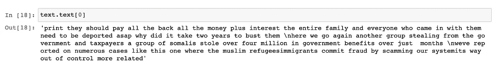
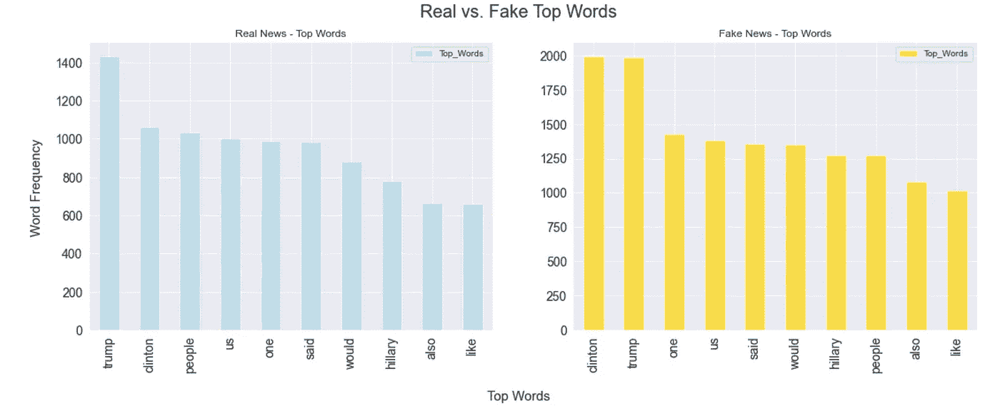
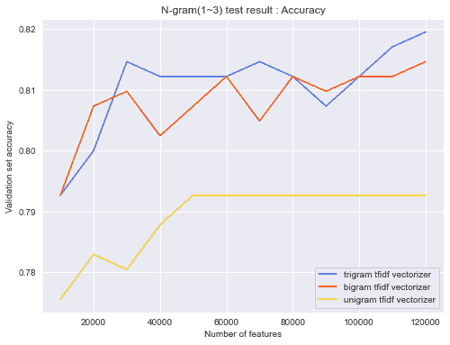
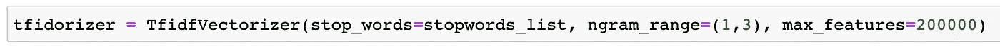
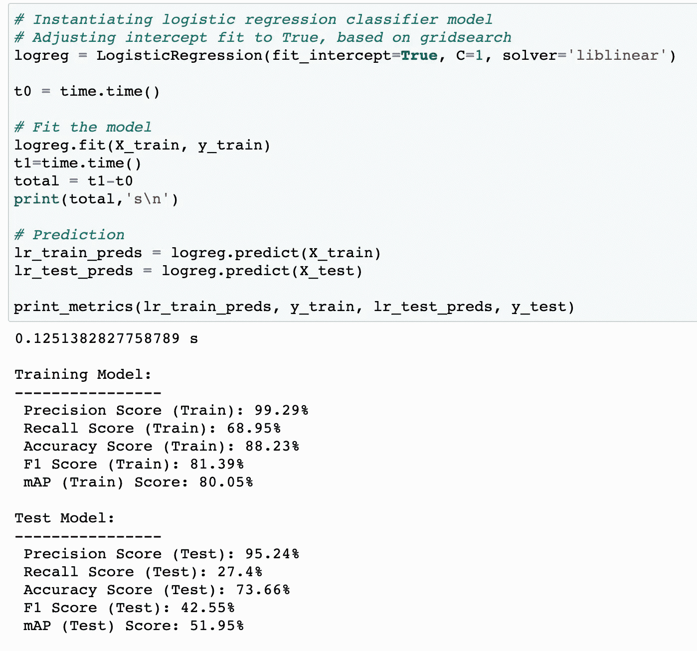
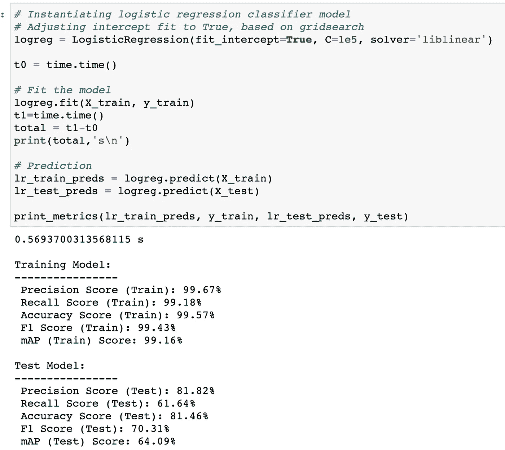
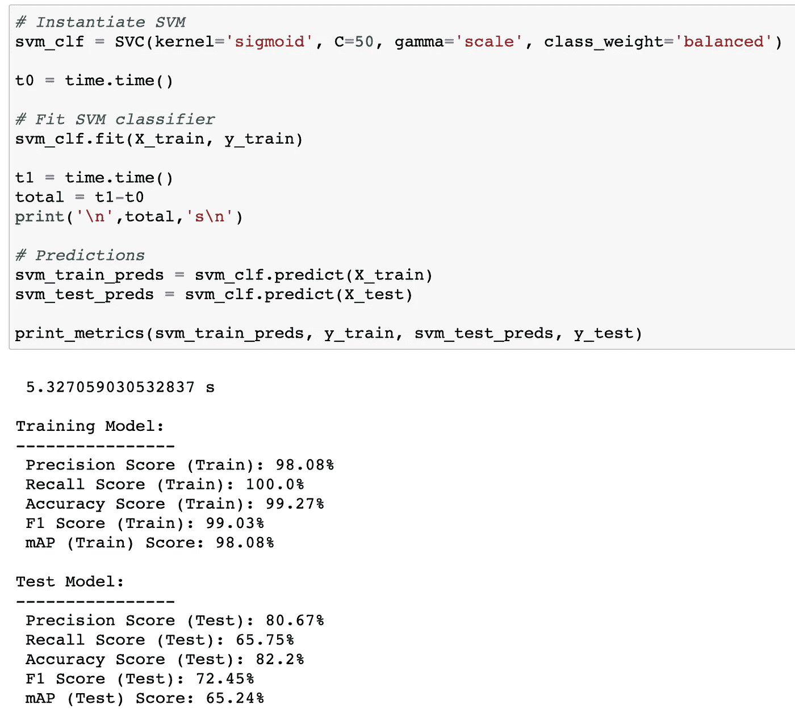

# 更多真实新闻:文本分类

> 原文：<https://medium.com/analytics-vidhya/more-real-news-text-classification-f6b8f417b675?source=collection_archive---------35----------------------->

错误信息和虚假信息是公共领域越来越多的考虑。在过去的 5 年里，我们看到政府、新闻机构和社交媒体公司在努力应对误导性的新闻和社交帖子。随着我们进入 2021 年，就什么是真实和事实达成共识似乎比以往任何时候都更重要。

社交媒体在社会中根深蒂固——数十亿人转向他们的脸书小组、Twitter“主题”专家和其他数字社交渠道获取信息，这些信息塑造了他们对世界的看法。由于一条虚假推文的潜在病毒式传播，错误信息在数百万人眼中可能变成“事实”;这是 21 世纪技术专家必须应对的威胁。

社交媒体公司常用的一种方法是将信息标记为“有争议”或“虚假”。另一个是在事后记下信息。这两者都有负面影响——那些帖子被标记或删除的人更确信他们的信息是真实的。

我决定尝试另一种策略:关注好的方面，少展示坏的方面。为了做到这一点，我比较了各种分类模型，将文本(包括社交帖子和网站新闻)标记为“真实”或“虚假”。目的是找到一个既准确又足够轻量的分类模型，以便在生产案例中使用。

一旦我们有了一个经过训练的分类器，我们可以将它与推荐系统结合起来，将真实和实质性的内容排在虚假和煽动性的内容之上。这是与注意力商品的当前规范的一个关键区别，它经常导致分裂和愤怒(因为这些更好地抓住一个人的注意力)。实际的推荐系统不在本文的讨论范围之内——我需要先吃我的麦粉并开始学习。现在，我们将坚持识别好消息的第一步，这样我们就可以宣传我们更好的天使。

# 数据

数据来源于 Kaggle 的基于来源的假新闻分类。它包含从 244 个网站上收集的文本和元数据，并由丹尼尔·西拉德斯基标记为 BS Detector Chrome 扩展。

注意:我们将在由分类算法标记的数据上训练我们的分类器。在理想的情况下，我们将拥有由专家手工标注的大型数据集。

文本数据最初是用显示真实文本数据与伪造文本数据的差异的可视化来探索的。由于 NaN 值，大约 50 行被删除，留给我们 2050 行文本。然后通过各种 NLP 技术处理数据，包括停用词移除、标记化和使用 TF-IDF 的矢量化。存在 2/3‘假’对 1/3‘真’的阶层失衡。最初，这种不平衡被保留了下来。后来，SMOTE 被开发出来，尽管没有任何全面的改进。使用 TruncatedSVD 进行降维也有类似的经历。

频率分布分析:

接下来，采用 20%测试规模的训练测试分割。我们的因变量是带标签的数据列，其中 1 是真的，0 是假的(使用 LabelEncoder 更改)。经过处理的文本数据用于 300，000+列的解释变量。使用 Sci-Kit Learn 的 TF-IDF 矢量器，创建了三元模型，并测试了字数限制，最佳结果为 200，000。现在我们已经准备好建模了…

# 建模

为了对我们的文本数据进行分类，研究了七种分类器模型:

1.  逻辑回归
2.  决策图表
3.  高斯朴素贝叶斯
4.  随机森林
5.  梯度推进
6.  XGBoost
7.  SVM-Sigmoid &线性核

模型性能基于各种指标进行评估，包括准确度、精确度、召回率、F1 分数和平均精确度。此外，我们还考虑了计算速度，因为我们的模型在生产中的可行性将取决于我们运行该模型的速度。在我们的业务问题的例子中，一个帮助分类文本的模型，以便真实的新闻在推荐系统中上升到顶部，精确度似乎是最重要的。

在我们的例子中，精确意味着我们标记为真实的新闻是真正真实的(几乎没有假阳性)。验证错误信息是危险的，比完全没有信息更糟糕(对鸣人大声喊出来——假期里和我的小妹妹一起看)。

# 调查的结果

一对夫妇的模型作出了最后的削减，并值得在一个更大的系统的背景下进一步探讨。这些包括逻辑回归，因为它的速度和精确的过度索引(这可能被证明是一个福音)。另一个模型是使用 sigmoid 内核的 SVM。它运行速度相对较快，具有最高的准确性，并且在准确性和召回率之间有较好的平衡。

# 1.逻辑回归:

## 为了精度而过度索引

## 最高的准确性和 F-1 分数

# 2.SVM-Sigmoid 核

## 最高的整体准确性和 F-1 分数

如前所述，根据上下文和首要目标，这些模型中的每一个都可以被选为顶级模型。逻辑回归的优势在于它的速度和最小的计算复杂度。根据参数调整，逻辑回归具有最高的精度(95.2%)，虚假新闻被标记为真实的，或者在任何模型(即使是花哨的系综模型)中具有第二高的总体精度(81.5%)和 F1 得分(70.3%)。

使用 Sigmoid 内核的 SVM 在准确性(82.2%)和 F1 分数(72.5%)方面表现最佳，计算时间仅超过 5 秒。准确度提高 0.70%值得多花 4.7 秒计算时间吗？嗯，我认为这个问题可能超出了我的工资级别，但我会说没有。这意味着获胜的模型(我几乎选择甚至不去打扰)是伟大的新闻分类马拉松的获胜者。

# 结论

解决数字时代的错误信息是技术社区成员面临的最重要的挑战之一。我对分类的短暂探索让我明白了这个问题有多困难。一方面，我们必须在当今的注意力经济中创建分类器和推荐系统，其中包含大量基于文本的信息。另一方面，我们必须记住，我们做出的任何决定都有微妙的后果——如果你选择只优化上升到顶部的真实新闻，当它们实际上是真实的时，被分类为虚假的帖子会发生什么？更进一步，在什么情况下，我们通过推送帖子侵犯了第一修正案的权利(即使是恶意的)？

最后，我们创建了一个模型，能够在大约半秒钟内以 81.5%的准确率将新闻文本分类为假或真。就个人而言，这是解决网络上虚假信息问题的第一步，同时扩展了我对 NLP 和这个问题的模糊水域的了解。

同样，我们的目的是将这种分类器与推荐系统结合使用。通过这种方式，分类器在站点之外，允许真实的新闻(即使有偏见)上升到提要的顶部。这是一种不同于其他选择在事后给帖子贴上警告标签或追溯删除的方法——这两种方法都会引起愤怒，并进一步巩固用户的信念。

顺便提一下，最好的解决方案可能是创建多个分类器来处理不同的主题，并增加对有可能产生重大影响的信息的关注。

特别感谢来自火影忍者的 Ibiki Morino 为这个项目提供的中肯的灵感。

“虚假信息往往比完全没有信息更糟糕……”——鸣人伊比奇·森野

