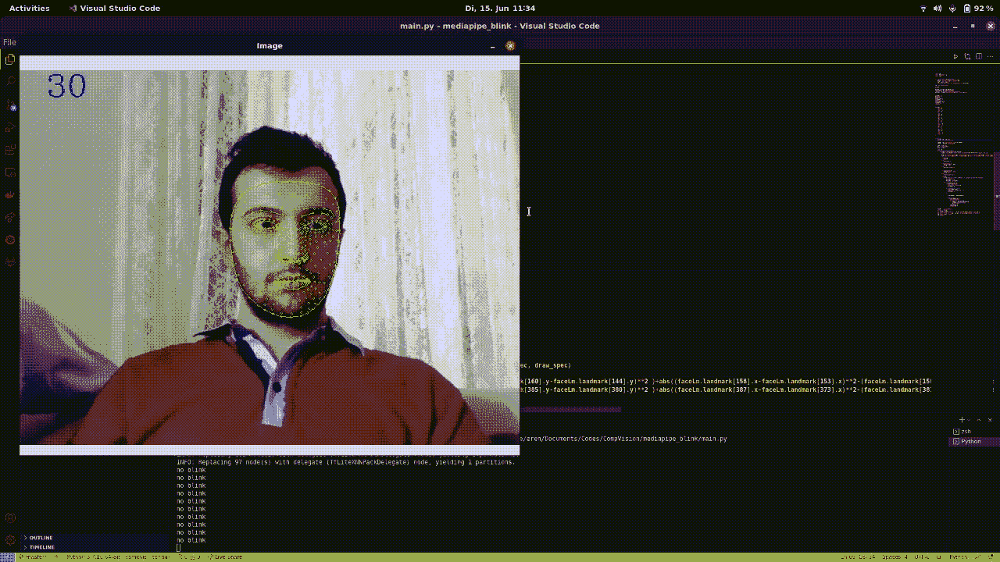
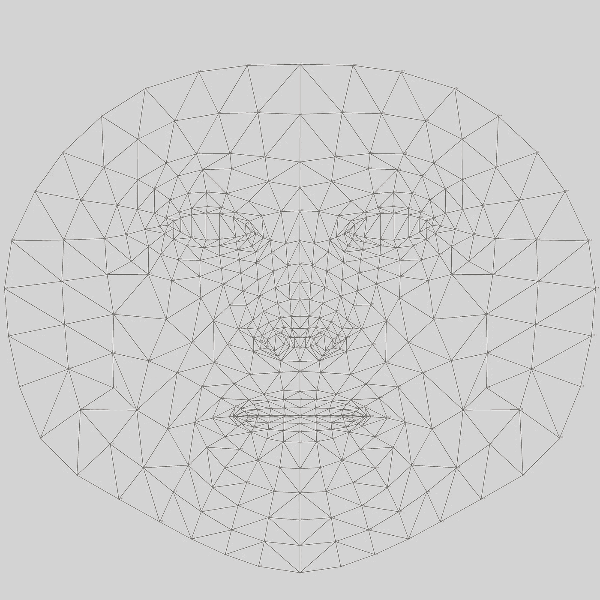
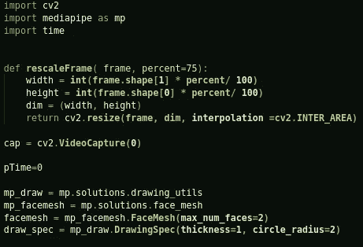
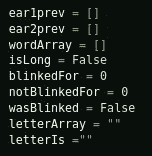
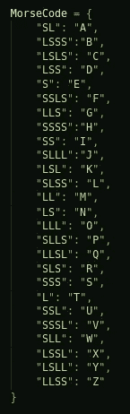
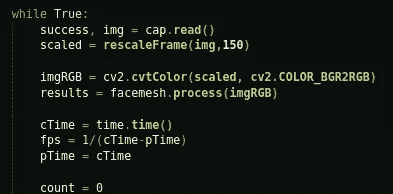
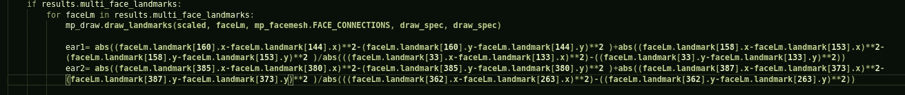
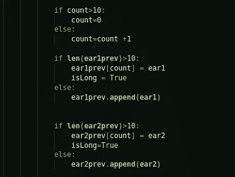
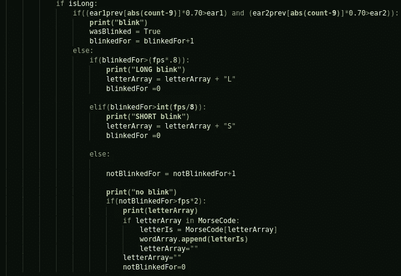
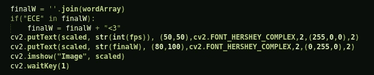

# 莫尔斯电码转换器检测闪烁——Python、OpenCV、MediaPipe

> 原文：<https://medium.com/analytics-vidhya/morse-code-translator-with-python-opencv-and-mediapipe-886e3bd973c5?source=collection_archive---------2----------------------->

2021 年 6 月 15 日

大家好，

距离我上一次发布教程已经有一段时间了，或者说是一般的东西。基本上生活发生了，我决定不分享，而不是分享低质量的内容。今天，我将带你完成一个计算机视觉项目，它将你的实时视频输入转换成莫尔斯字母表，这样你就可以忽短忽长地眨眼来写信息。

该项目的源代码是[这里](https://github.com/eren23/mediapipe--morsecode-translator)，我也用[这个](https://www.youtube.com/watch?v=V9bzew8A1tc&t=141s)牛逼教程作为锅炉板开始，如果你想了解更多关于计算机视觉应用你可以从我发布的链接查看频道所有者的频道。所以，事不宜迟，让我们开始吧。

作为开始，我想解释一下 MediaPipe 库，“MediaPipe 为直播和流媒体提供开源的跨平台、可定制的 ML 解决方案。”这个定义来自他们自己的[网站](https://mediapipe.dev/)，并且简单明了地解释了你可以用这个库做什么，他们提供了几个可以在不同平台上运行的其他解决方案，我将在以后的不同帖子中解释它们。我们今天将使用的功能称为“面部网格”，这个解决方案为我们提供了一个面部标志地图，其中包含了可以在人脸上看到的最重要的 468 个标志。使用该地图，我们将计算面部某些特定点之间的比率，利用该信息，我们将检测相机上的人是否眨眼。

面部标志

在上面的图片中，你可以看到我之前提到的观点，通过这种方式访问人脸的标志，你可以进行各种与面部表情相关的检测，另一个很酷的内置库是 [OpenFace](https://github.com/TadasBaltrusaitis/OpenFace) 你也可以查看该库。

为了能够检测眼睛是否眨眼，我们使用代表“眼睛纵横比”的“耳朵”比率来计算眼睛的“耳朵”值，我们需要访问一个人面部的 6 个标志。你可以从链接[这里](https://hackaday.io/project/27552-blinktotext/log/68360-eye-blink-detection-algorithms)看到“耳”是如何计算的，以及我们需要哪些地标。

现在让我们继续编码部分；首先，我们需要进口我们需要的东西。我还定义了一个函数来调整帧的大小。我们首先定义一个先前的时间变量来检测稍后的 FPS，然后为了定义绘图对象以便我们可以在界标之间绘图，我们创建 FaceMesh 对象，最后我们编辑我们的绘图规范。

进口和实用工具

然后，我们定义 2 个数组来保存旧的 ear 值，1 个数组来保存字母，1 个 bool 来保存长信号，1 个数组来保存闪烁持续时间，1 个数组来保存不闪烁的容限，1 个数组来保存闪烁的容限，1 个字符串来保存 Morse 代码字符串，最后一个数组来保存找到的字母。

变量

保存莫尔斯字母表的字典。

莫尔斯电码字母表

我们项目的主循环，读取源图像，将输入放大 50%，从 OpenCV 的 BGR 转换为 RGB，因为这种形式需要从 MediaPipe 获得，然后我们通过获取当前时间并用当前时间和先前时间的差除以 1 来计算 FPS。

主循环、FPS 计算、图像准备

如果每个界标都有界标，首先画出界标之间的连接，然后计算耳值。

EAR 值计算

如果计数大于 10，则使其为零，否则递增 1。如果以前的 ear 数组长于 10，则用新的 ear 值更改当前元素，并使 long check 为真。

旧耳朵比较

如果是 long，并且当前 ear 值为 9 个旧 ear 值，则检查保持，检测闪烁并在 else 内将“blinkedFor”增加 1，如果闪烁长于 0.8 秒，则将其计为 L(长)，否则计为 S(短)，否则将未闪烁时间增加 1，如果未闪烁持续时间长于 2 秒(FPS 的 2 倍)，如果我们在 MorseCode 中找到的字母，则将其添加到字母数组，如果不只是清除数组。

主莫尔斯电码检查

然后，最后把找到的数组，变成字符串，然后放到页面上，一个小小的惊喜，如果文本中有我女朋友的名字(Ece ),它会自动把❤加到末尾。:D

展示结果

就这些了，我希望这个教程简单易懂并且有趣。这次我会继续定期发布，没有时间限制，希望下次能见到你。:)

*最初发表于*[*【https://blog.akbuluteren.com】*](https://blog.akbuluteren.com/blog/morse-code-translator-using-camera-feed-and-blinks)*。*