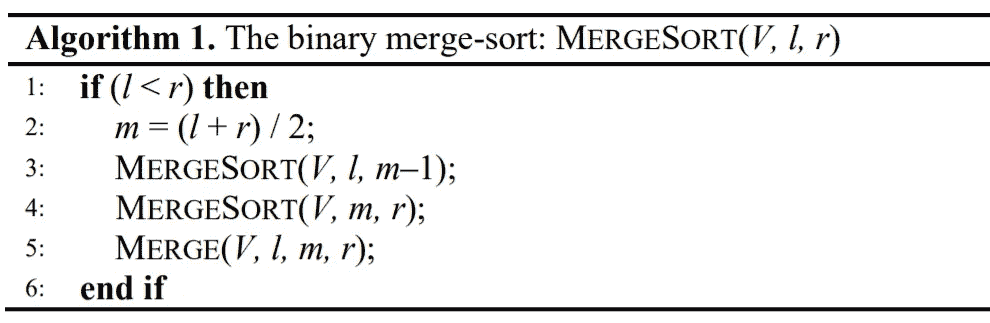
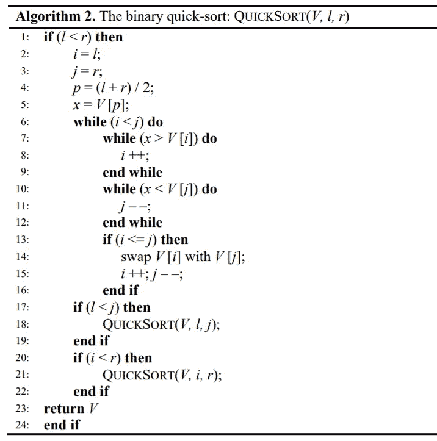

# Mergesort & Quicksort:简单的 Python 实现。

> 原文：<https://medium.com/analytics-vidhya/most-famous-ready-to-use-sorting-algorithms-in-python-7f0e5dfca975?source=collection_archive---------1----------------------->

图片来自 [Crio。做](https://www.crio.do/blog/top-10-sorting-algorithms/)

我知道你现在在想什么:使用`sort()` Python 方法是一个如此快速简单的选择。为什么我要从头开始实现排序算法？

如果你是一名计算机科学的学生，或者如果你只是想学习编程，没有比把手弄脏更好的理解代码的方法了。你越是尝试自己的实现，它的功能就越会留在你的脑海中。算法对你来说将不再有秘密。

然而，作为一个有 7 年研究算法经验的计算机科学家，我知道从头开始编写自己的代码一点也不容易。出于这个原因，在本文中我想推荐一些最著名的**排序算法的最简单的实现(用 Python)。**对于每一个，我首先介绍伪代码(作为一个开始的框架，以防你喜欢用其他编程语言构建自己的实现)，然后我推荐一个现成的 Python 代码，你可以立即复制和测试。

 [## 排序算法(适用于 RAM 型号)

### DILETTAGOGLIA 回复的 Python

replit.com](https://replit.com/@DILETTAGOGLIA/Sorting-algorithm-for-RAM-models) 

> ⬆⬆⬆:这是我的 repl 的链接，在这里你可以找到并尝试本文中所有的实现！

我真的希望这对你理解和体验编码有所帮助。

我们开始吧！

# 前提:符号和辅助功能。

*   ***V*** 是要排序的数组
*   ***n*** 是数组中的项数
*   ***l*** 和 ***r*** 分别是左右指针
*   ***swap*** 是将数组**中的两个项目 ***i*** 和 ***j*** 互换(即同时赋值两个值)的辅助程序，定义如下:**

**辅助程序“交换”**

# **1.合并排序**

****

**维基百科中的 GIF 合并排序**

## **伪代码:**

****

**按作者合并排序伪代码**

**Mergesort 是一个基于 [**除法&征服**范式](https://en.wikipedia.org/wiki/Divide-and-conquer_algorithm)的**递归**算法。**

**步骤 1 检查要排序的数组是否至少包含两项，否则它已经被排序，不需要做任何事情。如果条目至少有两个，它将输入数组 *S* 分成两半，然后在每一部分上递归。当递归结束时，两半 *S[l，m -1]* 和 *S [m，r]* 被排序，以便步骤 5 通过调用过程`merge`在 *S[l，r]* 中融合它们。这个合并步骤需要一个大小为 *n* 的辅助数组(在我们的实现中我们称之为`temp`),因此 **MergeSort 不是一个就地排序算法**(不像 Heapsort 和 Quicksort)而是需要 O( *n* )的额外工作空间。假设，在每次递归调用时，我们将待排序的输入数组的大小减半，那么**递归调用的总数为 O(log *n* )** 。**

**通过使用两个指针 *i* 和 *j* ，可以在 O( *r - l+1* )时间内执行`merge`过程，这两个指针开始于两个半部分*S【l，m-1】*和*S【m，r】*的开始处。然后将 *S[i]* 与 *S[j]* 进行比较，在融合序列中写出较小者，并将其指针前移。假设每次比较前进一个指针，总步数的上限是指针前进的总步数，上限是 *S[l，r]* 的长度。所以 MergeSort( *S，1，n* )的**时间复杂度**可以通过递推关系 T(*n*)= 2T(*n*/2)+O(*n*)= O(*n*log*n*)来建模。**

## **实施:**

# **2.快速排序**

****

**维基共享的快速排序 GIF**

## **伪代码:**

****

**作者的快速排序伪代码**

**关键思想是**将**输入数组 *S[i，j]* 分成两部分，使得其中一部分包含的项目小于(或等于)后一部分包含的项目。这种划分是保序的，因为在两次递归调用后，不需要后续步骤来重新组合有序片段。通常，通过选择一个输入项作为中枢，并根据所有其他输入项是否小于/大于中枢，将它们分配到两个子数组中，来实现分区。与轴心相等的项目可以存储在任何地方。在伪代码中，为了简单起见，强制主元大约出现在要排序的数组的中间(步骤 4)。**

**请注意，为了实现快速排序的执行效率，我们应该注意两个形成的片段的大小之间的比率，因为它们越平衡，快速排序就越接近 Mergesort
，从而接近 O( *n* log *n* )的**最优时间复杂度**。在完全不平衡分区的**(最坏)情况**下，其中一个块可能为空(即 *p* = *i* 或 *p* = *j* )，快速排序的时间复杂度为 O( *n* )。**

## **实施:**

**我真的希望这对你有所帮助。如果你喜欢这篇文章，请支持我👏🏻。谢谢，享受你的算法之旅！**

# **参考资料:**

*   **页（page 的缩写）费拉吉娜，*算法的魔力！*，比萨大学，2020 年**
*   **F.Romani，*Elementi di algoritimica con esercizi svolti ed esempi in Phyton，* 第二版，比萨大学出版社，2017 年**
*   **托马斯·h·科尔曼，查尔斯·e·莱瑟森，罗纳德·L·李维斯特，克利福德·斯坦，*算法导论，第三版，麻省理工学院出版社，2009 年***