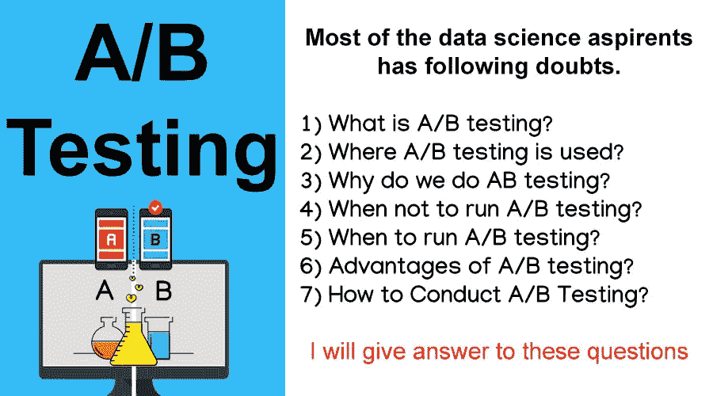
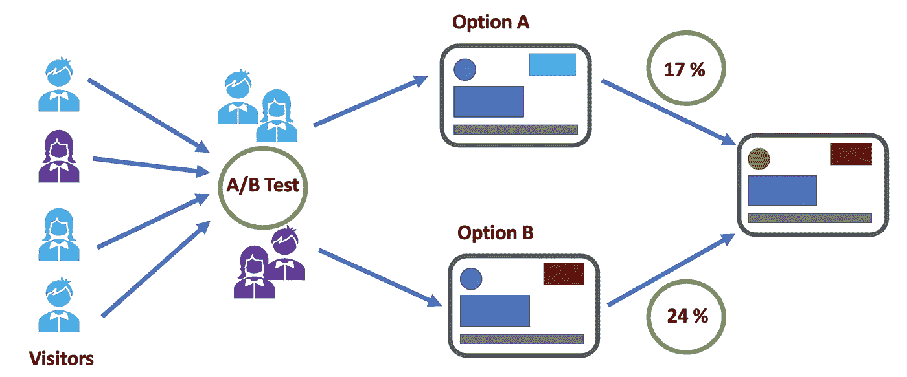
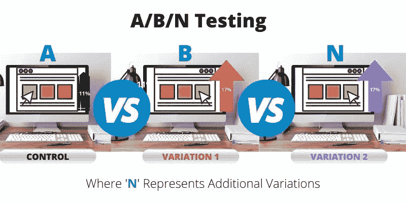
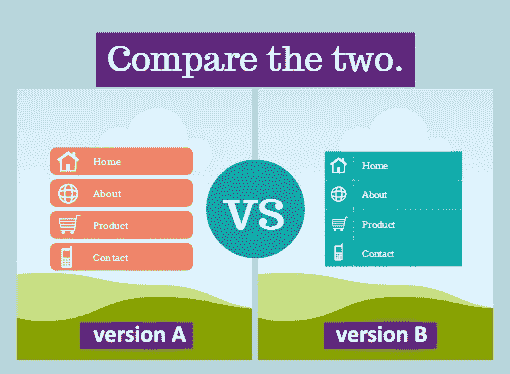
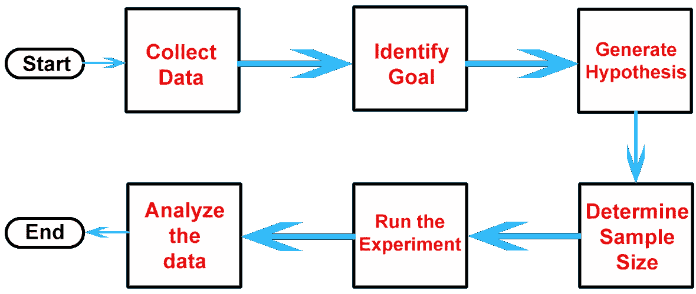
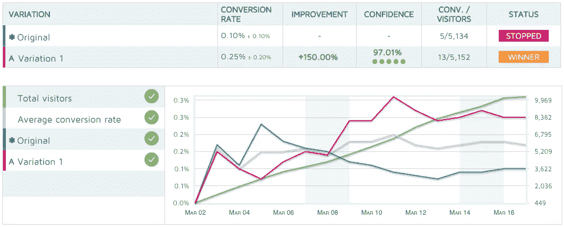
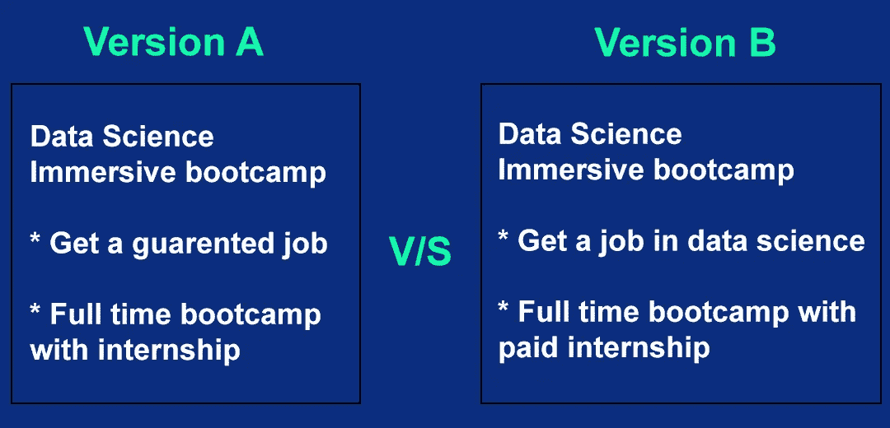
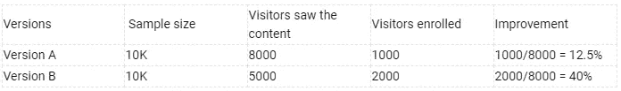

# 数据科学有志者对 A/B 测试心存疑虑

> 原文：<https://medium.com/analytics-vidhya/most-frequent-doubts-of-data-science-aspirants-regarding-a-b-testing-f5bc7a6fe98f?source=collection_archive---------7----------------------->

一步一步，初学者友好的教程 A/B 测试的数据科学有志之士。

> 在本文中，我们将讨论什么是 A/B 测试？，在这里您可以实现数据科学中 A/B 测试的更多关键概念。

在过去的十年里，数据科学已经成为解决商业问题的一种流行而有效的技术。业务问题之一是“用户是否会喜欢新版本？”例如，如果你为用户开发了应用程序，后来你想在应用程序中集成一个新功能，但你对此没有把握，所以你想决定是否推出该功能。在这里，你可以接受用户的输入，不管他们是否想要一个新功能，这样你就可以获得更多的流量。

现在这个问题可以通过进行一个实验/测试来解决，这个测试被称为 [A/B 测试](https://en.wikipedia.org/wiki/A/B_testing)。我们开始吧。

[图片作者:Panwar Abhash Anil](https://www.linkedin.com/in/panwar-abhash-anil/)

# 什么是 A/B 测试？

[图片来源:谷歌](https://miro.medium.com/max/3568/1*aPUSwnuyUsxF_ACHuxiDlA.png)

A/B 测试是一项随机实验，旨在比较某样东西(网页、图片等)的两种变体/版本(A 对 B)。)来根据用户体验确定哪种变体对于给定的转换目标表现得更好。

它也被称为拆分测试，其中您将用户随机分为控制组和处理/变化组，其中一个版本被显示/给一个组，另一个版本给另一个组，然后根据用户输入，您确定哪个版本更好或执行得更好。

在统计学中，A/B 检验是统计[假设检验](https://en.wikipedia.org/wiki/Statistical_hypothesis_testing)的一个例子，这是一个对两个数据集之间的关系做出假设，然后将这些数据集相互比较，以确定是否存在统计意义上的显著关系的过程。

# A/B 测试的变体:

[图片来源:谷歌](https://www.convert.com/wp-content/uploads/2020/10/A_B-Testing-Ultimate-Guide-3.jpg)

A/B 测试是比较两个版本，但是如果要比较两个以上的版本呢？

但是作为一个数据科学家，有时候我们要测试两个以上的版本。如果你测试三个版本，那么这个测试将被命名为 A/B/C 测试。一般来说，对于 n 个版本，会是 A/B/n 测试。程序将与 A/B 测试相同。

# 在哪里使用 A/B 测试？

[图片来源:谷歌](https://cdn-s.omniconvert.com/upload/content/images/2014-05-14_1145.jpg)

对于 A/B 测试，实验者需要用户的输入来做实验，而[网页](https://en.wikipedia.org/wiki/Web_page)是做实验的在线方式。你可能会想，你也可以去找个人用户获取输入，是的，你可以这样做，但通过这种方式，你的样本量会太小。因此，你的样本不可能等于真实人口。

它有助于做出决策，因为它基于样本统计来估计总体参数。

# 为什么数据科学家要做 A/B 测试？

A/B 测试帮助组织避免不必要的风险，允许他们将资源用于最大效果和效率。此外，它还帮助他们选择最佳版本的产品(最佳网页、最佳图片、最佳营销推广内容等)。)

# 你应该多长时间进行一次 A/B 测试？

为了获得有代表性的样本数据并保证数据的准确性，专家建议至少进行一到两周的 A/B 测试。

# 何时不运行 A/B 测试？

1.  当样本量很小时:当你没有足够的有意义的流量时。
2.  如果你还没有一个可靠的假设:确定你的问题。定义一个假设。然后测试你是否正确。比如问题陈述:当前推广内容做的不好。假设:-如果我添加更多的视觉效果，那么会有更多的人关注它。
3.  如果你不能花时间:假设你可以做实验但如果你不能花时间分析数据或测试假设，做 A/B 是没有用的。

# 何时运行 A/B 测试？

1.  当样本量较大时。
2.  当你想让用户的输入满足你的目标时，你可以做 A/B 测试。

# A/B 测试的优势？

1.  帮助决策:如果你有相同产品的两个版本，那么 A/B 测试将帮助你选择最好的一个。
2.  降低风险:你可以避免/降低风险。让我通过一个例子向你解释:假设你在一个网页上做了一些重大的改变，在向所有用户推出之前，你可以检查这些新的改变是否会受到用户的欢迎。

# 如何进行 A/B 测试？

[图片作者:Panwar Abhash Anil](https://www.linkedin.com/in/panwar-abhash-anil/)

如果您是一名数据科学家，并希望为您的组织进行 A/B 测试，请遵循以下步骤

## **步骤 1)收集数据:**

在比较两个版本之前，您必须收集第一个版本或两个版本的数据。

假设你想比较两个版本的网页，那么你必须有第一个网页的数据，然后通过测试，你将收集第二个版本的数据。

假设您想要比较两个促销活动，那么显然您也没有第一个版本的数据。在这种情况下，您将通过 A/B 测试收集两个版本的数据。

## **步骤 2)确定目标:**

找出问题所在。定义假设，然后测试你是否正确。定义目标将有助于理解目标是什么。

## **步骤 3)生成假设:**

一旦为 A/B 测试设定了目标。下一步是生成[假设](https://en.wikipedia.org/wiki/Hypothesis)，即如何改进原始版本以及如何使其比当前版本更好。

**比如**你在一家电子商务公司工作，你认为在商品页面显示结账按钮可以提高结账率。

## **步骤 4)确定样本量:**

要进行 A/B 测试，您需要预先知道有多少用户访问了该页面，这样测试结果才具有统计学意义。

基于这一点，将决定你需要运行多长时间的 A/B 测试来从用户那里收集数据。

## **步骤 5)运行实验:**

下一步是运行 A/B 测试。一旦样本大小确定下来，你必须平均随机地分割你的版本。

***举例:*** 你已经定义了一个 20，000 用户的样本量，并且要比较两个版本的网页。接下来，你必须将你的 20000 个用户随机平均分成两组，这样每个版本都会显示给 10000 个用户。

## **步骤 6)分析数据:**

[图片来源:谷歌](https://yoast.com/app/uploads/2015/07/Convert_Experiments.png)

实验完成后，作为数据科学家，下一步是分析结果。实验收集到的数据，会告诉你同一产品不同版本的性能和效率的区别。它还将使用统计数据显示变量之间是否存在显著差异。这将有助于您做出决定，您必须使用版本 1 或 2。

# 实际例子:

假设你是一名在 [***从事数据科学***](http://towardsdatascience.com/) 的数据科学家，一家公司发布了面向数据科学有志之士的[训练营](https://en.wikipedia.org/wiki/Boot_camp)，随后你确定了要添加到[训练营](https://en.wikipedia.org/wiki/Boot_camp)中的关键功能，你提出了以下两个版本:

[图片作者:潘瓦尔·阿布哈什·阿尼尔](https://www.linkedin.com/in/panwar-abhash-anil/)

**假设:**如果我们提供有保障的工作和带薪实习，那么将会有更多的数据科学有志者加入训练营。

**确定样本量:**假设数据科学网站*的每周访客接近 50k，你决定将两个版本平均分配给 20k 用户。*

**运行实验:**您运行了两周的实验，并收集了总访客数等数据，这些数据来自看过内容的总访客数，而不是来自登记加入训练营的总访客数。

**分析数据:**一旦实验完成，你就开始基于用户体验分析数据。

[图片作者:Panwar Abhash Anil](https://www.linkedin.com/in/panwar-abhash-anil/)

运行 A/B 测试后，您已收到上述数据。

共有 8k 名用户浏览了 A 版的*训练营*页面，其中只有 1000 名学生注册了训练营。

共有 5000 名用户通过了 B 版的*训练营*页面，其中有 2000 名学生注册了训练营

因为看到版本 B 的用户较少，但是 40%的用户注册了训练营。

因此，在面向数据科学的 A/B 测试*之后，可以决定是否添加新功能。*

> *感谢阅读。我希望这有助于您理解数据科学中 A/B 测试的核心概念。
> 一如既往，我欢迎反馈，可以通过 [Linkedin](https://www.linkedin.com/in/panwar-abhash-anil/) 联系到我。*