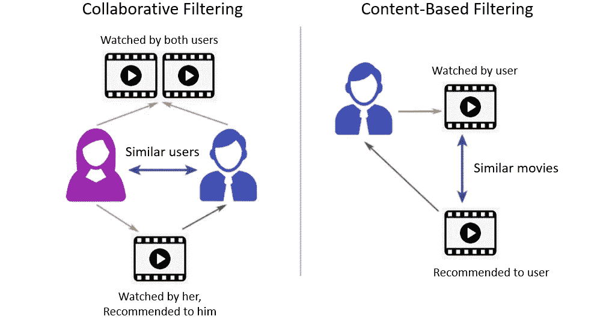
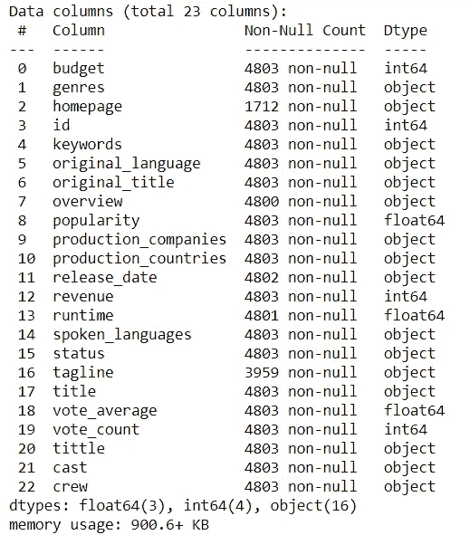
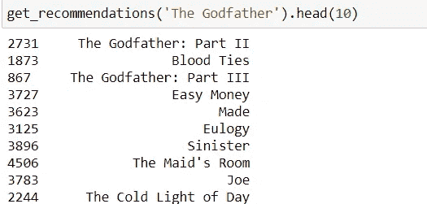
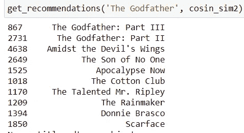
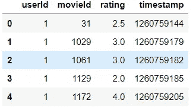
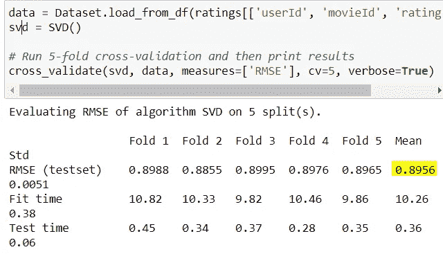
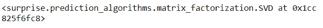
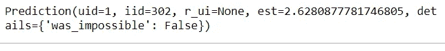
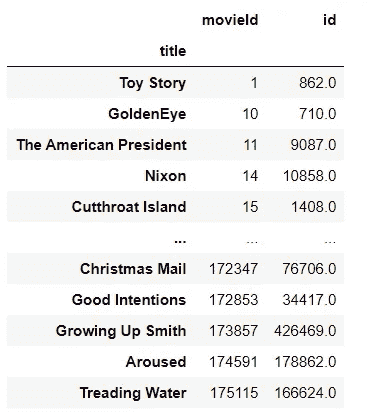
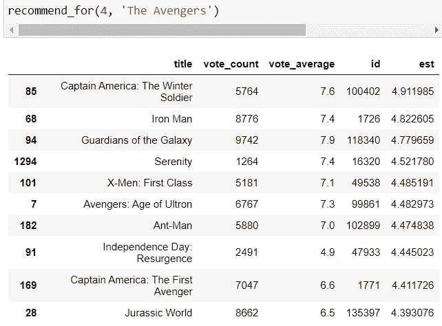

# 电影推荐系统

> 原文：<https://medium.com/analytics-vidhya/movie-recommendation-system-aa204f0700eb?source=collection_archive---------3----------------------->


嘿！！极客。我们都知道看电影很有趣。我们都像网飞一样在不同的平台上看了很多电影。我一直在思考，像网飞这样基于电影的平台，甚至是 medium，是如何根据用户兴趣来推荐任何东西的。基于我们的兴趣，这些建议是如何起作用的。让我们获取知识。！

在这个博客中，我们将讨论推荐系统。并使用电影数据库数据集创建一个电影推荐系统。

> 听听谷歌对此的看法。

**推荐系统，**或推荐系统，是信息过滤系统的一个子类，它试图预测用户对某个项目的“评分”或“偏好”。

简单来说，**推荐系统**旨在预测用户的兴趣，并推荐他们很可能感兴趣的产品。

> 推荐值

**网飞**:观看电影的 2/3 被推荐

谷歌新闻:推荐产生 38%的点击率

亚马逊 : 35%的销售额来自推荐

因此，从商业角度来看，用户在平台上找到的相关产品越多，他们的参与度就越高。它增加了各种平台的收入。

# 推荐系统的类型

通常，机器学习算法适合于推荐系统的两个类别。

1.  基于内容的推荐系统

2.协同过滤推荐系统

虽然，现代推荐使用这两种方法，称为混合推荐。



## 基于内容的过滤

基于特定项目建议相似的项目。该系统使用项目元数据，例如流派、导演、描述、演员等。对于电影，提出这些建议。这些推荐系统背后的一般思想是，如果一个人喜欢一个特定的项目，他或她也会喜欢与之相似的项目。前任。 **YouTube**

## 协同过滤

这些系统被广泛使用，它们试图根据其他用户过去的评分和偏好来预测用户对某个项目的评分或偏好。协作过滤器不像基于内容的过滤器那样需要项目元数据。

CF 分为两类:

*   **基于用户**:衡量目标用户与其他用户的相似度
*   **基于项目**:衡量目标用户评价/交互的项目与其他项目之间的相似性

CF 背后的关键思想是相似的用户分享相同的兴趣，并且相似的项目被用户喜欢。这样的例子可以在**网飞**和 **Spotify** 的推荐系统中找到。

详情点击 [**此处**](https://hackernoon.com/introduction-to-recommender-system-part-1-collaborative-filtering-singular-value-decomposition-44c9659c5e75) 。

## **混合动力发动机**

我们将来自内容和协作过滤的想法结合在一起，构建了一个引擎，该引擎根据内部为特定用户计算的估计评级，向该用户提供电影建议。

> 让我们开始实现部分..

在这里，我使用了一个 [tmdb_5000_dataset。包含近 5000 部电影，包括它们的标题、名字、类型、演员等等。信息。](https://www.kaggle.com/tmdb/tmdb-movie-metadata)

我们使用 pandas 和 numpy 进行数据预处理，使用 sklearn 进行机器学习任务。

导入所有需求和数据集..

```
import pandas as pd
import numpy as np
movies = pd.read_csv('datasets/tmdb_5000_movies.csv')
df = pd.read_csv('datasets/tmdb_5000_credits.csv')
df.columns = ['id', 'tittle', 'cast', 'crew']
movies = movies.merge(df, on='id')movies.info()
```



上图中我们可以看到有 4803 部电影和 23 个带有 tmdb id 的列。

> 让我们从**基于内容的推荐引擎开始。为此，我们需要关于这部电影的信息，在**概述**栏中有描述。**

现在，我们将使用 sklearn 的 [TF-IDF 矢量器](/@cmukesh8688/tf-idf-vectorizer-scikit-learn-dbc0244a911a)来获取电影的特征，并基于 TF-IDF 矩阵找到电影之间的相似之处。

```
from sklearn.feature_extraction.text import TfidfVectorizer# removing english stop word like a, and , the 
tfidf = TfidfVectorizer(analyzer = ‘word’,stop_words = ‘english’)#NaN -> ‘’
movies[‘overview’] = movies[‘overview’].fillna(‘’)tfidf_matrix = tfidf.fit_transform(movies[‘overview’])tfidf_matrix.shape # outputs: (4803, 20978)
```

TF-IDF 矩阵的形状是(4803，20978)。这意味着这里有 20978 个不同的词被用来描述一部 4803 电影。

现在，我们将找到这个矩阵的相似性得分。

因为我们有一个 TF_IDF 矢量器，直接计算点积将会得到余弦相似度。这里我们使用余弦相似性得分，因为它相对容易和快速计算。

```
from sklearn.metrics.pairwise import linear_kernelcosin_sim = linear_kernel(tfidf_matrix, tfidf_matrix)
```

我们将为电影和标题的索引做反向映射。

```
index_of_movies = pd.Series(movies.index,   index=movies['title']).drop_duplicates()
```

我们来写函数求推荐吧。

1.  会得到这个头衔
2.  从 cosin_sim 矩阵中查找电影的相似性得分
3.  对相似性得分排序
4.  基于输入返回顶级电影

```
def get_recommendations(title, cosin_sim=cosin_sim):
    idx = index_of_movies[title]

    sim_scores = list(enumerate(cosin_sim[idx]))
    # sorting of moviesidx based on similarity score
    sim_scores = sorted(sim_scores, key = lambda x:x[1], reverse = True)
    # get top 10 of sorted 
    sim_scores = sim_scores[1:31]

    movies_idx = [i[0] for i in sim_scores]

    return movies['title'].iloc[movies_idx]
```



推荐电影的输出

**用另一个元数据改进推荐器**

首先，我们获得演员、工作人员、关键字和流派列数据。然后，我们将对数据进行一些预处理，以获取最有用的信息，例如，我们将从“crew”列中获取 Director。

我们将创建这些信息的大杂烩。并应用[计数矢量器](https://www.educative.io/edpresso/countvectorizer-in-python)。

一个重要的区别是我们使用了 **CountVectorizer()** 而不是 TF-IDF。这是因为我们不想贬低一个演员/导演的存在，如果他或她演过或导演过相对更多的电影。没有太大的直观意义。

下一步是基于计数矩阵计算余弦相似矩阵。

下面是相同的代码..

```
from ast import literal_evalfeatures = ['cast', 'crew', 'keywords', 'genres']
for f in features:
    movies[f] = movies[f].apply(literal_eval)# to get director from job
def get_director(x):
    for i in x:
        if i['job'] == 'Director':
            return i['name']
    return np.nan# get top 3 elements of list
def get_list(x):
    if isinstance(x, list):
        names = [ i['name'] for i in x]

        if len(names)  > 3:
            names = names[:3]
        return names
    return []#apply all functions
movies['director'] = movies['crew'].apply(get_director)features = ['cast', 'keywords', 'genres']
for f in features:
    movies[f] = movies[f].apply(get_list)#striping
def clean_data(x):
    if isinstance(x, list):
        return [str.lower(i.replace(' ', '')) for i in x]
    else:
        if isinstance(x, str):
            return str.lower(x.replace(' ', ''))
        else:
            return ''features = ['cast', 'keywords', 'director', 'genres']
for f in features:
    movies[f] = movies[f].apply(clean_data)#creating a SOUP
def create_soup(x):
    return ' '.join(x['keywords'])+' '+' '.join(x['cast'])+' '+x['director']+' '+' '.join(x['genres'])movies['soup'] = movies.apply(create_soup, axis=1)#count Vectorizer
from sklearn.feature_extraction.text import CountVectorizer
count = CountVectorizer(stop_words = 'english')
count_matrix = count.fit_transform(movies['soup'])# finding similarity matrix
from sklearn.metrics.pairwise import cosine_similarity
cosin_sim2 = cosine_similarity(count_matrix, count_matrix)
```

现在，我们使用相同的 get_recommendation()函数，您可以看到我们的电影的改进推荐。



改进的建议

这就是我们如何创建一个基于内容的推荐引擎。

但是，我们的基于内容的引擎受到一些严重的限制。它只能建议与某部电影相近的电影。也就是说，它不能捕捉口味并提供跨流派的推荐。

此外，我们构建的引擎并不是真正个性化的，因为它没有捕捉到用户的个人品味和偏好。任何人基于电影向我们的引擎查询推荐，都会收到同样的电影推荐，不管她/他是谁。因此，现在，我们将使用一种协同过滤来对电影进行推荐。

> 现在，让我们来看看另一种基于**协同过滤**的类型

由于我们之前使用的数据集没有 userId(这是协同过滤所必需的),让我们加载另一个数据集。我们将使用 **Surprise** 库来实现 SVD。你可以从[这里](https://www.kaggle.com/rounakbanik/the-movies-dataset)下载数据集。

```
from surprise import Reader, Dataset, SVD
from surprise.model_selection import cross_validatereader = Reader()
ratings = pd.read_csv(‘datasets/ratings_small.csv’) 
```



评级 _ 小型数据集

交叉验证我们的数据。



交互效度分析

我们得到大约 0.89 的均方根误差，这对于我们的情况来说已经足够好了。现在让我们在数据集上进行训练并得出预测。

```
train = data.build_full_trainset()
svd.fit(train)
```



让我们预测用户 1 对电影 Id=302 的评级

```
svd.predict(1, 302)
```



这里你可以看到 **est=2.6280** 意味着用户 1 可能给 Id 为 302 的电影评分 2.63。

这就是我们如何在不知道用户过去行为的情况下，根据用户档案预测电影评级，并向他们推荐最佳电影。这被称为协同过滤。

# 混合推荐器

现在，让我们把基于内容和基于内容的推荐放在一起，做一个强有力的推荐器。

```
movie_id = pd.read_csv(‘datasets/links.csv’)[[‘movieId’, ‘tmdbId’]]
movie_id['tmdbId'] = movie_id[‘tmdbId’].apply(conv_int)
movie_id.columns = [‘movieId’, ‘id’]
movie_id = movie_id.merge(movies[[‘title’, ‘id’]], on=’id’).set_index(‘title’)
print(movie_id.shape) # o/p: (4599, 2)
```

我们的 movie_id 数据帧将如下所示。



制作一个 index_map 来查找一部电影的索引。

```
index_map = movie_id.set_index('id')
```

最后，让我们定义我们的推荐函数。它具有基于内容和 CF 两种技术的能力。

```
def recommend_for(userId, title):
    index = index_of_movies[title]
    tmdbId = movie_id.loc[title]['id']

    #content based
    sim_scores = list(enumerate(cosin_sim2[int(index)]))
    sim_scores = sorted(sim_scores, key=lambda x: x[1], reverse=True)
    sim_scores = sim_scores[1:30]
    movie_indices = [i[0] for i in sim_scores]

    mv = movies.iloc[movie_indices][['title', 'vote_count', 'vote_average', 'id']]
    mv = mv[mv['id'].isin(movie_id['id'])] # CF
    mv['est'] = mv['id'].apply(lambda x: svd.predict(userId, index_map.loc[x]['movieId']).est)
    mv = mv.sort_values('est', ascending=False)
    return mv.head(10)
```

让我们对我们的工作有公正的评价；)



对用户 4 的建议

> 结论

我们使用基于内容的协同过滤来创建推荐器。**混合系统**可以利用基于内容和协作过滤，因为这两种方法被证明几乎是互补的。这个模型非常基础，只提供了一个基本的框架。

> 你可以在这里找到这个项目[。去和它玩吧；)](https://github.com/AshishTrada/Movie-Recommendation-system)

快乐学习！！