# 电影推荐系统

> 原文：<https://medium.com/analytics-vidhya/movie-recommender-system-3ac889cb09fd?source=collection_archive---------1----------------------->


使用 [python](https://www.python.org/) ， [Numpy](https://numpy.org/) ，[熊猫](https://pandas.pydata.org/)， [Matplotlib](https://matplotlib.org/) ， [Seaborn](https://seaborn.pydata.org/) ， [ipywidgets](https://ipywidgets.readthedocs.io/en/latest/)

一个**推荐系统**，或者一个**推荐系统**(有时用一个同义词如平台或引擎代替‘系统’)，是[信息过滤系统](https://en.wikipedia.org/wiki/Information_filtering_system)的一个子类，它试图预测用户对一个项目的“评分”或“偏好”。

推荐系统被用于各种领域，通常公认的例子采取视频和音乐服务的播放列表生成器、在线商店的产品推荐器、或者社交媒体平台的内容推荐器和开放网络内容推荐器的形式。这些系统可以使用单一输入(如音乐)或跨平台的多个输入(如新闻、书籍和搜索查询)来运行。也有针对特定主题的流行推荐系统，如餐馆和网上约会。推荐系统也被开发来探索研究文章和专家、合作者和金融服务。

# **问题陈述:**

根据用户喜欢的相似流派和电影进行分析和基本推荐。

我们将关注的一些要点包括:

●电影的盈利能力

●基于语言的总量分析

●不同流派的总收入和利润比较，

●基于演员、电影、流派的推荐系统。

这个项目将帮助我们理解这些因素之间的相互关系。

# 导入库:

```
# lets import the basic Librariesimport numpy as npimport pandas as pd# for data visualizationimport matplotlib.pyplot as pltimport seaborn as sns# for jupyter notebook widgets#import ipywidgets as widgets#from ipywidgets import interact#from ipywidgets import interact_manual# for Interactive Shellsfrom IPython.display import display# setting up the chart size and backgroundplt.rcParams['figure.figsize'] = (16, 8)plt.style.use('fivethirtyeight')
```

# 加载数据集:

```
# lets read the datasetdata = pd.read_csv('movie_metadata.csv')
```

# 数据的形状:

```
# lets check the shapeprint(data.shape)
```

这个数据集中总共有 5043 行和 28 列。

# 关于数据集的信息:

```
# lets check the column wise infodata.info()
```

我们可以看到这个数据集中有很多空值。所以我们必须删除这些空值。

# 缺失值插补:

```
round(100*(data.isnull().sum()/len(data.index)), 2)
```

在这里，我们检查数据集中缺失值百分比较高的行。

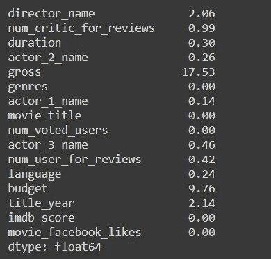

因为“gross”和“budget”列有大量 NaN 值，所以使用

“isnan”NumPy 的函数以及一个否定“~”

```
data = data[~np.isnan(data['gross'])]data = data[~np.isnan(data['budget'])]
```

现在让我们再次按列检查缺失的值。

```
data.isnull().sum()
```

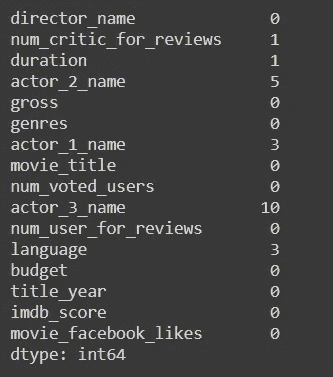

```
 data = data[data.isnull().sum(axis=1) <= 2]data.isnull().sum()
```

上面的代码保留了 Null 之和小于 2 的行。

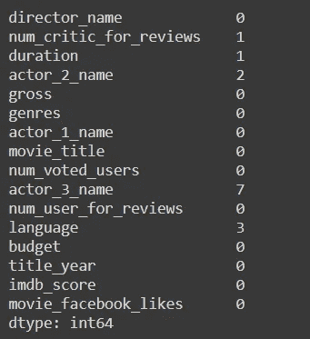

正如我们所知，我们不能使用统计值来估算演员姓名的缺失值，所以我们将用“未知”来替换演员姓名。

```
data['actor_2_name'].fillna('Unknown Actor', inplace = True)data['actor_3_name'].fillna('Unknown Actor', inplace = True)
```

因为我们估算了所有缺失值，所以让我们检查数据集中缺失值的总数。

```
data.isnull().sum().sum()
```

现在我们终于有了零空值。

# 特征工程:

让我们将总额和预算从美元转换为百万美元，以便于我们的分析。

```
data['gross'] = data['gross']/1000000data['budget'] = data['budget']/1000000
```

# 计算电影利润:

● **预算:**是制片人制作一部电影所花费的金额，包括制作、选角和广告费用。

● **毛:**是制作方通过在影院上映自己的电影，向电视、OTT 平台如 Prime、Hulu、Disney+Hotstar、网飞等出售卫星版权而赚取的金额。

● **利润:毛—预算，**

我们将使用这个公式来计算有史以来最赚钱的电影。

让我们使用预算和总额创建一个利润列。

```
data['Profit'] = data['gross'] - data['budget']
```

让我们也查一下十大赚钱电影的名字。

```
data[['Profit','movie_title']].sort_values(by = 'Profit', ascending  = False).head(10)
```

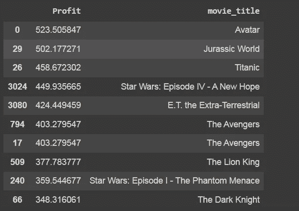

通过查看上面的结果，我们可以很容易地分析出有一些重复。所以我们必须删除这些重复的内容。

```
lets print the no. of rows before removing Duplicatesprint("No. of Rows Before Removing Duplicates: ",data.shape[0])# so lets remove all the duplicates from the datadata.drop_duplicates(subset = None, keep = 'first', inplace = True)# lets print the no. of rows after removing Duplicatesprint("No. of Rows After Removing Duplicates: ",data.shape[0])
```

去重前行数: **3888**

删除重复后的行数: **3853**

# 利润最高的 10 部电影:

让我们再来看看十大赚钱电影。

```
data[['movie_title','Profit']].sort_values(by = 'Profit', ascending  = False).head(10)
```

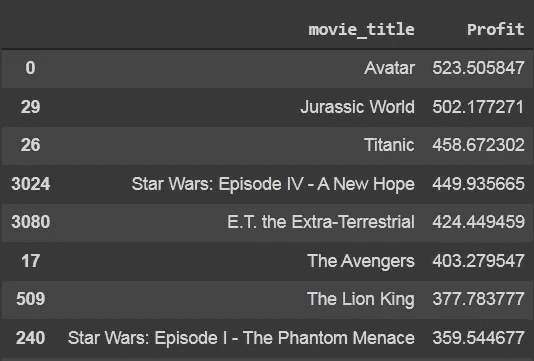

# 操作持续时间和语言列:

让我们检查语言列中的值。

```
data['language'].value_counts()
```

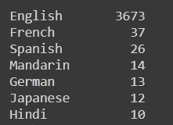

查看上面的输出，我们可以很容易地观察到，在 3500 部电影中，只有 150 部电影是其他语言的。所以最好只保留英语和外语两种语言。

```
def language(x):if x == 'English':return 'English'else:return 'Foreign'# lets apply the function on the language columndata['language'] = data['language'].apply(language)# lets check the values againdata['language'].value_counts()
```

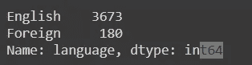

电影的时长变化不大，但我们知道大多数用户要么喜欢看长电影，要么喜欢看短电影。我们可以把电影分为两类，即短片和长片。让我们定义一个对电影时长进行分类的函数。

```
def duration(x):if x <= 120:return 'Short'else:return 'Long'# lets apply this function on the duration columndata['duration'] = data['duration'].apply(duration)# lets check the values of Duration columndata['duration'].value_counts()
```

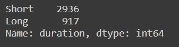

让我们也检查一下“流派”列中的值。

```
data['genres'].value_counts()
```

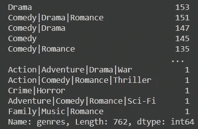

```
data['genres'].str.split('|')[0]
```

['动作'，'冒险'，'幻想'，'科幻']

我们可以从上面的输出中看到，大多数电影都有很多类型，一部电影可以有这么多类型，所以我们保留四种类型。

```
data['Moviegenres'] = data['genres'].str.split('|')data['Genre1'] = data['Moviegenres'].apply(lambda x: x[0])# Some of the movies have only one genre. In such cases, assign the same genre to 'genre_2' as welldata['Genre2'] = data['Moviegenres'].apply(lambda x: x[1] if len(x) > 1 else x[0])data['Genre3'] = data['Moviegenres'].apply(lambda x: x[2] if len(x) > 2 else x[0])data['Genre4'] = data['Moviegenres'].apply(lambda x: x[3] if len(x) > 3 else x[0])# lets check the head of the  datadata[['genres','Genre1','Genre2','Genre3','Genre4']].head(5)
```


# 数据可视化:

## 计算社交媒体受欢迎程度:

决定社交媒体受欢迎程度的重要因素包括:

●为电影投票的人数。

●观影人数。

●电影页面上脸书喜欢的人数。

利用这些指标，我们想出了一个公式来计算这些电影在社交媒体上的受欢迎程度。

**(电影评论人数/电影投票人数)*脸书点赞数。**

为了计算一部电影的受欢迎程度，我们可以合计投票用户数、评论用户数和脸书点赞数。

```
data['Social_Media_Popularity'] = (data['num_user_for_reviews']/data['num_voted_users'])*data['movie_facebook_likes']# lets also check the Top 10 Most Popular Movies on Social Mediax = data[['movie_title','Social_Media_Popularity']].sort_values(by = 'Social_Media_Popularity',ascending = False).head(10).reset_index()print(x)sns.barplot(x['movie_title'], x['Social_Media_Popularity'], palette = 'magma')plt.title('Top 10 Most Popular Movies on Social Media', fontsize = 20)plt.xticks(rotation = 90, fontsize = 14)plt.xlabel(' ')plt.show()
```

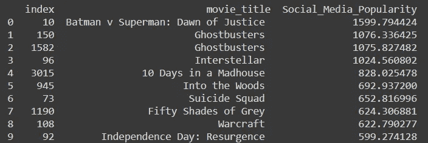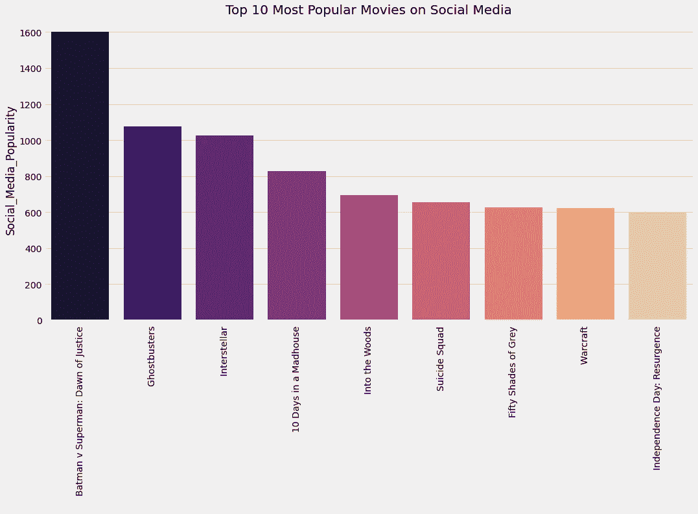

我们来比较一下总量和流派。

首先对类型进行分组，并获得该类型电影的最大、最小和平均总值。

```
data[['Genre1','gross',]].groupby(['Genre1']).agg(['max','mean','min']).plot(kind = 'line', color = ['red','black','blue'])plt.title('Which Genre is Most Bankable?', fontsize = 20)plt.xticks(np.arange(17), ['Action', 'Adventure', 'Animation', 'Biography', 'Comedy', 'Crime','Documentary', 'Drama', 'Family', 'Fantasy', 'Horror', 'Musical','Mystery', 'Romance', 'Sci-Fi', 'Thriller', 'Western'], rotation = 90, fontsize = 15)plt.ylabel('Gross', fontsize = 15)plt.xlabel(' ',)plt.show()print('The Most Profitable Movie from each Genre')display(data.loc[data.groupby(data['Genre1'])['Profit'].idxmax()][['Genre1','movie_title','gross']].style.background_gradient(cmap = 'copper'))
```

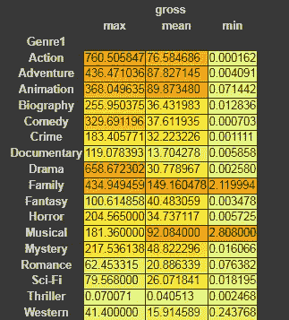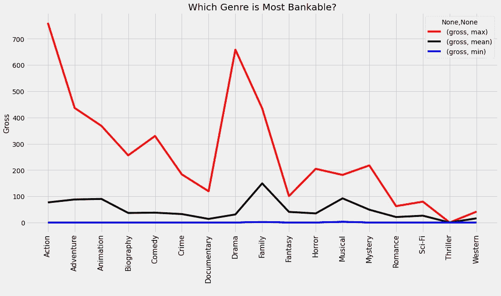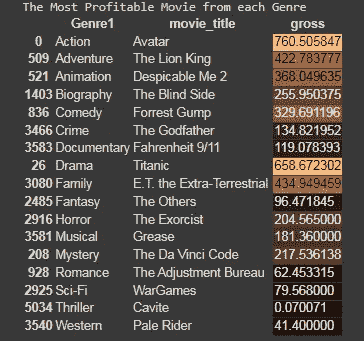

# **票房最赚钱的年份:**

```
data['title_year'] = data['title_year'].astype('int')print('Most Profitable Years in Box Office')display(data[['title_year','language','Profit']].groupby(['language','title_year']).agg('sum').sort_values(by = 'Profit',ascending = False).head(10).style.background_gradient(cmap = 'Greens'))# lets plot themsns.lineplot(data['title_year'], data['Profit'], hue = data['language'])plt.title('Time Series for Box Office Profit for English vs Foreign Movies', fontsize = 20)plt.xticks(fontsize = 18)plt.xlabel(' ')plt.show()print("Movies that Made Huge Losses")display(data[data['Profit'] < -2000][['movie_title','language','Profit']].style.background_gradient(cmap = 'Reds'))
```

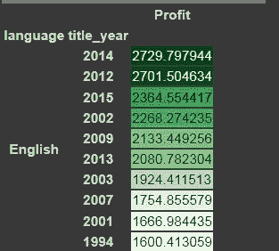

## 亏损巨大的电影:

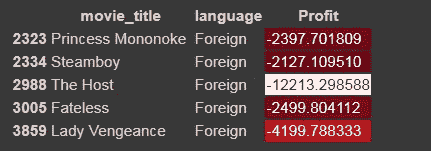

```
display(data[data['duration'] == 'Long'][['movie_title', 'duration', 'gross','Profit']].sort_values(by = 'Profit',ascending = False).head(5).style.background_gradient(cmap = 'spring'))display(data[data['duration'] == 'Short'][['movie_title', 'duration', 'gross','Profit']].sort_values(by = 'Profit',ascending = False).head(5).style.background_gradient(cmap = 'spring'))sns.barplot(data['duration'], data['gross'], hue = data['language'], palette = 'spring')plt.title('Gross Comparison')
```

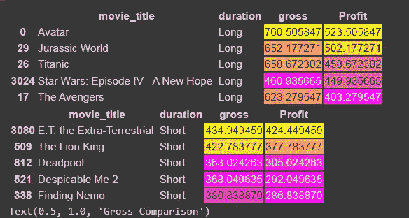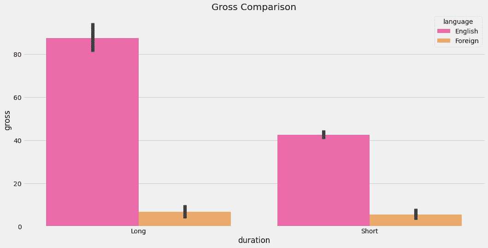

```
print("Average IMDB Score for Long Duration Movies is {0:.2f}".format(data[data['duration'] == 'Long']['imdb_score'].mean()))print("Average IMDB Score for Short Duration Movies is {0:.2f}".format(data[data['duration'] == 'Short']['imdb_score'].mean()))
```

长时长电影的平均 IMDB 评分为 **7.06。**

短时长电影的平均 IMDB 评分为 **6.28。**

```
print("\nHighest Rated Long Duration Movie\n",data[data['duration'] == 'Long'][['movie_title','imdb_score']].sort_values(by = 'imdb_score', ascending = False).head(1))print("\nHighest Rated Short Duration Movie\n",data[data['duration'] == 'Short'][['movie_title','imdb_score']].sort_values(by = 'imdb_score', ascending = False).head(1))
```

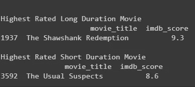

```
sns.boxplot(data['imdb_score'], data['duration'], palette = 'copper')plt.title('IMDB Ratings vs Gross', fontsize = 20)plt.xticks(rotation = 90)plt.show()
```

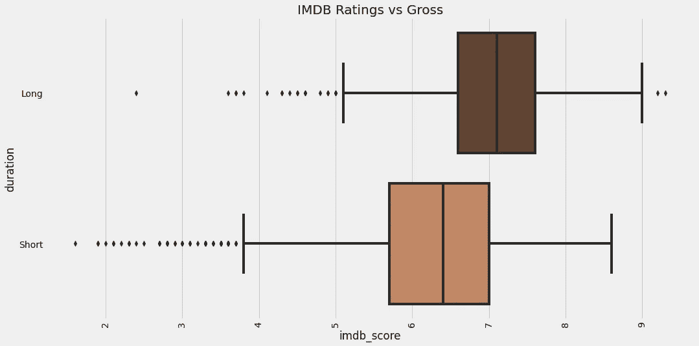

```
pd.set_option('max_rows', 3000)@interactdef show_movies_more_than(column='imdb_score', score=9.0):x = data.loc[data[column] > score][[ 'title_year','movie_title','director_name','actor_1_name','actor_2_name','actor_3_name','Profit','imdb_score',]]x = x.sort_values(by = 'imdb_score', ascending = False)x = x.drop_duplicates(keep = 'first')return x
```

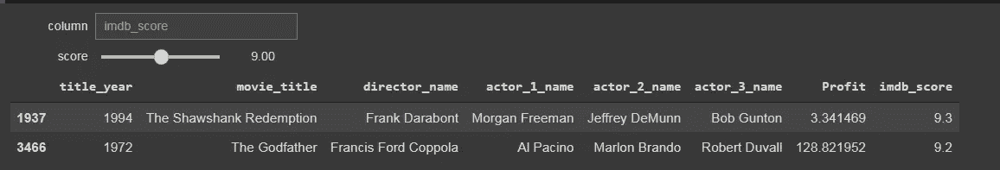

```
pd.set_option('max_rows', 30000)@interactdef show_articles_more_than(column=['budget','gross'], x=1000):return data.loc[data[column] > x][['movie_title','duration','gross','Profit','imdb_score']]
```

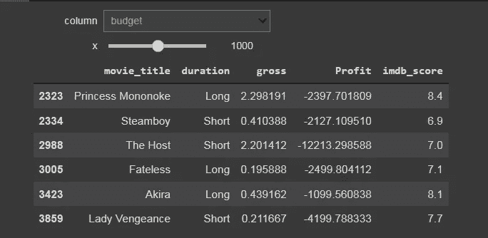

# 基于语言推荐电影:

```
def recommend_lang(x):y = data[['language','movie_title','imdb_score']][data['language'] == x]y = y.sort_values(by = 'imdb_score', ascending = False)return y.head(15)recommend_lang('Foreign')
```

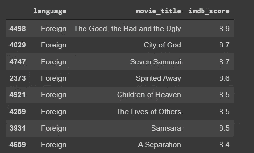

# 根据演员推荐电影:

```
def recommend_movies_on_actors(x):a = data[['movie_title','imdb_score']][data['actor_1_name'] == x]b = data[['movie_title','imdb_score']][data['actor_2_name'] == x]c = data[['movie_title','imdb_score']][data['actor_3_name'] == x]a = a.append(b)a = a.append(c)a = a.sort_values(by = 'imdb_score', ascending = False)return a.head(15)recommend_movies_on_actors('Leonardo DiCaprio')
```


# 推荐相似的流派:

```
from mlxtend.preprocessing import TransactionEncoderx = data['genres'].str.split('|')te = TransactionEncoder()x = te.fit_transform(x)x = pd.DataFrame(x, columns = te.columns_)# lets check the head of xx.head()
```

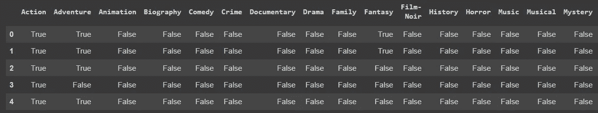

让我们将这些数据转换成布尔值，以便进行计算。

```
genres = x.astype('int')genres.head()
```

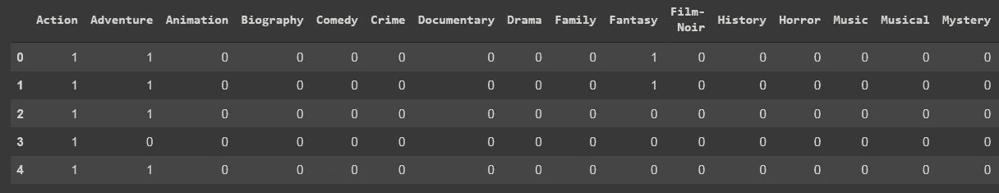

## 制作用于获得相似流派的推荐引擎:

```
def recommendation_genres(gen):gen = genres[gen]similar_genres = genres.corrwith(gen)similar_genres = similar_genres.sort_values(ascending=False)similar_genres = similar_genres.iloc[1:]return similar_genres.head(3)recommendation_genres('Documentary')
```

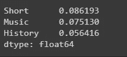

# 推荐类似电影:

```
def recommendation_movie(movie):movie = x[movie+'\xa0']similar_movies = x.corrwith(movie)similar_movies = similar_movies.sort_values(ascending=False)similar_movies = similar_movies.iloc[1:]return similar_movies.head(20)# lets test on some resultsrecommendation_movie('Shutter Island')
```

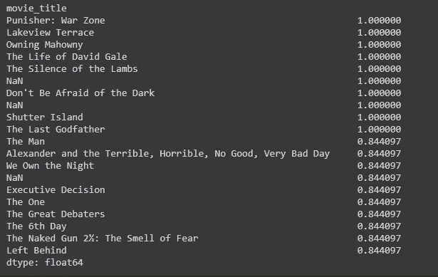

# Github 链接:

[](https://github.com/pinaki1889/movie_recommender.git) [## GitHub-pinaki 1889/电影 _ 推荐者

### 在 GitHub 上创建一个帐户，为 pinaki1889/movie_recommender 的开发做出贡献。

github.com](https://github.com/pinaki1889/movie_recommender.git) 

# 关键要点:

在完成一个项目后，分析关键外卖是非常重要的。因此，让我们讨论一下主要的要点

●理解缺失值处理

●如何执行特征工程

●如何根据要求对数据进行操作。

●如何根据内容进行推荐

●如何根据相似度进行推荐。

