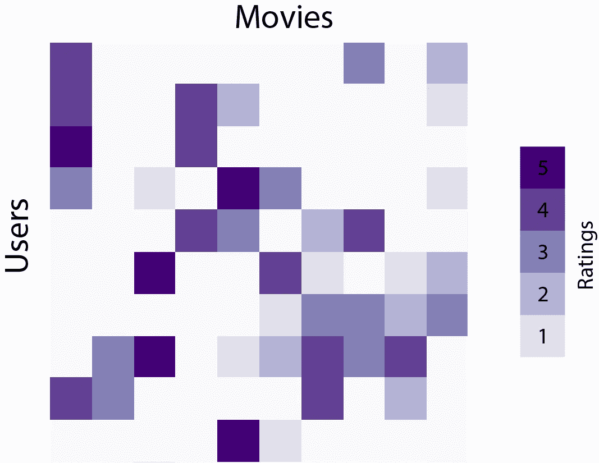
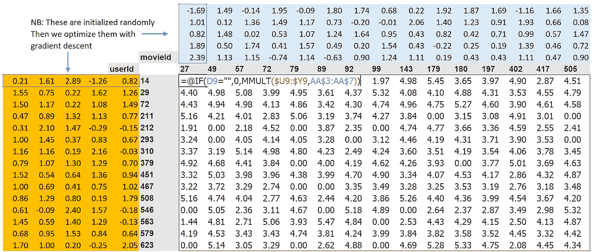
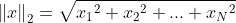
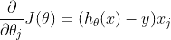
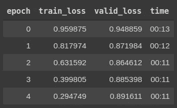
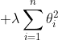
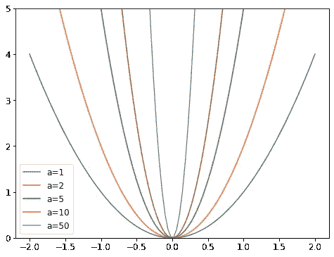
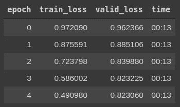
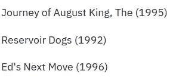

# 使用协同过滤的电影推荐器

> 原文：<https://medium.com/analytics-vidhya/movie-recommender-using-collaborative-filtering-7cf54d54d663?source=collection_archive---------12----------------------->


维多利亚诺·伊斯基耶多在 [Unsplash](https://unsplash.com?utm_source=medium&utm_medium=referral) 上的照片

如今，我们在网上所到之处似乎都有类似“你的最佳选择”或“基于你以前的…”；这些更经常出现的网飞电影，或者持续出现在你的歌曲电台中的 Spotify 歌曲，都是推荐系统的结果。这些系统有时可能会令人讨厌，有点打扰，但是，值得称赞的是，它们通过给我们一个现实的候选名单来节省我们筛选大量内容的时间。

与拥有更多数据的网飞相比，我创建的推荐系统是有限的；比如用户年龄，这对偏好有很大的影响。我使用的是缩减的[电影镜头](https://grouplens.org/datasets/movielens/)数据集，它有 10 万个收视率，而完整数据集只有 2500 万个收视率。对于预处理和训练，我使用 Fastai 库，因为它有很多有用的内置功能，我也参加了他们的课程。这里是我的 [GitHub](https://github.com/jacKlinc/movie-recommender) 回购。用于托管[电影仪表盘](https://share.streamlit.io/jacklinc/movie-recommender/main/src/src_recommender.py)的 Streamlit。

# 协同过滤

最常用的方法被称为协同过滤，它的名字对于机器学习来说出奇的好。它依赖于具有相似兴趣的其他用户的推荐，来过滤结果以最适合您的需要。提到的兴趣被称为协同过滤中的潜在因素，是决定电影推荐的因素。

**基本步骤**:

1.  *随机初始化参数—* 这些是帮助预测某人是否喜欢某部电影的潜在因素。
2.  *计算预测—* 这是通过获取电影和用户矩阵的矩阵点积来完成的。一个例子是，如果用户对国际电影的喜爱程度很高，而一部电影是外国的；这两者的产品将会很大，并且，对于该用户来说，该电影将会排名更高。
3.  *计算损失—* 找出预测和用户喜欢之间的差异。使用均方误差(MSE)。
4.  *用 SGD 优化—* 现在，通过比较步骤 3 的误差和预测值的误差，用梯度下降法调整前面提到的参数(潜在因素)。更新参数以改进预测，并且重复该过程，直到精度令人满意。

奥赖利的下图非常形象地展示了用户和电影评分的交集是如何影响预测的。



照片由[奥赖利](https://www.oreilly.com/content/deep-matrix-factorization-using-apache-mxnet/)

## 计算预测

下面的 Excel 表格显示了步骤 1 中使用矩阵分解相乘的参数的交叉表。为了简单起见，下面的潜在因素的数量是五。

```
user_factors = torch.randn(n_users, 5)movie_factors = torch.randn(n_movies, 5)
```



由 [FastAI](https://colab.research.google.com/github/fastai/fastbook/blob/master/08_collab.ipynb) 拍摄

**一热编码**

一个热编码是机器学习中分类变量所需的预处理步骤。字符串变量(分类的)和模型合不来，所以把它们转换成模型能理解的向量是至关重要的。计算特定用户的预测如下所示:

```
one_hot_user = one_hot(12, n_users).float()user_factors.t() @ one_hot_user
```

第一行在索引 12 处为用户创建一个独热编码向量。这个向量和用户矩阵的乘积进行预测。这种方法可以用于预测，但是效率非常低，因为它需要为每个预测创建和存储一个向量。

**矩阵分解**

更好的解决方案是使用矩阵分解或嵌入，这使用 py torch(FastAI 下的 API)内置的一个层，支持直接索引到矩阵中。下面的“create_params”函数返回一个满是归一化随机参数的秩为 2 的张量。

矩阵分解实现

“DotProductBias”类的“y_range”参数首先出现在第 15 行，用于限制第 40 行的 sigmoid 函数。电影分级范围是 0-5，但由于 sigmoid 渐近线的最大值，5.5 更好。在第 15 行看到的偏差参数说明了受到高偏差(挑剔/容易高兴)影响的用户和电影；像《年少轻狂》这样的电影对大多数用户来说是得分很高的例子。

## 计算损失

传递给下面的学习者对象的第一个变量是包含训练集和验证集的 DataLoaders 对象。接下来是架构本身，上面的“dp_bias_model”是 DotProductBias 类。幸运的是，FastAI 提供了损失函数，因此，不需要编写任何额外的代码。“MSELossFlat()”与 PyTorch 的“MSELoss()”相同，但它使输入变平。

```
learn = Learner(dls, dp_bias_model, loss_func=MSELossFlat())
```

均方误差(MSE)查找预测值和实际值之间的误差，对其进行平方，然后查找其平均值，这也称为平方 L2 归一化。这只是毕达哥拉斯定理，但不是三角形的两条边，而是五十个电影因素。



MSE 损失方程

## 使用 SGD 优化

同样，不需要实现随机梯度下降，因为 FastAI 默认具有 Adam 优化器。Adam 依赖于过去梯度的指数衰减，但是细节超出了本文的范围——查看 [this](https://machinelearningjourney.com/index.php/2021/01/09/adam-optimizer/) 了解更多信息。



SGD 方程

该模型在下面以 0.005 的学习率被训练五个时期。

```
learn.fit_one_cycle(5, 5e-3)
```



模型损失

对于左侧的每个时期，训练误差减少，但是验证误差增加，这种行为表明对数据的过度拟合。

## 规范化

也称为权重衰减，L2 正则化旨在减轻数据集过度拟合的影响。该过程将权重的平方和加到损失函数上；这确保了参数尽可能小。这一项随后被添加到标准损失函数中。



损失函数正则化项

上面的 lambda 表达式用于控制模型与数据的拟合程度，项越大；抛物线越窄，数据拟合越不紧密。FastAI 在下面提供了一个例子，其中 a 是 lambda。



FastAI 规范化示例

使用正则化就像给学习者对象添加权重衰减参数一样简单。

```
learn.fit_one_cycle(5, 5e-3, wd=0.1)
```



正则化损失模型

不需要太多的努力就能有很大的进步！防止模型与数据拟合得太好，可以让它更好地概括新数据。

# 推荐

那么模型训练好了，我们怎么给一个用户预测一部电影呢？比方说，我们喜欢塔伦蒂诺电影，所以我们尝试真正的浪漫。

```
fav_movie = 'True Romance (1993)'
movie_factors = learn.model.movie_factors
```

现在，从 DataLoaders 对象中选择了与电影同名的行。

```
idxs = dls.classes['title'].o2i[fav_movie]
```

找到与真正浪漫距离最小的电影，就会找到最喜欢的:

```
dist = nn.CosineSimilarity(dim=1)(movie_factors, movie_factors[idxs][None])
```

现在，我们需要对距离进行排序，并选择前 3 名:

```
idx = distances.argsort(descending=True)[1:4]
```

索引到数据加载器以获取电影标题:

```
[dls.classes['title'][i] for i in idx]
```



真爱至上 3

## 结论

有许多方面的推荐系统被排除在本文之外，主要是因为我对这个主题还不熟悉，并且计算资源有限。这种模式的缺点之一是电影数量有限，只有 1600 部左右；我需要推荐的许多电影都不在名单上。使用完整的 MovieLens 数据集可以访问更多的电影和更多的用户评级，这将提高准确性，但需要相当长的时间来训练。这里没有涉及的另一个方面是深度学习，它不是表格数据的显而易见的选择，但对所有机器学习问题越来越有用。

我会推荐我以前的[文章](/analytics-vidhya/mask-detector-w-fastai-and-streamlit-sharing-62448b4cb7b6)，以获取任何关于我如何在 Streamlit 上主持它的信息。我也会去看看我一直密切关注的 FastAI 课程。

## 参考

*   [FastAI 第八课](https://course.fast.ai/)
*   [电影镜头](https://grouplens.org/datasets/movielens/)数据集
*   [奥赖利](https://www.oreilly.com/content/deep-matrix-factorization-using-apache-mxnet/)照片
*   [亚当乐观者](https://machinelearningjourney.com/index.php/2021/01/09/adam-optimizer/)