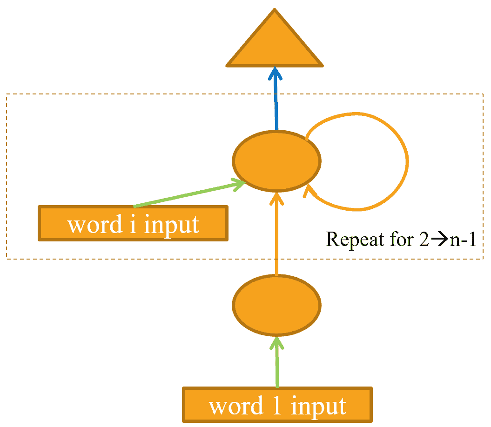
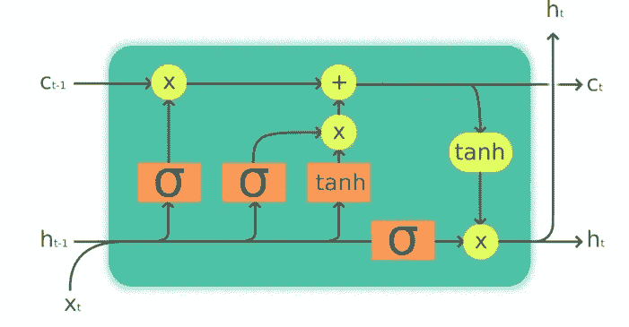
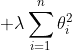
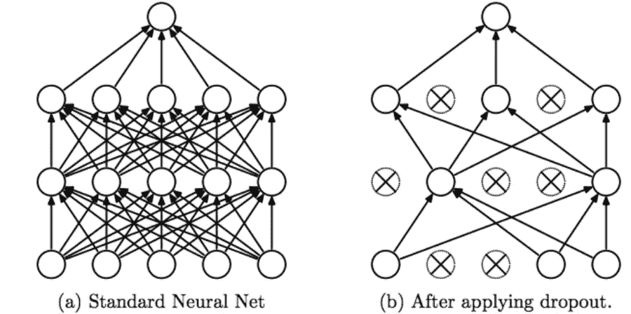
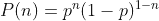

# 带 RNNs 的电影评论情感分析

> 原文：<https://medium.com/analytics-vidhya/movie-review-sentiment-analysis-w-rnns-5227e7b52f8c?source=collection_archive---------18----------------------->


照片由 [Avel Chuklanov](https://unsplash.com/@chuklanov?utm_source=medium&utm_medium=referral) 在 [Unsplash](https://unsplash.com?utm_source=medium&utm_medium=referral) 拍摄

据 IMDb 称，它有超过 50 万部电影和近 550 万条用户评论，每条评论都是 1-10 分的评分和文字评论；我想用这些评论来训练一个模型，可以猜测未来评论的情绪。自然语言处理的类型称为文本分类。这里的大部分工作来自 FastAI 课程的第 8 课，我不能向任何对深度学习感兴趣的人推荐。跟随用于训练模型的[笔记本](https://github.com/jacKlinc/movie_review_sentiment/blob/main/notebooks/1_mdl_nlp_train_sentiment.ipynb)。

# 预处理

对于一台只能理解 1 和 0 的计算机来说，文本是一个非常抽象的概念——它需要努力让它为理解人类语言做好准备。语料库中的每个词就像一个有限级别的分类变量；语料库级别被称为词汇库。

有两个步骤:

1.  *标记化*:为语料库创建一个单词/子单词列表。
2.  *数字化*:将单词转换成数字，并将它们的位置转换成索引。

## 符号化

看起来很简单:将文本传递给标记器并开始训练？不幸的是，我们需要处理像标点和连字符这样的事情。将文本拆分成单词的方法有很多种，但我在这里重点介绍的是基于单词的方法。幸运的是，有一些单词分词器——其中一个叫做`spacy`。它知道如何处理单词，比如“它的”。

```
first(spacy(["It's really sunny on Monday"]))
>> ['It', "'s", 'really', 'sunny', 'on', 'Monday']
```

FastAI 添加了自己的特殊标记规则来为单词添加上下文，比如评论的开头或大写字母。

```
tok = Tokenizer(spacy)(["It's really sunny on Monday"]); tok
>> ['xxbos', 'xxmaj', 'it', "'s", 'really', 'sunny', 'on', 'xxmaj', monday']
```

`xxbos`表示流(bos)的开始，`xxmaj`是大写字母。像“它”和“It”这样的词对我们来说是同一个词，但是对模型来说，它们是独特的。这些特殊的记号解析它们是一样的，但是用一个大写字母记号来区分它们。

## 数值化

该模型现在知道如何拆分评论中的每个单词，但我们仍然需要将它们转换成计算机可以理解的数字。数值化的工作方式类似于 one-hot 编码变量，其中`Numericalize`为分类变量列出所有可能的级别，用 vocab 中的索引替换每个级别。

```
num = Numericalize(min_freq=3, max_vocab=60000)
num.setup(tok)
num(tok)
>> tensor([ 4, 11, 435, 434, ... ])
```

存储所有单词是不实际的，因为 vocab 会太大，`max_vocab`属性限制了它，而`min_freq`要求它在被添加之前出现几次。这个张量现在可以直接输入网络的嵌入层。

# RNNs

递归神经网络用于 NLP，因为它们对文本在序列中的位置进行加权。基本思想是网络的第一层使用第一个字的嵌入；第二种使用第二个单词的嵌入和第一个单词的输出激活相结合；第三种使用第三个单词的嵌入和第二个单词的激活。前一个单词的激活被称为 ***隐藏状态*** 。



来自 FastAI 的 RNN

他们没有显式声明每一层，而是将它们重构到一个 for 循环中——这是经常性的。`for`循环的极限是层数。

上面的第一个类`LanguageModel`，明确地向每个网络的下一层提供先前的激活；`LanguageModelRecurrent`使用一个循环来实现同样的功能。上面的模型产生了大约 50%的精确度。

## 状态和信号

`forward()`为隐藏状态，`h` *，*存储以前的激活；然后，这被重置为零，丢弃关于给评论更多上下文的单词的潜在重要信息。将重置移入`init()`通过仅在对象实例化时重置来解决这个问题。这保持了状态，但打开了另一个问题:梯度爆炸。维护状态会为语料库中的每个标记创建一个层，可能有 60，000 个，需要对每个层进行梯度计算，这导致训练速度很慢。丢弃除了前三个梯度之外的所有梯度解决了这个问题；这被称为时间截断反向传播(tBPTT)。

上面的第二个 RNN 实现通过循环序列长度`sl`而不是仅仅三个字来添加信号。增加句子长度会给出更多的上下文；潜在地提高准确性——这被称为 ***发信号*** 。引入状态将准确度提高到**的 57%** ，添加更多信号将准确度提高到**的 64%** 。

## 多层和 LSTMs

多层 rnn 将第一层的输出输入到下一层，为模型提供更长的学习时间范围，并创建对文本的更好理解。考虑到这一点，精度应该会提高很多，但反而下降到 **48%** ，比我们上次的单层模型下降了 16。这种下降的原因是所谓的爆炸和消失梯度现象。由于每个浮点数只有 32 位，重复相乘矩阵会导致其精度下降；当浮点数偏离 1 时，它们会失去精确性，因为需要更多的位来存储它们的值。通过两层传递矩阵会导致每次乘法的数值偏离实际值。如果梯度太小，算法不会更新；太大了，他们的更新太快了。

长期短期记忆(LSTM)架构通过引入另一种称为 ***单元状态*** 的隐藏状态来保留更多的句子记忆，从而解决了这一问题。隐藏状态关注当前单词标记，而单元格状态考虑单词序列中较早的单词激活。



来自[拉恩](https://arxiv.org/abs/1808.05578)的 LSTM 细胞

上图中的橙色方框代表网络中的层， *tanh* 是双曲线 tan，另一个是 *sigmoid* 。将 *sigmoid* 的输出从 0 调整到 1，将 *tanh* 的输出从-1 调整到+1，解决了爆炸梯度问题。 ***单元格状态*** 控制 LSTM，使用图中的黄色圆圈更新；他们输入的乘积决定了状态:更新那些接近 1 的；丢弃接近 0 的部分。网络现在可以保持对单词的长期记忆，使较长的句子更容易理解。

`init()` 定义了 LSTM 使用的各个门，`forward()`实现了它们。很方便的是，PyTorch 有一个内置的[类](https://pytorch.org/docs/stable/generated/torch.nn.LSTM.html)，所以不需要写那么多。有了 LSTM，多层模型的精确度从 **48%** 上升到**81%**——相当大的一个飞跃！模型的验证损失远远高于训练损失，表明数据过度拟合。

## 规范化

在传统的 ML 模型中，这一步相当简单，只需在损失函数后附加一个正则化项:



重量衰减参数

在 NLP 中，使用数据扩充的一些方法的过程稍微复杂一些，将文本翻译成另一种语言，然后以不同的方式再翻译回短语句子；这是一个开放的研究领域，超出了本文的范围。

**辍学**

辍学背后的想法是随机丢弃网络中的随机神经元，以帮助网络朝着共同的目标努力。排除这些神经元会在网络中引入噪声，使模型更加健壮，并且不容易过度拟合。



被 [KDNuggets](https://www.kdnuggets.com/2018/09/dropout-convolutional-networks.html) 退学

丢弃神经元由概率`p`控制，逐层变化，在复杂的网络层中适当丢弃。漏失遵循下面定义的伯努利分布。



二项分布

PyTorch 实施的辍学:

```
class Dropout(Module):
  def __init__(self):
    self.p = p

  def forward(self, x):
    if not self.training:
      return x
    mask.new(*x.shape).bernoulli_(1-p)
    return x * mask.div_(1-p)
```

**重量捆绑**

语言模型的输入嵌入(第一层)将英语单词映射到激活，并将输出激活映射到英语单词。将这些设置为相同可以提高准确性。这是论文。

```
self.h_o.weight = self.i_h.weight
```

FastAI 提供了一个`TextLearner` 类来为我们完成大部分工作:

```
learn = TextLearner(dls, LanguageModelLSTM(len(vocab), 64, 2, 0.4),
                loss_func=CrossEntropyLossFlat(), metrics=accuracy)
learn.fit_one_cycle(15, 1e-2, wd=0.1)
```

准确率从 **81%** 到**87%**；这在五年前会是世界上最好的！FastAI 的创造者使用与上述相同的技术训练了一个[模型](https://arxiv.org/abs/1801.06146)，达到了 94%的准确率——只是最近才被打破。

# 预言；预测；预告

FastAI 提供了一个 IMDb 数据集[和 25，000 条两极分化的评论，下面是非常简单的语法:](https://course.fast.ai/datasets)

```
path = untar_data(URLs.IMDB)
```

`DataBlock` 使用`path`将实例加载到模型中。

```
dls_clas = DataBlock(
  blocks=(TextBlock.from_folder(path), CategoryBlock),
  get_y=parent_label,
  get_items=partial(get_text_files, folders=['train', 'test']),
  splitter=GrandparentSplitter(valid_name='test')
).dataloaders(path, path=path, bs=128, seq_len=72)
```

创建模型使用了`DataBlock` *、* `AWD_LSTM`:正规化的 LSTM 建筑、`drop_multi`:全球化的辍学生。`to_fp16()` 将所有 32 位浮点数转换为 16 位，从而加快训练速度。

```
l3 = text_classifier_learner(
  dls_clas, 
  AWD_LSTM,
  drop_mult=0.5,
  metrics=accuracy
).to_fp16()
```

我建议将训练好的模型和 vocab 保存在`[pickle](https://pypi.org/project/pickle5/)`文件中，因为在 Colab GPUs 上训练它需要两个多小时。加载模型并进行预测的过程如下:

```
l3 = l3.load('/path/to/my_saved_model')
l3.predict('That was terrible!')
 >> ('neg', tensor(0), tensor([0.8067, 0.1933]))
```

## 主办；主持

我通常会将这个模型放在一个 Streamlit web 应用程序中进行推理，就像我在我的[以前的](/analytics-vidhya/mask-detector-w-fastai-and-streamlit-sharing-62448b4cb7b6)项目中所做的那样，但是因为保存的模型非常大，我将需要使用云托管。

# 参考

*   【https://www.imdb.com/pressroom/stats/ 号
*   【https://course.fast.ai/videos/?lesson=8 
*   [https://arxiv.org/abs/1808.05578](https://arxiv.org/abs/1808.05578)
*   [https://www . kdnugges . com/2018/09/dropout-convolatile-networks . html](https://www.kdnuggets.com/2018/09/dropout-convolutional-networks.html)