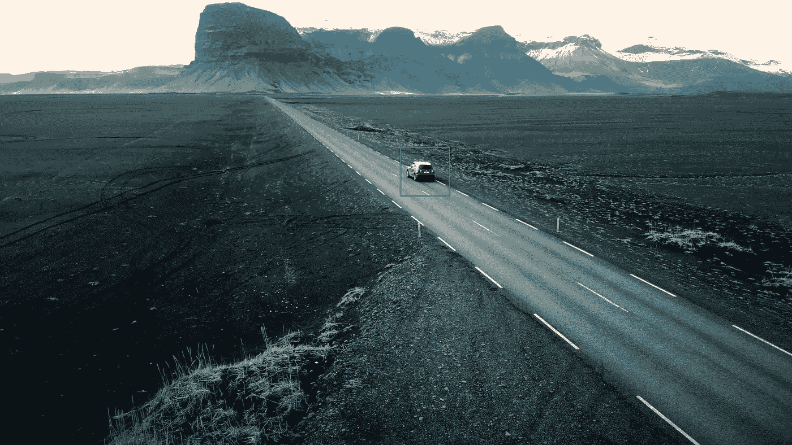

# 基于计算机视觉的视频运动车辆检测

> 原文：<https://medium.com/analytics-vidhya/moving-car-detection-from-video-by-using-computer-vision-e285db894249?source=collection_archive---------8----------------------->

> 探测高速移动的物体意味着拥有鹰眼般的精度

当谈到图像处理和视频处理时，机器检测领域表现出色的是计算机视觉。这是一个令人着迷的领域，因为它通过灰度、轮廓、边缘检测等手段处理图像和视频帧。

让我们使用 Python 中的 Open CV 来处理汽车视频，捕捉视频帧并检测运动的汽车

1.  首先，我们需要设置视频的路径，以及我们可以存储以图像形式捕获的帧的路径。这将是我们移动汽车检测的重要数据集

图像存储在路径中

2.显示视频中的帧

视频中的第一帧和第二帧

3.帧的灰度级

图像帧的灰度

4.图像帧的阈值处理

不清晰

5.执行帧的图像膨胀

图像膨胀

6.为检测创建分区

车辆与许多其他东西一起在区域内被检测

7.图像帧轮廓

汽车现在轮廓，但仍然需要删除背景和汽车上的重点

8.利用多尺度检测运动车辆

detectMultiScale()是 openCV 中的一个函数，用于查找图像中的大/小尺寸，通过调整精确的参数，我们可以将其设置为汽车的宽度和高度。

利用仿真逐帧捕捉并检测车辆

检测到移动的汽车

结论:通过使用 OpenCV，我们可以将视频分割成图像帧，并对图像进行数据处理，从而使检测运动目标的任务变得更加简单。

参考资料:-

1.  关于 detect multi scale()-[https://www . geeks forgeeks . org/detect-an-object-with-opencv-python/](https://www.geeksforgeeks.org/detect-an-object-with-opencv-python/)
2.  [https://www . analyticsvidhya . com/blog/2020/04/vehicle-detection-opencv-python/](https://www.analyticsvidhya.com/blog/2020/04/vehicle-detection-opencv-python/)
3.  [https://www . geeks forgeeks . org/opencv-python-program-vehicle-detection-video-frame/](https://www.geeksforgeeks.org/opencv-python-program-vehicle-detection-video-frame/)
4.  完整代码-[https://github . com/saish 15/Machine-Learning/blob/master/Moving _ obj 2 . ipynb](https://github.com/saish15/Machine-Learning/blob/master/Moving_obj2.ipynb)