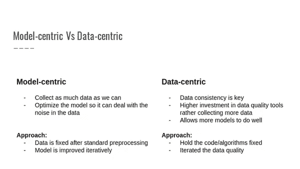

# 从以模型为中心转向以数据为中心的方法

> 原文：<https://medium.com/analytics-vidhya/moving-from-model-centric-to-data-centric-approach-1468fb5dbafb?source=collection_archive---------1----------------------->

谷歌研究人员发现，“数据级联——由低估数据质量的传统人工智能/人工智能实践引发的导致数据问题负面下游影响的复合事件——是普遍存在的(92%的流行率),看不见，有延迟，但通常是可以避免的。”

让我们讨论跨组织的大多数或所有 AI 用例广泛遵循的趋势。只是为了让我自己清楚，这里的术语 AI 是指包含我们的数据科学/机器学习和深度学习用例的保护伞。

所有人工智能系统的两个基本组成部分是数据和模型，两者在产生预期结果的过程中密切相关。我们确实意识到，人工智能社区一直偏向于在模型构建方面投入更多的努力。一个似乎合理的原因是，人工智能行业密切关注人工智能的学术研究。由于人工智能中的开源文化，几乎每个会使用 github 的人都可以很容易地获得该领域的大多数前沿进展，但处理数据有时被认为是一项低技能的任务，许多工程师更喜欢处理模型，但等式表明，为了改进解决方案，我们可以改进我们的代码或改进我们的数据，当然，两者兼而有之。

**以模型为中心的方法**

ML 是一个迭代过程，它包括围绕模型设计经验测试以提高性能。这包括在巨大的可能性空间中找到正确的模型架构和训练过程，以达到更好的解决方案。

根据 ng 的说法，在占主导地位的以模型为中心的人工智能方法中，你收集所有你可以收集的数据，并开发一个足够好的模型来处理数据中的噪声。已建立的流程要求保持数据不变，并反复改进模型，直到达到预期的结果。

**以数据为中心的方法**

这包括系统地改变/增强数据集，以提高你的人工智能系统的准确性。这通常被忽视，数据收集被视为一次性任务。

Ng 说，在新生的以数据为中心的人工智能方法中，“数据的一致性至关重要”。为了得到正确的结果，您保持模型或代码不变，并迭代地提高数据的质量。

**谁在谈论它？**

研究科学家 Martin Zinkevich 强调在训练你的第一个模型之前*为所有业务指标和遥测技术实现可靠的数据管道和基础设施。他还主张在简单的模型或启发式方法上测试管道，以确保在任何生产部署之前数据都按预期流动。*

谷歌的 Tensorflow Extended (TFX)团队引用了 Zinkevich 的话，并回应说，构建现实世界的 ML 应用程序“需要一些心智模型的转变(或者可能是增强)。”

然而，最近，人们越来越关注低质量数据在 ng 所认为的生产差距概念验证中的作用，即人工智能项目和机器学习模型在现实世界中部署时无法成功

这两位领导人传达的信息是，部署成功的 ML 应用程序需要转移焦点。而不是问，*我需要哪些数据来训练一个有用的模型？*，问题应该是:*我需要哪些数据来衡量和保持我的 ML 应用的成功？*

**数据和 AI 划分**

TensorFlow、PyTorch、SciKit-Learn 等流行的机器学习框架都不做数据处理。因为这些数据系统不“做 AI”，这些 AI 技术也不“做数据”，所以企业想用 AI 成功是极其困难的，毕竟要成功需要这两个成分。源自以模型为中心的方法的数据科学工具在软件中提供了高级模型管理功能，这些功能与关键数据管道和生产环境相分离。这种脱节的架构依赖于其他服务来处理基础设施中最关键的部分——数据。

因此，对整个数据流的访问控制、测试和记录分散在多个平台上。

**需要以数据为中心的 ML 平台**

在这一点上，在继续之前，我要重申更多的数据并不等于更好的数据。以数据为中心的 ML 平台为业务指标、监控和合规性带来了模型和功能以及数据。它将它们统一起来，这样做从根本上来说更简单。

a.数据通常存储在各种业务应用程序中，访问起来很困难和/或很慢。同样，组织再也不能等待数据加载到数据存储中，就像具有预定义模式的数据仓库一样。一方面，随着时间的推移，随着收集的数据越来越多，总体数据变得越来越有价值。聚合数据提供了回顾过去、查看业务某一方面的完整历史以及发现趋势的能力。实时数据在被捕获的那一刻是最有价值的。相比之下，新创建的或即将到来的数据事件为您提供了做出决策的机会，这些决策可以积极影响您降低风险、更好地服务客户或降低运营成本的能力

b.从为收集数据而投资的基础设施，到专门用于收集数据的人力资源数量，以及在理想情况下收集数据的机会有多少，这使得数据成为当今最昂贵的资产之一。行业趋势是从预先支付网络和服务器容量的巨额资本支出(capex)转向“即时”和“按使用量付费”的运营支出(opex)方法

c.改善整个组织与数据的交互方式。数据必须易于被发现，基于用户角色的默认访问权限，优先考虑使用相似或相邻数据的用例。如果您的工程团队需要执行工作来为一个用例提供数据，那么寻找机会让工程师做增量工作，以便为相邻的用例提供数据

d.MLOps(机器学习操作)是对生产化模型及其任务的主动管理，包括其稳定性和有效性。换句话说，MLOps 主要关注通过更好的数据、模型和开发人员操作来维护 ML 应用程序的功能。简单来说，MLOps = ModelOps + DataOps + DevOps。

e.统一分析通过一个通用平台将数据科学和工程的不同领域结合在一起，使数据工程师能够更轻松地构建跨孤岛系统的数据管道，并为模型构建准备带标签的数据集，同时使数据科学家能够探索和可视化数据，并协作构建模型。统一分析提供了一个引擎来准备大规模的高质量数据，并在相同的数据上迭代地训练机器学习模型。统一分析还为数据科学家和数据工程师提供协作能力，以便在整个人工智能生命周期中有效工作。

既然我们已经定义了问题/区分了两种方法，为什么需要以数据为中心的平台。让我们看看支持任何组织向以数据为中心的方法过渡所需的能力。我在这里并不是提倡使用某个特定的产品或工具，而是在您决定是构建还是购买之前，先了解一下要注意的一般功能，这也不是一个书面的事实，每个人都可能有自己完全不同的发展轨迹。

**1。数据处理和管理**

由于 ML 中的大部分创新发生在开源领域，所以支持开放格式和 API 的结构化*和*非结构化数据类型是一个先决条件。系统还必须处理和管理 KPI、模型训练/推理、**、测试和记录的流水线。并非所有管道都以相同的方式或相同的 SLA 处理数据。根据使用情况，训练管道可能需要 GPU，监控管道可能需要流，推理管道可能需要低延迟在线服务。**

**2.**安全协作-****

**现实世界中的 ML 工程是一项跨职能的工作——全面的项目管理以及数据团队和业务利益相关者之间的持续协作是成功的关键。访问控制在这里起着很大的作用，它允许合适的团队在同一个地方一起处理数据、代码和模型，同时限制人为错误或不当行为的风险。**

****3。测试****

**理想的自动化测试降低了人为错误的可能性，并有助于合规。。应对数据进行测试，以确定是否存在敏感的 PII 或 HIPAA 数据和培训/服务偏差，以及功能和目标偏差的验证阈值。应测试模型在人口统计和地理细分、特征重要性、偏差、输入模式冲突和计算效率方面的基线准确性**

****4。监控****

**对系统进行定期监控有助于识别和应对对系统稳定性和有效性构成风险的事件。当一个关键的管道发生故障、一个模型变得陈旧或者一个新的发布版本导致生产中的内存泄漏时，多快可以发现它？上次刷新所有输入要素表或有人试图访问受限数据是什么时候？**

****5。再现性****

**我们知道人工智能模式是不确定的，所以通过重新创建模型的定义(代码)、输入(数据)和系统环境(依赖关系)来验证模型的输出是很重要的。如果一个新模型表现出意想不到的糟糕性能，或者包含对一部分人群的偏见，组织需要能够审计用于功能工程和培训的代码和数据，重现一个替代版本，并重新部署。**

****6。文档****

**记录一个 ML 应用程序扩展了操作知识，降低了技术债务的风险，并作为抵御违反规范的壁垒。记录是一个重要的特征，它将人类的判断和反馈带到 AI 系统中。**