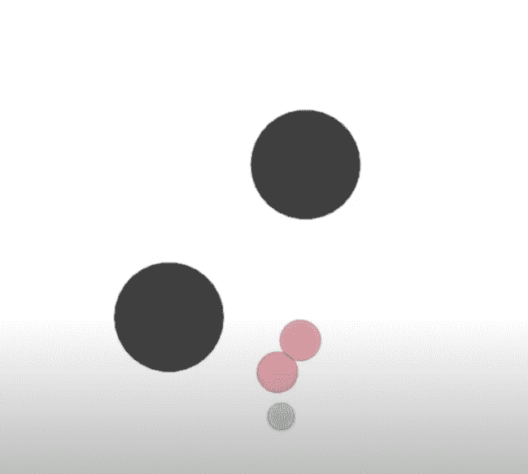
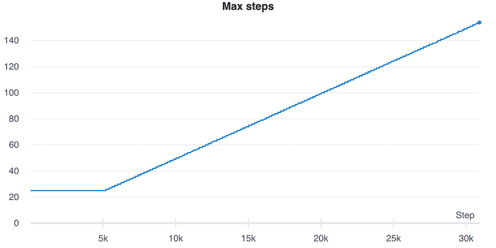
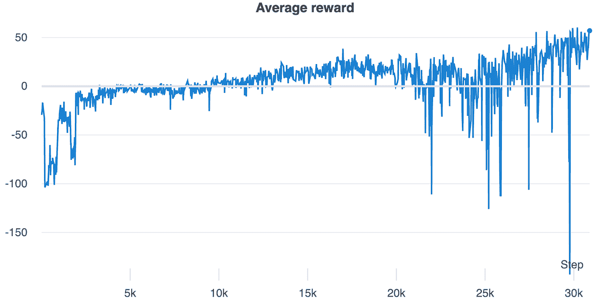
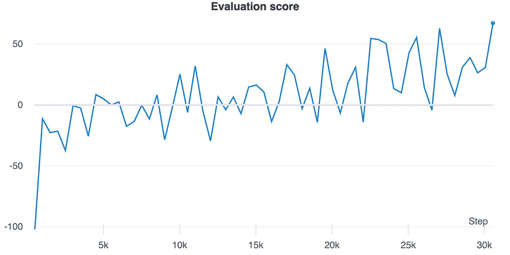
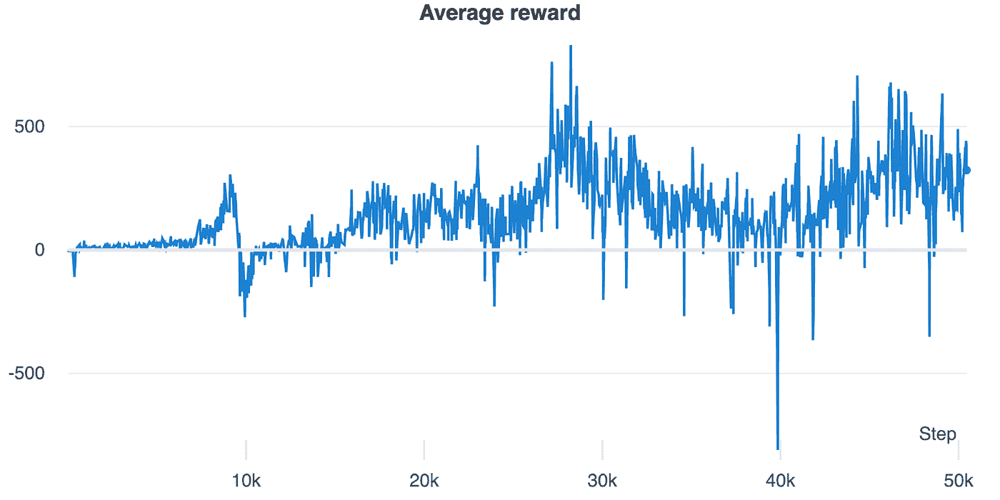
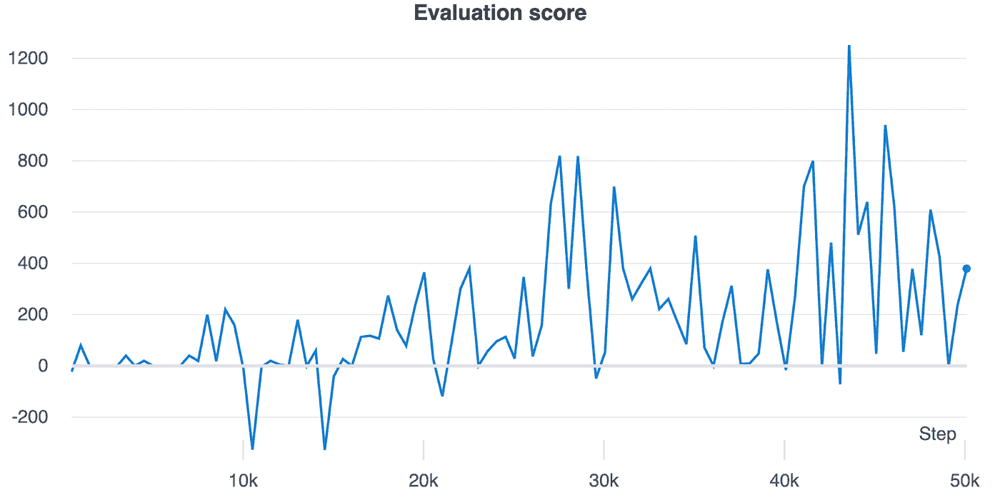

# 多智能体强化学习:OpenAI 的 MADDPG

> 原文：<https://medium.com/analytics-vidhya/multi-agent-reinforcement-learning-openais-maddpg-a741c6cf3869?source=collection_archive---------10----------------------->

探索 OpeanAI 的 MADDPG 算法解决多智能体环境问题。



作者安东尼奥·利斯

# 介绍

大家好，在通过经典的深度学习应用程序进行了一点有趣的练习后，我们将回到解决强化学习环境。

今天我们将使用 OpenAI 的 MADDPG 算法来解决一个有多个代理的环境。这将是不同的，同时与我们目前所看到的相似。对于多个代理，我们增加了复杂性和计算要求，但是，正如我们将看到的，我们将使用我们所学的知识来解决单代理环境。

和往常一样，我们将使用 Tensorflow 2 从头开始实现一切。但是考虑到 MADDPG 是 DDPG 的多代理版本，我们将在帖子中使用大量关于 [DDPG](https://antonai.blog/?p=260#more-260) 的代码。所以如果你没有读过，我建议你先读一读。

# 多代理环境

强化学习领域的大多数发展都是在单代理领域。但是有许多重要的用例，其中多个代理同时学习协调它们的动作。

在多智能体环境中，由于智能体的决策策略不断变化，存在一个主要的挑战，即从任何单个智能体的角度来看，环境的非平稳性。

标准的 RL 算法并不真正适合多代理环境。研究人员提出了不同的方法来处理这种非平稳性，可以分为集中式和分散式架构。

# 集中式和分散式架构

在分散式学习中，代理人彼此分开训练。每个代理都使用本地观察作为输入来训练其策略网络。为了处理非平稳性，通常使用某种形式的自我游戏，其中代理与他们当前或以前的版本进行游戏，以学习最佳策略。

在集中学习中，代理以某种方式集体建模。 [Lowe et al. (2017)](https://arxiv.org/pdf/1706.02275.pdf) 提出了 MADDPG，一种使用确定性策略梯度算法的多代理集中式架构。该算法基于行动者-批评家体系结构，有一个集中的批评家和一个分散的行动者。集中的评论家建议如何通过查看全局信息来更新行动者策略。由于每个代理都可以通过评论家访问所有其他代理的观察和动作，所以策略梯度估计以其他代理的策略为条件，因此解决了非平稳性。在测试过程中，集中的批评家被移除，只留下参与者、他们的策略和本地观察。

# MADDPG

来自 OpenAI、加州大学伯克利分校和麦吉尔大学的研究人员在 Lowe 等人(2017) 的论文[中提出了 MADDPG。MADDPG 是基于行动者-批评家框架的深度确定性策略梯度算法(DDPG)的多代理对等体。](https://arxiv.org/pdf/1706.02275.pdf)

在 DDPG，我们只有一个代理人。在这里，我们有多个代理人，他们有自己的演员和评论家网络。actor-network 将代理的本地观察作为输入，并输出推荐的动作，因此与 DDPG actor-network 相比并无新意。相反，批评家网络将环境的全局观察作为输入，因此它不仅将环境的状态和代理的动作作为输入，还将局部观察和其他代理的动作作为输入。critic 网络的输出仍然是 q 值估计。所以评论家网络只在训练部分使用，给演员一个全局视野，以适应全局环境和其他代理的行动。通过这种方式，参与者可以学习合作或竞争策略。此外，由于每个智能体的训练是以所有其他智能体的观察和动作为条件的，所以每个智能体都将环境视为静止的。

像在 DDPG 一样，为了提高学习稳定性，我们也将为每个代理使用一个目标行动者和评论家网络，具有相同的软更新机制。像在 DDPG 一样，我们也将使用一些噪音来改善探索。与我们在 [DDPG](https://antonai.blog/?p=260#more-260) 的帖子中实现的不同，我们不打算实现一个奥恩斯坦-乌伦贝克过程，但是我们将使用一个简单的随机噪声。

# 多智能体粒子环境

我们将解决论文中使用的相同环境[混合合作-竞争环境](https://arxiv.org/pdf/1706.02275.pdf)的多主体行动者-批评家。你可以在这里找到 python 包[，里面有关于如何安装和使用它的所有说明。](https://github.com/openai/multiagent-particle-envs)

我们可以开始探索一个简单的环境来理解库是如何工作的:

```
*def* make_env(scenario_name, benchmark=False):
    '''
    Creates a MultiAgentEnv object as env. This can be used similar to a gym
    environment by calling env.reset() and env.step().
    Use env.render() to view the environment on the screen.
    Input:
        scenario_name   :   name of the scenario from ./scenarios/ to be Returns
                            (without the .py extension)
        benchmark       :   whether you want to produce benchmarking data
                            (usually only done during evaluation)
    Some useful env properties (see environment.py):
        .observation_space  :   Returns the observation space for each agent
        .action_space       :   Returns the action space for each agent
        .n                  :   Returns the number of Agents
    '''
    from multiagent.environment import MultiAgentEnv
    import multiagent.scenarios as scenarios

    # load scenario from script
    scenario = scenarios.load(scenario_name + ".py").Scenario()
    # create world
    world = scenario.make_world()
    # create multiagent environment
    if benchmark:        
        env = MultiAgentEnv(world, scenario.reset_world,     scenario.reward, scenario.observation, scenario.benchmark_data)
    else:
        env = MultiAgentEnv(world, scenario.reset_world, scenario.reward, scenario.observation)
    return env

env = make_env("simple_adversary")
print(env.action_space)
```

*【离散(5)，离散(5)，离散(5)】*

我们使用了 make_env 函数，您可以在库的 Github 库中找到它。如您所见，在简单的对手环境中，我们有三个动作空间，因此我们有三个代理需要输出长度为 5 的动作向量。我们还可以看到三个代理的输入:

```
print(env.observation_space)
```

*【Box(-inf，inf，(8，)float32)，Box(-inf，inf，(10，)float32)，Box(-inf，INF，(10，)float 32)】*

因此，对于第一个代理，我们有一个(8，0)连续输入向量，对于另外两个代理，我们有一个(10，)连续输入向量。

我们将使用简单的对手作为开发环境，然后我们也将解决简单的标签，以查看我们的算法如何执行解决不同的环境。

从文档中:

*   简单对手:1 个对手(红色)，N 个好特工(绿色)，N 个地标(通常 N=2)。所有特工观察路标和其他特工的位置。一个标志是“目标标志”(绿色)。优秀的特工根据他们中的一个与目标地标的接近程度得到奖励，但是如果对手接近目标地标，则得到负面奖励。对手的奖励基于它与目标的距离，但它不知道哪个地标是目标地标。所以优秀的特工必须学会“分头行动”,覆盖所有的地标来欺骗对手。
*   简单的标签:捕食者-猎物环境。优秀的特工(绿色)速度更快，想要避免被对手击中(红色)。对手比较慢，想打好代理。障碍物(黑色大圆圈)挡住了去路。

# 重放缓冲器

我们从实现重放缓冲区开始，在这里我们保存状态、代理的动作、奖励等等。该代码与为 DDPG 实现的代码非常相似，但我们需要考虑到我们有多个代理的事实，所以有点不同:

```
*class* ReplayBuffer():
    *def* __init__(self, env, buffer_capacity=BUFFER_CAPACITY, batch_size=BATCH_SIZE, min_size_buffer=MIN_SIZE_BUFFER):
        self.buffer_capacity = buffer_capacity
        self.batch_size = batch_size
        self.min_size_buffer = min_size_buffer
        self.buffer_counter = 0
        self.n_games = 0
        self.n_agents = env.n
        self.list_actors_dimension = [env.observation_space[index].shape[0] for index in *range*(self.n_agents)]
        self.critic_dimension = *sum*(self.list_actors_dimension)        
        self.list_actor_n_actions = [env.action_space[index].n for index in *range*(self.n_agents)]

        self.states = np.zeros((self.buffer_capacity, self.critic_dimension))
        self.rewards = np.zeros((self.buffer_capacity, self.n_agents))
        self.next_states = np.zeros((self.buffer_capacity, self.critic_dimension))
        self.dones = np.zeros((self.buffer_capacity, self.n_agents), dtype=*bool*)

        self.list_actors_states = []
        self.list_actors_next_states = []
        self.list_actors_actions = []

        for n in *range*(self.n_agents):
            self.list_actors_states.append(np.zeros((self.buffer_capacity, self.list_actors_dimension[n])))
            self.list_actors_next_states.append(np.zeros((self.buffer_capacity, self.list_actors_dimension[n])))
            self.list_actors_actions.append(np.zeros((self.buffer_capacity, self.list_actor_n_actions[n])))
```

我们正在初始化 NumPy 向量列表来存储多个代理的所有状态和动作，同时我们使用单个 NumPy 向量来存储全局状态和奖励。

```
 *def* __len__(self):
        return self.buffer_counter

    *def* check_buffer_size(self):
        return self.buffer_counter >= self.batch_size and self.buffer_counter >= self.min_size_buffer

    *def* update_n_games(self):
        self.n_games += 1

    *def* add_record(self, actor_states, actor_next_states, actions, state, next_state, reward, done):

        index = self.buffer_counter % self.buffer_capacity

        for agent_index in *range*(self.n_agents):
            self.list_actors_states[agent_index][index] = actor_states[agent_index]
            self.list_actors_next_states[agent_index][index] = actor_next_states[agent_index]
            self.list_actors_actions[agent_index][index] = actions[agent_index]

        self.states[index] = state
        self.next_states[index] = next_state
        self.rewards[index] = reward
        self.dones[index] = done

        self.buffer_counter += 1
```

add_record 函数需要考虑到我们有多个代理的事实，所以我们使用 for-cycle 来更新之前初始化的列表中的状态和动作。在多智能体粒子环境中，智能体由数字标识，所以我们可以只使用列表和索引。在其他多代理环境中，每个代理都有一个名字，在这种情况下，我们应该使用一些字典，而不是使用名字作为关键字的列表。

```
 *def* get_minibatch(self):
        # If the counter is less than the capacity we don't want to take zeros records, 
        # if the cunter is higher we don't access the record using the counter 
        # because older records are deleted to make space for new one
        buffer_range = *min*(self.buffer_counter, self.buffer_capacity)

        batch_index = np.random.choice(buffer_range, self.batch_size, replace=False)

        # Take indices
        state = self.states[batch_index]
        reward = self.rewards[batch_index]
        next_state = self.next_states[batch_index]
        done = self.dones[batch_index]

        actors_state = [self.list_actors_states[index][batch_index] for index in *range*(self.n_agents)]
        actors_next_state = [self.list_actors_next_states[index][batch_index] for index in *range*(self.n_agents)]
        actors_action = [self.list_actors_actions[index][batch_index] for index in *range*(self.n_agents)]

        return state, reward, next_state, done, actors_state, actors_next_state, actors_action

    *def* save(self, folder_path):
        """
        Save the replay buffer
        """
        if not os.path.isdir(folder_path):
            os.mkdir(folder_path)

        np.save(folder_path + '/states.npy', self.states)
        np.save(folder_path + '/rewards.npy', self.rewards)
        np.save(folder_path + '/next_states.npy', self.next_states)
        np.save(folder_path + '/dones.npy', self.dones)

        for index in *range*(self.n_agents):
            np.save(folder_path + '/states_actor_{}.npy'.*format*(index), self.list_actors_states[index])
            np.save(folder_path + '/next_states_actor_{}.npy'.*format*(index), self.list_actors_next_states[index])
            np.save(folder_path + '/actions_actor_{}.npy'.*format*(index), self.list_actors_actions[index])

        dict_info = {"buffer_counter": self.buffer_counter, "n_games": self.n_games}

        with *open*(folder_path + '/dict_info.json', 'w') as f:
            json.dump(dict_info, f)

    *def* load(self, folder_path):
        self.states = np.load(folder_path + '/states.npy')
        self.rewards = np.load(folder_path + '/rewards.npy')
        self.next_states = np.load(folder_path + '/next_states.npy')
        self.dones = np.load(folder_path + '/dones.npy')

        self.list_actors_states = [np.load(folder_path + '/states_actor_{}.npy'.*format*(index)) for index in *range*(self.n_agents)]
        self.list_actors_next_states = [np.load(folder_path + '/next_states_actor_{}.npy'.*format*(index)) for index in *range*(self.n_agents)]
        self.list_actors_actions = [np.load(folder_path + '/actions_actor_{}.npy'.*format*(index)) for index in *range*(self.n_agents)]

        with *open*(folder_path + '/dict_info.json', 'r') as f:
            dict_info = json.load(f)
        self.buffer_counter = dict_info["buffer_counter"]
        self.n_games = dict_info["n_games"]
```

然后我们有 get_minibatch 和 save/load 函数，它们非常类似于单代理版本，但是我们总是使用列表和索引来获取和保存/加载关于代理的观察结果。

# 网络

我们需要为每个代理实现一个 Actor 和一个 Critic，这里我们可以使用为 DDPG 实现的相同代码，逻辑是相同的，但是 Critic 的状态输入与单代理中的 Actor 不同:

```
*class* Critic(tf.keras.Model):
    *def* __init__(self, name, hidden_0=CRITIC_HIDDEN_0, hidden_1=CRITIC_HIDDEN_1):

        *super*(Critic, self).__init__()

        self.hidden_0 = hidden_0
        self.hidden_1 = hidden_1

        self.net_name = name

        self.dense_0 = Dense(self.hidden_0, activation='relu')
        self.dense_1 = Dense(self.hidden_1, activation='relu')
        self.q_value = Dense(1, activation=None)

    *def* call(self, state, actors_actions):
        state_action_value = self.dense_0(tf.concat([state, actors_actions], axis=1)) # multiple actions
        state_action_value = self.dense_1(state_action_value)

        q_value = self.q_value(state_action_value)

        return q_value

*class* Actor(tf.keras.Model):
    *def* __init__(self, name, actions_dim, hidden_0=ACTOR_HIDDEN_0, hidden_1=ACTOR_HIDDEN_1):
        *super*(Actor, self).__init__()
        self.hidden_0 = hidden_0
        self.hidden_1 = hidden_1
        self.actions_dim = actions_dim

        self.net_name = name

        self.dense_0 = Dense(self.hidden_0, activation='relu')
        self.dense_1 = Dense(self.hidden_1, activation='relu')
        self.policy = Dense(self.actions_dim, activation='sigmoid') # we want something beetween zero and one

    *def* call(self, state):
        x = self.dense_0(state)
        policy = self.dense_1(x)
        policy = self.policy(policy)
        return policy
```

# 代理人

我们现在可以定义单个代理的逻辑。我们在这里不打算像对单个对手那样定义损失函数，因为我们需要对环境有一个全局的看法来为评论家定义损失函数:

```
*class* Agent:
    *def* __init__(self, env, n_agent, actor_lr=ACTOR_LR, critic_lr=CRITIC_LR, gamma=GAMMA, tau=TAU):

        self.gamma = gamma
        self.tau = tau
        self.actor_lr = actor_lr
        self.critic_lr = critic_lr

        self.actor_dims = env.observation_space[n_agent].shape[0]
        self.n_actions = env.action_space[n_agent].n

        self.agent_name = "agent_number_{}".*format*(n_agent)

        self.actor = Actor("actor_" + self.agent_name, self.n_actions)
        self.critic = Critic("critic_" + self.agent_name)
        self.target_actor = Actor("target_actor_" + self.agent_name, self.n_actions)
        self.target_critic = Critic("critic_" + self.agent_name)

        self.actor.*compile*(optimizer=opt.Adam(learning_rate=actor_lr))
        self.critic.*compile*(optimizer=opt.Adam(learning_rate=critic_lr))
        self.target_actor.*compile*(optimizer=opt.Adam(learning_rate=actor_lr))
        self.target_critic.*compile*(optimizer=opt.Adam(learning_rate=critic_lr))

        actor_weights = self.actor.get_weights()
        critic_weights = self.critic.get_weights()

        self.target_actor.set_weights(actor_weights)
        self.target_critic.set_weights(critic_weights)

    *def* update_target_networks(self, tau):
        actor_weights = self.actor.weights
        target_actor_weights = self.target_actor.weights
        for index in *range*(*len*(actor_weights)):
            target_actor_weights[index] = tau * actor_weights[index] + (1 - tau) * target_actor_weights[index]

        self.target_actor.set_weights(target_actor_weights)

        critic_weights = self.critic.weights
        target_critic_weights = self.target_critic.weights

        for index in *range*(*len*(critic_weights)):
            target_critic_weights[index] = tau * critic_weights[index] + (1 - tau) * target_critic_weights[index]

        self.target_critic.set_weights(target_critic_weights)

    *def* get_actions(self, actor_states):
        noise = tf.random.uniform(shape=[self.n_actions])
        actions = self.actor(actor_states)
        actions = actions + noise

        return actions.numpy()[0]

    *def* save(self, path_save):
        self.actor.save_weights(f"{path_save}/{self.actor.net_name}.h5")
        self.target_actor.save_weights(f"{path_save}/{self.target_actor.net_name}.h5")
        self.critic.save_weights(f"{path_save}/{self.critic.net_name}.h5")
        self.target_critic.save_weights(f"{path_save}/{self.target_critic.net_name}.h5")

    *def* load(self, path_load):
        self.actor.load_weights(f"{path_load}/{self.actor.net_name}.h5")
        self.target_actor.load_weights(f"{path_load}/{self.target_actor.net_name}.h5")
        self.critic.load_weights(f"{path_load}/{self.critic.net_name}.h5")
        self.target_critic.load_weights(f"{path_load}/{self.target_critic.net_name}.h5")
```

都很标准。与 DDPG 相比，更大的区别是缺少奥恩斯坦-乌伦贝克噪声，为了简单起见，用简单的均匀噪声代替。至于 DDPG，我们也使用目标评论家和演员来稳定训练。

# 超级代理

我们现在要定义引导代理行动的全局逻辑。我把这个模块叫做*“超级代理人”*，但是实际上并没有一个超级代理人，而是一群*“超级评论家”*帮助单个演员改进他们的政策:

```
*class* SuperAgent:
    *def* __init__(self, env, path_save=PATH_SAVE_MODEL, path_load=PATH_LOAD_FOLDER):
        self.path_save = path_save
        self.path_load = path_load
        self.replay_buffer = ReplayBuffer(env)
        self.n_agents = *len*(env.agents)
        self.agents = [Agent(env, agent) for agent in *range*(self.n_agents)]

    *def* get_actions(self, agents_states):
        list_actions = [self.agents[index].get_actions(agents_states[index]) for index in *range*(self.n_agents)]
        return list_actions

    *def* save(self):
        date_now = time.strftime("%Y%m%d%H%M")
        full_path = f"{self.path_save}/save_agent_{date_now}"
        if not os.path.isdir(full_path):
            os.makedirs(full_path)

        for agent in self.agents:
            agent.save(full_path)

        self.replay_buffer.save(full_path)

    *def* load(self):
        full_path = self.path_load
        for agent in self.agents:
            agent.load(full_path)

        self.replay_buffer.load(full_path)
```

我们首先定义重放缓冲区、代理和 get_actions 函数，该函数只调用单个参与者的 get_actions 函数。相同的逻辑用于仅调用单个代理的保存和加载的保存和加载功能，相同的功能用于重放缓冲区。

让我们进入有趣的部分，即代理的培训:

```
*def* train(self):
        if self.replay_buffer.check_buffer_size() == False:
            return

        state, reward, next_state, done, actors_state, actors_next_state, actors_action = self.replay_buffer.get_minibatch()

        states = tf.convert_to_tensor(state, dtype=tf.float32)
        rewards = tf.convert_to_tensor(reward, dtype=tf.float32)
        next_states = tf.convert_to_tensor(next_state, dtype=tf.float32)

        actors_states = [tf.convert_to_tensor(s, dtype=tf.float32) for s in actors_state]
        actors_next_states = [tf.convert_to_tensor(s, dtype=tf.float32) for s in actors_next_state]
        actors_actions = [tf.convert_to_tensor(s, dtype=tf.float32) for s in actors_action]

        with tf.GradientTape(persistent=True) as tape:
            target_actions = [self.agents[index].target_actor(actors_next_states[index]) for index in *range*(self.n_agents)]
            policy_actions = [self.agents[index].actor(actors_states[index]) for index in *range*(self.n_agents)]

            concat_target_actions = tf.concat(target_actions, axis=1)
            concat_policy_actions = tf.concat(policy_actions, axis=1)
            concat_actors_action = tf.concat(actors_actions, axis=1)

            target_critic_values = [tf.squeeze(self.agents[index].target_critic(next_states, concat_target_actions), 1) for index in *range*(self.n_agents)]
            critic_values = [tf.squeeze(self.agents[index].critic(states, concat_actors_action), 1) for index in *range*(self.n_agents)]
            targets = [rewards[:, index] + self.agents[index].gamma * target_critic_values[index] * (1-done[:, index]) for index in *range*(self.n_agents)]
            critic_losses = [tf.keras.losses.MSE(targets[index], critic_values[index]) for index in *range*(self.n_agents)]

            actor_losses = [-self.agents[index].critic(states, concat_policy_actions) for index in *range*(self.n_agents)]
            actor_losses = [tf.math.reduce_mean(actor_losses[index]) for index in *range*(self.n_agents)]

        critic_gradients = [tape.gradient(critic_losses[index], self.agents[index].critic.trainable_variables) for index in *range*(self.n_agents)]
        actor_gradients = [tape.gradient(actor_losses[index], self.agents[index].actor.trainable_variables) for index in *range*(self.n_agents)]

        for index in *range*(self.n_agents):
            self.agents[index].critic.optimizer.apply_gradients(*zip*(critic_gradients[index], self.agents[index].critic.trainable_variables))
            self.agents[index].actor.optimizer.apply_gradients(*zip*(actor_gradients[index], self.agents[index].actor.trainable_variables))
            self.agents[index].update_target_networks(self.agents[index].tau)
```

我们从调用 get_minibatch 函数从重放缓冲区获取观察值开始。然后我们把所有的 NumPy 向量转换成张量流向量。然后，我们从目标参与者和标准参与者获得目标和策略操作。我们在它们上创建全局视图，其中还包括连接所有代理的所采取的动作、策略和目标动作的所采取的动作。因此，我们可以从批评者那里获得价值，向他们提供关于状态和行为的全局观点，并始终使用贝尔曼方程来定义损失函数。

给定 q 值，我们可以定义演员损失，对评论家和演员应用梯度，并软更新目标网络。

# Wandb 初始化和训练循环

我们现在可以初始化 wandb 配置:

```
config = *dict*(
  learning_rate_actor = ACTOR_LR,
  learning_rate_critic = CRITIC_LR,
  batch_size = BATCH_SIZE,
  architecture = "MADDPG",
  infra = "Colab",
  env = ENV_NAME
)

wandb.init(
  project=f"tensorflow2_madddpg_{ENV_NAME.lower()}",
  tags=["MADDPG", "RL"],
  config=config,
)
```

然后，如果我们要重新开始培训会话，我们将初始化环境并加载一个经过培训的模型:

```
env = make_env(ENV_NAME)
super_agent = SuperAgent(env)

scores = []

if PATH_LOAD_FOLDER is not None:
    print("loading weights")
    actors_state = env.reset()
    actors_action = super_agent.get_actions([actors_state[index][None, :] for index in *range*(super_agent.n_agents)])
    [super_agent.agents[index].target_actor(actors_state[index][None, :]) for index in *range*(super_agent.n_agents)]
    state = np.concatenate(actors_state)
    actors_action = np.concatenate(actors_action)
    [super_agent.agents[index].critic(state[None, :], actors_action[None, :]) for index in *range*(super_agent.n_agents)]
    [super_agent.agents[index].target_critic(state[None, :], actors_action[None, :]) for index in *range*(super_agent.n_agents)]
    super_agent.load()

    print(super_agent.replay_buffer.buffer_counter)
    print(super_agent.replay_buffer.n_games
```

最后，我们实现了训练循环:

```
for n_game in tqdm(*range*(MAX_GAMES)):
    start_time = time.time()
    actors_state = env.reset()
    done = [False for index in *range*(super_agent.n_agents)]
    score = 0
    step = 0

    if (super_agent.replay_buffer.n_games + 1) > 5000:
        MAX_STEPS = *int*((super_agent.replay_buffer.n_games + 1) / 200)

    while not *any*(done):
        actors_action = super_agent.get_actions([actors_state[index][None, :] for index in *range*(super_agent.n_agents)])
        actors_next_state, reward, done, info = env.step(actors_action)

        state = np.concatenate(actors_state)
        next_state = np.concatenate(actors_next_state)

        super_agent.replay_buffer.add_record(actors_state, actors_next_state, actors_action, state, next_state, reward, done)

        actors_state = actors_next_state

        score += *sum*(reward)
        step += 1
        if step >= MAX_STEPS:
            break

    if super_agent.replay_buffer.check_buffer_size():
        super_agent.train()

    super_agent.replay_buffer.update_n_games()

    scores.append(score)

    wandb.log({'Game number': super_agent.replay_buffer.n_games, '# Episodes': super_agent.replay_buffer.buffer_counter, 
               "Average reward": *round*(np.mean(scores[-10:]), 2), \
                      "Time taken": *round*(time.time() - start_time, 2), 'Max steps': MAX_STEPS})

    if (n_game + 1) % EVALUATION_FREQUENCY == 0 and super_agent.replay_buffer.check_buffer_size():
        actors_state = env.reset()
        done = [False for index in *range*(super_agent.n_agents)]
        score = 0
        step = 0
        while not *any*(done):
            actors_action = super_agent.get_actions([actors_state[index][None, :] for index in *range*(super_agent.n_agents)])
            actors_next_state, reward, done, info = env.step(actors_action)
            state = np.concatenate(actors_state)
            next_state = np.concatenate(actors_next_state)
            actors_state = actors_next_state
            score += *sum*(reward)
            step += 1
            if step >= MAX_STEPS:
                break
        wandb.log({'Game number': super_agent.replay_buffer.n_games, 
                   '# Episodes': super_agent.replay_buffer.buffer_counter, 
                   'Evaluation score': score, 'Max steps': MAX_STEPS})

    if (n_game + 1) % SAVE_FREQUENCY == 0 and super_agent.replay_buffer.check_buffer_size():
        print("saving weights and replay buffer...")
        super_agent.save()
        print("saved")
```

都很标准。唯一具体的是 MAX_STEPS 参数，我们随着玩游戏的次数而增加。这是因为粒子环境并没有真正结束，所以我们需要一个参数来摆脱循环。

# 结果

我们现在可以看到结果。我们从简单的对手开始:



在第一幅图中，我们可以看到如何增加 MAX_STEPS 参数。在第二个例子中，我们可以看到训练中的平均回报是如何变化的。正如你所看到的，有很大的可变性，大部分是负面的结果，大部分是正面的结果。这是典型的 DDPG，我们也看到了它在单一代理对应。在最后一个情节中，我们可以看到评价分数如何随着时间的推移而增加，直到我们停止它，但代理们正在学习。

我们使用简单的对手环境来开发一切，但我们也在另一个环境 simple tag 上测试它，以确保它能够工作:



从这两个图中，我们可以看到代理正在学习，仍然有很高的可变性，在这种情况下，10k 游戏的性能在变好之前变得最差。

# 结论

因此，在这篇文章中，我们展示了如何实现和使用多智能体 MADDPG 来解决 OpenAI 提供的玩具环境，复制了 Lowe 等人(2017) 在论文[混合合作竞争环境的多智能体演员-评论家中所取得的成就。](https://arxiv.org/pdf/1706.02275.pdf)

你可以在我的 [Github](https://github.com/antonai91/reinforcement_learning/tree/master/maddpg) 上找到所有代码。有任何问题，你可以通过 [Linkedin](https://www.linkedin.com/in/lisiantonio/) 联系我。

如果你喜欢这篇文章，分享给你的朋友和同事吧！我会在下一篇文章中看到你。与此同时，要小心，保持安全，记住*不要成为另一块墙砖*。

Anton.ai

*原载于 2021 年 5 月 12 日*[*https://antonai . blog*](https://antonai.blog/multi-agent-reinforcement-learning-openais-maddpg/)*。*