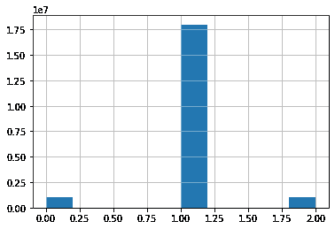

# 多臂土匪为登陆页的选择

> 原文：<https://medium.com/analytics-vidhya/multi-armed-bandit-for-the-selection-of-the-landing-page-d533fc2c4e71?source=collection_archive---------15----------------------->

这篇文章最初出现在*cienciadedatos.net*，你可以在这里找到西班牙语[的原始版本。](https://www.cienciadedatos.net/documentos/py28-k-armed-bandit-evaluar-versiones-web-python.html)


在这篇文章中，我们将探讨**强化学习**，更准确地说是多臂土匪如何让我们减少必要的时间来评估一个新网站**版本是否更有效**来增加被号召行动的客户数量。

# 商业背景

营销的一个关键方面是将潜在客户对我们网站的访问转化为对我们主页的 ***CTA*** (行动号召)。

这就是为什么一个有吸引力的网站青睐这个 *CTA* ，无论是注册成为用户，**保持滚动**，还是下载白皮书，都是极其重要的原因之一。

但是，当我们想要部署一个新版本，但又不确定其效率时，会发生什么呢？在这些情况下，我们通常做的是**将一部分流量**导向旧版本，一部分导向新版本，直到建立了有意义的用户样本，并且可以进行适当的评估。根据策略的不同，这种 **A/B 测试**可以是平衡的(50 / 50)、金丝雀部署(新网站的 1%)等。

这种方法的问题在于它是事后的。在两个版本都上线一段时间后，我们正在承受**机会成本**(同时保持效率最低的版本在线)，在当前竞争日益激烈的环境下，这是不可取的，甚至是不可接受的。

# **利用强化学习**

在这种情况下，我们想要比较我们的欢迎页面的 2 个以上版本，强化学习允许我们加快决策过程并减少机会成本，逐渐倾向于我们的客户反应更好的版本，并逐渐减少指向那些效率较低和令人满意的替代方案的流量。

在培训期间，我们将不得不在选择那个时间点的最佳选项或**开发**，以及将流量引导到那个时间效率较低的版本或**探索**之间找到平衡，以不断学习更多内容。

# **多臂土匪**

在强化学习中，代理通过**与环境**交互来生成自己的训练数据。代理人必须通过反复试验来了解其行为的后果，而不是从该行为中获得先验知识。

在多臂强盗的特殊情况下，我们有 k 种不同的选择或行动。在选择了一个动作之后，然后**代理收到**来自概率分布的数字奖励。这种奖励必须是固定的，取决于所选择的行动。我们的目标是在预定的时间步数内，例如 1000 步，最大化总回报。

在我们的问题中，每个行动在被选择后都有一个平均预期回报，称为行动价值或 q。对于我们的任何行动:


如果我们事先知道每个动作的**真实值**，那么多臂强盗问题就变得简单了，因为期望值最高的动作将被选择。我们假设我们不能确定地知道它，尽管我们可以**估计**这些*Qt(a)*在采取行动 *a* 后在时间戳 *t* 的预期回报，并且我们将试图使它们尽可能接近*q*∫(*a*)。

有关*多臂土匪*及其实现所需伪代码的更多详细信息，请参考*强化学习:简介，第 25–36 页*。

在每个时间点，我们将在概率为 *p* 的探索和概率为 *(1-p)* 的利用之间进行选择，选择到该时间点为止具有**最高估计** q 值的动作。在强化学习中，这种类型的智能体被称为*ε贪婪*。

# **用例形式化**

我们将考虑以下因素:

*   三个不同版本的网站要进行评估。当前版本(0)和替代版本(1)和(2)。
*   我们将假设有 100，000 名访问者到达我们的网站，并要求被重定向到任何版本(使用负载平衡器)。
*   如果访问者进行了 CTA，则交互是成功的。

## **将其框架化为强化学习问题**

*   这组动作的基数为 3:旧版本、新版本 1 和新版本 2。
*   如果 CTA 完成，奖励为 1，否则为 0。

## 实验

*   **实验一:**评估一个探索概率为 15%的智能体。
*   **实验二:**评估 0%-50%之间不同探索概率的智能体。

## 其他考虑

*   我们目前的版本有 50%的效率，并将被建模为 0 和 1 之间的均匀分布。
*   新版本 1 的 CTA 效率为 75%，新版本 2 为 25%。

因此，我们实验的**累积预期回报**将是 50.000，与当前版本一致。(100.000 个访问者 x 50%的 CTA 概率)，其上限为 75.000。我们将评估哪种**学习策略**提供最高的累积回报。

# 履行

## 平均累积报酬的理论范围


平均累积奖励(超过 100，000 名访客)

## 环境

我们实现了一个简单的环境，在这个环境中，每个行动都以一定的概率 *pa* 取得成功

我们验证了行动 0 的**预期回报约为时间步长的 50%，行动 1 的 75%，行动 2 的 25%。**

## 代理人

# 实验 1:具有 15%探索率的代理

在第一个实验中，我们将在 200 次模拟 100，000 个客户到来的过程中评估代理的行为。探索的概率将为 15%，最大理论回报为 0.75，对应于进行 *CTA* 的四分之三客户的**转化率**。

## 平均累积报酬


## 选定的操作



实验 1 贪婪代理的行动选择

我们观察到代理人很快选择了**行动 1**，这是回报最高的行动，尽管达到了 71%的比率，比理论最大值低了 4 个点。无论如何，新版本提供了比当前登录页面至少 21%的改进，而机会成本只有 4%。

还可以验证，对应于更有效的新版本的动作 1 被选择，其频率比其他两个动作高几个**数量级**。

最后，可以检查每个估计动作值是否接近真实值:

```
action 1:0.501
action 2:0.750
action 3:0.246
```

# 实验 2:勘探和开采率

我们现在将进行第二次实验，使用不同的勘探/开采比率来评估是否有可能缩小机会成本差距。

将比较 0%(纯贪婪)和 50%之间的五个不同选项，这是一个**二分决策**，其中每个行动都是在完全随机或当前最佳行动之间进行抛硬币选择的结果。

找到利用最佳行动或探索新行动之间的平衡至关重要，因为低探索率将系统地提供次优选择，而高价值将带来代理人不稳定的**行为，不提供真正的商业价值。**

## 平均累积报酬


## 选定的操作


在这个实验中，我们可以检查参数 *ϵ* 的**不同值**如何影响代理的学习。

一个贪婪的代理很快收敛到 0.6 并被卡住，而这个**随机**探索的更高值，范围从 p 0.4 到 p 0.5，获得略微优越的性能，但总是低于 0.65。

*ϵ* 的最佳值在 1%到 10%之间，前者获得最高的平均累积回报，后者上升**更快**但收敛到理论最大值以下 0.72 . 3%。

在动作直方图中，我们可以看到代理如何探索动作 0 和 2，但很快选择动作 1 作为最佳选择。

# 先验知识整合

到目前为止，我们已经从每个版本的预期转换率考虑了**没有先前的经验**。

在这种特殊情况下，这并不完全正确，因为我们必须继续跟踪初始版本及其度量，并且这种先验知识可以被**利用**来初始化每个动作 *Q0(a)的值。*

我们将以这个实验结束，用 0.5 作为每个版本的预期转化率来**初始化**所有的动作。

## 具有先验知识的平均累积报酬


先验知识 epsilon 贪婪代理奖励

在这种情况下，我们可以评估使用先验知识的**潜力**，这不仅可以提高大多数策略的平均累积回报，还可以加快学习过程。

比较在有先验知识和没有先验知识的情况下的最佳代理，验证了尽管收敛到相同的值，但是利用先验知识的代理做得更快**。**

## **有(无)先验知识的平均累积报酬**

****

**无论事先是否知情，都是最佳代理**

# **结论**

**在本文中，我们探讨了强化学习如何帮助我们决定哪个登录页面更适合我们的**客户漏斗**，从用户那里收集在线反馈。**

**使用*多臂大盗*，我们已经看到了正确平衡探索和利用具有**最高估计**值的动作以及利用先验知识来获得每个动作的更快更准确的*q*∫(*a*)的影响。**