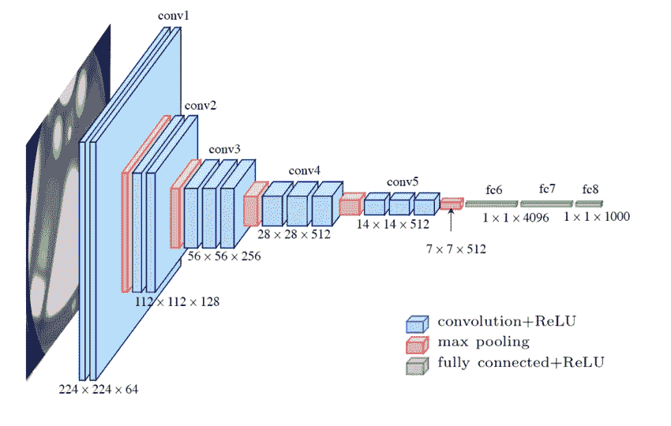
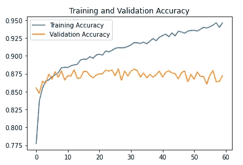

# 基于深度卷积神经网络迁移学习的多类图像分类

> 原文：<https://medium.com/analytics-vidhya/multi-class-image-classification-using-transfer-learning-with-deep-convolutional-neural-networks-eab051cde3fb?source=collection_archive---------3----------------------->

图像分类是一个有监督的机器学习问题，它试图将整个图像作为一个整体来理解。它使用一组预定义的目标类(图像中要识别的对象)，并使用带标签的示例照片训练模型来识别它们。猫 vs 狗是最基本的图像分类问题。在这篇文章中，我们将尝试对世界各地的自然景观进行分类。

我们将在其中一项[图像分类挑战](https://www.kaggle.com/puneet6060/intel-image-classification)中使用英特尔提供的数据集。

6 个类别—“建筑物”(0)、“森林”(1)、“冰川”(2)、“山”(3)、“海”(4)、“街道”(5)

图像类别

这里是完整的笔记本，有代码供您参考。

 [## 总体神经网络 87.2%(vgg 16+resnet 50+InceptionV3)

### 使用 Kaggle 笔记本电脑探索和运行机器学习代码|使用来自英特尔图像分类的数据

www.kaggle.com](https://www.kaggle.com/krishnakumarkk/ensemble-nn) 

# **转移学习**

迁移学习(TL)是机器学习(ML)中的一个研究问题，它专注于存储在解决一个问题时获得的知识，并将其应用于另一个不同但相关的问题。例如，在学习识别汽车时获得的知识可以应用于识别卡车。

在本文中，我们将重点介绍 VGG16、Resnet50 和 InceptionV3。Keras 提供许多其他 TL 型号，你可以在这里查看[。](https://keras.io/api/applications/)

我们开始吧..

# 图像预处理

我们刚刚应用了非常基本的增强技术，并使 RGB 值正常化。神经网络喜欢标准化的值，有了它们，它表现得更好。要理解为什么，你应该阅读使用链规则的渐变计算，消失渐变和爆炸渐变。我们在这里使用的迁移学习模型有许多层，这些层用“imagenet”权重初始化。我们可以冻结这些层或者让它学习。

# **一个普通的 CNN**

让我们看看一个基本的 CNN 是如何对图像进行分类的。

在训练这个模型 60 个纪元后。这是它学习的方式。我们可以看到，它很快就停止学习任何有用的东西。

它具有较高的验证损失和较差的验证准确性。在 7000 幅图像的数据集上进行验证，这不是训练的一部分，并且仅用于计算分数，而不是根据计算损失来更新过滤器权重。

正如预期的那样，使用该模型的预测结果偏差很大。它只是学会了作为一个类来预测所有的图像。这意味着现在存在的准确性也是侥幸。这是个该死的骗子。

正如你在这里看到的，它把一切都归类为“山”。但是我们当场抓住了它！或者在这种情况下可能是黄绿色的。

但这并不意味着一个正常的 CNN 总是表现很差，但它在这种情况下表现很差，可能是因为它是为大量的时代训练的，也可能是架构不合适。调整这些值和其他超参数可以给出高于 0.5 的相当好的准确度分数。

# 民主是一种方式

等等……什么？“民主”到底是从哪里来的！我们将要证明民主比独裁更好。我们不会仅仅通过选择 VGG16、Resnet50 和 InceptionV3 中的一个来做最后的预测。但是我们让他们为每张图片投票，我们要求他们分类并预测多数人的投票。

# VGG16

在这种情况下，我们冻结层的“imagenet”权重，并使用其输出和训练 6 个不同类别的两个以上的层。我们在 14000 幅图像上运行这个模型 60 个时期，这至少需要一个小时。因此，我们实现了提前停止的回调，也就是说，如果它不再学习了。当我们找到它们时，也保存最佳模型，以便即使内核由于意外情况而崩溃，我们也可以从我们到目前为止计算的最佳权重开始训练。

这是它学习的方式。

嗯……看起来我们比预期的更快达到了最佳体重。但它继续过度拟合训练数据。无论如何，我们将最终使用保存最好的模型。

这就是我们所欣赏的，美丽的对角线。它的精度为 0.848，相当不错。现在足够好了。

# Resnet50

Resnet50 试图解决的关键问题是使用大量图层时出现的渐变消失问题。所以它有几个跳跃连接，这使它能够抓住前两层的一些数据。

这是它学习的方式。不错，我们在训练过程的早期又一次达到了最佳值。

这就是它的表现。它的精确度为 0.847。一点也不差。下一个，InceptionV3。

# InceptionV3

在这里！

我知道你第一眼看到这个建筑时的表情。

理解架构的关键是看单个的块。下面的块在整个架构中重复了多次。如您所见，它也有类似 Resnet50 的跳过连接。它还提供了比最终输出更早的两个输出，从更少的层处理，我们也可以在最终预测中使用。

这是代码。

在这里使用辍学真的帮了很大的忙。但是可以随意尝试不同的架构。另外，你一定注意到了，我们没有冻结所有的层，我们只冻结了前 250 层。我们正在更新最后几层的权重，并允许 InceptionV3 改变并从我们 60 个时代的训练中学习。这是它学习的方式。

看起来和 Resnet50 挺像的。这是它的表现。

准确率 0.827 分。现在我们来测试民主！

VGG16 的准确率得分为 0.848

Resnet50 的准确度分数是 0.847

InceptionV3 的准确率得分为 0.827

让他们投票:

H0:民主是跛脚的。组合模型分数不会超过 0.85。

H1:民主是强大的。当我们得到 0.85 以上的准确率时。

# 民主模式

这就是了！

准确率 0.872 分。因此，毫无疑问，我们可以有绝对的信心拒绝 H0。民主的确是强大的。

既然你已经走了这么远，这里有一些额外的图片。

**普通 CNN 预测**

**VGG16 预测**

**Resnet50 预测**

**InceptionV3 预测**

**民主模式预测**

如果你觉得这篇文章有用，请鼓掌并分享。也让我知道你的评论。享受数据带来的乐趣！！

这里是完整的笔记本，有代码供您参考。

 [## 总体神经网络 87.2%(vgg 16+resnet 50+InceptionV3)

### 使用 Kaggle 笔记本电脑探索和运行机器学习代码|使用来自英特尔图像分类的数据

www.kaggle.com](https://www.kaggle.com/krishnakumarkk/ensemble-nn)