# 多维数据——好事还是坏事？

> 原文：<https://medium.com/analytics-vidhya/multi-dimensional-data-boon-or-bane-3de73c9650bb?source=collection_archive---------12----------------------->

*PCA 的‘为什么，什么&如何)*

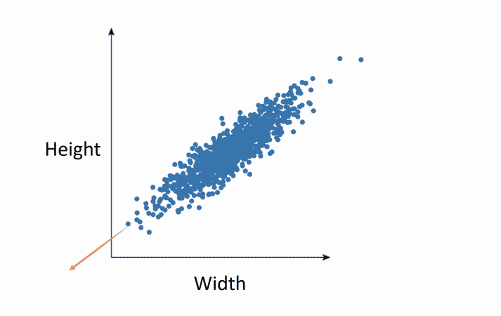

来源:——【megaputer.com】

数据的可用性无需介绍。不用说，如今数据驱动着商业。对于给定的业务问题，我们捕获的特征越多，分析就越好。不是吗？或者是？

如果，…

> 1.维数/特征比观测数多？
> 
> 2.维度太多，有时候会碰到上百个甚至更多？

上面的场景定义了一种叫做 ***维度诅咒*** 的特殊现象，简单来说就是太多的特性实际上可能是一个问题。但是，怎么做呢？

比方说，我们试图找出一个员工是否会流失。我们有员工的年龄、教育程度、经验、当前工作级别、月收入等信息。在这里，我们已经知道，年龄越高，经验越多；经验越多，职位级别越高，月收入越高。因此，如果我们说，初级管理层的员工容易流失，这也意味着，经验较少的员工可能会流失。正确吗？类似地，加薪百分比和绩效等级也是相关的；工作满意度和在同一家公司工作的年数也可能相关等等。这种特征(或自变量)之间的相关性，即特征之间的相互关系，称为*。*

**特征(指数据集中的列)，也称为独立/预测变量，用于预测目标/因变量/响应变量。上例中的目标变量是“员工是否会流失—流失(是|否)”。**

*如果一些特征传达了相同的信息，我们能不能把它们作为多余的东西丢掉？*(只保留一列，去掉多余的其他列)。*在某些情况下，是的，我们可以——丢弃它们不会(极大地)影响模型的预测。准确地说，我们只选择最相关的特征。这就是所谓的， ***【特征选择】*** 。*

*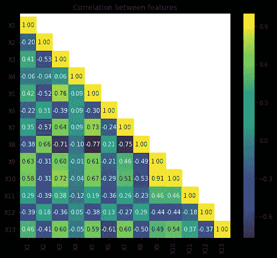*

****关联热图****

*左侧图像显示了样本数据中特征(X1 至 X13)的相关性。 ***相关系数范围从-1 到+1，其中极值表示最大相关，0 表示不相关。****

*PS:-相关不代表因果关系。更多的睡眠有助于你表现得更好；更多的睡眠和表现可能相关；当一个增加时，另一个也可能增加。但是，更多的睡眠不会导致(有助于)更好的表现。这同样适用于上述示例。*

*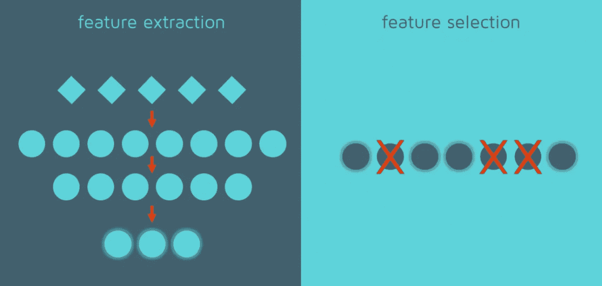*

*来源:——【quantdare.com/】*

*对于特征选择，我们应该知道哪些特征是不重要的，哪些是贡献最小的。也有可能在删除它们之后，多重共线性仍然存在。那么，如果我们能创造一组新的衍生变量，是原始变量的线性组合，会怎么样呢？这样的技术叫做 ***【特征提取】*** 。*

> ****PCA(主成分分析)*** 是一种用于特征提取的无监督算法。派生特征是以彼此不相关的方式创建的，因此，每个特征都传达唯一的信息。虽然目的之一是避免信息中的冗余，但 PCA 也旨在减少维度，即减少要分析的特征的数量。*

*这是一个回归的例子，其中我们试图预测的值是连续的*(不像上面例子中的离散标签)。我们想预测给定地区的房价(目标变量)。影响这一点的因素可能是地块大小、污染程度、可达性等。**

*原始方程将是*

**房价= w0 + w1 地块面积+ w2 污染程度+ w3 可达性+ …。**

*其中，w1、w2、w3 —每个特征的相应系数/权重。在其他条件不变的情况下，每增加一个单位的土地面积，房价就会上涨 1 倍。*

*在 PCA 之后，相同的等式变成*

****房价=β0+β1 PC1+β2 PC2+β3 PC3+……****

*在哪里，*

*PC1、PC2、PC3 —主要组件或新功能*

*β1，β2，β3 —主成分的权重/系数*

> *无论有无 PCA，预测价格变化不大。但是，如果没有 PCA，其中一个特征的单位增加可能会影响所有相关变量的权重，因此，不可能确定特征的重要性，即每个特征对目标变量的贡献大小。特征的可解释性降低。*

# *PCA 的概念:-*

**主成分建立在数据中的方差代表数据中的信息这一事实上。*方差为零的特征，不携带任何信息，可以认为是常数。*

*在上面的例子中，随着工作级别的增加，月收入也会增加。我们假设月收入没有方差。这样，月收入不会因工作级别的不同而变化，因此，无论工作级别如何，月收入都可以被视为一个常数。*

*正是由于数据中存在这种固有的差异，才能进行分析并提取信息。*

*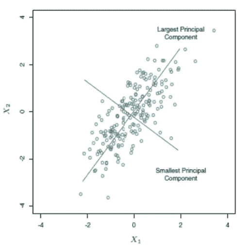*

*来源:——[docs.tibco.com](https://docs.tibco.com)*

*PCA 捕捉数据的最大方差。具有 n 个维度/特征的数据集将产生 n 个主成分。获得最大方差的组件是 PC1，方差最小的组件是 PCn。主成分形成为彼此正交，即它们是不相关的*(无线性关系)*，因此，每个成分携带关于数据的有用信息。*由于目标之一是降低维度，我们选择 k 个主成分，使得 k < n 和它捕获数据*中总方差的至少 70%和高达 90%。*

# *PCA 的步骤:-*

1.  *标准化功能:-*
2.  *构建协方差矩阵:-*
3.  *特征分解:-*
4.  *对特征对排序:-*
5.  *选择最佳主成分:-*

# *1.标准化功能:-*

*由于 PCA 捕捉数据中的方差，特定特征中固有的巨大方差可能会误导。*

*比方说，年龄在 30 到 60 岁之间。然而，月收入可能从 10K 卢比到 2L 卢比不等。月收入的方差明显高于年龄的方差。如果特征没有被标准化，月收入自动成为携带最大差异的特征*(在年龄&月收入)*。也是出于同样的原因，离群值将被删除(或在下一步之前处理)。初级管理层中 50 岁以上的人或更年轻的人成为首席执行官(因此，薪水更高，等等)。)被认为是该数据中的异常值。*

****PCA 偏向方差较大的特征，得到的主成分将不能传达原始信息。****

*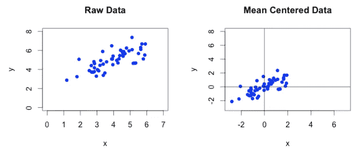*

*来源:——[cybernetist.com](https://cybernetist.com)*

> *使用 ***z 得分*** 对特征进行标准化，其中从观察值中减去平均值，以使数据围绕轴居中，然后除以标准偏差，使它们处于相同的范围内。*

*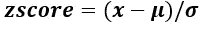*

*其中，x-特征的观测值*

*—特征的平均值*

*σ —平均值周围的标准偏差*

# *2.协方差矩阵:-*

**协方差矩阵显示了特征之间的相互作用。它告诉我们一个特性的可变性对另一个特性的影响有多大。**

*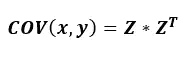*

*其中，Z-标准化数据，ZT-标准化数据的转置。*

***为什么协变而不是相关？:-***

*协方差衡量两个变量之间线性关系的方向，可以是成正比(正)或成反比(负)。另一方面，相关性不仅衡量方向，还衡量两个变量之间线性关系的强度。*

*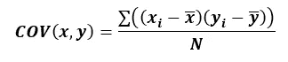*

*协方差是方差的一种扩展，其中考虑了两个变量相对于各自均值的偏差和积，而不是观测值相对于均值的偏差平方和。它以平方单位来度量，因此范围在-∞和+∞之间。比例的变化会影响协方差。当实际值被标准化时，协方差降低到-1 < cov < 1.*

*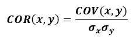*

*Correlation is already standardized, because the calculation involves dividing covariance by the product of standard deviations of the variables. Correlation does not have any units and ranges between -1 to 1\. Hence, **相关性，标准化变量的协方差将为(大约。)一样。***

****【COV(缩放数据)= CORR(缩放数据)= CORR(未缩放数据)****

*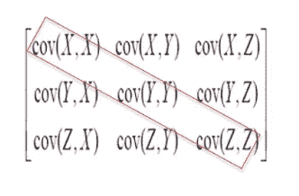*

***协方差矩阵***

*COV(X，Y) *(在左图中)*表示 X & Y 一起变化了多少。*

*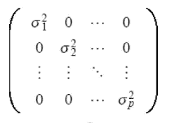*

*来源:——[analyticsvidhya.com](https://www.analyticsvidhya.com)*

****【COV(X，Y) = COV(Y，X)****

> *协方差矩阵的**对角线表示特征的方差——它是同一特征与其自身或特征与其自身相互作用的协方差，并且**始终为 1。**由于对角元素始终为 1，因此**数据中的总方差(信息)=协方差矩阵中对角元素的总和=数据中变量/特征/维度的数量。*****

# *3.特征分解:-*

*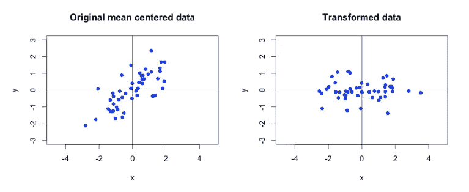*

*来源:cybernetist.com*

*先前转换为协方差矩阵的原始缩放和居中数据中的信息绕轴旋转，以形成数据的主分量(新维度)。主成分又称为 ***特征向量*** ，决定最大方差的方向。*

*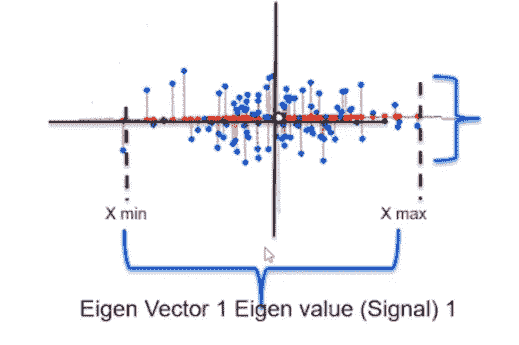*

*来源:——[analyticsvidhya.com](https://www.analyticsvidhya.com)*

> **最大方差(x-max — x-min)又称为* **信号**(如左图)*形成最大方差的方向，作为 PC1。该信号指示捕获的变化量，也称为* ***特征值*** *。**

*残差方差(y-max — y-min)称为 ***噪声*** 。信噪比(SNR)如下所示。更好的 SNR 表明捕捉最大方差(数据中的信息)的能力，因此，会产生更好的模型。*

*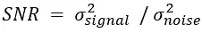*

*虽然残差方差被归类为 PC1 的噪声，但它包含关于其余数据的信息(方差),并成为第二主分量的信号。数据中 n 个特征/维度的所有 n 个主成分都以相同的方式构建。*

# *4.对特征对排序:-*

*本征向量和本征值总是成对出现，分别表示方向和大小。特征值将按降序排序，以获得从最高到最低的方差，各个特征向量给出主分量。*

***解释了&累计方差:-***

*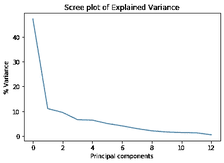*

****解释方差*** 是每个主成分捕捉到的变异性的百分比。在 ***碎石图*** *(绘制在左图所示的样本数据上)*中，第一主成分捕获了大约 45%的可变性。*

*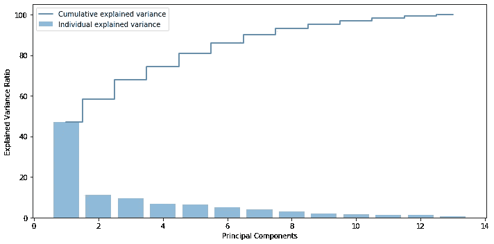*

****累积方差*** 是从 PC1 捕捉到的各个主成分的总方差百分比。最后一个 PC 捕获的累积方差表示所有 PC 的方差百分比之和，即它捕获了数据中的总方差，即 100%。*

# *5.最佳主成分:-*

*选择的 ***件数<总尺寸(特征数)*** 。这个想法是用较少数量的个人计算机来解释数据中的大量差异。*

*I .如果 k 是所选择的主成分的数量，那么 PC(k)预期捕获数据中总方差的至少 70%和高达 90%。但是，这可能会随着数据或域的变化而变化。*

*二。另一种确定主成分数量的方法是找出两个连续成分之间累积方差的增量。如果 k 和 k+1 个分量的两个累积方差之差小于 10%，则取 k 个分量，否则取 k+1 个分量。*

*三。还有一种方法是在“碎石图”中寻找一个拐点，超过这个拐点，线就变得近似水平。*

> *在上图中，为了解释大约 70%的方差，选择四个主成分就足够了。然而，为了解释 90%的方差，要选择 7 个主成分。*

*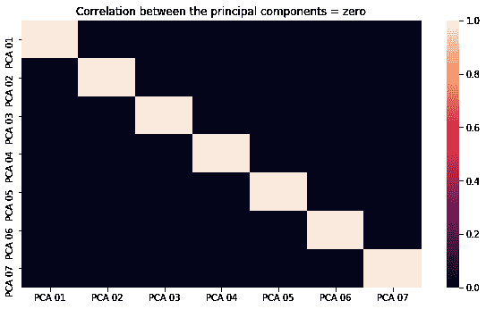*

1.  *最初的相关变量*(如上面的相关热图所示)*现在被转换成不相关的主成分。*
2.  *特征的数量从 13 个减少到 7 个，每个特征携带关于数据的唯一信息。*

*python 中 *(google colab)* 对 [*波士顿房价数据集*](https://www.kaggle.com/heptapod/uci-ml-datasets) 的 PCA 实现，在这里 可用[。](https://colab.research.google.com/drive/1VWikUA30KvZrzUzdESa21UUagX6IetKQ#scrollTo=SpftnOsaq0Yf)*

# *最后的想法:-*

*由于特征高度相关，减少了特征数量后，PCA 有助于显著提高模型性能。然而，解释主要成分(衍生特征)并不简单。重要的是要记住，在进行 PCA 之前，必须对数据进行标准化。必须小心选择主成分的正确数量，以便在丢失的信息量和模型精度之间有一个可接受的折衷。*

*虽然 PCA 可以解决这个问题，但是当数据具有多个维度时，将数据收集限制在相关/最佳的特征上也同样重要，这样可以有效地利用资源。但是，要收集多少数据(观察值)？这是另一个博客的故事。敬请期待！*