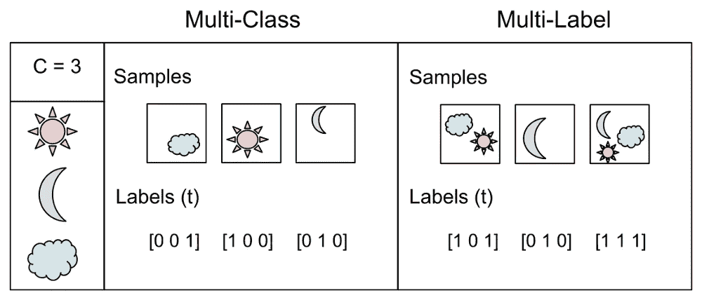
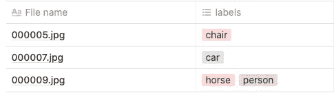
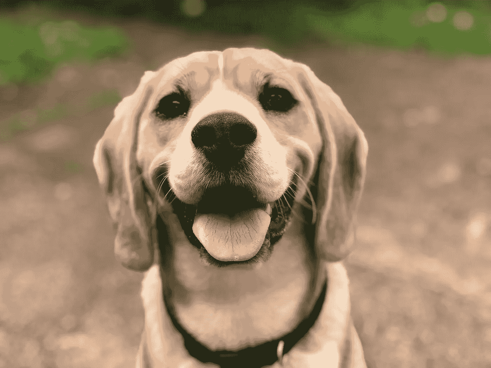
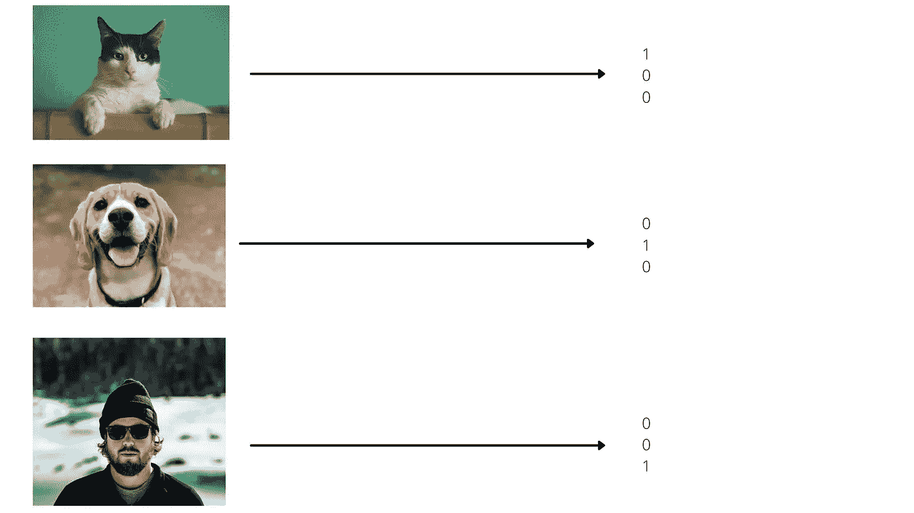
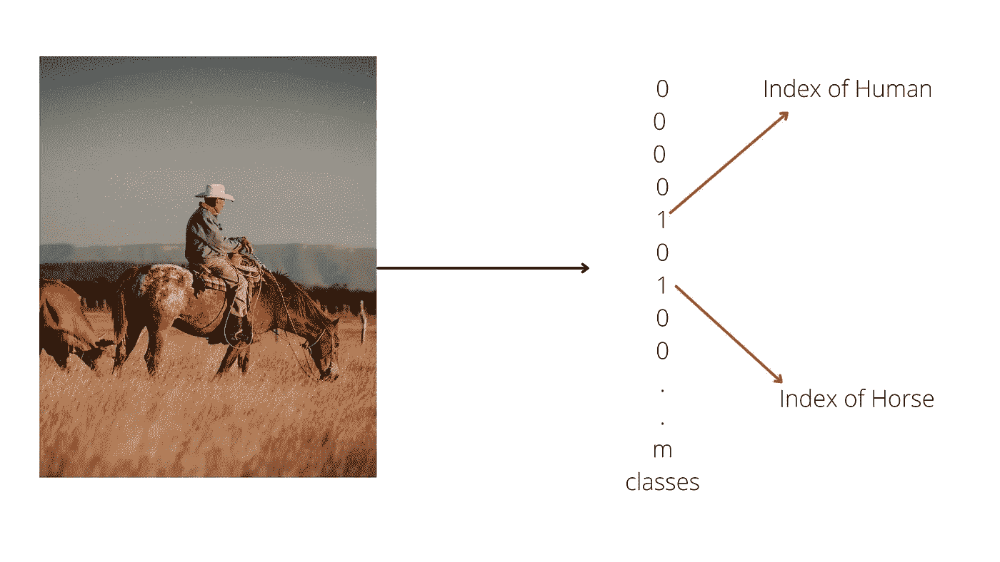
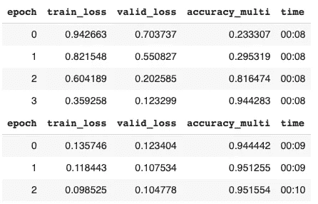
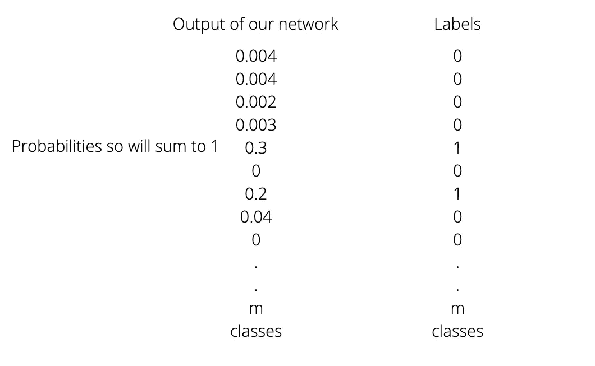

# 多标签分类

> 原文：<https://medium.com/analytics-vidhya/multi-label-classification-a9643d221954?source=collection_archive---------17----------------------->

多标签分类听起来与多标签分类相似，但完全不同。这些是少数几个术语之一，当你阅读时，你完全明白了这个概念，但是当你试图实现时，你的大脑就像多…什么？那是什么？嗯，我可以向你保证，感到困惑是很正常的，因为在机器学习中有很多奇特的术语，而本博客的目的是澄清其中之一。

# 分类

从一组对象中识别出一个对象的过程。例如，当一个婴儿被他/她的母亲抱起时停止了哭泣，他/她的大脑已经从一组其他人中识别出了他的母亲。就是这样。那就是分类。为什么 ML 要把什么都炒作起来？在我们的日常生活中，我们对数以千计的物体进行分类。我们把成熟的香蕉和未成熟的分类。我们把跑车和普通轿车区分开来。这些事情对我们来说是自然而然的。多年来，我们的大脑已经进化到对它非常精通。这是包括我们在内的所有生物最原始的行为。为了生存，我们需要对周围的事物进行分类。我希望我已经解决了房间里的大象，现在每当你在任何研究论文、帖子等中看到*分类这个词。你不会抓狂的。*

*现在你会说我明白了，这对人类来说没什么大不了的，但是机器呢？对此，我的回答是，没什么不同，也没什么复杂的。在机器中，它遵循同样的原理。你从头开始教机器，这个物体是香蕉，另一个物体是苹果，就像你小时候学的一样。你的大脑非常强大，可以在不使用任何编程语言或框架的情况下从演示中学习，:D，然后有人说机器将接管世界。这不会很快发生。我们太聪明了，不会被取代。回到正题，要教所谓的 ***【机器】*** 如何对物体进行分类我们需要给它们数据。*

*让我们举下面的例子:*

**

*示例数据集*

*我们可以看到前两个文件各有一个标签，但第三个文件名有两个标签。这可能吗？是的，下面的图片告诉你为什么？*

**

*一个骑马的人*

*在此图中，您可以清楚地看到标签是正确的。确实有一个人和一匹马。你会说没关系，高塔姆，但是你要怎么训练它呢？*

*训练它实际上是相当容易的！首先，你需要理解这些标签。暂时忘记我们有多重标签。假设我们有三张图片。*

1.  *一只猫*
2.  *cog 之一*
3.  *一个人类*

**

*图 1:猫*

**

*图 2:狗*

**

*图 3:人类*

*现在假设我准备了一个机器学习模型。它接收一幅图像，然后给出三种概率[p1，p2，p3]*

*p1:图像是猫的概率*

*p2:图像可能是狗*

*p3:图像是人类的概率*

*现在有趣的部分来了。你如何比较这些值和你的标签来做反向传播？请注意，你的标签是字符串，如“狗”、“猫”等。你要如何在上面进行反向传播？*

> *答案是你需要把这些标签转换成机器能理解的东西。*

# *输入一个热编码*

*一种热编码是将这些标签转换成机器能够理解的东西，即数字。转换将如下所示:*

**

1.  *找出你有多少独特的对象/类。这个问题我们有 3 个。就叫**大小**吧。*
2.  *制作一个大小为**大小为**的数组/向量，并将所有条目分配为 0。*
3.  *对于数组中的每个索引，决定你想把它分配给哪个类。例如，假设我给猫指数 1，狗指数 2 和人类指数 3(基于一个指数)。*
4.  *对于每个图像，在该类表示的索引处用 1 替换 0。例如，在下图中*

**

*图 3:人类*

*我已将索引 3 分配给人类。所以现在我将用[0 0 1]代替[0 0 0]。*

*Tada！您已经成功地将图像标签从字符串转换为数值。*

*现在让我们回到马和人的例子。我们将如何表现这样的形象？*

**

*马与人的标签表示*

*真的是这样。那就是**多标签分类。**这就是如何将多个标签编码成数字形式。*

*我们可以使用强大的库来执行这样的操作，而不是手工操作。FastAI 就是其中之一。*

*PyTorch 和 fastai 有两个主要的类来表示和访问训练集或验证集:*

1.  ***Dataset** :返回单个项目的自变量和因变量元组的集合*

*2. **DataLoader** :一个迭代器，提供一个小批量流，其中每个小批量是一批自变量和一批因变量的元组*

*我们得到以下结果:*

**

*95%的准确率！一点也不差。完整的笔记本可以在([链接](https://github.com/fastai/fastbook/blob/master/06_multicat.ipynb))找到*

> *这里需要注意的另一件重要事情是 **binary_cross_entropy()** 函数。我不会去了解它的工作细节，但它大致测量了我们的输出与目标标签的偏差。*

**

*我们的损失函数将比较这些值并进行反向传播。*

*我希望这篇文章能帮助你理解多标签分类。我希望它能激励你把手弄脏并钻研它。如果有帮助，请按拍手按钮。很有帮助:)。*