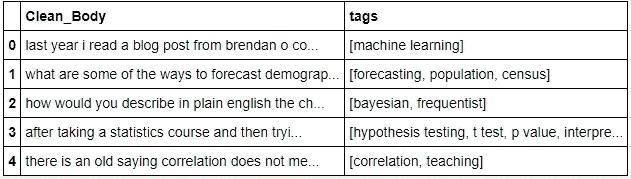

# 使用变压器的多标签文本分类

> 原文：<https://medium.com/analytics-vidhya/multi-label-text-classification-using-transformers-bert-93460838e62b?source=collection_archive---------2----------------------->

*使用来自拥抱脸和 PyTorch Lightning 的预训练 BERT 模型预测 Stack Exchange 上发布的问题的标签*


[栈交换](https://stackexchange.com/)

**Stack Exchange** 是一个由 176 个社区组成的网络，由对某个特定主题充满热情的专家和爱好者创建和运营。该网站主要为用户提供一个提问和回答问题的平台。

所有问题都用主题领域**标记**。每个标签最多可以有 5 个，因为一个问题可能与几个主题相关。标签使你很容易找到你感兴趣的领域的问题，并使你能够从给出的答案中学习，或者能够回答属于你专业领域的问题。标签可以由用户在发布问题时输入，也可以由 StackExchange 根据提出的问题进行预测。


与问题相关联的标签示例

*"预测&将正确的标签与问题相关联是很重要的，这样可以确保问题引起所有人的注意，这些人可以根据标记的主题领域回答问题。这将增加更快响应的机会，从而推动更多参与"*

# **目标:**

开发一个机器学习模型，该模型将准确预测可能与某个问题相关联的所有标签(一个或多个)。

*假设读者对自然语言处理(NLP)有一定的了解，并且对 PyTorch &变压器有一定的了解，特别是对 BERT。这篇文章是我用变形金刚解决多标签文本分类问题的成果，希望它能帮助一些读者！*

# **方法:**

预测“标签”的任务基本上是一个多标签文本分类问题。虽然可能有多种方法来解决这个问题，但我们的解决方案将基于利用预训练变压器(BERT)模型和 *PyTorch Lightning* 框架的能力。

**高级步骤:**

1.  安装和导入库
2.  加载和预处理数据
3.  准备 PyTorch 数据集和 Lightning 数据模块
4.  定义模型(基于 BERT 的分类器)
5.  使用闪电训练器训练模型
6.  评估模型的性能
7.  模型推理

# **1。安装&导入库**

我们需要的主要库是 a) *拥抱人脸变形器*(用于 BERT 模型和记号化器)，b) *PyTorch* (DL 框架&数据集准备)，c) *PyTorch Lightning* (模型定义和训练)，d) *Sklearn* (用于拆分数据集&度量)和 e)*beautiful ulsoup*(用于从给定数据的原始文本中移除 HTML 标签)。

# **2。加载&预处理数据**

所需的数据集可在 [Kaggle StatsQuestion](https://www.kaggle.com/stackoverflow/statsquestions) 的两个文件 Questions.csv 和 Tags.csv 中获得。将它们装入单独的*熊猫*数据帧。


问题数据


标签数据

questions data frame:“Body”列包含 HTML 格式的文本，这也是数据集中除 Id 列之外唯一对我们的任务有用的列。

Tags dataframe:包含与问题相关的标签。一个问题有一个独特的 ID。请注意，Id=1 有 3 个标签。

为了进一步处理，我们需要在连接它们的 Id 列上连接这两个数据帧。在此之前，我们清理 Body 列中的文本——首先使用 *Beautiful soup* 删除 HTML 标签，然后使用 *Regex* 删除除字母之外的所有字符，最后将所有文本转换为小写。

```
**def** pre_process(text):
  text = BeautifulSoup(text).get_text()
  *# fetch alphabetic characters*
  text = re.sub("[^a-zA-Z]", " ", text)
  *# convert text to lower case*
  text = text.lower()
  *# split text into tokens to remove whitespaces*
  tokens = text.split()
  **return** " ".join(tokens)
```

大约有 85 k 行问题和 1315 个唯一标签。许多标签数量很少，并不重要。就这个问题的范围而言，我们将只限于前 10 个标签。这给了我们总共大约 11 k 行的问题——考虑到我们使用的是预先训练好的 BERT 模型，这已经足够了。最后，我们需要合并两个数据帧来生成一个只包含 3 列的数据帧——Id、Body 和 Tags。

以下是 10 大标签:


十大标签

下面是将用于训练和测试模型的数据结构:“Clean_Body”(问题)列包含训练的输入，“tags”列包含标签或目标。标签的多标签结构在下面非常明显:



最终数据帧

**检查文字长度(一句话的字数):**

在我们继续之前，我们需要将文本数据转换成数字表示(模型只理解数字)。Transformer 型号不能一次处理超过 512 个单词。快速直方图显示，大多数问题都有字数统计< 300\. Also in general, that much length is reasonable for the model develops sufficient context to be able to perform classification for a narrow problem. We will restrict ourselves to the first 300 words


**将数据分为训练、验证和测试数据集:**

```
**from** **sklearn.model_selection** **import** train_test_split
*# First Split for Train and Test*
x_train,x_test,y_train,y_test = train_test_split(x, yt, test_size=0.1, random_state=RANDOM_SEED,shuffle=**True**)*# Next split Train in to training and validation*
x_tr,x_val,y_tr,y_val = train_test_split(x_train, y_train, test_size=0.2, random_state=RANDOM_SEED,shuffle=**True**)
```

# 3.准备数据集和数据模块

由于机器学习模型只能处理数字数据，因此我们需要将标签和正文编码成数字格式。

**编码标签**:我们使用来自 *sklearn* 的*multilabel binary izer()*类。这用于将标签转换成二进制格式——每个唯一的标签都有一个位置——在对应于标签的位置上的 1 表示标签的存在，0 表示标签的不存在。我们只有 10 个标签，所以我们将有一个长度为 10 的标签向量。

```
**from** **sklearn.preprocessing** **import** MultiLabelBinarizer
mlb = MultiLabelBinarizer()
yt = mlb.fit_transform(y)*# Getting a sense of how the tags data looks like*
print(yt[0])
print(mlb.inverse_transform(yt[0].reshape(1,-1)))
print(mlb.classes_)
------------------------------------------
**Output**:[0 0 0 0 0 0 1 0 0 1]
[('r', 'time series')]
['classification' 'distributions' 'hypothesis testing' 'logistic'
 'machine learning' 'probability' 'r' 'regression' 'self study'
 'time series']
```

**编码输入(问题):**我们需要以 BERT 所需的结构化格式对文本数据进行符号化和数字编码，拥抱脸(transformers)库中的*bertokenizer*类使这成为一件简单的事情。 *encode_plus()* 为我们提供了一行代码。

```
inputs = self.tokenizer.encode_plus(
            text,
            **None**,
            add_special_tokens=**True**,#Add [CLS] [SEP] tokens
            max_length= self.max_len,
            padding = 'max_length',
            return_token_type_ids= **False**, 
            return_attention_mask= **True**,#diff normal/pad tokens
            truncation= **True**,# Truncate data beyond max length
            return_tensors = 'pt' # PyTorch Tensor format
          )
```

首先基于 *Dataset* 类创建 QTagDataset 类，它以 BERT 模型所需的格式准备文本。

```
**class** **QTagDataset** (Dataset):
    **def** __init__(self,quest,tags, tokenizer, max_len):
        self.tokenizer = tokenizer
        self.text = quest
        self.labels = tags
        self.max_len = max_len

    **def** __len__(self):
        **return** len(self.text)

    **def** __getitem__(self, item_idx):
        text = self.text[item_idx]
        inputs = self.tokenizer.encode_plus(
            text,
            **None**,
            add_special_tokens=**True**,
            max_length= self.max_len,
            padding = 'max_length',
            return_token_type_ids= **False**,
            return_attention_mask= **True**,
            truncation=**True**,
            return_tensors = 'pt'
          )

        input_ids = inputs['input_ids'].flatten()
        attn_mask = inputs['attention_mask'].flatten()

    **return** {
      'input_ids': input_ids ,
      'attention_mask': attn_mask,
      'label':torch.tensor(self.labels[item_idx],dtype= torch.float)

    }
```

由于我们使用 *Pytorch Lightning* 进行模型训练，我们将设置从 *LightningDataModule* 派生的 QTagDataModule 类。

```
**class** **QTagDataModule** (pl.LightningDataModule):

  **def** _init__(self,x_tr,y_tr,x_val,y_val,x_test,y_test,tokenizer,
batch_size=16,max_token_len=200):
        super().__init__()
        self.tr_text = x_tr
        self.tr_label = y_tr
        self.val_text = x_val
        self.val_label = y_val
        self.test_text = x_test
        self.test_label = y_test
        self.tokenizer = tokenizer
        self.batch_size = batch_size
        self.max_token_len = max_token_len

  **def** setup(self):
     self.train_dataset = QTagDataset(quest=self.tr_text,  tags=self.tr_label,tokenizer=self.tokenizer,max_len= self.max_token_len) self.val_dataset= QTagDataset(quest=self.val_text, tags=self.val_label,tokenizer=self.tokenizer,max_len = self.max_token_len) self.test_dataset =QTagDataset(quest=self.test_text, tags=self.test_label,tokenizer=self.tokenizer,max_len = self.max_token_len)

  **def** train_dataloader(self):
     **return** DataLoader(self.train_dataset,batch_size= self.batch_size, shuffle = **True** , num_workers=4) **def** val_dataloader(self):
     **return** DataLoader (self.val_dataset,batch_size= 16) **def** test_dataloader(self):
     **return** DataLoader (self.test_dataset,batch_size= 16)
```

**设置数据模块:**

```
*# Instantiate and set up the data_module*
QTdata_module = QTagDataModule(x_tr,y_tr,x_val,y_val,x_test,y_test,
Bert_tokenizer,BATCH_SIZE,MAX_LEN)
QTdata_module.setup()
```

# **4。定义模型(基于 BERT 的分类器)**

现成的 BERT 模型已经在维基百科和书籍语料库上进行了预训练，因此对通用英语文本有很好的理解。然而，来自 *StackExchange* 的特定数据集包含许多与技术相关的单词，这些单词可能是 BERT 模型在预训练阶段没有看到的。

因此，我们需要*微调*我们数据集上的模型，以便它可以建立对我们数据集的理解，并在文本分类任务中变得更好。方法是在核心 BERT 模型上添加一个分类头，然后在我们的数据集上训练整个模型。这篇文章讨论了使用 BERT 进行多标签分类，但是，BERT 也可以用于执行其他任务，如问题回答、命名实体识别或关键字提取。NLP 术语中类似上述的任务也被称为*下游*任务。

在这个文本分类任务中，我们利用了 BERT 基本模型，该模型为每个单词(令牌)输出长度为 768 的向量，也为*汇集输出* (CLS)输出长度为 768 的向量。模型训练周期结束时的*汇总输出*收集了足够的任务背景，能够帮助进行预测。因为我们的预测任务基本上只需要 10 个标签的概率，所以我们在来自 BERT 的 768 个输出之上添加了 10 个输出的线性层。

由于输出是多标签的(多个标签与一个问题相关联)，我们可能倾向于为最终输出使用 Sigmoid 激活函数和二进制交叉熵损失函数。然而，Pytorch 文档推荐使用 *BCEWithLogitsLoss ()* 函数，该函数将 Sigmoid 层和 *BCELoss* 组合在一个类中，而不是在普通的 Sigmoid 之后再加上一个 *BCELoss* 。

```
*# we will use the BERT base model(the smaller one)*
BERT_MODEL_NAME = "bert-base-cased"**class** **QTagClassifier**(pl.LightningModule):
    *# Set up the classifier*
  **def** __init__(self,n_classes=10,steps_per_epoch=**None**,n_epochs=3, lr=2e-5):
    super().__init__()

    self.bert=BertModel.from_pretrained(BERT_MODEL_NAME, return_dict=**True**)
    self.classifier=nn.Linear(self.bert.config.hidden_size,
n_classes) 
    self.steps_per_epoch = steps_per_epoch
    self.n_epochs = n_epochs
    self.lr = lr
    self.criterion = nn.BCEWithLogitsLoss()**def** forward(self,input_ids, attn_mask):
    output = self.bert(input_ids=input_ids,attention_mask=attn_mask)
    output = self.classifier(output.pooler_output)

    **return** output
```

# **5。训练模型(使用 Pytorch 闪电训练器)**

对于典型的 Pytorch 训练周期，我们需要实现历元的循环，迭代通过小批量，对每个小批量执行前馈传递，计算损失，对每个批量执行反向传播，然后最终更新梯度。

PyTorch Lightning 对其进行了重组和抽象，我们基本上提供了可配置的细节，如优化器、学习率、时期数，Lightning 负责剩下的工作。

*PyTorch Lightning* 是构建在 PyTorch 之上的高级框架。它为使用 PyTorch 代码进行深度学习的传统方式提供了结构化和抽象。基本上，它减少了我们需要编写的代码，并允许我们专注于实验问题，如超参数调整、找到最佳模型和可视化结果。此外，Lightning 将处理如何在多个 GPU 上运行您的模型或加速代码。

*pl。照明模块*类似于 *nn。PyTorch 的模块*,但是增加了功能——我们的分类器模型就是从它派生出来的。 *LightningModule* 定义了模型结构，因此具有实现训练、验证和配置优化器的方法。它将我们的 PyTorch 代码分为 5 个部分:

*   初始化(__init__)
*   推理(向前)
*   训练循环(训练 _ 步骤)
*   验证循环(验证 _ 步骤)
*   测试循环(test_step)
*   优化器(configure _ optimizers)

Lightning 还使我们能够为 *Modelcheckpoint()* 定义一个回调，该回调与训练循环一起自动运行。一个*检查点*是一个模型的整个内部状态(架构、权重、优化器的状态、纪元、超参数等)的中间转储。)到机器上的一个文件。因此，对训练过程设置检查点允许我们在训练过程被中断的情况下恢复训练过程，微调模型，或者使用预训练的模型进行推理，而不必重新训练模型。检查点还允许我们定义“损失”或“准确性”标准来保存性能最佳的模型。

```
*# saves a file like: input/QTag-epoch=02-val_loss=0.32.ckpt*
checkpoint_callback = ModelCheckpoint(
    monitor='val_loss',*# monitored quantity*
    filename='QTag-**{epoch:02d}**-**{val_loss:.2f}**',
    save_top_k=3, *#  save the top 3 models*
    mode='min', *# mode of the monitored quantity  for optimization*
)
```

**初始化超参数**

```
*# Initialize the parameters that will be use for training*
N_EPOCHS = 12
BATCH_SIZE = 32
MAX_LEN = 300
LR = 2e-05
```

在我们将代码组织成一个 *LightningModule* 之后， *Trainer()* 会自动完成其他所有工作。下面是我们通常如何使用*训练器()*

```
trainer **=** Trainer()
trainer**.**fit(model, datamodule)
```

在引擎盖下，闪电*训练器*为我们处理训练循环细节，下面是它做的一些事情:

*   自动启用/禁用梯度
*   运行培训、验证和测试数据加载器
*   在适当的时候调用回调
*   将批处理和计算放在正确的设备上(GPU/CPU)
*   进度指示器

下面是我们的实现:

```
*# Instantiate the Model Trainer*
trainer = pl.Trainer(max_epochs = N_EPOCHS , gpus = 1, callbacks=[checkpoint_callback],progress_bar_refresh_rate = 30)*# Train the Classifier Model*
trainer.fit(model, QTdata_module)
```

# **6。评估测试数据集的性能**

Lightning 支持与流行框架( *TensorBoard，Comet，Weights&bias，Neptune)的集成..*)帮助我们记录、跟踪和可视化机器学习实验的性能/结果。

这基本上需要一个*记录器*来记录配置信息(参数/超参数)、结果和度量。我们只需简单地将*记录器*传递给*训练器*()。由于 Lightning 默认使用*tensor board*——在我们的代码*中，你不会发现它被明确传递给*训练师*。*

这通常是如何完成的:

```
# Example of using logger from wandb.ai (Weights & Biases Inc.)from pytorch_lightning.loggers import WandbLogger 
wandb_logger = WandbLogger()
trainer **=** Trainer(logger**=**wandb_logger)
```

**使用 Tensorboard 可视化性能:**

```
*# Visualize the logs using tensorboard.*%load_ext tensorboard
%tensorboard --logdir lightning_logs/
```


训练损失与训练步骤


验证损失与培训步骤

```
*# Evaluate the model performance on the test dataset*
trainer.test(model,datamodule=QTdata_module)Out[ ]:[{'test_loss': 0.2652013897895813}]
```

分类器输出一个向量，该向量具有每个标签的概率——然而，我们需要根据它是高于还是低于阈值来将其滚动到 1 或 0。虽然使用阈值= 0.5 是可能的，但是我们可以在 0.3 和 0.51 之间尝试不同的阈值值，以查看哪个最大化测试集的预测性能。对于此问题，阈值 0.4 给出了最佳结果。详细内容请看一下代码。

以下是性能指标:

```
 precision    recall  f1-score   support

           0       0.94      0.93      0.94      8748
           1       0.76      0.77      0.77      2362

    accuracy                           0.90     11110
   macro avg       0.85      0.85      0.85     11110
weighted avg       0.90      0.90      0.90     11110
```

以下是随机抽样测试数据的预测和实际标签表:


# 7。模型推断

使用表现最好的训练模型，我们可以开始预测与我们的任何相关问题相关联的标签。

```
question = "based on the following relationship between matthew s correlation coefficient mcc and chi square mcc is the pearson product moment correlation coefficient is it possible to conclude that by having imbalanced binary classification problem n and p df following mcc is significant mcc sqrt which is mcc when comparing two algorithms a b with trials of times if mean mcc a mcc a mean mcc b mcc b then a significantly outperforms b thanks in advance edit roc curves provide an overly optimistic view of the performance for imbalanced binary classification regarding threshold i m not a big fan of not using it as finally one have to decide for a threshold and quite frankly that person has no more information than me to decide upon hence providing pr or roc curves are just for the sake of circumventing the problem for publishing"

tags = predict(question)
**if** **not** tags[0]:
    print('No Known Tags')
**else**:
    print(f'Following are the Tags associated : **{**tags**}**')
```

以下是输出:

```
Following Tags are associated : 
[('classification', 'machine learning')]
```

# **结论**

在本文中，我们使用预训练的 BERT 建立了一个多标签文本分类模型。我们还想了解一下 *PyTorch Lightning* 如何帮助模型的训练。我已经试着解释了文章中的重要方面和*这里是* [***链接***](https://github.com/pnageshkar/NLP/blob/master/Medium/Multi_label_Classification_BERT_Lightning.ipynb)**到我的代码*。*

*由于我们的想法主要是进行 POC，所以并没有认真尝试过提高性能，您可能希望利用超参数来提高性能。以前我曾经用 CNN (Keras/Tensorflow)为这个问题建立过模型。与该模型相比，BERT 模型的训练时间要长得多，而性能提升却非常小。*

*您可能希望对代码进行一点重组，并将推理代码封装到一个 API 中(如 *FastAPI* )，并使用 *Streamlit* 为用户提供一个 web 界面，以使用该模型来预测标签。*

*你可以在*谷歌实验室运行笔记本。*使用来自 *Kaggle* 的数据集(笔记本中提供了链接)。不要忘记修改代码，以便为包含数据的文件设置正确的路径。*

# *感谢您的阅读！*

*如果你在这篇文章中学到了新的东西，请鼓掌！这将激励我写更多的东西来帮助更多的人！*

# *参考*

*[用拥抱脸和 PyTorch 闪电微调 BERT】](https://youtu.be/UJGxCsZgalA)*

*[py torch 闪电简介](https://towardsdatascience.com/from-pytorch-to-pytorch-lightning-a-gentle-introduction-b371b7caaf09)*

*[Pytorch 闪电文件](https://pytorch-lightning.readthedocs.io/en/latest/)*

*[ka ggle 上的 StackExchange 数据集](https://www.kaggle.com/stackoverflow/statsquestions)*