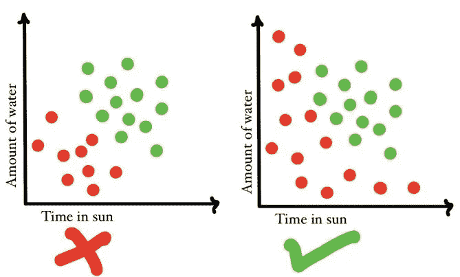
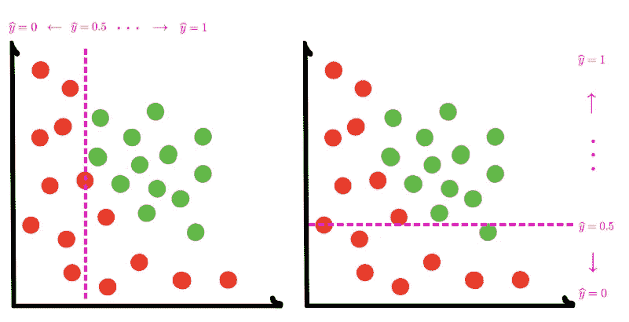
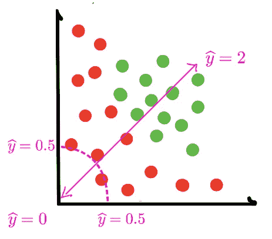

# 多层感知器作为非线性分类器— 03

> 原文：<https://medium.com/analytics-vidhya/multi-layer-perceptron-as-a-non-linear-classifier-03-8cd25147fc23?source=collection_archive---------7----------------------->

# 概述

在[的上一篇文章](/analytics-vidhya/perceptron-learning-from-discrete-to-continuous-02-b16ddf9e5ab6)中，我们讨论了感知器如何“学习”最佳的权重和偏差集来对一些数据进行分类。我们讨论了在最小化某些误差函数的情况下,“最佳”的真正含义。最后，我们激发了转向感知器的连续模型的需要。现在，我们将激发将几个感知器连接在一起的需求，以便构建更复杂的非线性模型。

# **动机**

到目前为止，我们用感知器建立的所有模型都是线性的。事实上，一个数据集很少能够用一条简单的线来分类。例如，给定一定量的水和在阳光下的时间，我们的植物生长玩具数据集看起来会更真实:

那么我们现在如何建立一个能够分离数据的模型呢？

# 作为非线性分类器的神经网络

进入多层感知器，或“香草”神经网络。想法是将几个线性模型结合在一起，以创建一个非线性模型。

要了解如何做到这一点，请考虑以下线性模型:

如果我们把这两个模型加在一起，你认为会发生什么？记住，我们真正添加的是两个概率空间。左边的模型是一个概率空间，从最左边的值 0 开始，向右移动趋向于值 1。右边的模型是一个不同的概率空间，当你向上移动时，你趋向于 1。给 *y_hat =* 0.5 的点集会是什么形状？在源模型中，这些点集呈现简单的垂直线和水平线的形状。

在这里，我们看到我们得到了曲线的形状！这个例子只是为了说明添加两个具有线性决策边界的模型会导致一个具有非线性边界的模型。

请注意，在这种情况下，这个求和模型将预测右上方约为 2 的概率。因此，我们需要对求和模型重新应用 sigmoid，以将概率归一化到 0 到 1 之间的范围。

## 将线性模型的总和表示为神经网络

那么我们如何用图形来表示上面的求和呢？我们知道，每个线性模型都可以用一个感知器来表示。感知器所做的只是对输入特征进行加权求和。因此，我们可以将前两个感知器的输出(上面显示的前两个模型)连接到另一个感知器作为输入，该感知器将这些模型相加在一起！

所以在这里，我们将原始输入特征传递给两个独立的感知器，它们有自己的一套权重和偏好。然后，我们在第二层将这些线性模型的输出相加，得到最终输出。这个最终模型是非线性的。这个例子应该给出一个多层感知器神经网络的架构实际上在做什么的更好的直觉，找到一个能够对我们的数据集中的数据点进行准确分类的高度非线性的函数。

我们来分解一下上图。首先，我们在“输入层”接收一组输入特征 *x_i* 。然后，我们将这些输入特征传递给“隐藏层”中的感知器。这就是我们输入和输出层之间的所有感知层。我们隐藏层中的第一层感知器将只接受输入特征并建立线性模型。这些线性模型然后被作为输入传递到我们的隐藏层的下一层中的感知器。这些感知器将输入的线性模型相加，每个感知器输出一个非线性模型。隐藏层中的层数越多，我们能找到的复杂非线性模型就越多。这些模型在输出层被组合以给出最终的模型，该模型应该能够分类出输入数据点。

## 培训和优化

那么我们实际上如何训练这些模型呢？这很大程度上类似于我们训练感知机的方式。给定一个干净的数据集(我们将讨论什么是好的数据集，以及如何确保训练尽可能顺利地进行)，我们做以下事情:

在每个数据点上向前运行 prop，生成初始预测。

使用前面讨论的二元交叉熵之类的损失函数，计算每个数据点的损失。

运行梯度下降来计算网络中的每个权重和偏差需要如何被推动以减少特定数据点的误差*。*

对数据集中的所有数据点执行上述 3 个步骤，并对权重和偏差的所有变化进行平均。

使用通过模型传递数据集和运行梯度下降找到的平均变化来更新权重和偏差。

以上是一个历元，通过网络用于训练的数据集的一次传递。我们在几个时期内重复这一过程，直到损失低到可以接受的程度，并且我们得到了准确的分类。

对于上述训练过程的惊人的视觉解释，请查看 3B1BS 视频:【https://www.youtube.com/watch?v=Ilg3gGewQ5U。如果前面的帖子都有道理，你应该有 pre req 知识才能看上面的视频:)。

# 摘要

在这篇文章中，我们介绍了如何将几个感知器连接在一起，让我们找到非线性决策边界，并概述了 MLP(多层感知器)神经网络架构。在下一篇文章中，我们将尝试回答是什么决定了训练的效果？我们应该在我们的数据集、我们的结果、我们的网络中寻找什么品质，更重要的是，我们可以添加哪些额外的调整来改善训练。

# **问题**

如果我们使用均方损失函数而不是交叉熵损失(即试图找到一条最佳拟合线，而不是决策边界)，你能说服自己将几个感知器相加仍然会导致线性模型吗？(如果没有，我们就有麻烦了，因为这意味着我们不能用这种方法解决回归任务，啊哈)

为了进行多类预测，我们需要对我们的 MLP 架构做什么改变？也就是说，预测我们的数据点位于几个类别之一(狗、猫、兔子等)

请在评论中留下你的答案:)