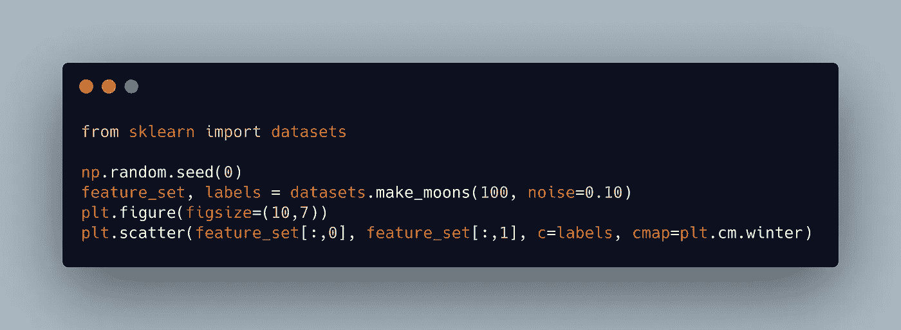
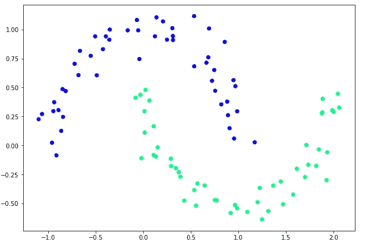
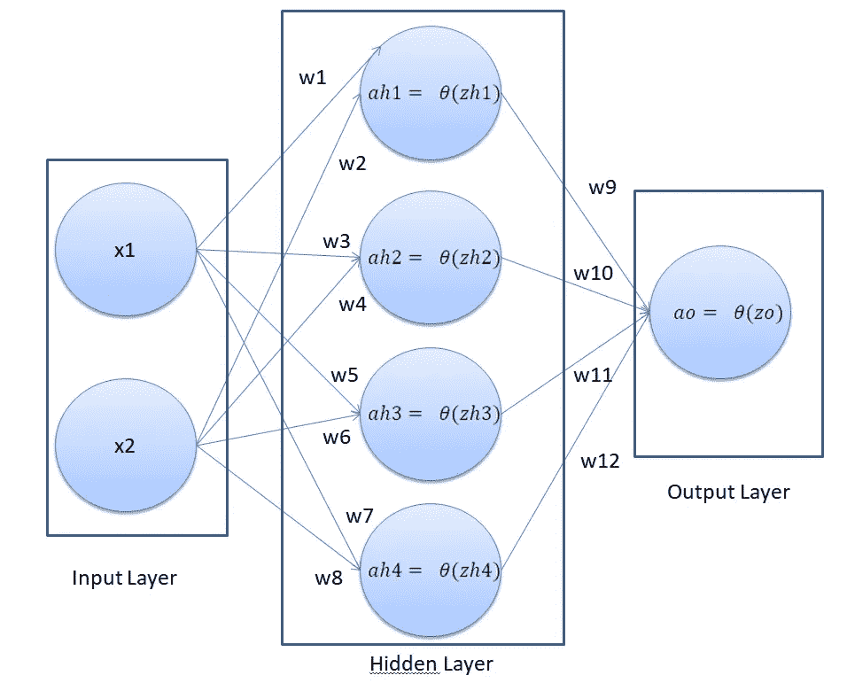
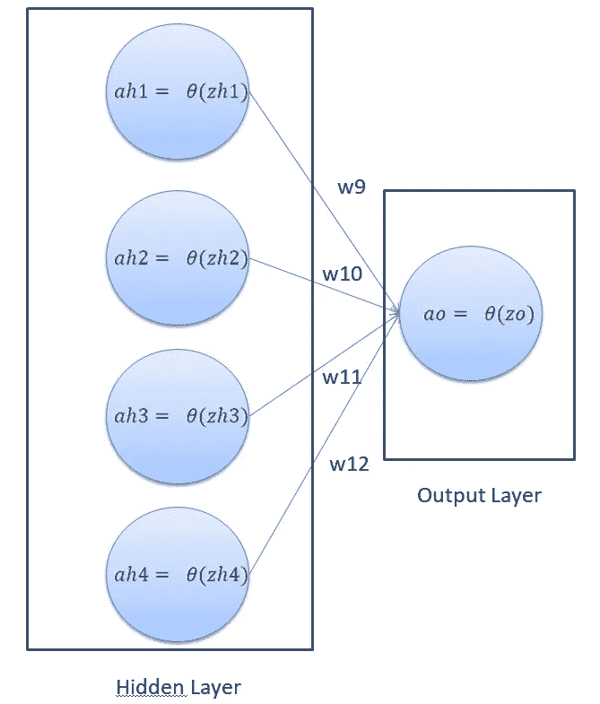
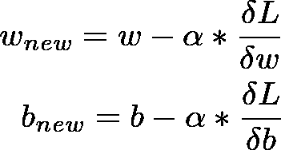

# 多层感知器解释

> 原文：<https://medium.com/analytics-vidhya/multi-layer-perceptron-explained-318df92b3efb?source=collection_archive---------4----------------------->

所以我从今天开始我的博客之旅。对于我的第一篇文章，我将解释一个简单但非常重要的概念来研究深度学习
，这是多层感知器。

## 数据集

在这篇博客中，我们将使用来自 sklearn 的 **make_moons** 数据集。
选择这个数据集是因为它不能用直线分开。
执行以下脚本来生成我们将要使用的数据集，以便训练和测试我们的神经网络。

在上面的脚本中，我们从`sklearn`库中导入了`datasets`类。为了创建 100 个数据点的非线性数据集，我们使用了`make_moons`方法，并将 100 作为第一个参数传递给它。该方法返回一个数据集，该数据集在绘制时包含两个交错的半圆，如下图所示:

你可以清楚地看到，这些数据不能用一条直线分开，因此**感知器**不能用来正确地分类这些数据。

我们来验证一下这个概念。为此，我们将使用一个具有一个输入层和一个输出层的简单**感知器**,因为这种结构基本上是一个具有输入和输出的逻辑回归函数，并且我们知道我们不能仅通过逻辑回归来对这些数据进行分类(我的意思是我们不能，但是误差不会从某个数字开始下降)

# 单隐层神经网络

在本节中，我们将创建一个具有一个输入层、一个隐藏层和一个输出层的神经网络(我更喜欢称之为**单层感知器**)。我们的神经网络的架构将会是这样的

在上图中，我们有一个具有两个输入、一个隐藏层和一个输出层的神经网络。隐藏层有 4 个节点。输出层有 1 个节点，因为我们正在解决一个二元分类问题，其中可能只有两个可能的输出。这种神经网络结构能够发现非线性边界。

神经网络的基本原理是 3 个步骤

1.  正向输送
2.  计算损失
3.  反向传播
4.  改变重量

这是我们今天在博客中要做的四件事。

# **前馈**

对于每一行，我们都有特征( **x1** 和 **x2** )。为了计算隐藏层中每个节点的值，我们必须将输入乘以我们正在计算值的节点的相应权重。然后，我们将点积传递给一个激活函数，以获得最终值。最初权重是随机选择的。因为输入( **2 个节点**)连接到隐藏层
中的 **4 个节点**，所以我们对于层 1 的权重矩阵将是形状(2，8)，因为每个输入 _ 节点连接到**隐藏层的 4 个节点。**

> weights _ layer 1 = NP . random . rand(features . shape[1]，features.shape[1]*4) #卫星数据的权重形状(2，8)

例如，要计算隐藏层中第一个节点的最终值，用“ah1”表示，您需要执行以下计算:

> zh1=x1w1+x2w2 **→等式 a**
> ah1 = 1/(1+NP . exp(-zh1))→**等式 b**

这是隐藏层中最顶层节点的结果值。同样，您可以计算隐藏层的第 2、第 3 和第 4 个节点的值。

同样，为了计算输出图层的值，隐藏图层节点中的值被视为输入。因此，为了计算输出，将隐藏层节点的值与它们相应的权重相乘，并通过**激活**函数传递结果。

这个操作可以用下面的等式来数学表达:

> zo = ah1 * w9+ah2 * w10+ah3 * w11+ah4 * w12→**方程 c**
> ao = 1/(1+NP . exp(-zo))→**方程 d**

# **反向传播**

在**反向传播**阶段，我们将首先定义我们的损失函数。我们将使用[均方差](https://en.wikipedia.org/wiki/Mean_squared_error)成本函数。它在数学上可以表示为:
这是我们的**成本函数**

## 这里的 **n** 是观察次数

## 第一相

在反向传播的第一阶段，我们需要更新输出层的权重，即 w9、w10、w11 和 w12。所以暂时就考虑我们的神经网络有以下部分:

反向传播的第一阶段的目的是以最小化最终误差的方式更新权重 w9、w10、w11 和 w12。这是一个[优化问题](https://en.wikipedia.org/wiki/Optimization_problem)，我们必须为我们的成本函数找到[函数最小值](https://en.wikipedia.org/wiki/Maxima_and_minima)。

为了找到函数的最小值，我们可以使用[梯度下降](https://en.wikipedia.org/wiki/Optimization_problem)算法。梯度下降算法可以数学表示如下:

在我们的神经网络中，预测输出用“ao”表示。这意味着我们必须基本上最小化这个函数:

> **成本=((1/2)*(NP . power((ao-labels)，2)))**

1.  **标签**为**真值**
2.  **ao** 是**的预测值**

我们必须更新重量值，以便降低成本。为此，我们需要对每个权重的成本函数求导。由于在此阶段，我们要处理输出层的权重，因此我们需要区分关于 w9、w10、w11 和 w2 的成本函数。

利用链式法则计算成本函数的微分。

## 为我们的博客

我们写
**dao/dwo = dao_dwo(非常重要)**

dcost _ dwo = dcost _ Dao * Dao _ dzo * dzo _ dwo→**等式 1**

这里“wo”指的是输出层中的权重。每个术语开头的字母“d”表示导数。

**dcost _ Dao**= 2 *(T19)ao—**标签** )/ **观察总数**

这里的 **2** 和**总观察次数**是常数，所以我们可以忽略它们。
所以**dcost _ Dao =(ao-labels)→等式 2**

现在 ao wrt zo(sigmoid 的导数是等式 3 )
所以**Dao _ dzo**=**sigmoid(zo)*(1-sigmoid(zo)→等式 3**

最后，我们需要找到关于“dwo”的“dzo”。导数就是来自隐藏层的输入，如下所示:

dzo_dwo = ah → **等式 4**

这里的“ah”指的是隐藏层的 4 个输入。*等式 1* 可用于找到输出层权重的更新权重值。为了找到新的权重值，由*等式 1* 返回的值可以简单地乘以学习率并从当前权重值中减去。这很简单，我们以前也这样做过。

**第二阶段**

在上一节中，我们了解了如何找到输出图层权重的更新值，即 w9、w10、w11 和 12。在本节中，我们将误差反向传播到前一层，并找到隐藏层权重的新权重值，即权重 w1 至 w8。

我们将隐藏层权重表示为“wh”。我们基本上必须区分关于“wh”的成本函数。数学上我们可以用链式微分法则来表示它为:

**dcost _ dwh = dcost _ dah * dah _ dzh * dzh _ dwh→等式 7**

我们将再次把方程式 **5** 分解成几个部分

第一项“dcost”可以使用微分链规则相对于“dah”进行微分，如下所示:

dcost _ dah = dcost _ dzo * dzo _ dah→**方程 7.1**

让我们再次将*等式 7.1* 分解成单独的项。再次使用链式法则，我们可以将“dcost”与“dzo”区分如下:

dcost _ dzo = dcost _ Dao * Dao _ dzo→**等式 7.2**

我们已经计算了 **dcost/dao** 在*等式 5* 中的值和 **dao/dzo** 在*等式 6* 中的值。

现在我们需要从 ***方程 a*** 中找到 **dzo/dah** 。如果我们看一下 **zo** ，它有以下值:

> zo = ah1 * w9+ah2 * w10+ah3 * w11+ah4 * w12

如果我们相对于来自隐藏层的所有输入来区分它，用“ao”表示，那么我们剩下来自输出层的所有权重，用“wo”表示。因此

dzo_dah = wo → **方程 7.3**

现在，我们可以通过替换下式中的值来找到 dcost/dah 的值

***方程式 7.2*** 和 ***中的 **7.3** 方程式 7.1***

回到*等式 2* ，我们还没有找到 dah_dzh 和 dzh_dwh。

dah _ dzh = sigmoid(zh)*(1-sigmoid(zh))→**方程 7.4**

dzh_dwh =输入特征→ **方程 7.5**

如果我们替换等式 7 中的 7.4 和 7.5，7.1，我们可以得到隐藏层权重的更新矩阵。为了找到隐藏层权重“wh”的新权重值，由*等式 7* 返回的值可以简单地乘以学习率，并从当前权重值中减去。差不多就是这样。有很多计算，但是是的，你学到了一些非常漂亮的东西

代码的链接将是
[https://github . com/sahibpreetsingh 12/100 daysofmlcode/blob/main/D8-SLP/D8-SLP . ipynb](https://github.com/sahibpreetsingh12/100daysofmlcode/blob/main/D8-SLP/D8-SLP.ipynb)

回购环节是[https://github.com/sahibpreetsingh12/100daysofmlcode](https://github.com/sahibpreetsingh12/100daysofmlcode)

希望你喜欢:)