# 多模型终端，带拥抱脸变形器和亚马逊 SageMaker

> 原文：<https://medium.com/analytics-vidhya/multi-model-endpoints-with-hugging-face-transformers-and-amazon-sagemaker-c0e5a3693fac?source=collection_archive---------2----------------------->

#拥抱脸# AWS #伯特#GPT-2 #SageMaker #Mlops


图片来自[my domain](https://www.mydomaine.com/dragon-tree-care-4797058)

我们可以通过 [Amazon SageMaker 多模型端点](https://docs.aws.amazon.com/sagemaker/latest/dg/multi-model-endpoints.html)托管多达数千种模型。

在某些情况下，可变延迟是可以容忍的，并且成本优化更重要，我们也可以决定使用 Mme 进行 A/B/n 测试，而不是这里讨论的更典型的基于[生产变量的策略](https://aws.amazon.com/blogs/machine-learning/a-b-testing-ml-models-in-production-using-amazon-sagemaker/)。

每当应用程序需要一致的低推理延迟时，实时端点仍然是最佳选择。

我们将使用拥抱脸推理 DLCs 和 Amazon SageMaker 来部署多个 transformer 模型作为多模型端点。Amazon SageMaker 多型号端点可用于提高端点利用率和优化成本。

这篇文章演示了如何在一个端点后的一个容器中托管 2 个预训练的变压器模型。

1.  使用 BERT 模型从文本中提取嵌入内容。
2.  使用 GPT-2 模型为给定文本生成合成文本。

**注意**:在撰写本文时，多模型端点仅支持`CPU`个实例。

**开发环境和权限**

注意:您可以在 SageMaker Studio、您的本地机器或 SageMaker 笔记本实例中运行这个演示

如果您打算在本地环境中使用 SageMaker(而不是 SageMaker Studio 或 Notebook 实例)。您需要访问具有 SageMaker 所需权限的 IAM 角色。你可以在这里找到更多关于它的信息。

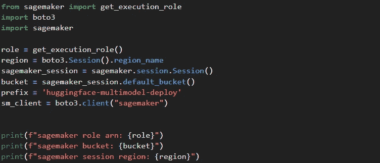

开发环境和权限(作者截图)

**检索模型工件**

`**BERT model**`

首先，我们将下载预训练 [BERT](https://arxiv.org/abs/1810.04805) 模型的模型工件。BERT 是一种流行的自然语言处理(NLP)模型，它从文本中提取含义和上下文。

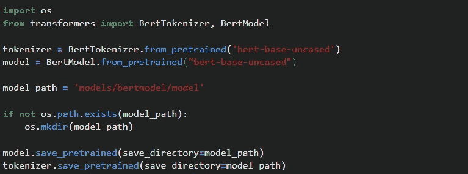

检索 BERT 模型工件(作者截图)

`**GPT-2 model**`

其次，我们将下载预训练的 [GPT-2](https://d4mucfpksywv.cloudfront.net/better-language-models/language_models_are_unsupervised_multitask_learners.pdf) 模型的模型工件。GPT-2 是一个流行的文本生成模型，由 OpenAI 开发。给定一个文本提示，它可以生成合成文本。

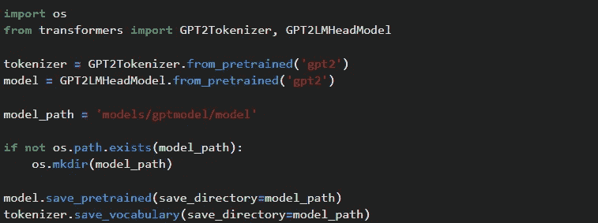

找回 GPT-2 模型文物(作者截图)

**编写推理脚本**

`**BERT model**`

由于我们要将一个模型带到 SageMaker，所以我们必须创建一个推理脚本。脚本将在我们的拥抱脸容器中运行。我们的脚本应该包括一个用于模型加载的函数，以及可选的生成预测和输入/输出处理的函数。拥抱脸容器提供了生成预测和输入/输出处理的默认实现。通过在脚本中包含这些函数，您可以覆盖默认函数。你可以在这里找到更多的[细节](https://sagemaker.readthedocs.io/en/stable/frameworks/pytorch/using_pytorch.html#serve-a-pytorch-model)。

**注意**:

1.**单一模型部署**:为了在容器启动时安装额外的库，我们可以添加一个 requirements.txt 文本文件，指定要使用 pip 安装的库。在存档中，拥抱脸容器期望所有的推理代码和 requirements.txt 文件都在`**code/**`目录中。

2.**多模型部署**:要在容器上安装额外的库，需要使用推理脚本中的 pip 来安装 requirements.txt 文本文件中的库。在档案中，拥抱脸容器期望所有的推理代码都在`**code/**`目录中。

在下一个单元格中，我们将看到 BERT 模型的推理脚本，它帮助我们从文本中提取嵌入内容。

你会注意到它使用了来自拥抱脸的[变形库，并在推理脚本中使用 pip 命令安装，同样，如果需要，我们需要安装额外的库。](https://huggingface.co/docs/transformers/index)

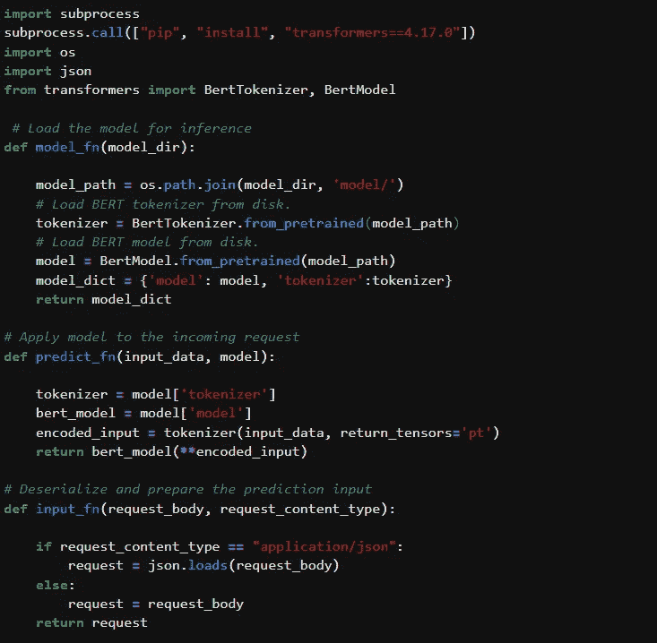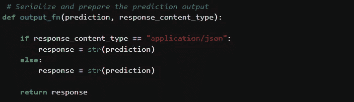

BERT 模型的推理脚本(作者截图)

`**GPT-2 model**`

在下一个单元格中，我们将看到 GPT-2 模型的推理脚本，它帮助我们为给定文本生成合成文本。

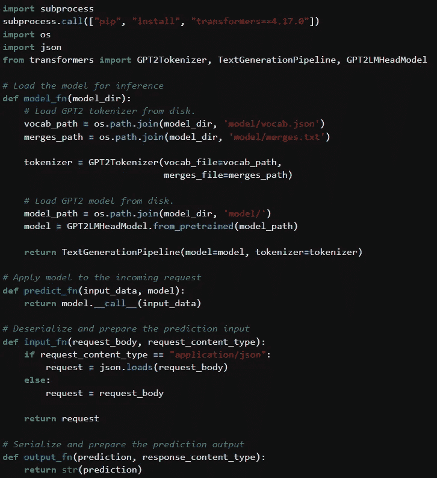

GPT-2 模型的推理脚本(作者截图)

**包装型号**

对于托管，SageMaker 要求部署包以兼容的格式构建。它希望所有文件都打包在一个名为“model.tar.gz”(我们称之为 bertmodel.tar.gz 和 gptmodel.tar.gz)的 tar 文件中，并使用 gzip 压缩。在存档中，拥抱脸容器期望所有的推理代码文件都在代码/目录中。有关所需目录结构的详细解释，请参见此处的指南。

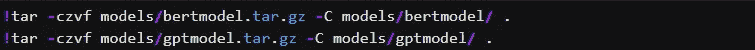

包装模型(作者截图)

**上传多张拥抱脸模型给 S3**

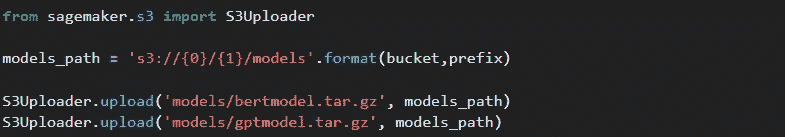

上传模特到 S3(作者截图)

**创建多模型端点**

将 BERT 模型上传到 S3 后，我们就可以部署端点了。要使用 boto3 创建/部署实时端点，您需要创建一个“SageMaker 模型”、“SageMaker 端点配置”和“SageMaker 端点”。“SageMaker 模型”包含我们的多模型配置，包括我们的 S3 路径，其中我们上传/部署多个拥抱脸模型。“SageMaker 端点配置”包含端点的配置。“SageMaker 端点”是实际的端点。

验证 docker 文件中的`multi-models`标签，以表明任何预先构建的容器能够同时装载和服务多个型号。

标签`com.amazonaws.sagemaker.capabilities.multi-models=true`

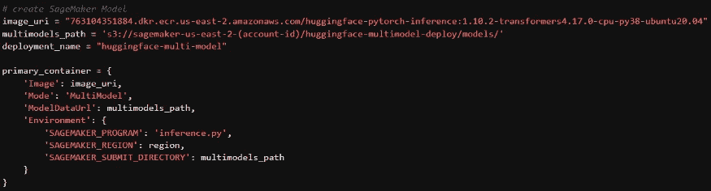

定义 DLC(作者截图)

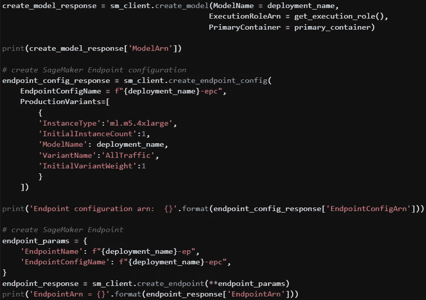

创建 SM 端点配置和端点(作者截图)

**获得预测**

`**BERT model**`

现在我们的 API 端点已经部署好了，我们可以向它发送文本来从我们的 BERT 模型中获取预测。您可以使用 SageMaker SDK 或 SageMaker 运行时 API 来调用端点。

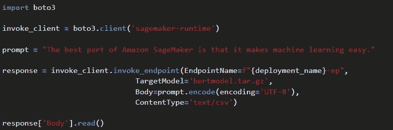

从 BERT 模型获得预测(作者截图)

`**GPT-2 model**`

既然我们的 RESTful API 端点已经部署好了，我们可以向它发送文本，以从我们的 GPT-2 模型中获取预测。您可以使用 SageMaker Python SDK 或 SageMaker 运行时 API 来调用端点。

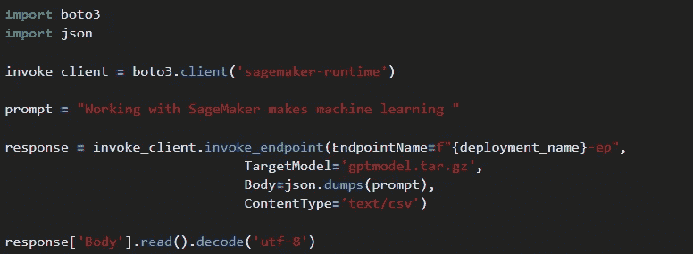

从 GPT-2 模型获得预测(作者截图)

**向端点动态部署模型和更新模型**

为了动态地部署模型和更新模型，您将遵循与上面相同的方法，并将其添加为一个新模型。例如，如果您已经重新训练了`bertmodel.tar.gz`模型，并且想要开始调用它，那么您将会在下面的 S3 前缀后面上传更新的模型工件，并使用一个新的名称，比如`bertmodel_v2.tar.gz`，然后将`TargetModel`字段更改为调用`bertmodel_v2.tar.gz`而不是`bertmodel.tar.gz`

```
multimodels_path = ‘s3://sagemaker-us-east-2-(account-id)/huggingface-multimodel-deploy/models/’
```

您应该避免在 Amazon S3 中覆盖模型工件，因为旧版本的模型可能仍然被加载到端点的运行容器或端点上实例的存储卷上:这将导致调用仍然使用旧版本的模型。

或者，您可以停止端点并重新部署一组新的模型。

**删除多模型端点**

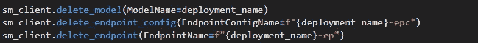

清理(作者截图)

**结论**

我们成功地将两个拥抱脸变形器部署到 Amazon SageMaker，使用多模型端点进行推理。多模型端点是优化模型计算利用率和成本的绝佳选择。尤其是当您由于用例差异而拥有独立的推理工作负载时。

这篇文章的完整源代码可以在 [github repo](https://github.com/Vinayaks117/AWS-SageMaker-Examples/blob/main/03_MultiModelEndpointWithHuggingFace/huggingface-sagemaker-multi-model-endpoint.ipynb) 找到

感谢阅读！！如果你有任何问题，随时联系我。