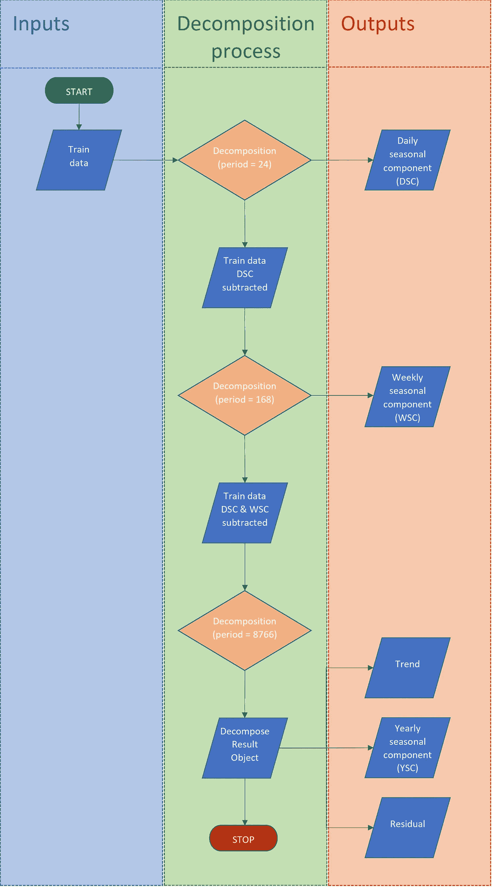

# 多季节时间序列分析:用 Python 进行分解和预测

> 原文：<https://medium.com/analytics-vidhya/multi-seasonal-time-series-analysis-decomposition-and-forecasting-with-python-609409570007?source=collection_archive---------0----------------------->

*通过未观测成分模型分析具有 100，000+个数据点的复杂季节性时间序列的实例*

照片由[理查德·霍瓦特](https://unsplash.com/@orwhat?utm_source=medium&utm_medium=referral)在 [Unsplash](https://unsplash.com?utm_source=medium&utm_medium=referral) 拍摄

# **范围**

预测是商业中常见的统计任务。它非常重要，因为它影响管理决策和管理资源的企业活动。第一个统计方法是在 100 年前首次开发的，ARIMA 模型仍然在其他现代机器学习和深度学习技术中频繁使用。尽管很受欢迎，ARIMA 模型也有一些严重的缺点:

1.  模型的系数不容易解释或需要详细解释
2.  对于小数据集是有效的，但是计算量很大
3.  假设数据是稳定的，否则输入应该被转换。因此，预测指的是转换后的数据，而不是原始时间序列。除了可解释性之外，相对于没有变换的平稳序列，该属性增加了置信区间

为了更好地解释季节性时间序列，开发了其他方法，如未观测成分模型(UCM)。作为一种所谓的“状态空间”模型，UCM 将原始时间序列分解为其个体水平、趋势、周期、季节成分，并通过建模和取这些成分的总和来预测未来值。

这篇文章是出于实用目的，关于[状态空间模型](https://otexts.com/fpp3/ets.html)的更多信息，特别是 [UCM](https://www.lexjansen.com/nesug/nesug04/an/an03.pdf) ，请跟随带下划线的链接。`Statsmodels`用户指南也可以在[这里](https://www.statsmodels.org/dev/examples/notebooks/generated/statespace_structural_harvey_jaeger.html)获得，但是我将该方法应用于一个更具说明性和更大的数据集。

分析的目标是利用过去的可用值预测未来一年的能源需求。可选地，可以使用外生变量来改进模型。一些这样的变量被选择、收集并输入模型。

*注:代码是逐步嵌入的，完整代码可在* [*这里*](https://jovian.ai/danielandthelions/hourly-energy-consumption-final) *。出于演示的目的，偶尔会先嵌入输出，然后再嵌入输入。这些作品旨在让非专业观众也能理解。你觉得是吗？是不是少了什么？欢迎发表意见。*

# **关于数据集**

T 他选择的数据集是来自 [Kaggle](https://www.kaggle.com/robikscube/hourly-energy-consumption) 的‘每小时能耗’。该源包含美国几个服务区每小时报告的以兆瓦为单位的能量需求值。出于演示目的，我选择了从 2004 年 1 月 10 日 01:00:00 到 2018 年 8 月 3 日的美国电力(AEP)时间序列。00:00:00.

有些日期缺失，有些重复。这些问题已在下文讨论和介绍。

# **方法**

D 数据集被拆分为训练和测试子集(持续 8766 小时作为测试)。应用对象和功能的简要概述:

1.  使用`pandas`和 Python 的`datetime`类加载和清理数据帧
2.  通过`seaborn`设置定制的`matplotlib.pyplot`绘制时间序列进行探索性数据分析
3.  通过`statsmodels.tsa`类的`seasonal_decompose()`功能手动分解单个组件
4.  通过`scipy.optimize()`和`numpy`逼近单个组件
5.  通过`statsmodels.tsa`的`UnobservedComponents`类自动分解单个组件并执行剩余诊断
6.  使用`sklearn.metrics` (MAE —平均绝对误差，RMSE —均方根误差)的模型评估，以及观察值积分和预测值积分的比较(以兆瓦时为单位的年绝对能源需求)

# **结果**

**加载并清理数据帧**

首先加载上述库:

数据帧从 Kaggle 提供的 csv 格式加载。事实证明，这些指数并不是按顺序排列的:

快速可视化揭示了数据集的复杂性。还绘制了一个更窄的时间框架，用于检查细微的模式:

索引不是`datetime`格式。对于模型类输入来说，这是必须的，所以它们要被转换。通过检查与数据框索引具有相同开始和结束日期的生成日期列表的相等性来获得测试:

输出为假。进一步的调查显示，存在重复项，并且缺少一些值，因为:

*索引集合中的元素数量<索引数量<完整列表中的元素数量*

转换为`datetime`格式后，算法会显示重复或缺失的索引:

异常情况的补救措施如下:

1.  通过将提取的索引的字符串格式改变为`datetime`格式来转换数据帧索引
2.  用平均值填补指数缺口
3.  删除重复项，保留重复值的平均值

对索引排序并再次测试生成列表的相等性最终成功了:

频率是固定的，尽管如果指数一致，建模类可以推断频率。

**探索性数据分析**

选择五个随机时间窗口，并以不同的比例绘制，以检查任何季节模式:

这些模式暗示至少有每日、每周和每年的季节性成分。为了获得更好的分辨率，可疑的季节性成分被单独标绘。这一次，垂直虚线有助于视觉:

**手动分解单个组件**

时间序列被拆分为训练和测试数据。去年(365.25 天或 8766 小时)预留用于测试。使用移动平均值通过`seasonal_decompose`函数进行分解。该函数接受一个句点参数，因此应该多次应用。首先提取日部分(对于每小时数据，周期=24)，下一步提取周部分(周期=168)，最后提取年部分(周期=8766 小时，365.25 天，考虑闰年)。

每周分解应在减去每日成分后应用，而每年分解应在从列车数据中减去所有其他季节性成分后应用。请参见流程图，了解该过程的简要概述。

*泳道时间序列手动分解流程图(来源:作者)*

流程的代码:

添加了注释的输出是可视化的(代码位于图像下方)。如上所述，分解是用移动平均法进行的。人们可以为这个过程找到更好的方法，这些方法可以在`statsmodels`库中找到，所以在这一点上，结果取决于程序员的考虑。出于演示的目的，我坚持使用这种方法。

样本内(训练数据时间间隔)预测很容易通过对没有残差的单个分量求和来获得。然而，样本外预测(预测)目前是不可能的:趋势组件不可避免地需要建模来预测未来值。至于季节成分，它们已经泄露了日历效应，并且在一个月的同一天的每周和每年成分的情况下，相位也不同，因为一年由 52.14 至 52.29 周(平均 52.179 周)或 8760 至 8784 小时(平均 8766 小时)组成，取决于闰年。

**单个组件的近似值**

在对单个组件建模后，可以进行预测。趋势分量在下降趋势区域内进行线性建模，也通过使用`numpy`多项式建模函数在整个训练数据集内进行三次多项式建模。

季节成分由三角函数近似表示。使用`scipy.optimize`寻找最佳近似是自动过程，但需要手动构造函数。在调用`scipy`方法寻找正则化函数的真最小值之前，手动近似也是不可避免的。各个近似值如下所示(首先是输出):

最终，可以从建模的组件中构建预测序列。模型的可视化真实地展示了数据集的复杂性和分解的能力，提供了可解释的组件:

模型通过平均绝对误差(MAE)和均方根误差(RMSE)进行评估。前者提供了观测值的平均偏差，更直观，而后者(如果显著大于 MAE)表明异常值的存在，并可能暗示残差的分布不符合正态分布。可以观察到一个细微的差别:

正如您将看到的，`UnobservedComponents`类将具有诊断绘图功能，这将提供额外的见解。

该模型的第三种评估方法非常准确。这意味着建模的趋势分量是有效的，并且残差在整个序列中变化，平均值接近于零。正如你将看到的，所有的模型精确地(

**自动分解单个组件并执行残差诊断**

所有上述过程都可以通过`UnobservedComponents`类实现，带有一个随时可用的诊断功能和计算指标的结果类。考虑到从探索性分析中获得的见解，具有相对较少代码行的单个单元格描述了必要的过程，并产生以下汇总表和指标:

考虑到 MAE 和 RMSE 度量标准，该模型本质上等同于上述手动方法。请注意，样本内预测的指标也是可用的。这为程序员提供了利用 k-fold 交叉验证和改进模型参数以获得更好结果的灵活性。你所要做的就是不仅将原始时间序列分成两个子集(训练和测试)，还要将训练集进一步分成 k 个区间(折叠)。该模型通过在开始时将超参数设置为默认值来初始化，然后执行优化。在 k 重交叉验证的情况下，初始训练的模型在每一重之后通过用从先前重获得的参数重新初始化而被改进，然后计算度量(使用`UnobservedComponentsResults`类`append()`方法)。模型的评估基于每个折叠的平均选择度量值。

结果以结果类`plot_components`函数格式的样式绘制(缺少一些关键信息，因此被忽略):

最后，`plot_diagnostics`叫做:

对于有意义的预测置信区间，残差分布偏离正态分布是可以容忍的。坦率地说，置信区间在几个月后暴涨(我只可视化了点预测)，但模型的可行性由以下内容显示:

1.  年度总需求的准确性和
2.  RMSE-基本上是残差的标准差-大约在。平均需求水平的 10%
3.  提前一年的点位预报非常准确，比观测值高 2.08%。

随后的 UC 模型与前一个模型的不同之处在于利用外生变量建立模型，对残差进行实际回归，并通过季节模型消除无法解释的方差。观察到的每日模式的变化(见 EDA)可能源于温度变化。空调通常在夏季使用，每日模式显示一个峰值，并且夏季需求相对高于例如春季需求。温度数据是从美国国家环境信息中心(NCEI，见资料来源)下载的，其中包含缺失值。填补空白需要另一篇博文来呈现，所以请把它视为理所当然。ARIMA 模型填补了这些空白。数据本身来自圣安杰洛，这只是 AEP 业务的一部分。尽管德克萨斯被认为是 AEP 人口最稠密、工业化程度最高的服务区，但它的解释力有限，但我仍然将其用于演示目的。

该模型利用温度数据作为附加输入，并计算度量:

从指标上看，这显然是一个微小的改进。然而，这证明了该模型的潜力。与第一次 UCM 相比，观察到的跷跷板模式显示了一些与温度变化相关的变化:

残留诊断:

几乎观察不到，但自相关图移向零。精心选择的外生变量将显著降低残差的自相关性，因为它只是随机噪声。

为了解决这个问题，更多的变量被添加到分析中:用于模拟照明的净太阳通量和太阳天顶角(假设用于模拟人工照明的额外能源需求)。数据是从 CERES 数据库下载的(参见参考资料)。在这种特殊情况下，不需要执行数据清理。

我准备了一个纯回归分析作为基准，使用同一个类:

正如预期的那样，模式建模比纯回归(使用给定的外生变量)产生更好的结果。模型的样本内预测的可视化:

绘图诊断显示自相关性增加，正态分布和残差分布之间的相似性降低:

最终模型利用所有给定变量和三角模型:

和残差分析:

**模型评估**

如前所述，评估基于三个指标:

1.  平均绝对误差
2.  RMSE(均方根误差)
3.  年度总能源需求(TYD)，自定义指标

所有的模型都准确地预测了趋势。因此，兆瓦时的能源需求预测误差相对接近于零(|2.4%|)。然而，更好的模型更有能力再现季节变化，从而产生更低的 MAE。RMSE 也以同样的速度下降，这意味着异常值仍然存在于所有的模型中(否则它会比 MAE 下降得更快)。为最终比较设置了数据框和图形:

重要提示:Hyndman & Athanasopoulos 建议使用 AIC 或 AICc(修正的 AIC)来评估模型。

尽管 UCM 模型的调整对指标的影响很小，但结果表明，复杂的多季节时间序列可以用 UCM 来处理，甚至可以用于长期预测。为了达到精密和准确，必须小心:

1.  选择分解方法
2.  建模单个组件
3.  选择适当的外生变量

或者按照手动分解方法，如果可以获得工业知识，可以通过任意复杂的函数来模拟单个组件。

请在我的木星简介[这里](https://jovian.ai/danielandthelions/hourly-energy-consumption-final)看完整的代码。

**消息来源**

 [## stats models . TSA . statespace . structural . unobserved components-stats models

### 单变量未观测成分时间序列模型这些也称为结构时间序列模型，并分解…

www.statsmodels.org](https://www.statsmodels.org/stable/generated/statsmodels.tsa.statespace.structural.UnobservedComponents.html?highlight=unobserved%20components#statsmodels.tsa.statespace.structural.UnobservedComponents) 

*原始数据集*
[https://www.kaggle.com/robikscube/hourly-energy-consumption](https://www.kaggle.com/robikscube/hourly-energy-consumption)

Hyndman，R.J .，& Athanasopoulos，G. (2021) *预测:原则与实践*，第三版，原文:澳大利亚墨尔本。OTexts.com/fpp3.于 2021 年 7 月 21 日登陆。

动画指南:普罗克·UCM(未观察组件模型)
拉斯·拉威利，ASG 公司的承包商。

*更详细的 UCM* 时间序列建模指南，Rajesh Selukar，SAS Institute Inc .，Cary，NC
[https://forecasts . org/WP-content/uploads/gravity _ forms/7-621289 A 708 af 3 e 7 af 65 A 7 CD 487 aee 6 EB/2016/07/selu kar _ Rajesh _ ISF 2016 . pdf](https://forecasters.org/wp-content/uploads/gravity_forms/7-621289a708af3e7af65a7cd487aee6eb/2016/07/Selukar_Rajesh_ISF2016.pdf)

*太阳净通量和太阳天顶角数据*
Wielicki，B. A .，B. R. Barkstrom，E. F. Harrison，R. B. Lee III，G. L. Smith 和 J. E. Cooper，1996:云和地球辐射能系统(CERES):一个地球观测系统实验，Bull。阿米尔。流星。社会主义者, 77, 853–868.2.0.CO 餐饮服务公司；2

圣安杰洛
[https://www.ncei.noaa.gov/](https://www.ncei.noaa.gov/)的*气温数据*