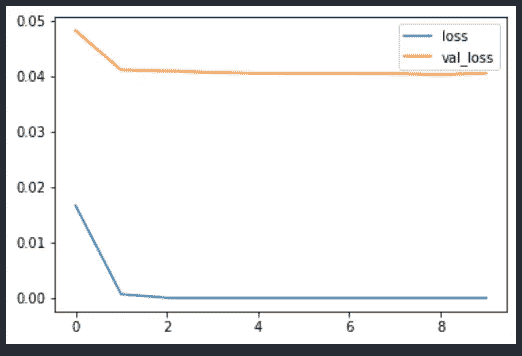

# 计算机视觉中的多任务学习:图像分类

> 原文：<https://medium.com/analytics-vidhya/multi-task-learning-in-computer-vision-image-classification-ea7b61fb4a0a?source=collection_archive---------1----------------------->

# 简介:

曾经面临过由于需求而不得不创建大量深度学习模型的问题，现在不用担心了，因为多任务学习就在这里。如果每个模型中的基础数据集保持不变，多任务学习会有很大帮助。不需要创建单独的模型，您可以使用基本网络层简单地提取数据集的特征，最后以并行方式将不同类型的头层附加到基本网络之上，以同时学习不同的模型。这可以解决计算机视觉领域中的一些用例:

*   房价和房屋类型预测
*   人脸性别和年龄检测
*   作物分离及其健康分析

在这里，我们将查看一个用例，其中我们将创建一个简单的图像分类模型来检测给定图像中出现的汽车的颜色和类型。我们不要再等了。

# 数据准备:

在下面的练习中，我选择了在 [Kaggle](https://www.kaggle.com/vedanshdwivedi/automobile-images-dataset) 中公开提供的数据集，该数据集由不同的目录组成，每个目录都遵循“color_type”的模式。你可能已经猜到了我们要做什么，是的，我们将把这作为一个多任务图像分类问题，颜色和类型是我们希望模型学习的不同目标值。让我们看看数据结构，并根据要求准备数据集。

因此，数据集由大约 **18 个类**组成，每个类可以仅由大约 **50 个图像**组成，这在正常图像分类问题的情况下可以说是较少的，而从多任务学习者的角度来看，我们可以将其分成两个学习者:一个用于颜色，另一个用于使用单一模型的车辆类型。让我们为此准备数据集。

**数据加载和准备**

在这里，图像按照模型的要求被加载和整形。此外，我们将 18 个类分成了两个不同的集合:

*   颜色标签:4
*   类型标签:5

**数据增强**

**准备目标数据**

**利用迁移学习建模**

现在，我们将创建构建多任务图像分类问题所需的图层，我决定尝试使用预训练的权重进行迁移学习，因为模型使用预训练的权重会学习得更好。该模型的具体内容如下:

*模型:Mobilenet_v2 在 Imagenet 数据集上训练，输入图像大小为[128，128，3]*

*   第 1 层用于学习数据集中车辆的颜色
*   第 2 层用于学习数据集中的车辆类型

**建立和训练模型**

该模型在验证数据集方面做得相当好，因为损失非常接近该图的较低水平

**用随机图像推断模型**

让我们使用来自互联网的随机图像来检查模型的能力，我已经下载了一些样本来测试模型的效率。我选择了三组图像:一辆黑色卡车、一辆白色卡车和一辆绿色自行车。让我们看看结果是如何分布的:

**获得预测，并将它们重新映射到类上**

正如我们在这里看到的，如果基础数据集是通用的，我们可以通过利用多任务学习来节省更多时间并构建高效的模型，而不是为不同的用例开发不同的模型集。一定要试试这个，并给我反馈，直到那时再见朋友。注意安全。