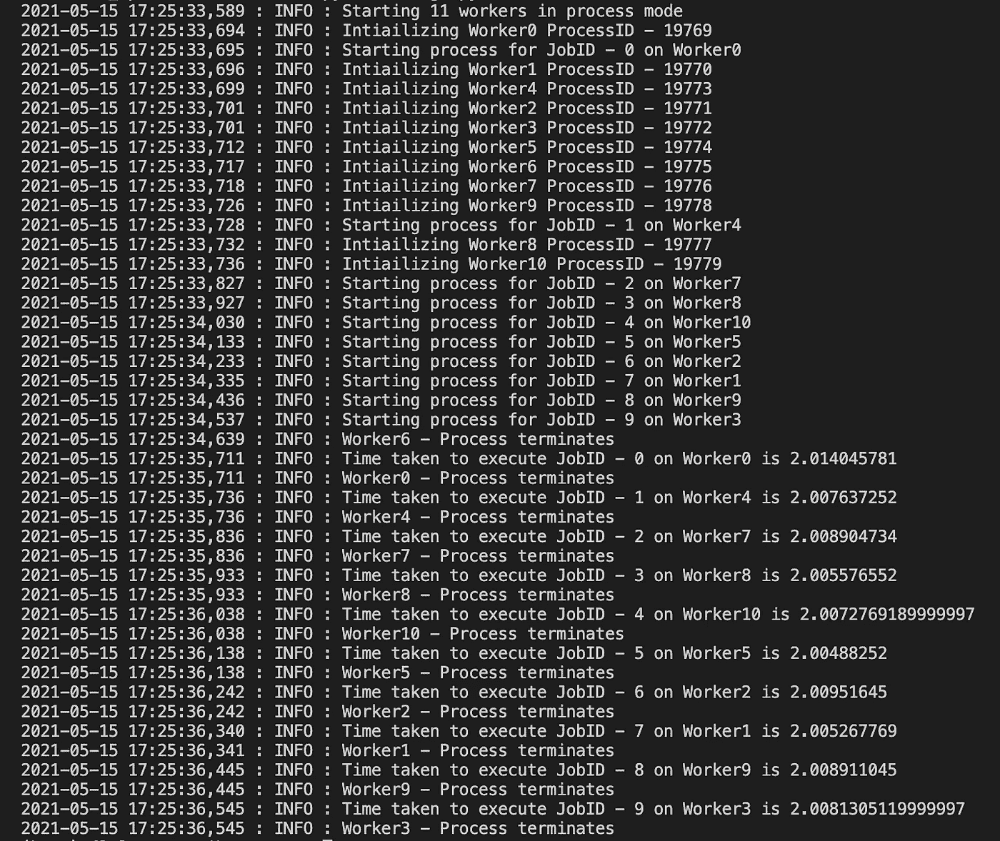

# Python 中的多任务处理方式

> 原文：<https://medium.com/analytics-vidhya/multi-tasking-your-way-in-python-795ced176d9d?source=collection_archive---------7----------------------->


由[马克·森德拉·马托雷尔](https://unsplash.com/@marcsm?utm_source=medium&utm_medium=referral)在 [Unsplash](https://unsplash.com?utm_source=medium&utm_medium=referral) 上拍摄的照片

ython 以其易用性和几乎不存在的学习曲线而闻名，但今天我将分享 python 多处理库的一个实现，作为一个客户端服务器架构。在开始编写代码之前，让我们先了解一些基础知识。

**什么是 GIL，它是如何工作的？**

简单地说，就像任何公共淋浴一样，当你使用它时，它是你的，在你用完之后，其他人使用它。在 Cpython 中，为了使其实现更简单，python 解释器的锁被提供给每个线程来执行，一旦线程的执行完成，一个新的线程就锁定 python 解释器。Python 的设计考虑了单线程执行，这增加了它的简单性。

关于 GIL 更详细的解释可以在[这里](https://realpython.com/python-gil/)找到

# **当我使用多核系统时，如何获得最佳性价比？**

最流行的方法是使用多处理方法，即使用多个进程代替线程。由于每个进程都有自己的 Python 解释器和内存空间，因此 GIL 不会成为问题。

`[multiprocessing](https://docs.python.org/3/library/multiprocessing.html#module-multiprocessing)`包提供了本地和远程并发，通过使用子进程而不是线程，有效地避开了[全局解释器锁](https://docs.python.org/3/glossary.html#term-global-interpreter-lock) (GIL)。因此，`[multiprocessing](https://docs.python.org/3/library/multiprocessing.html#module-multiprocessing)`模块允许程序员充分利用给定机器上的多个处理器。它可以在 Unix 和 Windows 上运行。

# 客户机-服务器体系结构

为此，我们将创建一个管理器类和一个工作器类，工作器将由管理器根据系统中可用的内核数量进行初始化。

因此，员工可以以并行方式承担您需要他们完成的任务。让我们来研究一下代码。

不知所措？，如果是的话，对我来说也是如此，但是让我们把代码分解成更小的部分以便于理解

**队列**—`[Queue](https://docs.python.org/3/library/multiprocessing.html#multiprocessing.Queue)` 是模仿 Python 2.5+中引入的标准库中的`[queue.Queue](https://docs.python.org/3/library/queue.html#queue.Queue)`类的多生产者、多消费者 FIFO 队列。

Queue.put 和 Queue.get_no_wait 顾名思义，将对象放入队列并从队列中移除和获取对象，get_no_wait 方法在生成异常 queue 之前不会等待任何时间。队列为空时引发空返回异常

> `Note — [multiprocessing](https://docs.python.org/3/library/multiprocessing.html#module-multiprocessing)`使用通常的`[queue.Empty](https://docs.python.org/3/library/queue.html#queue.Empty)`和`[queue.Full](https://docs.python.org/3/library/queue.html#queue.Full)`异常来发出超时信号。它们在`[multiprocessing](https://docs.python.org/3/library/multiprocessing.html#module-multiprocessing)`名称空间中不可用，因此您需要从`[queue](https://docs.python.org/3/library/queue.html#module-queue)`中导入它们。

**事件** —所以我们正在操作多个线程，我们需要一种机制来通信或发送信号，比如暂停或终止线程的执行，事件类的救援，这有助于我们进行线程间通信。

事件对象使用一个内部标志，称为事件标志，使用 set()方法将其设置为 True，并可以使用 clear()方法将其重置为 false。

*   **isSet() —** 当且仅当内部标志为 true 时，此方法返回 true
*   **set() —** 当对任何事件对象调用该方法时，内部标志被设置为真。并且一旦为任何事件调用 set()方法，所有等待它的线程都会被唤醒。

# **经理类**

好吧，这位经理既刻薄又无情，但他能让员工完成工作。他的任务是计划和分配工人需要完成的任务。

初始化时，管理器类初始化队列、事件和工作者类。工人数量取决于系统的处理能力。我将 1 个核心分配给经理，其余分配给工人。因此，请确保将计算强度较低的进程分配给管理器类。我班有两种方法。

*   **add_jobs()** —现在 manager 的主要任务是给工人分配他们各自的任务，这是使用该类的 add_jobs()方法来完成的，当这个方法被调用时，它开始将作业添加到队列中，为了简单起见，我将 10 个整数添加到我的队列中。

```
####################################################################                               #                  Task addition on queue starts                                ####################################################################                                                       for i in range(10):
    self.task_queue.put(i) # Assigns the job in queue
    time.sleep(0.1) ####################################################################                               #                 Task addition on queue ends                                ####################################################################
```

*   **terminate()** —该方法调用 stop_event 对象的 set 方法，使其事件标志为 True，从而通知可怜的工人不会有任何额外的任务，一旦现有任务完成，他们就可以回家了。这是在 add_jobs()方法完成执行后调用的

```
def terminate(self):
    '''Sets terminate event when called'''
    self.stop_event.set()
```

# 工人阶级

这里的工人天真、听话、勤劳。他们毫无怨言地完成了严格的经理分配给他们的所有任务，因此除了一个核心外，所有可用的核心都被分配到这个类别。因此，为员工规划计算密集型任务

该类继承自`[Process](https://docs.python.org/3/library/multiprocessing.html#multiprocessing.Process)`类并覆盖 run 方法，查看大量官方文档深入了解`[Process](https://docs.python.org/3/library/multiprocessing.html#multiprocessing.Process)`类。

您希望您的工人执行的任务放在 **run** 方法中。在我的实现中，代码从 while 循环开始，一直运行到两个条件都满足，即

*   队列仍有项目
*   未设置停止事件

```
while not self.task_queue.empty() or not self.stop_event.is_set(): try:
        job = self.task_queue.get_nowait()                                                                             ####################################################################                                       #                  Processing tasks starts                                        #################################################################### # Random operation below 

        random_operation = sum([(job)^i for i in range(500000)]) 
        time.sleep(2)                                       
                                      ####################################################################                                       #                  Processing tasks ends                                        #################################################################### except q.Empty: pass
```

*   当且仅当队列为空并且设置了停止事件时，代码才会退出循环。因此，如果经理没有及时分配一些项目，工人会被指示耐心等待，只有当管道为空且经理通过设置 stop_event 指示他们回家时才打包。无情的经理对吗？生活是艰难的。
*   self.task_queue.get_nowait()根据 FIFO(先进先出)获取队列中的下一个可用项，在获取项后可以开始处理作业。它抛出**队列。空的**异常如果没有条目，我们已经处理了异常。

# **结果**

现在是最后的结论，它的性能如何，性能是主观的，我使用的是 Macbook pro- Intel Core i7 处理器，它有 12 个内核，我使用其中的 11 个用于工作，因为执行是并行的，每个线程都使用自己的 python 解释器，所以不存在资源竞争，一个线程不会等待其他线程完成执行才开始，下面是我的终端上的截图，显示了同样的情况。



我们已经执行了 10 个进程，每个进程大约需要 2 秒钟，使用普通解决方案需要 20 多秒钟，但是同时执行 10 个不同的进程，其中一个内核没有使用，整个过程只需要大约 3 秒钟。

当您在通常为多核的虚拟机上部署生产代码时，您可以获得巨大的性能提升。

请在下面的评论中告诉我你的想法和建议。

注意安全，你比你想象的要坚强。

参考文献—

*   [https://docs . python . org/3/library/multi processing . html #多重处理。流程](https://docs.python.org/3/library/multiprocessing.html#multiprocessing.Process)
*   [https://docs . python . org/3/glossary . html # term-global-interpreter-lock](https://docs.python.org/3/glossary.html#term-global-interpreter-lock)
*   【https://realpython.com/python-gil/ 