# 使用深度学习的多类文本分类

> 原文：<https://medium.com/analytics-vidhya/multiclass-text-classification-using-deep-learning-f25b4b1010e5?source=collection_archive---------0----------------------->

***在本文中，我们将使用各种深度学习方法来解决一个多类文本分类问题。*** *所以让我们先理解它，并用 python 做一个简短的实现。*

# 数据集/问题描述

在这篇文章中，我使用了来自 Kaggle 的 [**UCI ML 药物评论数据集**](https://www.kaggle.com/jessicali9530/kuc-hackathon-winter-2018) 。它包含超过 200，000 个患者药物评论，以及相关条件。数据集有许多列，但是我们将只使用其中的两列来完成 NLP 任务。

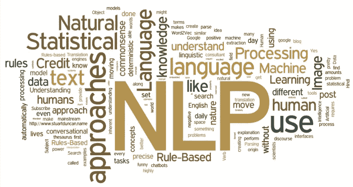

所以，我们的数据集看起来像这样:

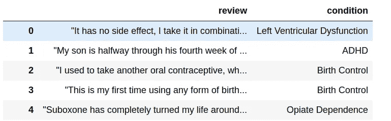

任务:我们希望根据药物综述对主要疾病进行分类。

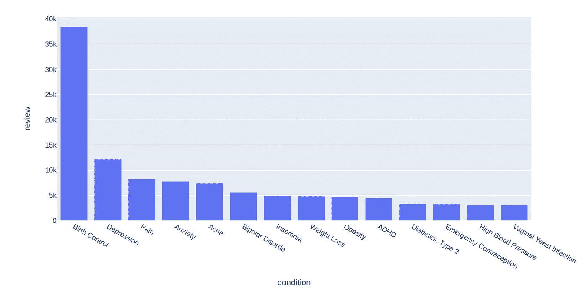

# word2vec 嵌入入门:

在我们进一步研究文本分类之前，我们需要一种在词汇表中用数字表示单词的方法。为什么？因为我们大部分的 ML 模型都需要数字，而不是文本。

实现这个目标的一种方法是使用单词向量的一次性编码，但这不是正确的选择。给定大量的词汇，这种表示将占用大量的空间，并且它不能准确地表达不同单词之间的相似性，例如如果我们想要找到数字单词 x 和 y 之间的余弦相似性:

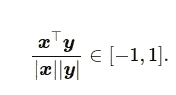

给定独热编码向量的结构，不同单词之间的相似度总是为 0。

Word2Vec 通过为我们提供一个固定长度(通常比词汇表大小小得多)的单词向量表示来克服上述困难。它还捕捉不同单词之间的相似性和类比关系。

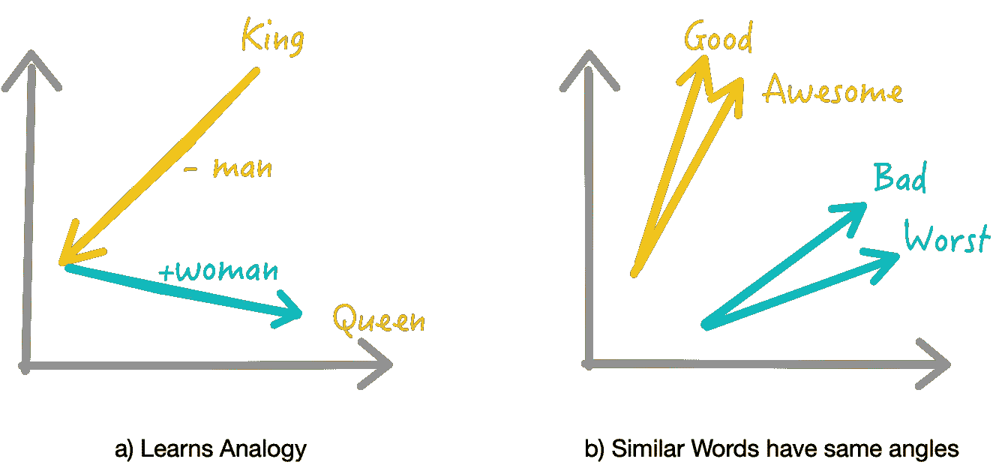

单词向量的学习方式允许我们学习不同的类比。这使我们能够对单词进行代数运算，这在以前是不可能的。

比如:什么是王者——男人+女人？结果是皇后。

Word2Vec 向量也帮助我们找到单词之间的相似性。如果我们寻找与“好”相似的词，我们会发现很棒，很棒，等等。word2vec 的这一特性使得它在文本分类中具有不可估量的价值。有了这个，我们的深度学习网络就明白了“好”和“伟大”是意思相近的词。

简单地说，word2vec 为单词创建了固定长度的向量，为字典中的每个单词(和常见的二元模型)提供了一个 d 维向量。

这些词向量通常是预先训练好的，并由其他人在像维基百科、推特等大型文本语料库上训练后提供。最常用的预训练词向量有 [**手套**](https://www.kaggle.com/takuok/glove840b300dtxt) 和 300 维词向量的快速文本。在这篇文章中，我们将使用手套词向量。

# 数据预处理

在大多数情况下，文本数据并不完全干净。来自不同来源的数据具有不同的特征，这使得文本预处理成为分类管道中最关键的步骤之一。例如，来自 Twitter 的文本数据不同于在 Quora 或其他新闻/博客平台上找到的文本数据，每种数据都需要区别对待。然而，我们将在这篇文章中讨论的技术对于你在 NLP 的丛林中可能遇到的几乎任何类型的数据都足够通用。

# a)清除特殊字符并删除标点符号

我们的预处理管道很大程度上依赖于我们将用于分类任务的 word2vec 嵌入。原则上，我们的预处理应该匹配在训练单词嵌入之前使用的预处理。由于大多数嵌入没有为标点符号和其他特殊字符提供向量值，所以我们要做的第一件事就是去掉文本数据中的特殊字符。

```
# Some preprocesssing that will be common to all the text classification methods you will see.import redef clean_text(x):
    pattern = r'[^a-zA-z0-9\s]'
    text = re.sub(pattern, '', x)
    return x
```

# b)清洁编号

为什么我们要用#s 代替数字？因为包括 Glove 在内的大多数嵌入都以这种方式对其文本进行了预处理。

***小 Python 绝招:*** 我们在下面的代码中使用了一个 if 语句来预先检查文本中是否存在数字，因为 if 总是比 re.sub 命令快，而且我们的大部分文本都不包含数字。

```
def clean_numbers(x):
    if bool(re.search(r'\d', x)):
        x = re.sub('[0-9]{5,}', '#####', x)
        x = re.sub('[0-9]**{4}**', '####', x)
        x = re.sub('[0-9]**{3}**', '###', x)
        x = re.sub('[0-9]**{2}**', '##', x)
    return x
```

# c)消除收缩

缩写是我们用撇号写的单词。缩写的例子是像“不是”或“不是”这样的词。因为我们想标准化我们的文本，所以扩展这些缩写是有意义的。下面我们使用收缩映射和正则表达式函数来完成。

```
contraction_dict = {"ain't": "is not", "aren't": "are not","can't": "cannot", "'cause": "because", "could've": "could have"}def _get_contractions(contraction_dict):
    contraction_re = re.compile('(**%s**)' % '|'.join(contraction_dict.keys()))
    return contraction_dict, contraction_re
contractions, contractions_re = _get_contractions(contraction_dict)def replace_contractions(text):
    def replace(match):
        return contractions[match.group(0)]
    return contractions_re.sub(replace, text)# Usage
replace_contractions("this's a text with contraction")
```

除了以上技巧，你可能还想做拼写纠正。但是因为我们的帖子已经很长了，我们现在就离开它。

# 数据表示:序列创建

使深度学习成为 NLP 的首选的一件事是，我们不必从我们的文本数据中手工设计特征；深度学习算法将一系列文本作为输入，像人类一样学习其结构。由于机器不能理解文字，它们希望数据是数字形式的。因此，我们需要将文本数据表示为一系列数字。

为了理解这是如何做到的，我们需要了解一些关于 Keras Tokenizer 函数的知识。其他记号赋予器也是可行的，但是 Keras 记号赋予器对我来说是个不错的选择。

# a)记号赋予器

简而言之，记号赋予器是一个将句子拆分成单词的实用函数。keras . preprocessing . text . tokenizer 将文本标记化(拆分)为标记(单词)，同时只保留文本语料库中出现次数最多的单词。

```
#Signature:
Tokenizer(num_words=None, filters='!"#$%&()*+,-./:;<=>?@[\\]^_`{|}~\t\n',
lower=True, split=' ', char_level=False, oov_token=None, document_count=0, **kwargs)
```

num_words 参数只保留文本中预先指定数量的单词。这是有帮助的，因为我们不希望我们的模型因为考虑不经常出现的单词而受到很多干扰。在真实世界的数据中，我们使用 num_words 参数留下的大多数单词通常都是拼写错误的单词。缺省情况下，记号赋予器还会过滤掉一些不想要的记号，并将文本转换成小写。

一旦适合数据，tokenizer 还保留一个单词索引(一个我们可以用来为单词分配唯一编号的字典)，可以通过 tokenizer.word_index 访问。索引词典中的单词按出现频率排列。

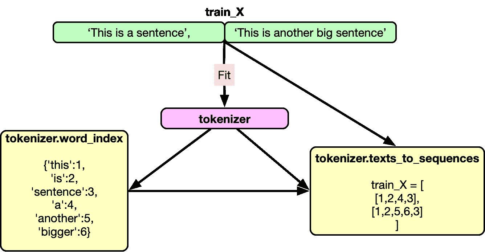

所以使用记号赋予器的全部代码如下:

```
from keras.preprocessing.text import Tokenizer## Tokenize the sentences
tokenizer = Tokenizer(num_words=max_features)
tokenizer.fit_on_texts(list(train_X)+list(test_X))
train_X = tokenizer.texts_to_sequences(train_X)
test_X = tokenizer.texts_to_sequences(test_X)
```

其中 train_X 和 test_X 是语料库中的文档列表。

# b)填充序列

通常，我们的模型期望每个文本序列(每个训练示例)具有相同的长度(相同数量的单词/标记)。我们可以使用 maxlen 参数对此进行控制。

例如:

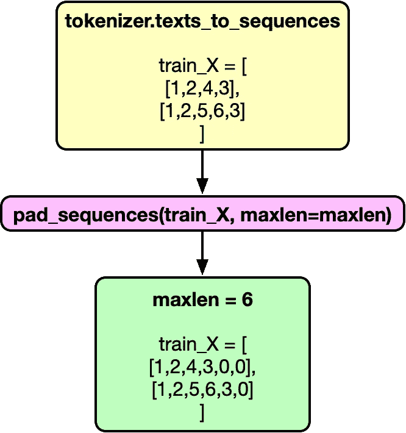

```
train_X = pad_sequences(train_X, maxlen=maxlen)
test_X = pad_sequences(test_X, maxlen=maxlen)
```

现在我们的训练数据包含了一个数字列表。每个列表都有相同的长度。我们还有 word_index，它是文本语料库中出现最多的单词的字典。

# c)编码目标变量的标签

Pytorch 模型期望目标变量是一个数字，而不是一个字符串。我们可以使用 sklearn 的标签编码器来转换我们的目标变量。

```
from sklearn.preprocessing import LabelEncoder
le = LabelEncoder()
train_y = le.fit_transform(train_y.values)
test_y = le.transform(test_y.values)
```

# 负载嵌入

首先，我们需要加载所需的手套嵌入。

```
def load_glove(word_index):
    EMBEDDING_FILE = '../input/glove840b300dtxt/glove.840B.300d.txt'
    def get_coefs(word,*arr): return word, np.asarray(arr, dtype='float32')[:300]
    embeddings_index = dict(get_coefs(*o.split(" ")) for o in   open(EMBEDDING_FILE)) all_embs = np.stack(embeddings_index.values())
    emb_mean,emb_std = -0.005838499,0.48782197
    embed_size = all_embs.shape[1]nb_words = min(max_features, len(word_index)+1)
    embedding_matrix = np.random.normal(emb_mean, emb_std, (nb_words, embed_size))
    for word, i in word_index.items():
        if i >= max_features: continue
        embedding_vector = embeddings_index.get(word)
        if embedding_vector is not None:
            embedding_matrix[i] = embedding_vector
        else:
            embedding_vector = embeddings_index.get(word.capitalize())
            if embedding_vector is not None:
                embedding_matrix[i] = embedding_vector
    return embedding_matrixembedding_matrix = load_glove(tokenizer.word_index)
```

一定要把下载这些手套向量的文件夹路径放进去。嵌入索引包含什么？这是一个字典，其中的键是单词，值是单词向量，一个长度为 300 的 np.array。这部词典的长度大约是十亿。

因为我们只需要 word_index 中单词的嵌入，所以我们将使用我们的 tokenizer 中的 word index 创建一个只包含所需嵌入的矩阵。

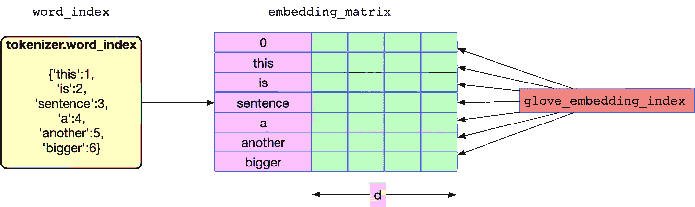

# 深度学习模型

# 1.TextCNN

使用 CNN 对文本进行分类的想法首先在 Yoon Kim 的论文[](https://www.aclweb.org/anthology/D14-1181)**中提出。**

**表示:这个想法的中心概念是把我们的文档看作图像。但是怎么做呢？假设我们有一个句子，我们有 maxlen = 70，嵌入大小= 300。我们可以创建一个形状为 70×300 的数字矩阵来表示这个句子。图像也有一个矩阵，其中各个元素是像素值。但是任务的输入不是图像像素，而是用矩阵表示的句子或文档。矩阵的每一行对应一个单词向量。**

****

**卷积思想:对于图像，我们移动我们的 conv。水平和垂直过滤，但对于文本，我们将内核大小固定为 filter_size x embed_size，即(3，300)，我们将垂直向下移动卷积，同时查看三个单词，因为我们在这种情况下的过滤器大小为 3。这个想法似乎是正确的，因为我们的卷积滤波器不分裂字嵌入；它会查看每个单词的完整嵌入。此外，我们可以将过滤器的大小想象成一元、二元、三元等。因为我们正在分别查看 1、2、3 和 5 个单词的上下文窗口。**

**这里是 CNN 网络编码在 [**Pytorch**](https://towardsdatascience.com/moving-from-keras-to-pytorch-f0d4fff4ce79%EF%BF%BD) 的文本分类。**

```
class CNN_Text(nn.Module):    
    def __init__(self):
        super(CNN_Text, self).__init__()
        filter_sizes = [1,2,3,5]
        num_filters = 36
        n_classes = len(le.classes_)
        self.embedding = nn.Embedding(max_features, embed_size)
        self.embedding.weight = nn.Parameter(torch.tensor(embedding_matrix, dtype=torch.float32))
        self.embedding.weight.requires_grad = False
        self.convs1 = nn.ModuleList([nn.Conv2d(1, num_filters, (K, embed_size)) for K in filter_sizes])
        self.dropout = nn.Dropout(0.1)
        self.fc1 = nn.Linear(len(filter_sizes)*num_filters, n_classes)def forward(self, x):
        x = self.embedding(x)  
        x = x.unsqueeze(1)  
        x = [F.relu(conv(x)).squeeze(3) for conv in self.convs1]
        x = [F.max_pool1d(i, i.size(2)).squeeze(2) for i in x]  
        x = torch.cat(x, 1)
        x = self.dropout(x)  
        logit = self.fc1(x)
        return logit
```

# **2.双向 RNN (LSTM/GRU)**

**TextCNN 很适合文本分类，因为它处理近距离的单词。比如它可以一起看《纽约》。然而，它仍然不能处理特定文本序列中提供的所有上下文。它仍然没有学习数据的顺序结构，其中每个单词都依赖于前一个单词或前一个句子中的一个单词。**

**RNNs 可以帮助我们。他们可以使用隐藏状态记住以前的信息，并将其与当前任务联系起来。**

**长短期记忆网络(LSTM)是 RNN 的一个子类，专门用于长时间记忆信息。此外，双向 LSTM 保持了两个方向的上下文信息，这在文本分类任务中非常有用(但是，它不适用于时间序列预测任务，因为在这种情况下我们无法看到未来)。**

**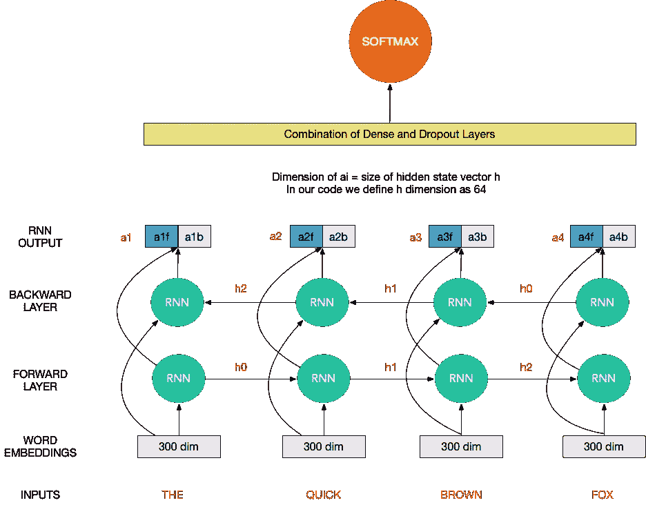**

**为了简单解释双向 RNN，可以把 RNN 单元想象成一个黑盒，它接受一个隐藏状态(向量)和一个字向量作为输入，给出一个输出向量和下一个隐藏状态。这个盒子有一些权重需要使用损耗的反向传播来调整。此外，相同的单元格应用于所有单词，以便句子中的单词共享权重。这种现象被称为重量共享。**

****

**隐藏状态，单词向量-->(RNN 单元格)->输出向量，下一个隐藏状态**

**对于像“你永远不会相信”这样的长度为 4 的序列，RNN 单元给出 4 个输出向量，这些向量可以连接起来，然后用作密集前馈架构的一部分。**

**在双向 RNN 中，唯一的变化是我们以通常的方式以及相反的方式阅读文本。所以我们并行堆叠两个 rnn，我们得到 8 个输出向量来附加。**

**一旦我们得到了输出向量，我们将它们通过一系列密集层，最后是 softmax 层，以构建文本分类器。**

**在大多数情况下，您需要了解如何在神经网络中堆叠一些层以获得最佳结果。如果性能更好，我们可以在网络中尝试多个双向 GRU/LSTM 层。**

**由于 RNNs 的局限性，例如不记得长期依赖关系，在实践中，我们几乎总是使用 LSTM/GRU 来建模长期依赖关系。在这种情况下，您可以将上图中的 RNN 单元格想象为 LSTM 单元格或 GRU 单元格。**

**以下是 Pytorch 中用于该网络的一些代码:**

```
class BiLSTM(nn.Module):
    def __init__(self):
        super(BiLSTM, self).__init__()
        self.hidden_size = 64
        drp = 0.1
        n_classes = len(le.classes_)
        self.embedding = nn.Embedding(max_features, embed_size)
        self.embedding.weight = nn.Parameter(torch.tensor(embedding_matrix, dtype=torch.float32))
        self.embedding.weight.requires_grad = False
        self.lstm = nn.LSTM(embed_size, self.hidden_size, bidirectional=True, batch_first=True)
        self.linear = nn.Linear(self.hidden_size*4 , 64)
        self.relu = nn.ReLU()
        self.dropout = nn.Dropout(drp)
        self.out = nn.Linear(64, n_classes)
 def forward(self, x):
        *#rint(x.size())*
        h_embedding = self.embedding(x)
        *#_embedding = torch.squeeze(torch.unsqueeze(h_embedding, 0))*
        h_lstm, _ = self.lstm(h_embedding)
        avg_pool = torch.mean(h_lstm, 1)
        max_pool, _ = torch.max(h_lstm, 1)
        conc = torch.cat(( avg_pool, max_pool), 1)
        conc = self.relu(self.linear(conc))
        conc = self.dropout(conc)
        out = self.out(conc)
        return out
```

# **培养**

**下面是我们用来训练 BiLSTM 模型的代码。代码注释的很好，请大家通读代码理解。你可能也想看看我在 Pytorch 上的帖子。**

```
n_epochs = 6
model = BiLSTM()
loss_fn = nn.CrossEntropyLoss(reduction='sum')
optimizer = torch.optim.Adam(filter(lambda p: p.requires_grad, model.parameters()), lr=0.001)
model.cuda()# Load train and test in CUDA Memory
x_train = torch.tensor(train_X, dtype=torch.long).cuda()
y_train = torch.tensor(train_y, dtype=torch.long).cuda()
x_cv = torch.tensor(test_X, dtype=torch.long).cuda()
y_cv = torch.tensor(test_y, dtype=torch.long).cuda()# Create Torch datasets
train = torch.utils.data.TensorDataset(x_train, y_train)
valid = torch.utils.data.TensorDataset(x_cv, y_cv)# Create Data Loaders
train_loader = torch.utils.data.DataLoader(train, batch_size=batch_size, shuffle=True)
valid_loader = torch.utils.data.DataLoader(valid, batch_size=batch_size, shuffle=False)train_loss = []
valid_loss = []for epoch in range(n_epochs):
    start_time = time.time()
    # Set model to train configuration
    model.train()
    avg_loss = 0\.  
    for i, (x_batch, y_batch) in enumerate(train_loader):
        # Predict/Forward Pass
        y_pred = model(x_batch)
        # Compute loss
        loss = loss_fn(y_pred, y_batch)
        optimizer.zero_grad()
        loss.backward()
        optimizer.step()
        avg_loss += loss.item() / len(train_loader) # Set model to validation configuration -Doesn't get trained here
    model.eval()        
    avg_val_loss = 0.
    val_preds = np.zeros((len(x_cv),len(le.classes_))) for i, (x_batch, y_batch) in enumerate(valid_loader):
        y_pred = model(x_batch).detach()
        avg_val_loss += loss_fn(y_pred, y_batch).item() / len(valid_loader)
        # keep/store predictions
        val_preds[i * batch_size:(i+1) * batch_size] =F.softmax(y_pred).cpu().numpy() # Check Accuracy
    val_accuracy = sum(val_preds.argmax(axis=1)==test_y)/len(test_y)
    train_loss.append(avg_loss)
    valid_loss.append(avg_val_loss)
    elapsed_time = time.time() - start_time
    print('Epoch {}/{} \t loss={:.4f} \t val_loss={:.4f}  \t val_acc={:.4f}  \t time={:.2f}s'.format(
                epoch + 1, n_epochs, avg_loss, avg_val_loss, val_accuracy, elapsed_time))
```

**培训输出如下所示:**

**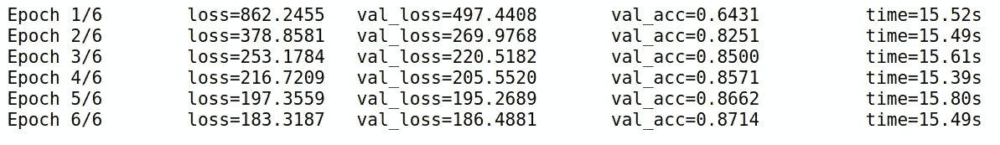****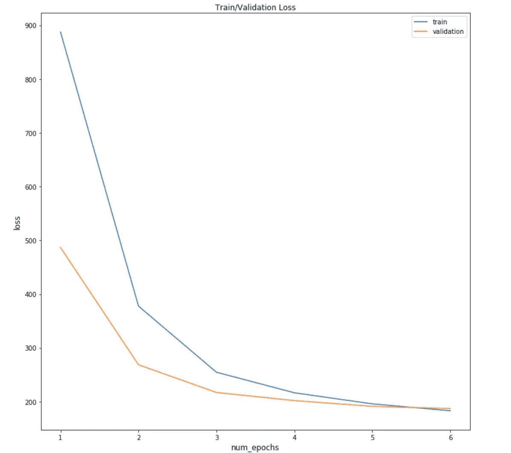**

# **结果/预测**

```
import scikitplot as skplt
y_true = [le.classes_[x] for x **in** test_y]
y_pred = [le.classes_[x] for x **in** val_preds.argmax(axis=1)]
skplt.metrics.plot_confusion_matrix(
    y_true,
    y_pred,
    figsize=(12,12),x_tick_rotation=90)
```

**以下是 BiLSTM 模型结果的混淆矩阵。我们可以看到，我们的模型做得相当好，在验证数据集上有 87%的准确率。**

**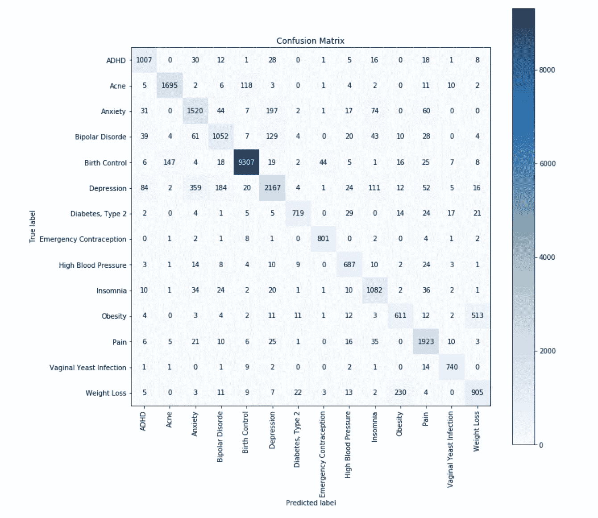**

**有趣的是，即使在模型表现不佳的地方，这也是可以理解的。例如，该模型混淆了减肥和肥胖、抑郁和焦虑、抑郁和双相情感障碍。我不是专家，但是这些病确实感觉挺像的。**

# **结论**

**在这篇文章中，我们介绍了用于文本分类的深度学习架构，如 LSTM 和比尔斯特姆，并解释了 NLP 深度学习中使用的不同步骤。**

**仍然有很多可以做的来改进这个模型的性能。改变学习速率、使用学习速率表、使用额外的特征、丰富嵌入、去除拼写错误等。我希望这段样板代码能为您可能面临的任何文本分类问题提供一个参考基准。**

**感谢阅读！将来我也会写更多的 **NLP 文章**。 [**跟着**](/@vijay_choubey) 我上来了解他们。我也是一名自由职业者，如果有一些数据相关项目的自由职业工作，请随时通过 [**Linkedin**](https://www.linkedin.com/in/vijay-choubey-3bb471148/) 联系。没有什么比做真正的项目更好的了！**