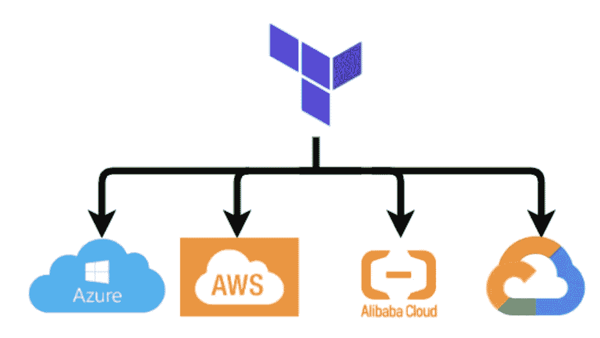
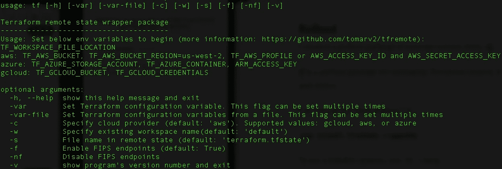
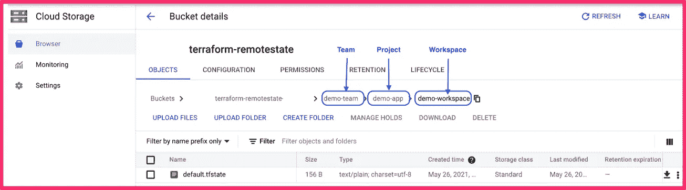
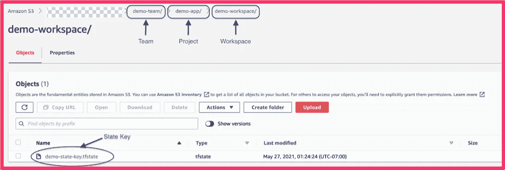
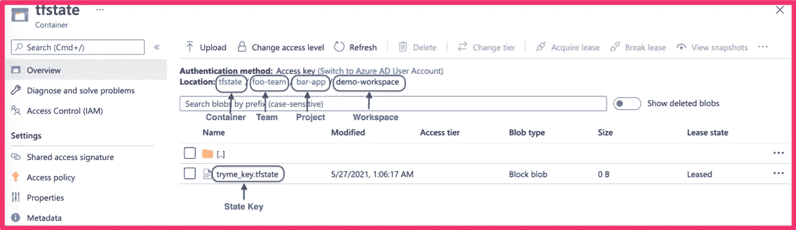

# 多云平台远程状态

> 原文：<https://medium.com/analytics-vidhya/multicloud-terraform-states-b8686de20d60?source=collection_archive---------11----------------------->



# 概观

在 Terraform 中，状态文件用于跟踪基础设施的当前状态。如果您在团队中工作，使用本地状态文件会使 Terraform 的使用变得困难，因为每个用户都必须确保在运行 Terraform 之前拥有最新的状态数据，并确保没有其他人同时运行 Terraform。因此，将状态文件存储在一个共享位置非常重要，这样团队就可以轻松地将文件放入和放入。这就是远程状态变得重要的地方。远程状态允许 Terraform 将状态文件存储在:

*   AWS S3
*   DynamoDB
*   开源代码库
*   Azure 存储帐户
*   Google 存储帐户

**注意:**就我个人而言，我不推荐使用 Github 进行远程状态，问题是你不想在每次部署后都进行修改，因为你可能还在构建环境。此外，您可能不希望在某人发布或执行部署后进行拉动或调整，因为您可能正在处理不同的组件。

对象存储是存储 Terraform 远程状态的最佳和推荐方法。我已经用了几年了，从来没有任何问题。它与 CICD 没有任何问题。

# 多云远程状态？

在多云环境下，如何设计 Terraform 远程状态的布局？

三个选项:

*   管理地形云中的状态。
*   将远程状态整合到一个云提供商。
*   管理每个云提供商的状态。

**管理地形云中的状态:**

我还没有机会工作在 Terraform 云，但这应该工作得很好。

**将远程状态整合到一个云提供商:**

在谷歌存储或 S3 中创建一个存储帐户，并存储所有 terraform 状态文件。这种方法的问题是，部署在 AWS 中的用户可能没有权限访问 Google Storage，或者部署 AWS 的用户可能没有权限访问 Azure Storage。随着组织的发展，将会有不同的团队管理不同的云提供商。所以，要做长远打算。

**管理每个云提供商的状态:**

这很简单。为每个云提供商创建存储。

*   谷歌部署到谷歌存储。
*   AWS 部署到 S3。
*   Azure 部署到 Azure 存储。

## 注意:

*   为生产和非生产环境创建单独的存储桶。
*   确保存储桶版本化。

# 首次展示

我创建了一个 python 包来管理多云环境中的远程状态**。**阅读更多关于 [**tf**](https://github.com/tomarv2/tfremote) **。 *tf*** 是一个 python 包，用于管理 GCP、AWS 和 Azure 的 Terraform 远程状态。

`**pip install tfremote --upgrade**`

根据云提供商，设置以下环境变量:

## AWS:

```
export TF_AWS_BUCKET=<remote_state_bucket_name>
export TF_AWS_PROFILE=default
export TF_AWS_BUCKET_REGION=us-west-2
```

## 天蓝色:

```
export TF_AZURE_STORAGE_ACCOUNT=<storage_account_name>
export TF_AZURE_CONTAINER=<storage_container_name>
ARM_ACCESS_KEY=<storage_access_key>
```

## GCP:

```
export TF_GCLOUD_BUCKET=<storage_bucket_name>
export TF_GCLOUD_CREDENTIALS=<service_account.json>
```

要查看可用选项，请运行`tf --help`



部署在谷歌云中。设置以下环境变量:

```
export TF_GCLOUD_BUCKET= <remote state bucket>
export TF_GCLOUD_CREDENTIALS= <Path to google service account file>
```

为团队 **demo-team** 项目 **demo-app** 部署在工作区 **demo-workspace:**

```
tf -c=gcloud apply -var='teamid=**demo-team**' -var='prjid=**demo-app**' -w=**demo-workspace**'
```

当您进行部署时，它将在 Google 云存储中创建一个结构，名为**Google bucket->demo-team->demo-app->demo-workspace。**

注意:如果没有提供`-w`，所有的部署都将转到`default` 工作区。



## AWS 中的结构:

*   **demo-team->demo-app->demo-workspace->demo-state-key . TF state**



**注意:**默认情况下，tfstate 文件被命名为 terraform.tfstate。如果您想要指定自定义名称，请使用`-s`标志。在工作区**演示工作区:**为团队**演示团队**项目**演示应用**部署

```
tf -c=aws apply -var='teamid=**demo-team**' -var='prjid=**demo-app**' -w=**demo-workspace**' -s=**demo-state**
```

## Azure 中的结构:

*   **foo-team->bar-app->demo-workspace->tryme _ key . TF state**



## github:[https://github.com/tomarv2/tfremote](https://github.com/tomarv2/tfremote)