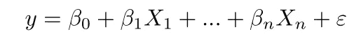
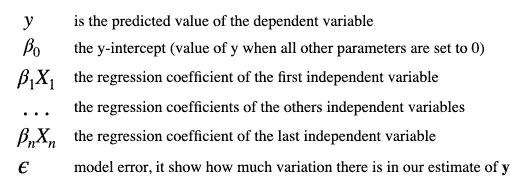
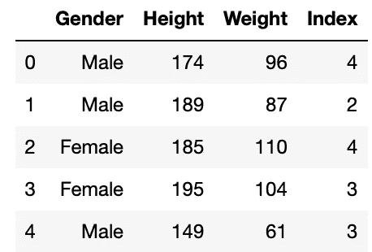
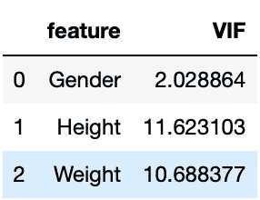

# 多元线性回归中的多重共线性

> 原文：<https://medium.com/analytics-vidhya/multicollinearity-in-multiple-linear-regression-e23997406c70?source=collection_archive---------13----------------------->


照片由 [Murai 拍摄。hr](https://unsplash.com/@murai?utm_source=medium&utm_medium=referral) on [Unsplash](https://unsplash.com?utm_source=medium&utm_medium=referral)

我经常在面试中听到关于线性回归中多重共线性问题的不同变体。它们听起来可能像:如何处理多元线性回归中的多重共线性？如何解决多重共线性？为什么多重共线性是一个潜在的问题？我决定把这个问题联合起来，为它找到一个精确的答案。

让我们从头开始。什么是多元线性回归？多元线性回归(MLR)或多重回归是简单线性回归的扩展。我们用它来估计两个或多个自变量和一个因变量之间的关系。因此，我们可以使用以下公式来执行 MLR:



MLR 公式

其中:



公式中的所有信息

多元回归比简单回归更接近现实生活，因为它可以显示变量之间的关系有多强，以及它们如何相互作用。比如降雨量、温度和肥料添加量如何影响植物，或者利率和失业率如何影响股票指数价格。

> 使用 ***MLR*** 当你需要知道:
> 
> —两个或多个自变量和一个因变量之间的关系有多强。
> 
> —自变量的某个值处因变量的值

## 为什么多重共线性是一个潜在的问题？

每一个回归分析都有一个目标，即找到并隔离每个自变量和因变量之间的关系。用回归系数表示的关系。当我们解释回归系数时，我们知道当我们保持所有其他自变量不变时，它代表自变量每单位变化的因变量的平均变化。换句话说，一个独立变量可以通过一个或多个其他独立变量进行线性预测。但是这里我们面临一个现象，当一个独立变量与多元回归方程中的一个或多个其他独立变量高度相关时。这给我们带来了模型解释和可信结果的问题。

> 当回归模型中的两个或多个独立变量高度相关时，就会出现多重共线性。

## 如何检测数据中的多重共线性？

有两种简单的方法可以在 EDA 上指示数据集中的多重共线性或使用 Python 获取步骤。

1.  **方差膨胀因子(VIF)。**
2.  **热图或关联矩阵。**

**方差膨胀因子**是多元回归中预测变量之间共线性的度量。它的计算方法是，将所有给定模型测试版的方差之比除以单个测试版的方差(如果它单独适用的话)。

例如，我们正在根据身高和体重变量为身体质量指数创建一个变量，该变量将包含模型中的冗余信息。



身体质量指数数据集

数据集有三个独立变量:

*   性别——我们可以为这个专栏创建虚拟人物
*   高度
*   重量

我用***stats models . outliers _ influence***库来计算 VIF 因子。如果 VIF 介于 5-10 之间，则可能存在多重共线性，您应该考虑删除该变量。

```
***# import necessary libraries*** from statsmodels.stats.outliers_influence import variance_inflation_factor***# the independent variables set*** 
X = data[['Gender', 'Height', 'Weight']] 

***# VIF dataframe*** 
vif_df = pd.DataFrame() 
vif_df["feature"] = X.columns 

***# calculating VIF for each feature*** 
vif_df["VIF"] = [variance_inflation_factor(X.values, i) 
                          for i in range(len(X.columns))]
```



我们在这里可以看到，身高和体重变量高度相关，因为 VIF 对他们来说超过 10。

**热图是**一个带有颜色渐变背景的相关矩阵。这个范围从 0 到 1，1 表示完全相关:

*   在 **0.9** 和 **1.0** 之间表示**非常高度相关的变量；**
*   在 **0.7** 和 **0.9** 之间表示可以认为**高度相关的变量；**
*   在 **0.5** 和 **0.7** 之间表示可以认为**中度相关的变量；**
*   在 **0.3** 和 **0.5** 之间意味着**低相关。**

## 如何修复数据中的多重共线性？

当我们希望在预测中避免高度相关的变量时，我们可以使用以下解决方案之一:

1.  **特色工程。**
2.  **掉一个。**

特征工程是将两个高度相关的特征聚合或组合起来，并把它们变成一个变量。

删除一个变量听起来很容易，但是在你决定应该删除哪个变量之前，需要一个合适的 EDA。

## 摘要

多重共线性是一个需要解决的有趣问题。当我们检查多重共线性时，我们应该检查多个指标，并在它们之间寻找模式。