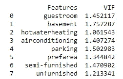

# 多重共线性、正则化、套索、岭和多项式回归

> 原文：<https://medium.com/analytics-vidhya/multicollinearity-regularization-lasso-ridge-and-polynomial-regression-93bc90d2e4d?source=collection_archive---------5----------------------->


## **多重共线性**

两个或多个自变量之间通常会出现高度相关。这在回归模型中有广泛的暗示。在实时情况下，数据可能具有共线性属性。在应用任何模型之前，需要校正共线性，否则将导致错误的结果和较低的准确性。

> 考虑日常活动以更好地解释多重共线性。汤姆通常喜欢甜食。他一边看电视一边享受甜食。我们如何确定汤姆的幸福等级？这个可以边看电视边吃甜食两种方式养。这两个变量是相互关联的。最后，这涉及到多重共线性的情况。

一旦发现数据中存在多重共线性，那么如何去除呢？。有什么可行的方法吗？是的，它是。这可以通过使用 VIF 因子来实现。

**可变通货膨胀因素**

确定 **R** 值是为了找出一个自变量被其他自变量描述得有多好。高值的 **R** 意味着该变量与其他变量高度相关。这由下面表示的 **VIF** 捕获:


*   VIF 从 1 开始，没有上限
*   VIF = 1，自变量和其他变量之间没有相关性
*   VIF 超过 5 或 10 表示该自变量与其他变量之间存在高度多重共线性

让我们看看数据集中关于预测房价的实现。将独立变量应用于 VIF 因子的以下代码片段。

```
from statsmodels.stats.outliers_influence import variance_inflation_factordef applyVIF(): vif = pd.DataFrame()
   vif["Features"] = X.columns
   vif["VIF"] = [variance_inflation_factor(X.values, i) for i in range(variables.shape[1])]

   print(vif)
```

您可以清楚地看到卧室、主要道路、浴室、楼层和具有高度多重共线性的区域。


超低频辐射

**修复多重共线性**

通过移除保存大于 5 的 VIF 值的列。

```
X.drop(['area','bedrooms','bathrooms','stories','mainroad'], axis=1, inplace=True)
```



移除 VIF 后> 5

**正规化**

用于解决机器学习模型中过拟合问题的技术。

**什么是过度拟合？**

过度拟合是一种现象，当模型学习训练数据中的细节和噪声达到一定程度时，它会对模型在新数据上的性能产生负面影响。

因此，过拟合是一个主要问题，因为它会对性能产生负面影响。

救援的正规化技术。

**正则化有以下两种类型:**

*   **L1 正则化或拉索正则化**
*   **L2 正则化或岭正则化**

# L1 正则化或拉索正则化

L1 正则化或套索正则化给误差函数增加了一个惩罚。罚分是权重的**绝对值**的总和。


`p`是调整参数，它决定了我们想要惩罚模型的程度。

# L2 正则化或岭正则化

L2 正则化或岭正则化也给误差函数增加了惩罚。但是这里的惩罚是权重值的**平方**之和。


与 L1 相似，在 L2，`p`是决定我们想要惩罚模型多少的调整参数。

这就是**正规化**。

**多项式回归**

多项式回归是一种回归算法，将因变量(y)和自变量(x)之间的关系建模为 n 次多项式。多项式回归方程如下所示:

```
y = b0+b1x1+ b2x12+ b2x13+...... bnx1n
```

**多项式回归有什么必要？**

如果我们在线性数据集中应用线性回归模型，将会产生很好的结果。而对于非线性数据集，应用线性回归。它会产生剧烈的结果。为了解决这个问题，多项式回归应运而生。

当数据点以非线性方式排列时，我们需要多项式回归模型。使用下面的线性数据集和非线性数据集的对比图，我们可以更好地理解它。


线性与多项式

用于简单和多元线性回归的公式。


用于多项式回归的公式


当我们比较以上三个方程时，我们可以清楚地看到，三个方程都是多项式方程，只是变量的**次不同。一元和多元线性方程也是一次多项式方程，多项式回归方程是 n 次线性方程。所以如果我们给我们的线性方程组加一个度，那么它就会转化为多项式线性方程组。**

在数据集中实现多项式回归

```
from sklearn.preprocessing **import** PolynomialFeatures
poly_regs= PolynomialFeatures(degree= 2)
x_poly= poly_regs.fit_transform(x)
```

我们使用了**poly _ regs . fit _ transform(x)**，因为首先，我们将特征矩阵转换为多项式特征矩阵，然后将其拟合到多项式回归模型中。参数值(degree= 2)取决于我们的选择。

```
#Visualizing the result **for** Polynomial Regressionmtp.scatter(x,y,color=”blue”)
mtp.plot(x, lin_reg_2.predict(poly_regs.fit_transform(x)), color=”red”)
mtp.title(“Bluff detection model(Polynomial Regression)”)
mtp.xlabel(“Position Levels”)
mtp.ylabel(“Salary”)
mtp.show()
lin_reg_2.predict(poly_regs.fit_transform(x))
```

我们采用 Lin _ reg _ 2 . predict(poly _ regs . fit _ transform(x ),而不是 x_poly，因为我们需要一个线性回归对象来预测多项式特征矩阵。


多项式回归—2 次

因此，我们可以通过增加多项式的次数来获得更精确的结果。我们将得到度=4 的精确图，如下所示。


多项式回归—4 次

希望这篇文章给出了机器学习的具体定义。

下一个话题再见。

快乐学习:)