# 性骚扰个人故事的多标签分类。#MeToo

> 原文：<https://medium.com/analytics-vidhya/multilabel-classification-of-sexual-harassment-personal-stories-metoo-19443ee0c763?source=collection_archive---------10----------------------->

来源:谷歌图片

# ***目录:📋***

1.  **问题概述。**
2.  **机器学习如何帮助我们解决这个问题。**
3.  **我们的数据来源及其概述。**
4.  **针对此类任务的现有解决方案。**
5.  **选择正确的绩效指标。**
6.  **先切进场。**
7.  **探索性数据分析。**
8.  **数据预处理和特征工程。**
9.  不同模型的实验。
10.  **创建一个端到端的管道，提供从原始输入获得预测的最佳模型。**
11.  **未来的工作。**
12.  **参考文献。**

> 1.问题概述。🔍

首先，世界上有许多女性受到男性的性骚扰和攻击。由于缺乏勇气，妇女变得无助，无法保护自己。

为了揭示这个问题，来自纽约的美国活动家 Tarana Burke 于 2006 年在 Myspace 社交网络上发起了 MeToo 运动，以促进“通过移情赋予权力”。这有助于其他有类似经历的妇女大声反对这些活动并为自己辩护。

2017 年 10 月晚些时候，美国女演员艾莉莎·米兰诺在推特上发布了她对性骚扰的看法，并附有一个 MeToo 标签(#MeToo)。这很快就用英语传遍了全世界。这一运动得到了广泛传播，数百万人开始在社交媒体上与 MeToo 标签分享他们的故事，获得了大公司和平民的关注。

在米兰 2017 年 10 月 15 日发布推文的同一天，MeToo 标签上的推文被发现超过 200，000 次，在接下来的 24 小时内，推文超过 500，000 次。

脸书报告称，美国 45%的用户有一个朋友用这个词发帖。很多名人也用#MeToo stories 回复了。

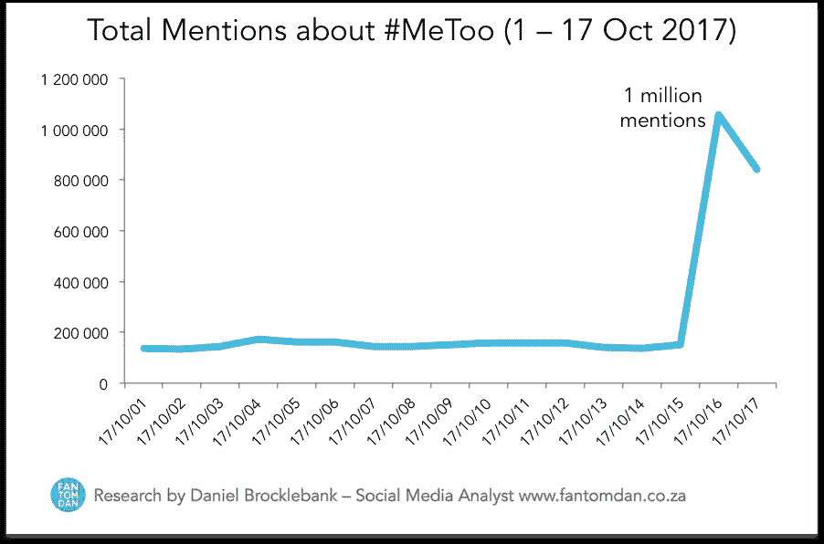

这一统计证据显示了这场运动的影响有多大。

随着这些个人故事数量的增加，很难对在线论坛 SafeCity 上共享的这些故事进行手动分类，该论坛可以识别犯罪模式并采取必要的行动来创建一个更安全的地方。

> *2。机器学习如何帮助我们解决这个问题。📝*

问题是将这些故事分类，它们可能属于一个或多个类别。这种类型的问题可以映射到多标签分类，其中一个故事可以有一个以上的类别与之相关联。

由于故事是文本形式的，我们可以利用自然语言处理的能力来完成这项任务。

> 3.数据来源及其概述📂

这个问题摘自一篇研究论文。

 [## 安全城市

### 安全城市是一个平台即服务产品，它为社区、警察和市政府提供动力，以防止暴力事件的发生。

安全城市](https://safecity.in/publications/research-papers/) 

研究论文中使用的数据集来自在线平台 Safecity，该平台收集和分析众包匿名暴力犯罪报告，确定模式和关键见解。

 [## 安全卡/安全城市

### 安全城市:理解不同形式的性骚扰个人故事，EMNLP 2018 作者:Sweta Karlekar & Mohit…

github.com](https://github.com/swkarlekar/safecity) 

**数据集介绍—**

我们有三个文件中的数据:培训、开发和测试

train.csv 中的行数= 7201

dev.csv 中的行数= 990

test.csv 中的行数= 1701

所有数据文件包含 4 列:

描述(字符串对象):一个受害者的个人故事，在社交媒体上与 MeToo 标签分享。

注释(整数):说明是否属于注释类别的描述标签。

抛媚眼/面部表情/凝视(整数):描述的标签，说明它是否属于抛媚眼、面部表情、凝视类别。

触摸/摸索(整数):说明是否属于触摸、摸索类别的描述标签。

## 示例数据点—

描述:当一个男孩来倒水时，我正在水龙头旁。他发现一个 14 岁的女孩在等着打水，就抓住她的手把她拖走了。

正在评论:0

色迷迷/面部表情/凝视:0

触摸/摸索:1

这个描述属于触摸/摸索的范畴

> 4.针对此类任务的现有解决方案✏️

在之前提到的研究论文中。它使用 CNN、RNN 和 CNN-RNN 类型架构的深度学习模型，在多标签分类上嵌入单词。

## 改进—

现在，我们将在单词嵌入的基础上添加一些额外的功能，例如

*   按单词级别和字符级别划分的文本长度。
*   给定描述的情感分数。

## 实验的—

我们将尝试不同的单词嵌入，例如:

*   预训练手套嵌入
*   以手套嵌入作为词向量的 tfidf-W2V
*   预训练快速文本嵌入
*   tfidf-W2V 使用快速文本嵌入作为词向量

> 5.选择正确的绩效指标:📏

f1-得分= 2 *(精确度*召回率)/(精确度+召回率)

在多标签分类的情况下，我们在计算 F1 分数时有两种类型

**宏观平均 F1-分数**:在这种情况下，我们简单地分别计算每个班级的 F1-分数，并取 F1_score 的平均值以获得总体 F1-分数。在我们的例子中，我们有 3 个类，因此，我们计算各个类的精确度和召回率，并取它们的平均值来计算宏观 F1 分数

宏精度=(精度 1+精度 2+精度 3)/3

宏观召回=(召回 1+召回 2+召回 3)/3

宏 F1= 2 *(宏精度*宏召回)/(宏精度+宏召回)

**微平均 F1 分数**:在这种情况下，我们通过对所有 TP 和类型错误求和来计算整个类的精度和召回率，而不是对单个类进行计算。然后，我们计算 F1 分数作为精确度和召回率的调和平均值。

微精度=(TP 1+TP 2+TP 3)/(TP 1+FP 1+TP 2+FP 2+TP 3+FP 3)

微召回=(TP 1+TP 2+TP 3)/(TP 1+fn1+TP 2+fn2+TP 3+fn3)

微 F1=2 *(微精度*微召回)/(微精度+微召回)

**海明损失**:是标签分类不正确的部分。

例如:如果 3 个标签中有 2 个分类错误。汉明损耗= 2/3

**精确数学比**:表示所有标签分类正确的样本的百分比。它只关心正确的分类，而忽略部分正确的分类。

这里，每个描述类的分类非常重要，因此我们将使用宏观 F1 分数作为我们的性能指标。因为宏观 F1-score 以同等的重要性对待所有的类，而微观 F1-score 只关注所有的类。

> **6。第一次切割方法。**

1.  我们将对我们拥有的数据集进行一些分析，即我们拥有的数据点总数以及每个特征对应的内容，检查数据中是否存在任何重复项，并删除这些重复项。
2.  稍后，我们将进行一些基本的探索性数据分析(EDA ),如从以下图中得出结论。
3.  我们将进行数据预处理和数据清理，包括删除可以从 nltk 库中获得的停用词、删除特殊符号、解连接单词(如(不能->不能，它是->它是)，以及将整个文本转换为小写。
4.  作为基线模型，我们将使用 sklearn 的多输出分类器。为此，将文本句子转换为 tfidf-w2v 表示，w2v 嵌入可以从预训练的手套模型中取出。现在，我们将使用这些训练数据来拟合多输出分类器，并将其作为基线模型结果。

> 7.探索性数据分析📊

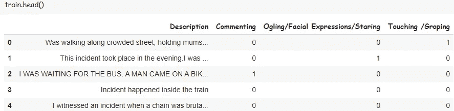

不存在缺失数据，因为我们有单一的文本特征，所以文本中不存在缺失数据。

我们将检查故事的副本。

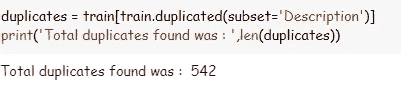

我们发现有 542 个重复，我们进一步分析这些重复的行。

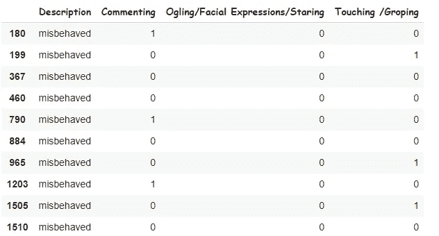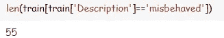

通过检查单个描述中的重复项，我们可以注意到许多行是重复的，这可能是在手工标记数据时发生的，其中单个单词在不同的情况下被解释为属于不同的类别。

为了避免这种歧义，我们用标签为 1，1，1 的单个点替换一个点的所有副本

我们绘制了不同类别之间的分数分布:

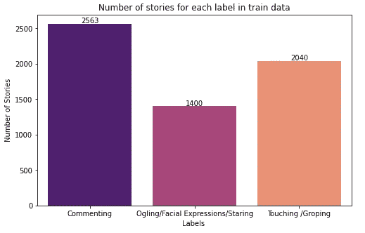

在训练模型时，我们需要记住类之间的一些类不平衡。

现在，我们绘制标签计数与具有该标签计数的故事数量的关系图:

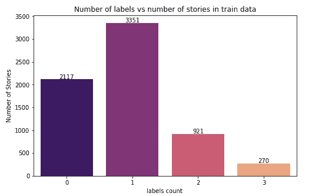

从这个图中我们可以看出，大多数故事都与一个标签相关联，或者没有标签，很少有故事同时具有三个标签。

> 8.**数据预处理和**特征工程🔧 🔩

作为数据预处理的一部分，执行以下文本清理:

*   单词的分解
*   删除特殊字符
*   停用字词删除和
*   堵塞物

作为特征工程的一部分，我们将从文本数据中提取这些特征:

*   创建描述向量表示(300 维)
*   按单词级别和字符级别划分的文本长度(二维)
*   使用 nltk (4-dim)的文本数据的情感分数

我们将获得总共 306 个特征。

我们将尝试以下 4 种描述向量表示，并将它们视为 4 组数据。

*   预训练手套嵌入
*   以手套嵌入作为词向量的 tfidf-W2V
*   预训练快速文本嵌入
*   tfidf-W2V 使用快速文本嵌入作为词向量

**通过使用下面的代码，我们可以从 glove 和 FastText 创建单词嵌入:**

**通过使用以下功能，您可以提取所有需要的特征:**

> 9.不同模型的实验🔧

我们总共提取了 306 个特征:

我们将在 4 种不同类型的单词嵌入格式上训练每个模型

训练手套嵌入格式的堆叠分类器:

我们使用 class_weight='balanced ',因为我们在机器学习模型的数据中有一些不平衡

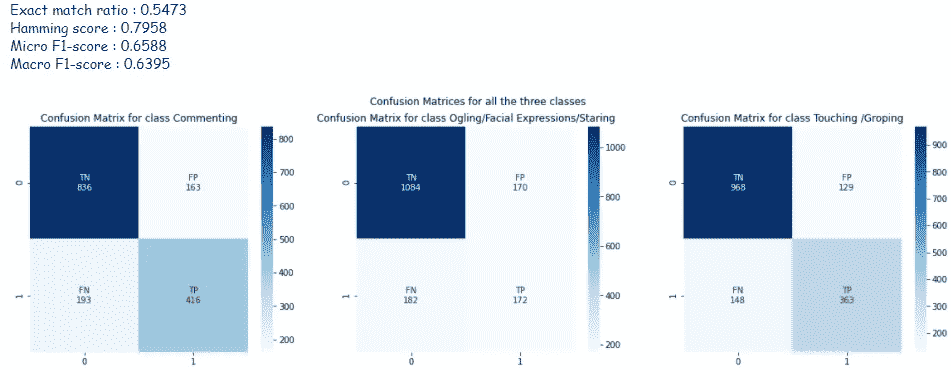

对于深度学习模型，我们编写了一个定制的损失函数，该函数借助于在三个类别之间为正负标签赋予不同的权重来处理类别不平衡。

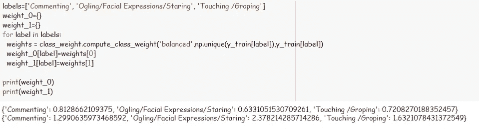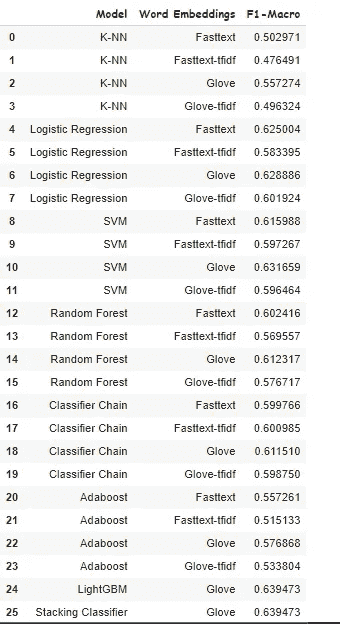

机器学习模型

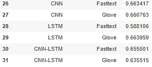

深度学习模型

通过观察训练模型的所有结果，我们可以得出结论，与快速文本嵌入相比，手套嵌入做得更好。因此，我们可以在部署时使用手套嵌入。

最佳机器学习模型:LightGBM 和堆叠分类器

最佳深度学习模型:LSTM

> 10.**创建一个端到端的管道，提供从原始输入获得预测的最佳模型。**

为了创建管道，我们需要将最佳模型保存为 pickel 文件，并在预测时使用它。我们不应该在创建管道时训练任何模型。

我们需要执行所有的预处理和特征提取步骤来获得模型的输入数据。

## 输出:

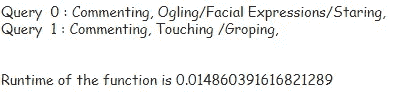

**您可以在下面看到运行部署在 AWS-EC2 实例上的 flask 应用程序的录制视频:**

> 11.未来的工作🕐

*   预训练的 Bert 模型(768-dim)可用于获得描述向量表示。这些 768 维的输出通过一个完全连接的神经网络，然后是一个 sigmoid 激活层。在我们的例子中，我们将有 3 个 sigmoid 激活单元，这给出了每个类别标签的概率。
*   通过适当的架构，可以使用字符级单词嵌入来代替单词级嵌入。
*   可以进行时间分析以获得模型的更多可解释性，这获得了对模型的单词级贡献。

> 12.参考📚

1.  [https://www.appliedaicourse.com/](https://www.appliedaicourse.com/)
2.  https://arxiv.org/abs/1809.04739
3.  [https://www . ka ggle . com/enforcer 007/what-is-micro-averaged-f1-score](https://www.kaggle.com/enforcer007/what-is-micro-averaged-f1-score)
4.  [https://www . mathworks . com/help/deep learning/ug/multi label-text-class ification-using-deep-learning . html](https://www.mathworks.com/help/deeplearning/ug/multilabel-text-classification-using-deep-learning.html)
5.  [https://www . cs . waikato . AC . NZ/~ ml/publications/2009/chains . pdf](https://www.cs.waikato.ac.nz/~ml/publications/2009/chains.pdf)
6.  [https://medium . com/the-owl/unbalanced-multi label-image-class ification-using-keras-FBD 8 c 60 D7 a 4b](/the-owl/imbalanced-multilabel-image-classification-using-keras-fbd8c60d7a4b)

> ***如果您需要任何与代码相关的文件，请通过下面给出的链接进入我的 GitHub 库:***

 [## sunil belde/safe city-多标签-分类

### sexula 骚扰个人故事的多标签分类-sunil belde/safe city-多标签分类

github.com](https://github.com/sunilbelde/safecity-multilabel-classification) 

> ***万一你想在 LinkedIn 上和我联系，下面是链接。***

 [## sunil belde -学生应用人工智能课程| LinkedIn

### 查看世界上最大的职业社区 LinkedIn 上 sunil belde 的个人资料。sunil 有 4 个工作列在他们的…

www.linkedin.com](https://www.linkedin.com/in/sunil-belde-1b4151129/) 

> — — —感谢您的阅读— — —