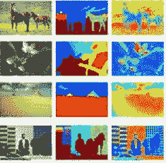

# 图像分割的多阈值方法

> 原文：<https://medium.com/analytics-vidhya/multilevel-thresholding-for-image-segmentation-d5805ad596b7?source=collection_archive---------6----------------------->



根据图像分割的数量，阈值分割技术可以分为二级和多级两类。在二值阈值分割中，图像被分割成两个不同的区域。灰度值大于某个值 T 的像素被分类为目标像素，而灰度值小于 T 的其他像素被分类为背景像素。

多阈值分割是将灰度图像分割成几个不同区域的过程。这种技术为给定的图像确定一个以上的阈值，并将图像分割成对应于一个背景和几个对象的特定亮度区域。该方法对于具有彩色或复杂背景的对象非常有效，在这些对象上，二级阈值化不能产生令人满意的结果。

全文可以在[这里](https://people.ece.cornell.edu/acharya/papers/mlt_thr_img.pdf)找到。在这里，作者使用图像的均值和方差来寻找将图像分割成多个层次的最佳阈值。该算法被递归地应用于根据前一步骤计算的子范围，以便为下一步骤找到阈值和新的子范围。

下面给出了上述 n 阈值方法的 Python (>3.0)代码:

```
import cv2
import numpy as np
import math

img = cv2.imread('path-to-image')
img = cv2.cvtColor(img, cv2.COLOR_BGR2GRAY)
a = 0
b = 255
n = 6 # number of thresholds (better choose even value)
k = 0.7 # free variable to take any positive value
T = [] # list which will contain 'n' thresholds

def multiThresh(img, a, b):
    if a>b:
        s=-1
        m=-1
        return m,s

    img = np.array(img)
    t1 = (img>=a)
    t2 = (img<=b)
    X = np.multiply(t1,t2)
    Y = np.multiply(img,X)
    s = np.sum(X)
    m = np.sum(Y)/s
    return m,s

for i in range(int(n/2-1)):
    img = np.array(img)
    t1 = (img>=a)
    t2 = (img<=b)
    X = np.multiply(t1,t2)
    Y = np.multiply(img,X)
    mu = np.sum(Y)/np.sum(X)

    Z = Y - mu
    Z = np.multiply(Z,X)
    W = np.multiply(Z,Z)
    sigma = math.sqrt(np.sum(W)/np.sum(X))

    T1 = mu - k*sigma
    T2 = mu + k*sigma

    x, y = multiThresh(img, a, T1)
    w, z = multiThresh(img, T2, b)

    T.append(x)
    T.append(w)

    a = T1+1
    b = T2-1
    k = k*(i+1)

T1 = mu
T2 = mu+1
x, y = multiThresh(img, a, T1)
w, z = multiThresh(img, T2, b)    
T.append(x)
T.append(w)
T.sort()
print(T)
```

你可以通过 scikit-image library 找到另一种方法，[多 Otsu 阈值法](https://scikit-image.org/docs/dev/auto_examples/segmentation/plot_multiotsu.html)。还有其他几种方法。谢谢大家！！！